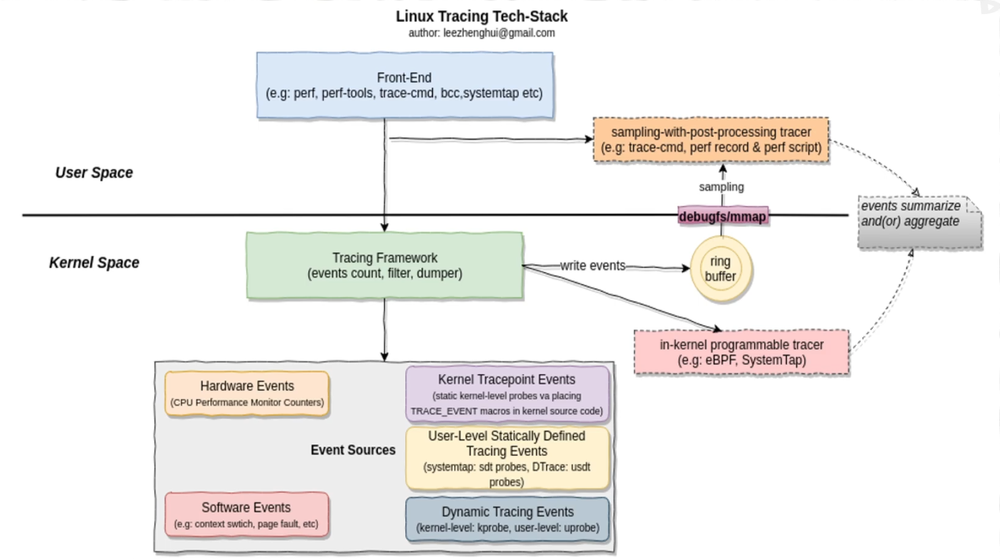
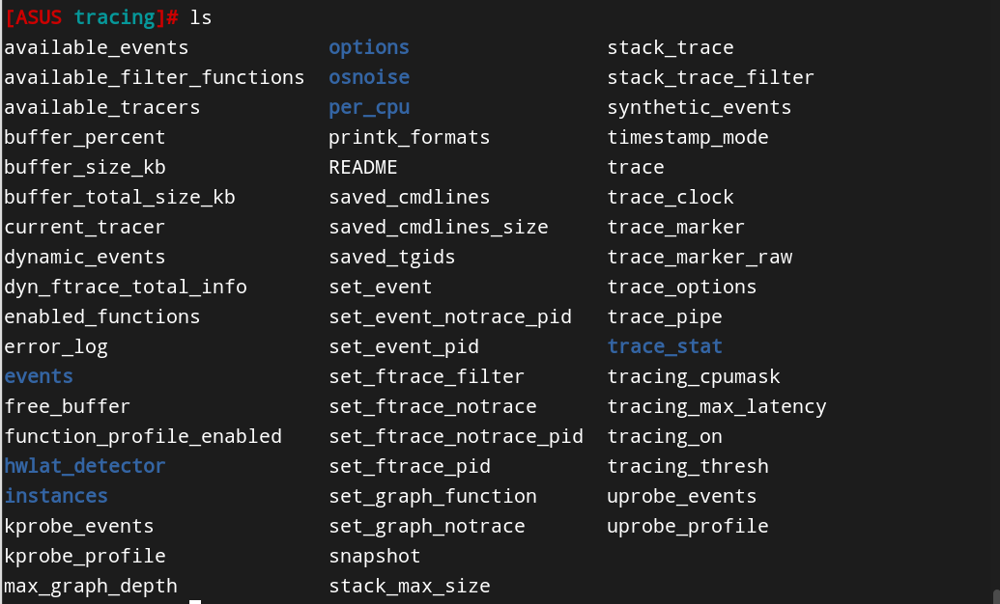

# Kernel Tracing

## 技术栈

## 内核中的事件源

### 硬件事件

来源于性能监控计数器（PMC），可以用于追踪一些很底层的执行情况

-   追踪CPU**缓存**命中情况
-   追踪**指令周期**
-   追踪**分支预测**

### 静态探针

指事先在代码中定义好，并编译到应用程序或内核中的探针。

#### Trace Points

常见的有：

-   调试内核源码时常用的printk
-   对printk进行封装后已经写入内核里的**内核函数**与**内核trace event**

​	在OS之上做开发时，可以用用户态工具去查看这些内核函数与事件，这样就可以追踪到内核执行到一些关键部分时的情况。不同的用户态工具对内核函数、事件的支持也有所不同。

#### USDT探针

​	全称是User Static-Defined Tracing，即用户级静态定义跟踪。**需要在用户程序中插入DTRACE_PROBE()代码**并编译，是对用户级程序的追踪。

### 动态探针

​	与静态探针对应，指内核在正常运行时可以动态添加进去的探针，相关技术主要有kprobes与uprobes

#### kprobes

​	用于对内核进行调试与跟踪，是一个比较轻量级的机制。本质上是**在指定的探测点插入一组处理程序，内核执行这部分程序即可将一些上下文信息传递给位于用户态的测试工具**。

​	分为3类，**kprobes**是可以被插入到内核任意指定位置的探针，**jprobes**是只能被插入到一个内核函数入口的探针（获取进入内核函数之前的状态），**kretprobes**则仅可被插入到指定内核函数的结束位置（用于获取函数的返回信息）

​	在使用时，可以**通过编写内核模块的方式向内核中注册探测点**（利用内核驱动模块的可热插拔性质）。也可以**通过使用ftrace的方式**来实现kprobes。

​	使用场景有：

-   **查看内核函数是否被调用到**
-   **内核函数耗时分析**

-   **注入bug修复代码**

#### uprobes

​	原理与kprobes大致相同，但是作用于用户程序。同样也有uprobes与uretprobes。

## 内核中的追踪框架

### ftrace

-   事件源：tracepoints，kprobes，uprobes

-   前端工具：/sys/kernel/debug/tracing，trace-cmd，**perf-tools**

### perf-event

-   事件源：tracepoints，kprobes，uprobes等，比ftrace更安全，支持采样，支持自定义动态事件
-   **使用场景**
    -   *寻找热点函数，定位性能瓶颈*（基于采样）
    -   可以用来*分析CPU cache，CPU迁移，分支预测，指令周期等各种硬件事件*
    -   也可以*配置成只对感兴趣的事件进行动态追踪*

### eBPF

-   是一个内核虚拟机，可以在events上高效地运行程序，支持常用的事件追踪；允许在Linux内核上执行自定义分析程序来处理事件，包括dynamic tracing，static tracing，profiling events等。

-   前端工具：
    -   bcc工具包
    -   bpftrace

## ftrace的用法实践

### 使用debugfs作为前端工具

Debugfs 在 **/sys/kernel/debug/tracing**目录下

​	可以看到有许多文件用于配置tracing

### 使用trace-cmd作为前端工具

