# 添加系统调用

## 内容复习

### 用户态与内核态

​	内核态与用户态的隔离是完全由对内存地址的划分而实现的；在保护模式下，CS寄存器已经变成了存储GDT Entry下标的工具，并且GDT Entry记录了段的起始地址与段的最大长度；这样，通过对CS寄存器的低位分类，就可以在GDT中分开属于内核的Entry与属于用户的Entry；并对这些Entry作一些限制（Linux中CS低两位作为分类条件（CS高位是作为Index的），0为内核态，3为用户态）

### 为用户提供接口

​	Linux为用户提供了用户态接口作为陷入内核的方式；用户通过调用用户态接口进入内核。进入内核的方式就是通过0x80这一中断进入（在main中，0x80中断与一个system_call函数绑定）

### 系统调用的实现

​	Linux实现系统调用，是通过中断执行system_call函数，并通过汇编为该函数准备参数与获取该函数的返回值。进入该函数后，会通过查表来获取要执行的系统调用地址并调用。

## 实验内容

​	实验要求实现自己的两个系统调用，并写测试代码。

## 实验过程

### 添加系统调用号，声明用户接口

​	观察发现，要使用系统调用都必须include一个 **unistd.h** ，因此我们要在这里完成系统调用的接口声明

##### 添加系统调用号

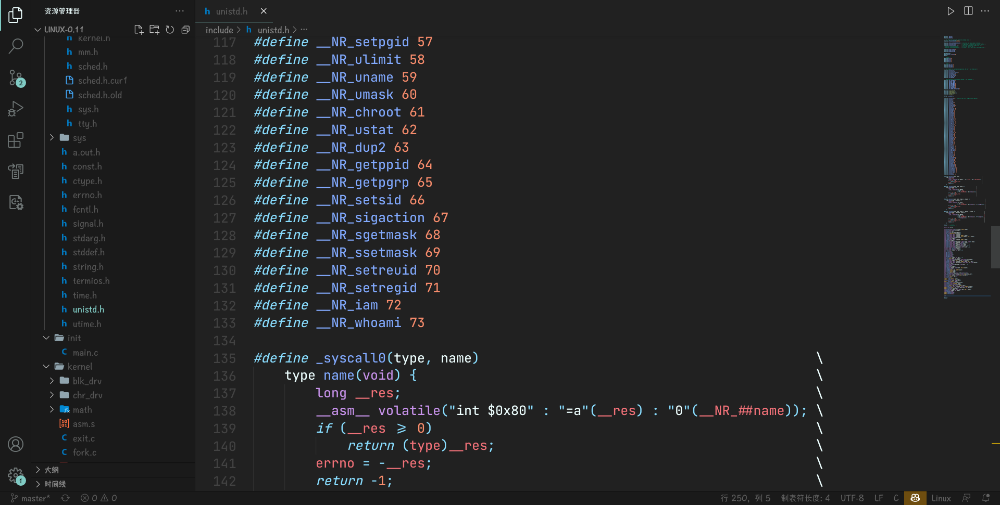

##### 修改系统调用的数量

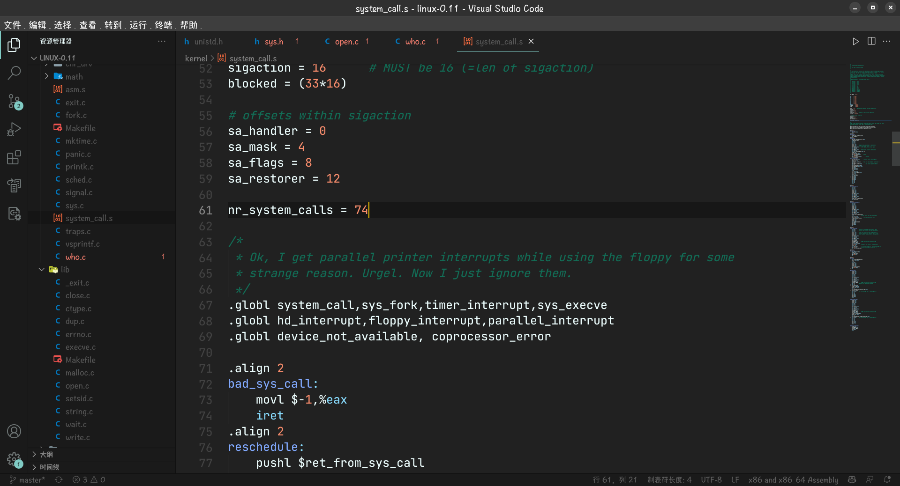

##### 声明可供用户调用的接口

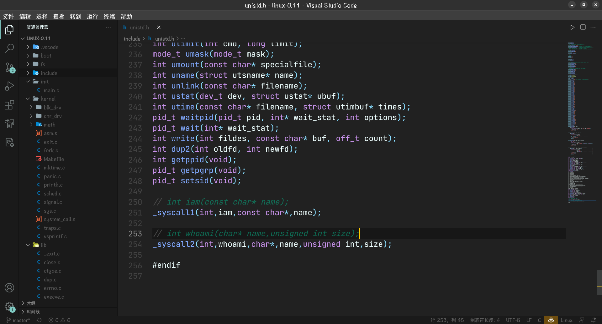

（因为懒得再去写一个实现它的c文件了（那样还要改makefile），就直接连着实现和定义都写在unistd.h下了～！）

### 声明系统调用，并添加到调用表中

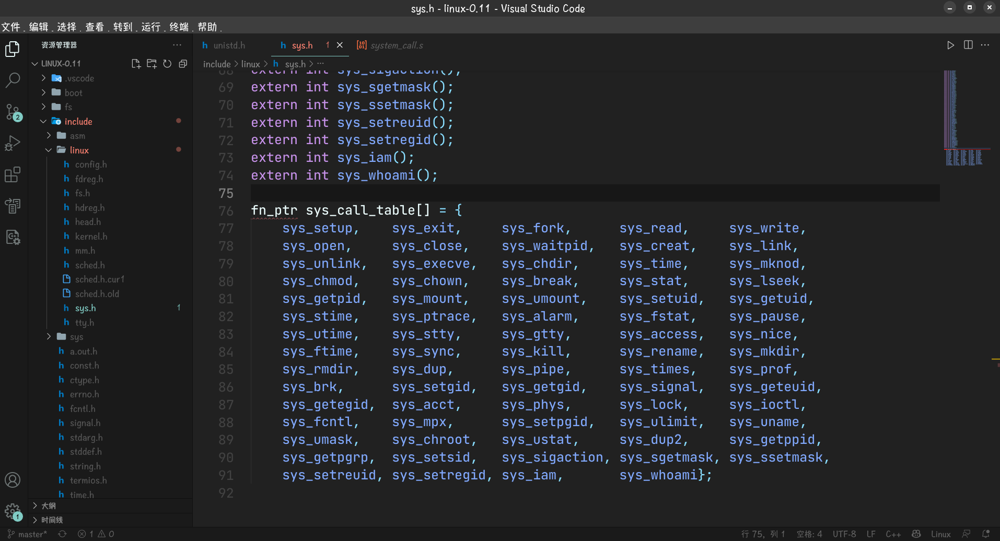

这样就完成了！这里的所有函数都没有参数，因为参数是在用户接口给的，到了system_call函数后并没动，只利用了系统调用号找对应的函数，因此用户调用接口函数时给的参数依然还在寄存器内，可以继续用，所以不需要传参

### 添加who.c文件（在kernel文件夹下）

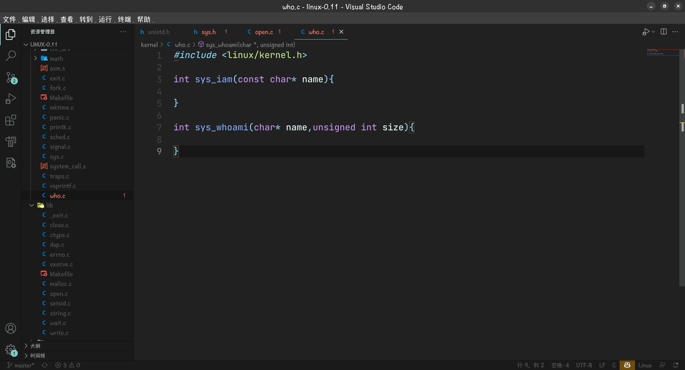

### 修改makefile文件

##### kernel/Makefile

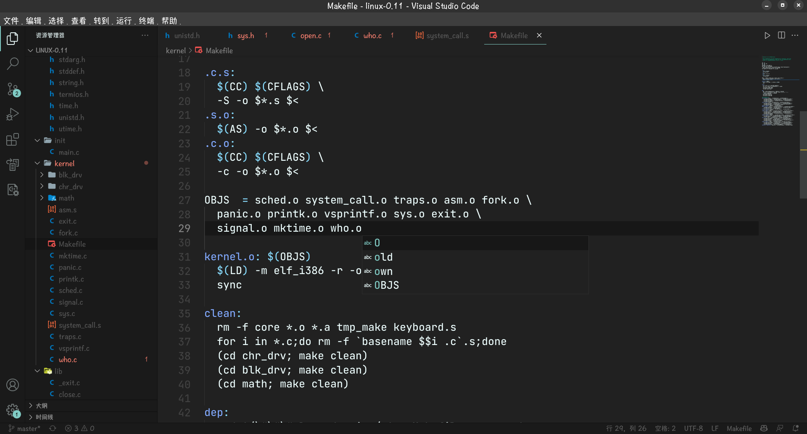

（添加 who.o）

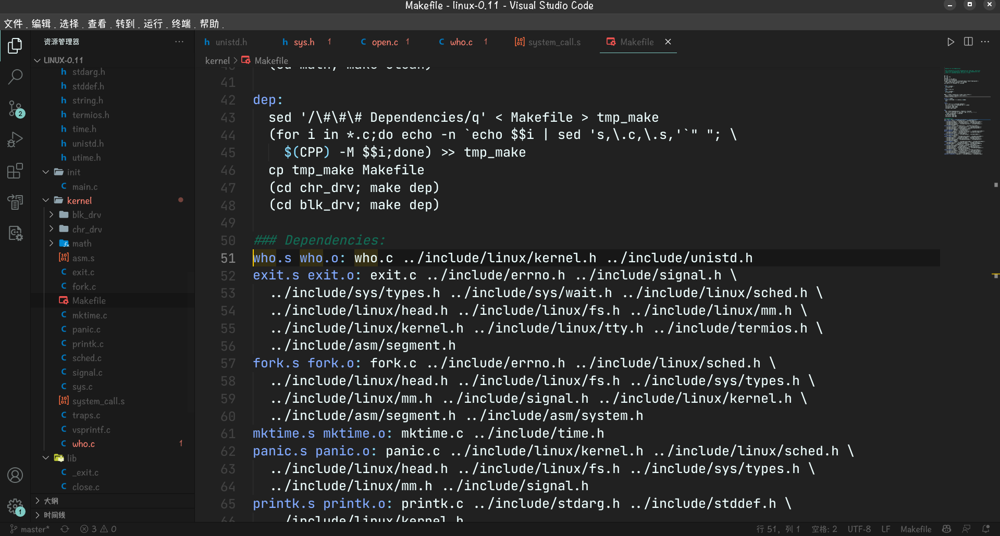

（添加 who.s who.o这一行）

### 编译测试一下

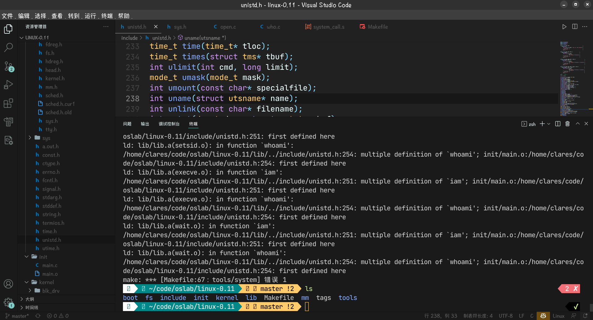

链接错误…说是iam和whoami（用户接口）重复定义了

链接错误确实一如既往的讨厌…最后改成了标准的格式（把c和h分开了）…

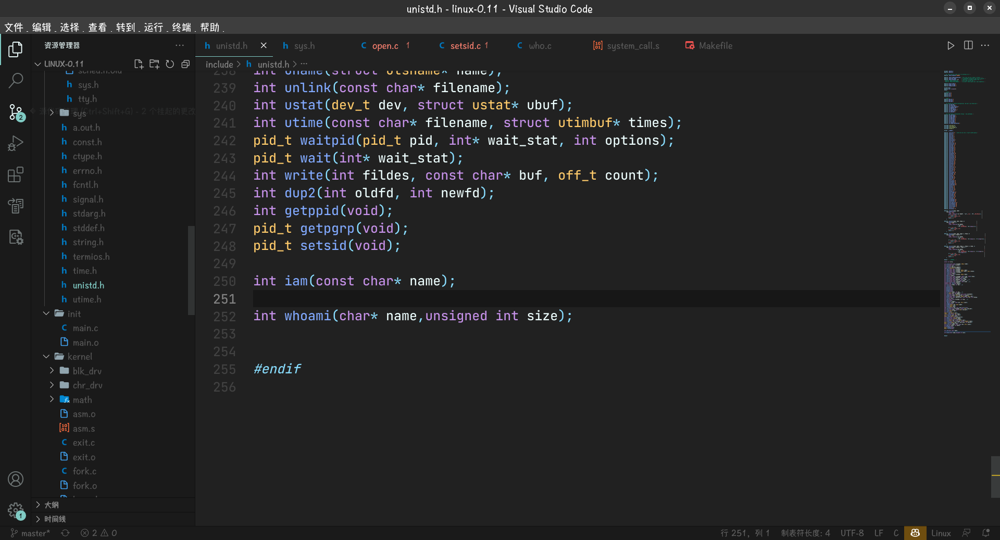

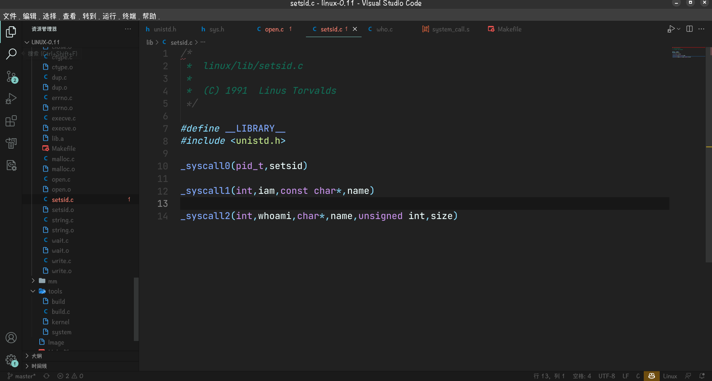

编译通过～！

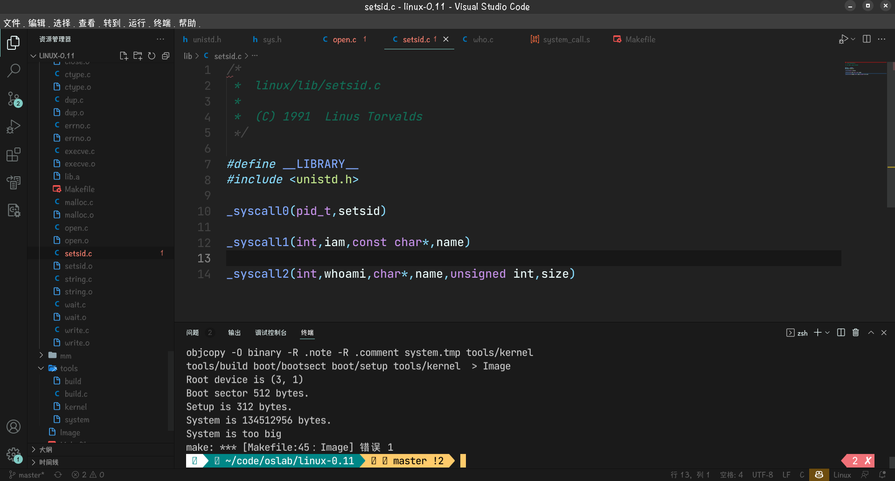

实验完成～
