# Operating System

## Overview

在CSAPP中，已经初步了解过了编写的代码是如何一步步加载到内存中执行的

> 经过以下阶段
>
> - 编译，得到汇编代码
> - 汇编，得到目标文件
> - 链接，得到可执行文件
> - 加载，通过虚拟内存系统，将磁盘上的可执行文件按页映射入物理内存中
> - 执行，CPU从内存中读指令，并进行运算等操作

但是仍然不足以解释为什么能在屏幕上输出“Hello world”

这中间还差了一环，在输出时，我们**通过系统级调用**，向标准输出设备文件输出，而这一部分，就是由操作系统提供的

这门课的**目的就是理解操作系统如何运作，通过对上层提供接口，从而协调多种硬件共同工作**。 

## System Setup

### 预备知识

#### 计算机启动过程

- 计算机在上电后，会做的第一件事就是**运行BIOS**，完成计算机内部的检查与初始化（设置一些寄存器的值等），这一过程**会将CS：IP设置为 0x07c0**，**并将磁盘中第一个扇区（每个扇区大小为512KB）读入**，这将是计算机将执行的第一个程序
- 通过汇编可以与主板上的硬件进行交互（**BIOS提供了一系列的中断操作**），用户编写的汇编代码可以通过调用中断操作硬件（操作系统也是这样协调硬件的）
- 磁盘的读取是以磁盘上的**扇区为单位进行读取**的，BIOS为磁盘读取提供了中断（INT13）

#### CPU的工作模式

CPU分为两种工作模式，**实模式与保护模式**，这两种模式之间的区别主要在于寻址方式的不同。

工作模式的选择依赖于一个**CR0寄存器**

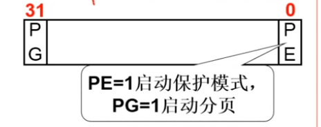

下面引用一些介绍

> ​	实模式出现于早期8088CPU时期。当时**由于CPU的性能有限**，一共**只有20位地址线**（所以地址空间只有1MB），以及8个16位的通用寄存器，以及4个16位的段寄存器。所以**为了能够通过这些16位的寄存器去构成20位的主存地址，必须采取一种特殊的方式**。当某个指令想要访问某个内存地址时，它通常需要用下面的这种格式来表示：
>
> 　**(段基址：段偏移量)**
>
> ​	其中第一个字段是段基址，它的值是由**段寄存器**提供的(一般来说，段寄存器有6种，分别为cs，ds，ss，es，fs，gs，这几种段寄存器都有自己的特殊意义
>
> 实模式的"实"更多地体现在**其地址是真实的物理地址**。
>
> ​	随着CPU的发展，CPU的地址线的个数也从原来的20根变为现在的32根，所以可以访问的内存空间也从1MB变为现在4GB，寄存器的位数也变为32位。所以实模式下的内存地址计算方式就已经不再适合了。所以就**引入了现在的保护模式**，实现更大空间的，更灵活也**更安全**的内存访问。
>
> ​	**在保护模式下，CPU的32条地址线全部有效**，可寻址高达4G字节的物理地址空间;  但是我们的**内存寻址方式还是得兼容老办法**(这也是没办法的，有时候是为了方便，有时候是一种无奈)，即(段基址：段偏移量)的表示方式。当然**此时CPU中的通用寄存器都要换成32位寄存器(除了段寄存器)来保证寄存器能访问所有的4GB空间**。
>
> ​	我们的**偏移值和实模式下是一样的**，就是变成了32位而已，**而段值仍旧是存放在原来16位的段寄存器中**，**但是这些段寄存器存放的却不再是段基址了**，毕竟之前说过实模式下寻址方式不安全，我们在保护模式下需要加一些限制，而这些限制可不是一个寄存器能够容纳的，于是我们**把这些关于内存段的限制信息放在一个叫做全局描述符表**(GDT)的结构里。**全局描述符表中含有一个个表项**，每一个表项称为**段描述符。**而段寄存器在保护模式下存放的便是相当于一个数组索引的东西，通过这个索引，可以找到对应的表项。段描述符存放了段基址、段界限、内存段类型属性(比如是数据段还是代码段,注意**一个段描述符只能用来定义一个内存段**)等许多属性,具体信息见下图：
>
> 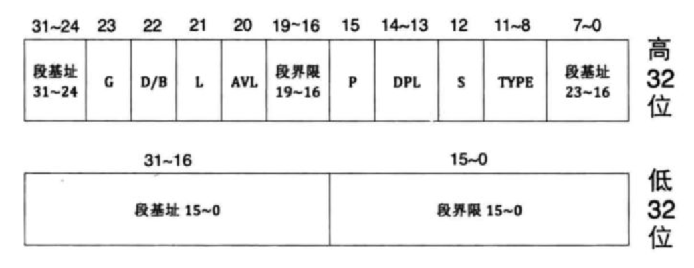
>
> ​	全局描述符表位于内存中，需要用专门的寄存器指向它后， CPU 才知道它在哪里。这个专门的寄存器便是**GDTR**(一个48位的寄存器),专门用来存储 GDT 的内存地址及大小。

同样地，中断也不再是直接访问了，而是通过IDT（中断定义表）来定位到对应的中断函数（系统调用基于这个机制）

### bootsect.s

源码文件放在同一文件夹下

- BIOS执行后

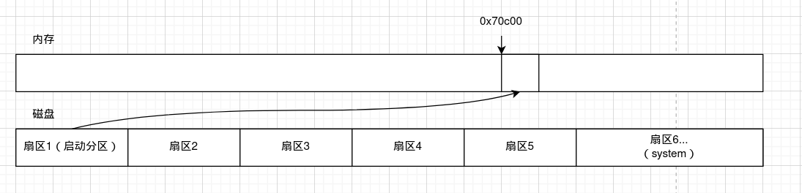

- bootsect-1 复制了自己

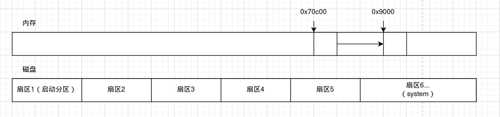

- 读取setup

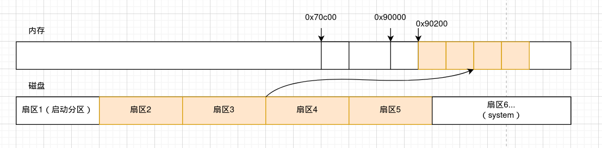

- 读system

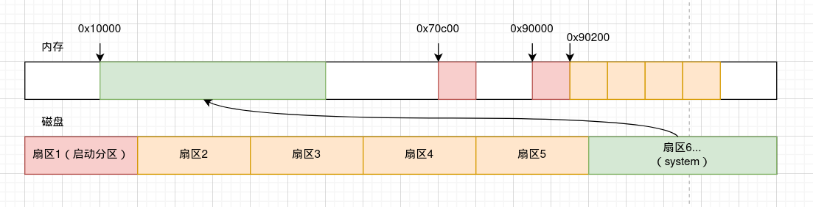

**不难看出，bootsect只是读取了后续需要的所有文件...**

### setup.s

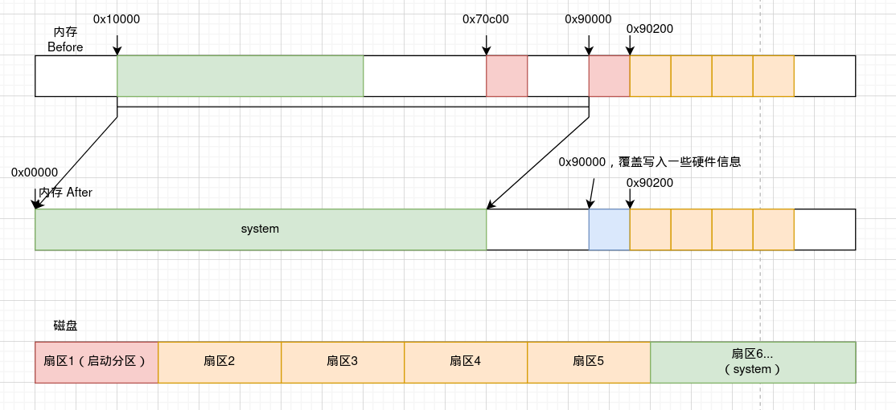

setup一方面通过BIOS中断读取了一些系统需要的**硬件信息**并写在0x90000开始的一段内存中（如扩展内存的大小、显卡信息、光标位置等），另一方面将0x10000～0x90000的内存复制到0x00000～0x80000，即**将system部分往前移动**。最后**开启保护模式，跳转进入system部分执行**。


### head.s

Linux makefile将head.s放置在了system部分的开头，因此setup执行后将执行这一部分

这一部分由于已经开启了保护模式，因此可以使用32bit汇编进行编程了（终于舒服了...）

**这一部分初始化了GBT表后，调用main函数，并在main中不断循环，不再退出**

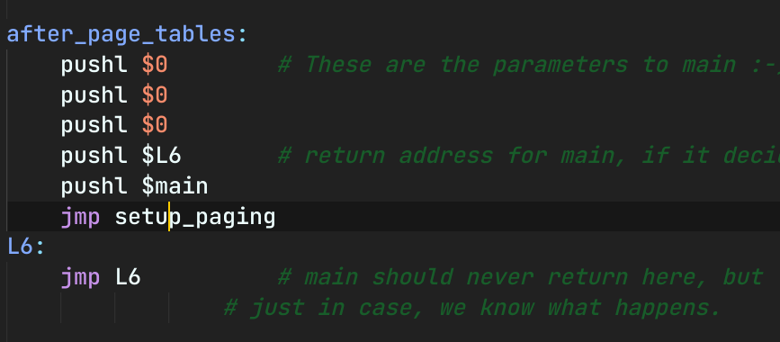

进入main之前，先准备好了paging信息

进入main后，如果main发生了return，则会进入L6，开始死循环（死机）

**main中会进行一系列init，包括内存、中断、设备、时钟、CPU等**

### 总结

操作系统在启动时，主要进行的操作就是 **读系统** 与 **初始化参数**

- bootsect读入系统与setup
- setup对系统的位置做一系列整理，并获取一些参数
- head为进入系统作最后准备，加载页表等
- main加载操作系统的各个模块

## System Call

### C内联汇编基础

```c
asm ( assembler template
        : output operands                /* optional */
        : input operands                 /* optional */
        : list of clobbered registers    /* optional */
);

其中 assembler template 为汇编指令部分。
前两个冒号后面的是操作数（输出、输入）：第一个冒号将汇编模板与第一个输出操作数分开，第二个冒号将最后一个输出操作数与第一个输入操作数（如果有）分开。总结就是：不同类型的操作数使用 : 分隔，相同类型的操作数使用 , 分隔。
逗号分隔每个组中的操作数。
操作数的总数为 10。
寄存器名称前有两个 %，这有助于 GCC 区分操作数和寄存器。
如果没有输出操作数但有输入操作数，那么输出操作数前的冒号不能省
```

例如

```c
void test(){
    int a = 10;
    int b = 0;
    asm volatile(
        "movl %0, %%eax;"
        "add  $10, %%ead;"
        "movl %%eax, %1"
        :"=" (a) //将%0与变量a绑定，"="代表仅可读
        :"+" (b）//同理，"+"代表可读可写
    );
    //即 b = a + 10
}
```

### 什么是系统调用

​		系统调用是操作系统给其上层的软件提供的一系列接口，让上层应用通过系统调用**安全地操作硬件**

### 为什么要有系统调用

​		系统调用可以最大程度地**保证内存中内核部分与用户部分的隔离**，使得用户无法直接访问到内核中的数据。尤其是对于Linux这样的多用户操作系统而言，保证内核中的数据不被访问是十分必要的（网课中举的例子是：内核中保存了用户的账户和密码；内核中与硬件交接的部分比如显存等，如果可以访问则可以看到别人操作的内容）

### 如何实现系统调用

#### 如何隔离内核与用户

​		这一内容完全是由**硬件实现**的。CPU对内存的访问最终是**通过CS:IP寄存器实现**，因此，采用CS的最低两位来表示操作的权限（**0为内核态，3为用户态**），同时设置两个特殊的段寄存器（**CPL与DPL，current/dest priority level**），分别表示**当前所在段**（即由CS决定）和**目标段**（当前指令要访问的段，由当前指令决定）。在进行访存时，**如果CPL<DPL，则允许操作**（即当前所在段的权限高于目标段），由此实现了内核态与用户态的隔离。

（注意，**这里的CS指的是GDT中的表项**，在操作系统初始化时，内核部分的内存就已经通过GDT表项初始化为0了；而在给用户态分配时，只需要分配GDT表项最低两位为3的即可）

#### 提供接口（陷入内核）

​		而为了进入内核，计算机也特别**提供了一个中断（INT 0x80）**用来**实现特权等级的转换**，而内核可以利用这个中断，**实现用户态的函数，在函数中中断到内核态，并调用内核中实现的异常处理程序**

再理顺一下，内核在系统调用中做了这些事：	

- 实现了一个**用户态函数，用来切换特权级，并在用户态函数中调用了内核态的异常处理程序**（上层用户不用自己调用中断，而是调用内核提供的用户态函数）（换句话说…如果自己写的C程序中也调用了这个中断，是不是可以直接在内核里随便操作？底下的代码说明，调用int 80必须往寄存器中放入系统调用号…**通过中断依然仅可以调用写好的异常处理程序**）
- 基于BIOS提供的支持，实现了**操作硬件的异常控制程序**，用于与硬件进行交互

贴一个系统调用的代码

```c
//unistd.h
#define _syscall3(type, name, atype, a, btype, b, ctype, c)
type name(atype a, btype b, ctype c){
    long __res;
    asm volatile(
    	"int $0x80;"
        :"=a"(__res)
        :"0"(__NR_##name),//这里是将__NR_name传入寄存器
        				  //NR_name有宏定义，是系统调用号
        //将abc作为参数，与系统调用用到的寄存器绑定
        "b"((long)a),
        "c"((long)b),
        "d"((long)c)
    );
    if(__res >= 0) return (type)__res;
    errno = -__res;
    return -1;
}
```

```C
//write.c
#define __NR_write ...;
_syscall3(int, write, int, fd, const char*, buf, off_set, count)；

//将这个宏展开后
int write(int fd, const char* buf, off_set count){
    long __res;
    asm volatile(
    	"int $0x80;"
        :"=a"(__res)
        :"0"(__NR_write),
        "b"((long)fd),
        "c"((long)buf),
        "d"((long)count)
    );
    if(__res >= 0) return (int)__res;
    errno = -__res;
    return -1;
}
//这就是上文所说的系统提供的陷入内核的用户态函数
```

```c
//main.c
void sched_init(void){
    ...
    //在main中初始化时，就将0x80中断与一个system_call中断处理函数绑定了
    //也因此，上面int的是0x80
    set_system_gate(0x80, &system_call);
	...
}

int main(){
    ...
        sched_init();
}

//include/asm/system.h
#define set_system_gate(n, addr)
{
    _set_gate(&idt[n], 15, 3, addr);
}

#define _set_gate(gate_addr, type, dpl, addr)
{
    //注意，这里的dpl就是dest priority level
    //在设置中断处理函数时，中断处理函数是在内核中的，即dpl = 0
    //而这里将dpl设置成3，用户态就可以通过中断去调用system_call这个函数了
	asm(
        "movw %%dx,%%ax；" //dx(addr)的值移入ax
		"movw %0,%%dx；"	  //0x8000+(dpl<<13)+(type<<8) 移入dx
		"movl %%eax,%1；"  //ax的值移入gate_addr
		"movl %%edx,%2；"  //dx的值移入 gate_addr + 4	
		: 
		: "i" ((short) (0x8000+(dpl<<13)+(type<<8))), 
		"o" (*((char *) (gate_addr))), 
		"o" (*(4+(char *) (gate_addr))), 
		"d" ((char *) (addr)),
        "a" (0x00080000) //目的函数地址的高32位，根据地址格式可以发现
        			     //目的函数的特权级为0（即内核态），也是在这里
        				 //完成了用户态到内核态的转换
    )
}
// 完成后，IDT表项的前32位为目标函数的addr
// 后32位中含有了dpl与type的信息（其中dpl为3,但是IDT指向的是特权级为0的函数）
//main.c中进行这样的处理后，再次调用INT 0x80时，就会从IDT表中取出段地址等信息跳转到内核态执行了
```

```assembly
#linux/kernal/system_call.s
.global _system_call
_system_call:
	#eax中存的是系统调用号，因为 "INT 0x80"："a"(__res)
	cmpl $nr_system_calls-1, %eax 
	ja _bad_system_call	#调用号错误
	#保存各个段寄存器
	push %ds
	push %es
	push %fs
	pushl %edx
	pushl %ecx
	pushl %ebx
	#让内核可以得到用户数据
	movl $0x10,%edx		
	mov %dx,%ds
	mov %dx,%es
	#调用了 sys_call_table + %eax * 4 处的函数
	#因为每个函数占用4字节的空间，所以需要调用号*4得到函数所在的地址
	#这个函数就是异常处理函数了
	call sys_call_table(,%eax,4) 
	#将返回值压入栈中
	pushl %eax
	...
_ret_from_sys_call:
	...
	popl %eax
	iret
```

（sys_call_table，一个全局的表，记录了所有系统调用的函数指针）

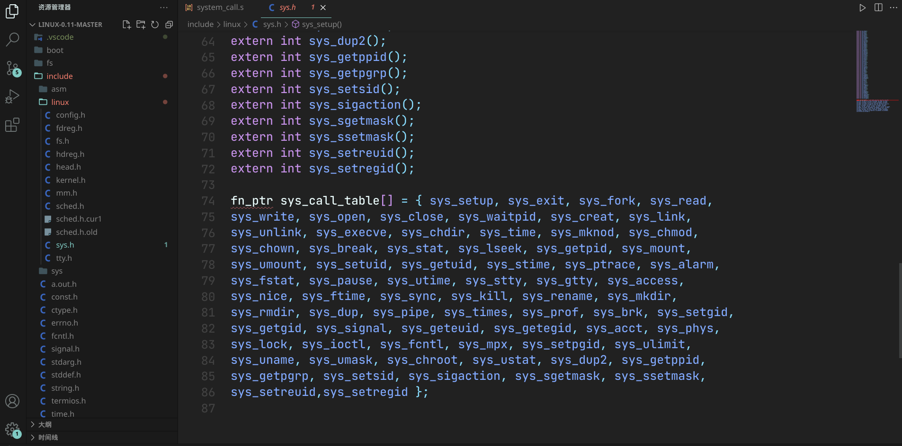

#### 系统调用的完整流程

- 用户调用用户态函数
- 用户态函数**展开为一个包含了INT 0x80的函数**，并在这个函数内**根据函数名准备好了系统调用号**（__NR_name）
- INT 0x80在系统初始化时**绑定到一个system_call函数**上，并在这个**函数调用时完成用户态到内核态的转换**（本质上并没有发生转换，而是**利用中断将system_call这个位于内核态的函数暴露给用户**）
- system_call通过**系统调用号**与一个**全局系统调用表**调用到**位于内核态内的异常处理程序代码**（因为是system_call这个内核态函数调用的，因此可以直接访问异常处理程序）

## Process View—Overview

### 进程是什么

​	过去对进程的理解，停留在是**一个程序**的级别。而到操作系统这一层，进程的概念变得更为具体。一个进程不仅仅是要执行的程序的机器码，由于它需要进行切换，所以需要保存运行时的各种状态（PC的值、各个寄存器的值），因此进程更应该是**需要执行的机器码与操作系统管理它所需要的数据的集合体**。

​	由此可以**猜测操作系统是如何进行多进程切换**的：进程运行到一定位置，**触发一个中断从而陷入内核引起进程切换操作**（PC跳入虚拟内存的内核段中，执行内核的代码，这一部分很容易想到）。内核**更新维护的进程数据**，并**根据进程调度算法决定下一个要执行的进程**。切换理论上并不难，因为进程数据结构中维护了所需要的信息，为唤醒的进程恢复数据即可。但是问题出现在有虚拟内存，**操作系统给每个进程都提供了独占内存的假象，而CPU又通过虚拟内存来访问真实内存，那么操作系统如何处理虚拟内存**这一层隔离就成了一个问题（尤其是虚拟内存是一个软硬结合的产物，有专门的MMU和TLB来处理虚拟内存到物理内存的映射…）。

### 多个进程的组织

- **PCB（Process Control Block）**，进程控制的一种数据结构

- CPU的核心在执行某个进程（通过PCB中的数据）

- 利用PCB再组织起一个数据结构（列表等）

- **就绪队列**与**磁盘等待队列**：有些进程已经完成了IO操作，可以继续往下执行，这些进程构成就绪队列，CPU从这个队列中选择将要执行的进程；有些队列还未完成IO操作，仍然在等待与磁盘的交互，完成交互后再进入就绪队列

- 进程生命周期的状态转换图：

    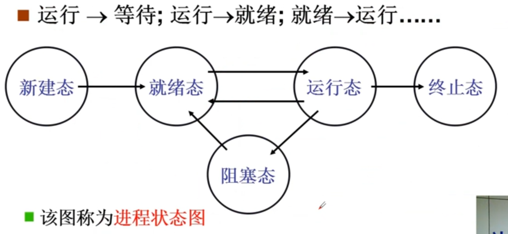

### 调度算法的问题

- **FIFO**：经典的队列，先进先出地执行就绪态程序，但是没有考虑到**不同进程的性质问题**
- **优先级调度**：先执行优先级高的进程，等所有优先级高的进程完成后再执行低优先级的进程，但是可能**造成一些低优先级进程饥饿**
- （计网中学过的一种按优先级权重的FIFO）：划分时间片，每个时间片都将整个就绪态队列运行一遍，同时根据优先级决定每个进程占用时间片的长度。

### 内存管理与虚拟内存

​	为了防止多个进程之间对内存的访问互相干扰，**OS为每个进程都维护了一个内存映射表（页表），为每个进程都提供了独占内存的假象，使得多进程得以同时运行**。此外，虚拟内存还带来了一些意外的好处：**每个内存段的权限控制更加精确，使得破坏性程序无法操作到一些重要数据**。

​	虚拟内存的组织在CSAPP中其实也已经学过了一部分，主要是**通过数据结构来维护每个内存段的权限、物理地址等**。

​	这时，上面关于进程调度的一个问题似乎也可以解决了：操作系统多进程切换时如何“绕过”虚拟内存？只需要**设置MMU访问的页表位置**即可…页表一换，虚拟地址虽然还在同一个范围，但是访问到的物理地址已经不一样了，得到的指令自然也不一样了。

### 多进程间的通信与合作

​	进程之间也存在某些依赖关系，如编辑、保存、打印等。因此，进程间必须能进行通信，才能保证按合理的顺序完成工作

​	核心在于进程同步，通过锁机制等方式去强制执行序列趋于唯一，实现合理地推进程序。

### Process View的学习内容

- 读写**PCB**（**OS中最重要的结构，这一结构贯穿整个OS过程**）

- 需要写**汇编代码**去**实现调度程序中的寄存器保存、恢复等程序**
- 需要实现一些**调度算法，用来合理地管理进程队列**
- 需要**实现进程间的同步与合作**，实现进程间的通信等内容
- 需要**实现虚拟内存**，为每个进程**提供独占内存的假象**

## Process View—Process & Thread

### Thread or Process？

​	**线程**（Thread），可以认为是**轻量级的进程**，线程之间的切换也需要保存、恢复寄存器的值，但是由于线程在同一个进程内，进程可以**为线程分配固定的内存位置**，**而不需要像进程切换那样进行页表的转换**。因此，**线程具体来说，实现了多个执行序列与一个地址空间**。课程到这时候还没有学习虚拟内存的内容，因此将进程调度的重点放在进程切换时对寄存器、PC的处理，因此实际上就是在叙述线程的调度与切换。

### User Thread

#### 两个线程，一个栈？

```c
//假设有这样一段代码
Thread1{
    funcA(){
        funcB();
        return;
    }
    
    funcB(){
        Yield();
        return;
    }
}

Thread2{
    funcC(){
        funcD();
        return;
    }
    
    funcD(){
        Yield();
        return;
    }
}
```

​		假设代码从Thread1开始执行，关注栈的状态

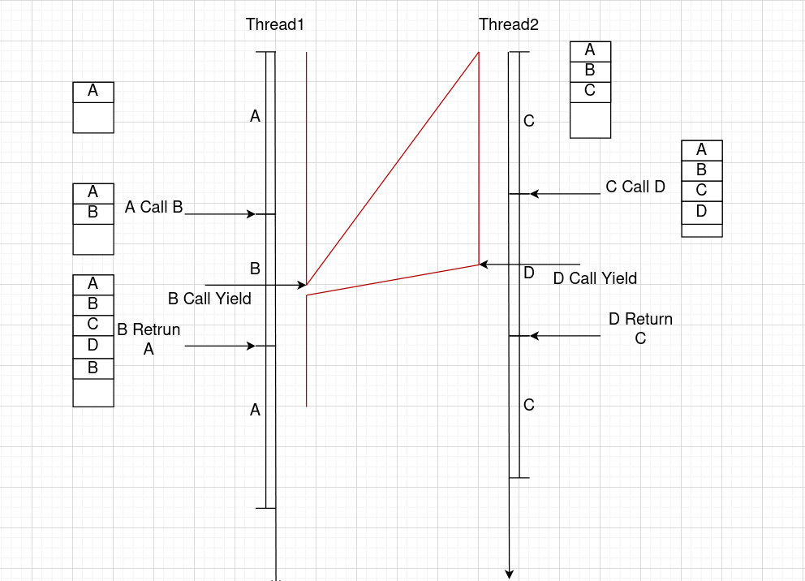

​		当B返回时，控制流会根据栈返回到D中，控制流就乱了。因此，一个栈无法解决多个线程的调度问题，需要分配多个栈空间供不同的线程使用（同时记录每个栈的位置，这样利用内存就可以免去进程改页表的麻烦操作了）

#### 线程调度的设计

​	采取了多个栈的设计，并使用**全局变量TCB（Thread Control Block）描述每个线程的栈的栈顶位置**，并**在线程切换时将TCB读入RSP即可**（即上文所说的记录每个栈的位置）

```c
//模拟Yield函数的代码
//简化为由Thread1转到Thread2执行
void Yield_T1_to_T2(){
    TCB1.esp = esp;
    esp = TCB2.esp;
    return;
}
//为什么不需要修改PC的值？
//Thread2在之前调用Yield进入Thread1时，就需要将Yield后的代码压入栈中
//因此，在Thread1切换到Thread2的Yield函数返回时，ret出栈中的调用者的下一句指令就正好是Thread2 Yield之后的下一句指令（因为栈已经切换了～）
```

```c
//模拟ThreadCreate函数的代码
void Thread_Create(void* func){
    TCB* tcb = malloc();	//申请TCB的空间
    *stack = malloc();		//申请栈空间
    *stack = func;			//设置栈中的第一个代码位置
    tcb.esp = stack;		//记录栈顶
}
```

```c
//用户级Thread的实现
#include "stdio.h"

typedef struct Thread {
    __int64_t rsp;
    __int64_t stack[10000];
} Thread;

Thread thread1;
Thread thread2;

void createThread(void (*func)(), Thread* thread) {
    thread->rsp = (__int64_t)(thread->stack + 9998);
    thread->stack[9999] = (__int64_t)func;
}

void yield(Thread* threadSrc, Thread* threadDst) {
    __int64_t src_rsp;
    __int64_t dst_rsp;
    asm volatile("movq %%rsp, %0" : "=a"(src_rsp));
    threadSrc->rsp = src_rsp;
    dst_rsp = threadDst->rsp;
    asm volatile("movq %0, %%rsp" ::"a"(dst_rsp));
    return;
}

void funcA();
void funcB();
void funcC();
void funcD();

int main() {
    createThread(funcA, &thread1);
    createThread(funcC, &thread2);
    Thread mainThread;
    yield(&mainThread, &thread1);
}

void funcA() {
    printf("funcA Start\n");
    funcB();
}

void funcB() {
    printf("call funcB\n");
    while (1) {
        printf("funcB Yield\n");
        yield(&thread1, &thread2);
    }
}

void funcC() {
    printf("funcC Start\n");
    funcD();
}

void funcD() {
    printf("call funcD\n");
    while (1) {
        printf("funcD Yield\n");
        yield(&thread2, &thread1);
    }
}		
```

​	这种**用户级线程**为用户提供了线程切换、线程创建等函数，允许用户主动决定在什么位置切换线程。它**完全位于用户层，因此操作系统不会感知到它的存在**。但是同样地，如果这时**某个用户级线程进行了某个IO操作**，由于不知道它是多线程，**操作系统会进行进程切换**，从而**导致整个进程内的所有用户级线程都阻塞**。为了解决这个问题，**操作系统也提供了内核级线程，由内核维护TCB并进行调度**，就可以解决这个问题。

### Kernel Thread—Concept

​	下面进入内核级线程的部分。内核级线程主要是为了**协调多核CPU**而出现的，在Intel超线程技术出现以前，一个CPU核心就对应一条内核级线程（现在，单核CPU已经可以给操作系统提供自己的多核的假象了）。换句话说，**如果操作系统不支持Kernal Thread，那么多核CPU就无法发挥出作用**。

#### 多个核心共享内存？

​	多个核心，如何共享同一个物理内存空间？还是依赖了虚拟内存技术。一个CPU的**多个核心共享同一套Cache Memory和MMU**（核心级线程依然**被管理为同一个进程**，因此**使用的是同一个页表**，对内存的使用就与进程区别开来了）

#### 关于内核栈

​	内核要向用户进程隐藏细节，只提供系统调用。可是**系统调用也是过程**，并且也要进行过程调用；那么就一定**需要一个栈来存储调用过程时的数据与参数**等。**如果依然使用用户栈，那么用户代码可以轻松访问到系统调用遗留下来的数据**（退栈时不删除数据，只在压栈时覆写），因此引出了**内核栈**的概念。

​	在**陷入内核时（触发中断时，由硬件实现），操作系统要保存rsp当前的值与当前PC的值**（即用户栈的地址与当前执行程序的信息），然后将rsp切换到位于内核段中的一个内核栈中，**系统调用返回后，并不会保存内核栈的rsp**，而是直接丢弃（每次系统调用时，内核栈都是空的，因此也不需要保存）


#### 与用户线程的区别

​	正如上文提到的，**对于OS而言，用户级线程是不可见的**（用户态线程的概念很接近一些编程语言中的异步编程，本质上**代码并不是同时执行**，而是在进行切换），因此**同时最多只会有一个系统调用在发生**，并不需要对内核栈作出什么变化。而**内核态线程是真正意义上的多个核心在同时执行不同的代码，并且就算是单核，在阻塞时也会切换到别的内核态线程（这弥补了用户态线程会被当作整个进程切换掉的缺陷）**，因此是会同时发生多个系统调用的。因此，**给每个线程提供的不仅仅是多个用户栈，还需要提供多个内核栈**。

#### 内核态线程的切换

​	考虑在单核时的情况，当内核态线程阻塞时，也需要进行切换。内核态线程的切换则**完全由操作系统内核决定**了。

​	内核态线程切换只会发生在陷入内核时；当某个内核态线程陷入内核，如进行IO操作时，系统调用就会**调用switch_to**进行内核态线程的切换，寻找一个**同样也陷入内核中、但是已经完成了复杂的调用，可以返回用户态的线程**并切换。

> ​	内核态线程的切换主要就是内核栈的切换，操作系统维护着内核态线程的TCB，记录了内核栈的地址；切换时的操作与用户栈大同小异，唯一的区别在于，由于内核栈是由于中断引起的，返回时不能仅使用普通的ret，而需要一个iret从中断中返回。
>
> ​	这个区别主要还是因为栈的返回只需要执行的地址就行了，而栈的切换需要恢复数据。


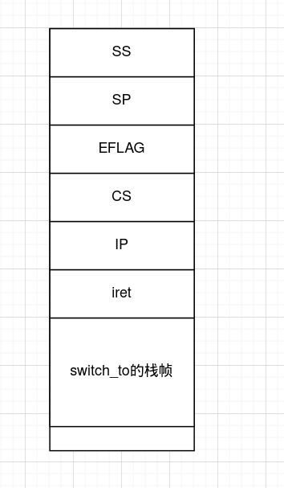

**（当switch_to返回时，会ret出iret作为下一条指令，iret会从内核栈中恢复用户态信息后返回用户态）**

#### 内核态线程的生命周期

**五段论**

- 触发中断（可能是时钟，也可能是某些系统调用）
- 中断处理（调用了Schedule，引发切换）
- 调度算法（寻找下一个要切换的TCB）
- 内核栈切换（根据TCB切换线程）
- 中断出口（退出中断，回到用户态）

#### 内核线程的启动

​	与用户级线程一样，用户级线程是新建一个用户栈并将要执行的代码放在栈底，将TCB加入队列中。那么内核态线程就是，新建内核栈、用户栈，用户栈的底部放要执行的代码，内核栈的底部存用户栈信息、代码等，栈顶放上iret，并将存内核栈的TCB加入队列中等待调度。

### Kernel Thread—Implement

​	本节分析Linux中**fork系统调用**的代码，因为fork既触发了中断（导致线程切换），有涉及了线程的创建（新建进程需要主线程）

```c
//main.c

//首先复习syscall的相关内容
static inline int fork(void) {
    long __res;
    asm volatile("int $0x80" 	 	//调用0x80中断的处理程序
                 : "=a"(__res) 		//将rax作为输出与变量__res绑定
                 : "0"(__NR_fork)	//将系统调用号放入rax
                );
    if (__res >= 0)
        return (int)__res;
    errno = -__res;
    return -1;
}
```

```assembly
#system_call.s


    TSS描述符仅可能存放在GDT中，不能存放在LDT或IDT中。 32位模式下，TSS描述符格式如下： 当G标志是0时，界限字段的值大
#根据main.c中绑定的中断表，调用了中断处理程序
#int 0x80 - linux系统调用入口点(绑定中断int 0x80,eax中是调用号)
.align 2
system_call:
#首先判断是否是错误的系统调用号，如果错误，转入bad_sys_call中执行
	cmpl $nr_system_calls-1,%eax
	ja bad_sys_call
#将ds、es、fs压入栈中（这里已经切换到内核栈了，切换由硬件实现）
	
	push %ds		#内核栈的情况
	push %es		# SS：SP
	push %fs		# EFLAGS
	pushl %edx		# ins- mov res, %rax (int 0x80结束后的下一句)
	pushl %ecx		# ds（以下是保存用户态信息）
	pushl %ebx		# es
					# fs
					# edx
					# ecx
					# ebx
					
#为syscall准备参数
	movl $0x10,%edx
	mov %dx,%ds
	mov %dx,%es
#fs段寄存器用于访问用户空间的数据
	movl $0x17,%edx
	mov %dx,%fs
#根据sys_call_table决定了要调用的函数
	call sys_call_table(,%eax,4)
#得到结果，将eax存入栈中（eax接下去还有用）
	pushl %eax
##重点在这里（这是current就是TCB）
	movl current,%eax
#将TCB的state与0比较（如果不为0,说明阻塞，需要调度）
	cmpl $0,state(%eax)
	jne reschedule
#将TCB的counter与0比较（如果相等，说明时间片用完了，需要调度）
	cmpl $0,counter(%eax)
	je reschedule

#system_call执行后，就是这一段程序
ret_from_sys_call:
#这里有大段信号处理内容，先跳过，关注3
	movl current,%eax
	cmpl task,%eax
	je 3f
	cmpw $0x0f,CS(%esp)
	jne 3f
	cmpw $0x17,OLDSS(%esp)
	jne 3f
	movl signal(%eax),%ebx
	movl blocked(%eax),%ecx
	notl %ecx
	andl %ebx,%ecx
	bsfl %ecx,%ecx
	je 3f
	btrl %ecx,%ebx
	movl %ebx,signal(%eax)
	incl %ecx
	pushl %ecx
	call do_signal
	popl %eax
#从这里开始，是中断退出的部分
#一系列pop过后，内核栈回到下面的样子
3:	popl %eax			#内核栈情况
	popl %ebx			# SS
	popl %ecx			# SP
	popl %edx			#EFLAG
	pop %fs				# CS
	pop %es				# IP
	pop %ds
#执行iret,会回到用户栈
	iret
	
#重调度
reschedule:
	pushl ret_from_sys_call
	call schedule

```

#### Schedule

```c
// sched.c
void schedule(void) {
    //大部分涉及调度算法，先看最后的switch_to
    int i, next, c;
    struct task_struct** p;
//check alarm,wake up any interruptible tasks that have got a signal
    for (p = &LAST_TASK; p > &FIRST_TASK; --p){
        if (*p) {
            if ((*p)->alarm && (*p)->alarm < jiffies) {
                (*p)->signal |= (1 << (SIGALRM - 1));
                (*p)->alarm = 0;
            }
            if (((*p)->signal & ~(_BLOCKABLE & (*p)->blocked)) 
                &&(*p)->state == TASK_INTERRUPTIBLE)
                (*p)->state = TASK_RUNNING;
        }
    }
    while (1) {
        c = -1;
        next = 0;
        i = NR_TASKS;
        p = &task[NR_TASKS];
        while (--i) {
            if (!*--p)
                continue;
            if ((*p)->state == TASK_RUNNING && (*p)->counter > c)
                c = (*p)->counter, next = i;
        }
        if (c) break;
        for (p = &LAST_TASK; p > &FIRST_TASK; --p){
            if (*p){
                (*p)->counter = 
                	((*p)->counter >> 1) + (*p)->priority;
            }
        }
    }
    //实现了任务的切换
    switch_to(next);  // 切换到Next任务并运行。
}

//switch_to的宏
#define switch_to(n) {
//Linux 0.11的切换还是基于TSS的，本质上是拿一整个TSS结构记录了当前CPU执行的任务的所有寄存器的状态，使用一个专门的TR段寄存器存当前任务的选择子，通过找专门的内存得到当前任务的信息。
//TSS的基本思路就是，通过TR寄存器找到当前的TSS,并存入当前的所有寄存器数据；再修改TR,并将需要转到的任务的TSS恢复入寄存器中，这样就完成了栈的切换；这些过程会在线程执行clts时自动完成
	struct {
		long a, b;
	} __tmp;

	asm(
        "cmpl %%ecx,currentnt"
		"je 1fnt"
		"movw %%dx,%1nt"
		"xchgl %%ecx,currentnt"
		"ljmp *%0nt"	//TSS方式中最关键的指令（远址跳转）
		"cmpl %%ecx,last_task_used_mathnt"
		"jne 1fnt"
		"cltsn"	//调整CPU中的所有寄存器，从而实现栈切换
		"1:" 
        :
        :"m"(*&__tmp.a),
		"m"(*&__tmp.b),
		"d"(_TSS(n)),
		"c"((long)task[n])
	);
}

```

#### Create

```assembly
#从call sys_call_table(,%eax,4) 接着往下看
.align 2
sys_fork:
	call find_empty_process 	#寻找可用进程号
	testl %eax,%eax
	js 1f
	push %gs		#压了一些寄存器（猜测是在准备参数）
	pushl %esi
	pushl %edi
	pushl %ebp
	pushl %eax
	call copy_process 	#调用了copy_process
	addl $20,%esp
1:	ret
```

```c
//fork.c
int copy_process(int nr..../*一系列寄存器*/){
    struct task_struct *p;
	...;
    //核心代码，获取一块新的内存空间
	p = (struct task_struct *) get_free_page();
	if (!p) return -EAGAIN;
	task[nr] = p;
    *p = *current;	//复制父进程的TSS
    //对父进程的TSS进行一些修改
    //注意这里对父进程的内核栈进行了修改，但是用户栈仍然共用
    ...;
    p->tss.eax = 0; //这里给子进程的tss-eax设置成0,因此子进程能返回0
    ...;
    //重新设置TR段寄存器等
    set_tss_desc(gdt+(nr<<1)+FIRST_TSS_ENTRY,&(p->tss));
	set_ldt_desc(gdt+(nr<<1)+FIRST_LDT_ENTRY,&(p->ldt));
    return last_pid;//这里的last_pid是调用find_empty_process得到的
}

//父进程会执行代码，直到set_tss为止
//而子进程的所有信息都由父进程生成，并在set_tss后会正式开始运行，因此也会执行return语句，因此返回的是上面父进程设置的pid，即0
//父进程在得到调度后，会继续执行，因此也会return,但是由于并没有修改过自己的pid,因此会返回获取到的last_pid
```

##  Process View—Process Schedule

### 衡量Schedule算法的优劣

- 尽快结束所有任务：周转时间短
- 用户操作尽快响应：响应时间短
- 系统内耗时间少：吞吐量优秀

​	**总的来说，系统应该专注于任务的执行（不能过多占用资源，不论是时间资源还是空间资源），这就注定了调度算法得在精简的情况下保证能合理调配任务**

### 矛盾？折中？

操作系统执行的不同任务，有着不同的重点，且它们会互相约束

- 对响应时间的需求导致CPU要频繁地切换到这个任务看有没有响应，这就会导致切换带来的系统内耗增大，而减少系统的吞吐量
- 前台任务与用户交互，需要关注响应时间；后台任务则更关注周转时间（让自己在不影响系统的情况下尽快完成）
- 此外，前台任务更经常进行IO操作，因此可以约等于IO-Bound类型的任务，它只需要一小段时间即可切入IO而停止使用CPU；后台任务约等于CPU-Bound类型的任务，因此需要长时间占用CPU；在设计时，应该将IO-Bound型任务的优先级提高

### 基本的调度算法

#### FCFS

​	即 *First Come First Served* ，先到者先得到服务；这种算法非常简单…利用一个队列即可实现。它并不优秀（系统的平均周转时间长），但是具有很好的公平性。

> **系统周转时间**
>
> 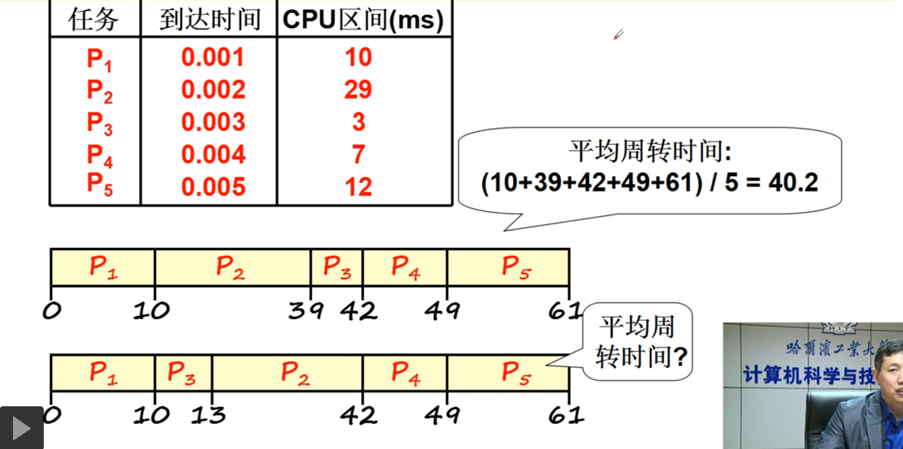

#### SJF

​	*Short Job First* ，对FCFS作出了优化，将短任务排在更前的位置；这种方法可以将系统的周转时间减到最小，但是它没有考虑任务的性质（如果将耗时的用户操作一直放在最后，那么用户的体验将非常差）

#### RR

​	*Round Robin* ，时间片轮转调度算法；将一定量的时间片按需求分给每个任务，并限制每个任务拥有时间片的最大值，轮流执行每个任务。（不难看出，RR算法的调度会非常频繁，但是很好地保证了响应时间与公平性）

#### 总结

​	**上面的算法已经比较好地解决了同优先级的任务之间的调度问题，但是正如前面所提到的，任务有不同的类型，前台任务与后台任务有不同的需求，在这一方面，需要提供优化；此外，这个算法还需要有一定的学习能力，用来区别出前台任务与后台任务**

### schedule in Linux 0.11

```c
//kernel/sched.c

void schedule(void) {
    int i, next, c;
    struct task_struct** p;
    for (p = &LAST_TASK; p > &FIRST_TASK; --p) {
        if (*p) {
            if ((*p)->alarm && (*p)->alarm < jiffies) {
                (*p)->signal |= (1 << (SIGALRM - 1));
                (*p)->alarm = 0;
            }
            if (((*p)->signal & ~(_BLOCKABLE & (*p)->blocked)) &&
                (*p)->state == TASK_INTERRUPTIBLE)
                (*p)->state = TASK_RUNNING;
        }
    }
    while (1) {
        c = -1;
        next = 0;
        i = NR_TASKS; //NR_TASKS记录了当前任务列表的容量
        p = &task[NR_TASKS]; //取出指向最后一个任务的指针
        while (--i) { //循环执行i次
            if (!*--p)  continue; //如果该任务位为空，跳过
            /*	判断当前任务的状态是否为running,若为running,且记录下当前
            任务的counter，一遍循环后，即可得到counter最大的任务，并记录
            下标为next */
            if ((*p)->state == TASK_RUNNING && (*p)->counter > c)
                c = (*p)->counter, next = i;
        }
        //如果最大的counter有了记录，就退出循环
        if (c) break;
        //这是没有找到最大counter的时候...循环整个表，并不断更新counter
        //令新counter = 旧counter/2 + priority
        for (p = &LAST_TASK; p > &FIRST_TASK; --p) {
            //关注这里发生的变化：
            //	这里的所有任务必然只能是阻塞态（因为就绪态会在上面被选出并切换
            //，不会运行到这一步），而阻塞态的进程还有时间片没用完，底下这个算
            //法计算后，阻塞态的counter会进一步提高，等到回到就绪列表后，				//counter一定会比初始的就绪态任务高
            if (*p) 
                (*p)->counter = 
                	((*p)->counter >> 1) + (*p)->priority;
        }
        //完成优先级更新后，重新找需要调度的任务
    }
    //切换到next
    switch_to(next);
}
```

​	counter在算法中，既承担了优先级的作用，也承担了时间片计数的作用；此外，counter还可以根据任务进行动态调整。

- counter保证了响应时间的界
- 经过IO后，counter的值会增大，IO时间越长，counter越大，照顾了前台进程
- 后台进程一直根据counter轮转（while里），近似SJF调度
- 每个进程仅维护counter一个变量，简单而高效

## Process View—Sync & Semaphore

### 为什么需要同步？

​	在很多情况下，进程与进程之间并不是纯粹的分离关系，而是互有合作。如办公软件与打印机驱动，打印机并不是随时都可以开始工作的，而是要等待信号；因此说这两个进程同步。

### 生产者-消费者实例

```c
#define BUFFER_SIZE 10
typedef struct {...} item;
item buffer[BUFFER_SIZE];
int in = out = counter = 0;

//生产者进程
while(true){
    while(counter == BUFFER_SIZE);
    buffer[in] = item;
    in = (in + 1)%BUFFER_SIZE;
    counter ++;
}

//消费者进程
while(true){
    while(counter == 0);
    item = buffer[out];
    out = (out + 1)%BUFFER_SIZE;
    counter --;
}
```

​	在这个例子中，counter就相当于**信号**，生产者和消费者双方根据信号**决定是阻塞还是继续运行**，通过阻塞来保证双方的同步。

​	因此可以发现，进程间同步的**关键就在于能够在合适的时候阻塞等待其他进程**。

```c
//改为多进程的样式

#define BUFFER_SIZE 10
typedef struct {...} item;
item buffer[BUFFER_SIZE];
int in = out = counter = 0;

//生产者进程
while(true){
    if(counter == BUFFER_SIZE) sleep(消费者);
    buffer[in] = item;
    in = (in + 1)%BUFFER_SIZE;
    counter ++;
    if(counter == 1) wake(消费者);
}

//消费者进程
while(true){
    if(counter == 0) sleep(生产者);
    item = buffer[out];
    out = (out + 1)%BUFFER_SIZE;
    counter --;
    if(counter == BUFFER_SIZE - 1) wake(生产者);
}
```

### 更多的进程?

​	如果生产者与消费者之间的关系是多对一或是多对多？再根据上面的模型，很容易发现，消费者如果不知道总共有多少个生产者，那么将无法完成对所有生产者的唤醒工作。因此，如果仅有信号，是不够的。

​	因此，扩充信号的语义，使它扩展为**信号量**。

可以假设满足如下的规律：

- 信号量sem记录了当前buffer能提供的空闲量
- 如果有一个生产者进程对buffer有需求而未得到满足，则sem-=1
- 如果sem为负，则消费者每唤醒一个生产者，sem+=1

模拟一下多个进程合作时的情况：

- 缓冲区满，此时P1执行，发现已满，进入睡眠，并将sem-=1（sem = -1）
- 调度到P2执行，发现已满，进入睡眠，sem-=1                （sem = -2）
- 调度到C执行，发现sem = -2，唤醒P1                           (sem = -1)
- C执行，发现sem为负数，唤醒P2                               （ sem = 0 ）
- C执行，读取，此时sem中出现空余，sem ++                   （sem = 1）
- 调度到P1，发现有空位，消耗sem……

可以发现，此时多个进程之间已经可以正常合作了

```c
//用代码实现一下

#define BUFFER_SIZE 10
typedef struct {...} item;
item buffer[BUFFER_SIZE];
int in = out = 0;
int sem = BUFFER_SIZE;

//生产者进程
while(true){
    if(sem <= 0){
        sleep(self);
    	addToQueue(self, producerSleepQueue);
        sem--;
    }
    if(sem >= BUFFER_SIZE) {
        wake(consumerSleepQueue.front);
    	sem--;
    }
    writeToBuffer(item);
    sem--;
}

//消费者进程
while(true){
    if(sem >= BUFFER_SIZE){
        sleep(self);
        addToQueue(self, consumerSleepQueu);
        sem++;
    }
    if(sem < 0){
        wake(producerSleepQueue.front);
        sem++;
    }
    readFromBuffer(item);
    sem++;
}
```

### 信号量的一种实现

信号量是1965年Dijkstra提出了一种特殊整形变量

```c++
struct semaphore{
    int val;
    PCB* queue;
    
    //test是否需要睡眠
    void P(){
        val --;
        if(val < 0) sleep(queue);
    }
    
    //判断是否需要唤醒
    void V(){
        val ++;
        if(val > 0 ) wake(queue);
    }
}
```

### 用信号量解决生产消费问题

```c
#include "semaphore.h"
#define BUFFER_SIZE 10
item buffer[BUFFER_SIZE];
semaphore full = BUFFER_SIZE;
semaphore empty = 0;

//生产者
while(1){
    empty.P();
    //执行操作
    full.V();
}

//消费者
while(1){
    full.P();
    //执行操作
    empty.V();
}
```

## Process View—Critical Section

### 为什么需要临界区保护

考虑如下一个执行序列

```c
semaphore empty;

process1{
	int tmp = empty.val;
    tmp += 1;
    empty.val = temp;
}

process2{
	int tmp = empty.val;
    tmp += 1;
    empty.val = temp;
}
```

​	这里就会出现一个经典的**数据竞争问题**：在时间片调度下，有可能会出现这样的序列（事实上，所有的共享数据都会存在这样的竞争问题…）

```
{
	process1.tmp = empty.val;
	process1.tmp += 1;
	process2.tmp = empty.val;
	process2.tmp += 1;
	empty.val = process1.tmp;
	empty.val = process2.tmp;
}
```

​	解决这类问题的一个直观想法就是：**给共享数据上锁**，强制只允许一个进程对共享数据进行修改（事实上有些指令集提供了原子操作这一硬件级的锁机制，如RISC-V）

​	而对共享数据的修改的操作，就被称**临界区**（Critical Section），则现在工作的重点就转移到**找出信号量相关的操作中属于临界区的代码**

### 软件对临界区进行保护

#### 加入了临界区的进程

```c
process{
    //剩余部分
    ....
    //进入临界区
    //临界区代码
    //退出临界区
    ....
    //剩余部分
}
```

​	可以看出，给临界区加保护的操作应该**集中在进入临界区与退出临界区的位置**，即进入临界区前先执行一部分操作（判断当前是否可以进入，如果可以进入的话，留下信息保证别的进程不同时进入这一部分代码），退出临界区后做一部分操作（解除对临界区的限制）

#### 保护的原则

对临界区的保护应遵循以下原则：

- **基本原则**：**互斥进入**
- **有空让进，若干个进程要求进入时，应尽快使一个进程进入临界区**
- **有限等待，从进程发出请求到允许进入，不能无限等待**

#### 一个简单尝试——轮换

```c
process1{
    //进入临界区
    while(turn != 0);
    //临界区
    ...
    //退出临界区
    turn = 1;
}

process2{
    //进入临界区
    while(turn != 1);
    //临界区
    ...
    //退出临界区
    turn = 0;
}
```

​	这个算法满足了互斥原则，但是**并不满足有空让进的原则**；即process1**无法连续两次进入临界区**，只能等待process2再进入一次后才可以进入（即使临界区现在是空的）

#### 一个改善——标记法

```c
process1{
    while(flag[1] == true);
    flag[0] = true;
    //临界区代码
    flag[0] = false;
}

process2{
	while(flag[0] == true);
    flag[1] = true;
    //临界区代码
    flag[1] = false;
}
```

​	这样就很好地解决了上面的问题，满足了有空让进的原则了！

#### 结合——Peterson算法

这个算法结合了标记和轮转两种思想，**采用非对称标记的方式**

```c
process1{
    flag[0] = true;
    turn = 1;
    while(flag[1] && turn == 1);
    //临界区
    flag[0] = false;
}

process2{
    flag[1] = true;
    turn = 0;
    while(flag[0] && turn == 0);
    //临界区
    flag[1] = false;
}
```

​	这个算法的核心思想就是，相比对称标记，**增加一个turn变量，由turn变量来决定当双方都留标记时哪一方允许进入临界区**

#### 多进程——面包店算法

​	这个算法仍然是标记与轮转的结合，但是并没有像上面那样为每个进程都提供一个flag，而是采取“叫号”的方式协调

- **如何轮转：每个进程都获取一个序号，序号最小的进入**
- **如何标记：进程离开时，序号为0，不为0的序号即是标记**

```c
process{
    choosing[i] = true;//标记自己为正在选号
    num[i] = max(num[0]...num[n-1])+1; //进行选号，并填入表中
    choosing[i] = false;//取消选号标记
    for(int j = 0; j < n; j++){
        while(choosing[j]);//如果有人在选号，等待
        //前面的号不为0并且比自己的号小，等待
        while((num[j] != 0) && num[j]< num[i]);
    }
    //临界区
    num[i] = 0;//将自己的号丢弃
}
```

### 硬件对临界区进行保护

#### 利用内嵌汇编阻止调度

​	在临界区开始前关闭中断，在临界区结束后再开启中断，从源头上阻止CPU进行调度，使得临界区代码成为一个原子操作。

​	但是这样会影响多核CPU的工作；如果将全部CPU核心的中断都关闭，那么执行非临界区代码的核心也会受到影响；如果只关闭自己的中断，那么其他核心依然可以进入访问临界区代码。

#### 硬件原子指令

​	利用指令集提供的原子操作，对共享数据上锁即可

## Process View—Coding Semaphore

这一节尝试在操作系统中实现一个真正的信号量系统

### 用户态怎么使用这一功能？

```c
//producer.c
#include "sem.h"

int main(){
    //通过name打开一个信号量
    int sd = sem_open("empty");
    for(int i = 0; i < 5; i++){
        //测试是否需要等待，如果需要则阻塞
        sem_wait(sd);
        write(fd, &i, 4);
    }
}
```

### 内核中实现的框架

```c
//sem.c

typedef struct{
    char name[20];
    int value;
    task_struct* queue;
} semtable[20];

//系统调用实现
int sys_sem_open(char* name){
    for(int i = 0; i < semtable.length(); i++){
        if(semtable.name == name) return i;
    }
    int pos = semtable.find_empty_position();
    semtable[pos] = ("name", 0, new queue);
    return pos;
}

void sys_sem_wait(int sd){
    cli();//关中断
    if(--semtable[sd].value < 0){
        add_to_queue(self, semtable[sd].queue);
        schedule();
    }
    sti();//开中断
}
```

### Linux 0.11中的信号

```c
//buffer.c

struct buffer_head* bread(int dev, int block){
	struct buffer_head* bh;
    bh = getblk(dev, blk);//申请缓冲区
    ll_rw_block(READ, bh);//启动读命令
    wait_on_buffer(bh);//等待磁盘读写操作结束（解锁后缓冲区里的数据就可用了）
    //因此这里实际上是进程与磁盘读写操作之间的同步
}

void wait_on_buffer(struct buffer_head * bh){
	cli();//进入临界区
	while (bh->b_lock)//当bh还锁着，说明读写操作还没完成
		sleep_on(&bh->b_wait); //进入等待队列
	sti();//退出临界区
}

void sleep_on(struct task_struct** p){
    struct task_struct* tmp;
    //将自己放入队列中（很隐蔽）
    tmp = *p;
    *p = current;
    
    current->state = TASK_UNITERRUPTABLE;
    schedule();
    if(tmp) tmp->state = 0;//循环唤醒队列中的所有进程
//考虑加入队列的这一段代码
    //*p = current,其中p是当前队列的头指针，那么队列的队首就变成了current
    //那么还需要将current的next设置为原队首，通过内核栈实现...
    //每个内核栈都有自己的tmp指针，tmp指向了原来的队首，则tmp就相当于next了
}

//当磁盘读写操作完成后，会由中断唤醒进程继续执行
```

好难…

## Process View—Deadlock

### 死锁的必要条件

- **互斥使用（Mutual Exclusion）**
- **不可抢占（No Preemption）**
- **请求和保持（Hold and Wait）**
- **循环等待（Circular Wait）**

### 处理方法概述

#### 死锁预防

- 在进程执行前，**一次性申请所有所需的资源**（一方面降低了资源的利用率，另一方面编程的难度加大了）
- 对资源类型进行排序，**申请资源按序进行**，排除环路等待的状态

#### 死锁避免

​	利用算法判断此次请求是否会引起死锁，并加以避免（时间复杂度**O(mn^2^)**），太复杂了

#### 死锁检测恢复

​	对死锁避免进行优化，发生死锁后让某个进程回滚，从而得到安全序列（回滚的实现比较难，要改动很多东西）

#### 死锁忽略

​	如字面意思…大部分个人PC机都采取了这种方式

### 银行家算法

## Memory Manager—Memory & Segmentation

### 内存是如何被使用的？

​	首先需要**将程序放入内存中**，之后，随着程序被执行，内存也就被一步一步地使用了。但是同样也会出现问题：**PC的初始值应该如何制定？程序对内存的利用都是通过绝对地址来完成的，如何保证不同程序不冲突？**

​	因此，需要虚拟内存系统来完成这一部分的工作。

​	（课程中提到了重定位这一概念，要与链接时的符号表重定位进行区别，链接时的重定位是通过符号表将两个目标文件链接到一起时候各个段合并时进行的地址修改操作）

### 运行时重定位

​	综上，程序在编译时或加载时重定位都不合适（编译时需要在编译时就知道程序的运行位置，加载时重定位无法解决程序运行时会发生移动的情况），因此**最合适决定程序的物理地址的时机变成了运行时**

​	要实现运行时重定位，就需要实现一个地址翻译机制，通过逻辑地址计算出物理地址。一般形式为**base+offset**实现

> **重新考虑VM的地址翻译机制**
>
> ​	在学习CSAPP时，了解到以下内容
>
> - 虚拟内存系统通过将虚拟地址分段，分为了**块索引**和**偏移量**
> - 块索引通过**页表**找到**对应的物理地址的基址**
> - 将**基地址与偏移量拼接**，即可得到最终的**物理地址**
>
> ​    现在来看，块的概念并不是虚拟内存中最重要的了，虚拟内存最关键的是利用了地址翻译的思想（与缓存一样，只不过有部分是通过软件实现的），实现了运行时重定位

​	再进入多进程视角看看，**每个进程都需要有自己的映射表**，并且**将表的信息存储在PCB（Process Control Block）中**，在进程切换时，同时切换页表；**随着程序的执行、换入换出，不断更新表的信息**，即可使每个进程都合理利用内存。

### 进程段表

​	考虑到之前的所有物理地址访问也并不是直接访问的，而是通过 **段+偏移量** 的方式实现的（如CS：IP等）；此外，还需要实现对不同的虚拟地址的权限进行管理，因此需要一些数据结构来实现这一点。

​	因此，每个进程如果仅有一个基地址不足以完成上述的工作，因此采用了LDT表（段表）来完成上述工作，分别记录了每个段的起始地址，并通过段索引来进行访问。

> **页表与段表**
>
> ​	使用进程段表是有历史遗留原因的，现代操作系统大多采用分段分页结合的方式利用内存，并通过链表来进行权限的管理，具体见这一篇文章
>
> https://zhuanlan.zhihu.com/p/341861276
>
> https://juejin.cn/post/7007404371516325925#heading-13

### 此时的工作方式

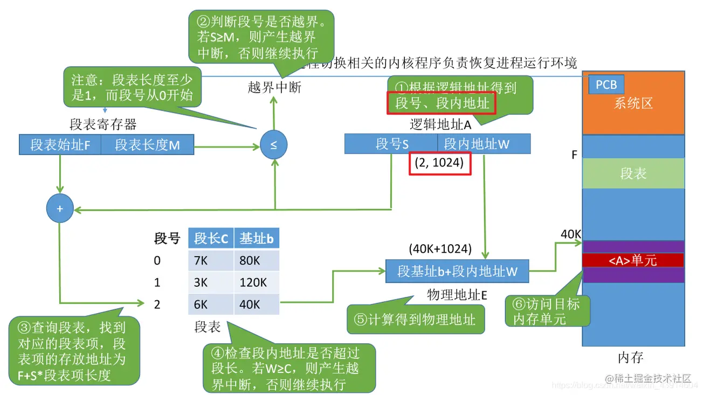

在进程切换时，只需要切换LDTR（段表寄存器）的值即可完成映射表的切换～

## Memory Manager—Partition & Paging

### 引入—内存怎么分配？

多个进程要如何获得自己的内存空间？有两种方法

#### 固定分区

​	固定分区的方法非常简单——**操作系统在初始化的时候就将内存等分为固定数量的n个分区，在进程请求时，寻找空的分区分配即可**。但是这个方法非常的不灵活：

- 进程超过n个怎么办？
- 有的进程需要的空间大于划分的空间怎么办？
- 有些进程需要的空间远小于划分的空间怎么办？

​	因此，固定分区并不是一个很好的解决方案

#### 可变分区

​	可变分区方式会根据进程发起的内存请求来分配内存空间（大概也是像隐式空闲链表那样的数据结构来解决的吧…）

​	这里会造成的问题和动态内存分配是一样的——产生内存碎片

### 页—从连续到离散

​	将内存分成页（页的大小一般很小，4K左右），**针对每个段内存的请求**，**将页逐个分配给段**，这样段就变成**自增长、且不连续**的了；此时段变成了一个逻辑上的意义，段变成了很多个页离散地分布在内存中。

​	这种分配方式带来的好处是，内存的浪费被减小到最少（只有每个段的末尾可能浪费小于一个页大小的内存）

### 页的访问

​	同样地，需要完成逻辑地址到物理地址的转化

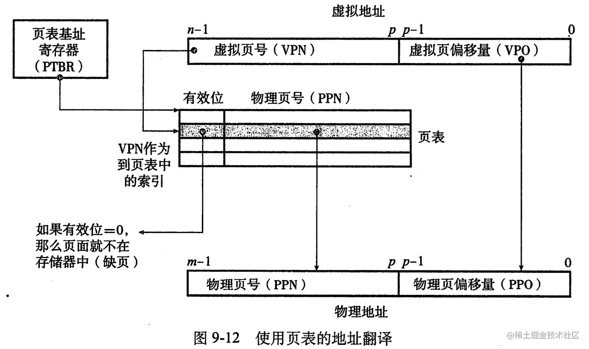

## Memory Manager—Multilevel Paging

### 页表的大小

​	在Linux中，会为每个进程分配一个大小为4GB的虚拟地址空间，若每个页的大小为4KB，则需要1024^2^个PTE（Page Table Entry，页表条目），一个PTE的大小为64bit（即8Byte），每个进程的页表都需要占用8MB的内存，而**这4GB虚拟地址空间中的大部分地址都不会被用到**！这无疑是一个很大的浪费，为了解决这个问题，**引入了多级页表（Multilevel Paging）**

### 多级页表

​	使用了**类似于多叉线段树的思想**，**将页表分段**，有效减少无效页表的数量


​	在这个情况下，1级页表记录为无效的PTE，就不会产生2级页表；依此类推，最终页表项会少很多。

> ​	这一部分关键**需要理解时间与空间上的互相折中**：
>
> - 如果**直接去掉无效的页表项**，那么平均每条指令都要访问内存n/2次（n为页表长度），而访存会带来极大的时间开销（就算是采用二分查找，也有log(n)的时间复杂度）
> - 如果**保留所有的表项**，那么对页表的访问类似于Hash，时间复杂度为O(1)，但是消耗了大量的空间
> - 最后采取了上图的**多级页表的访问方式**：由于有多个VPN进行类似于Hash的查找，每级页表的访问时间都是O(1)，**总共需要访问k次**（k为最低级页表的层数）。这样在空间和时间之间完成了一个折中（**空间上消耗要大于方案一，因为存储了多级页表；时间上要大于方案二，但是稳定在了一个固定的值**）

### TLB

​	虽然多级页表在空间和时间上作出了折中，但是时间上的消耗仍然是实实在在增加了的…因此引入缓存的思想，采用TLB（翻译后备缓冲器）用以缓存最近使用的PTE，从而加快地址翻译的速度（事实上，这又是一次局部性带来的好处）…

​	**TLB是一组全相联快速存储寄存器**，它通过将VPN作为缓存的索引和标记，从而快速定位到最近使用过的PTE条目

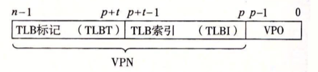

## Memory Manager—Segmentation & Paging

​	程序员在编写汇编程序时，更习惯使用段+Offset的方式编写程序；而对物理内存来说，使用分页是一个更合适的选择（可以有效提高内存的利用率）。两种管理方式都各有优劣，引出了**段页结合的实际内存管理**

### 段与页如何结合？

- 段的使用方式

    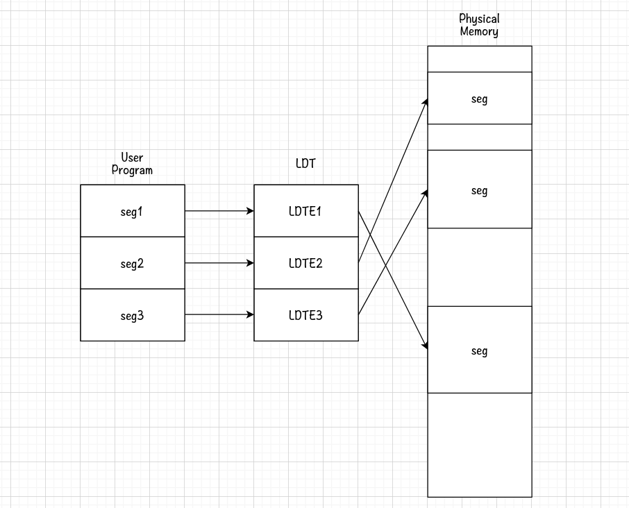

- 页的使用方式

    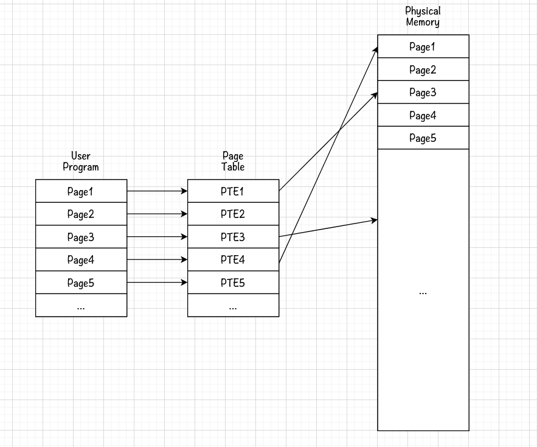

- 段与页结合？

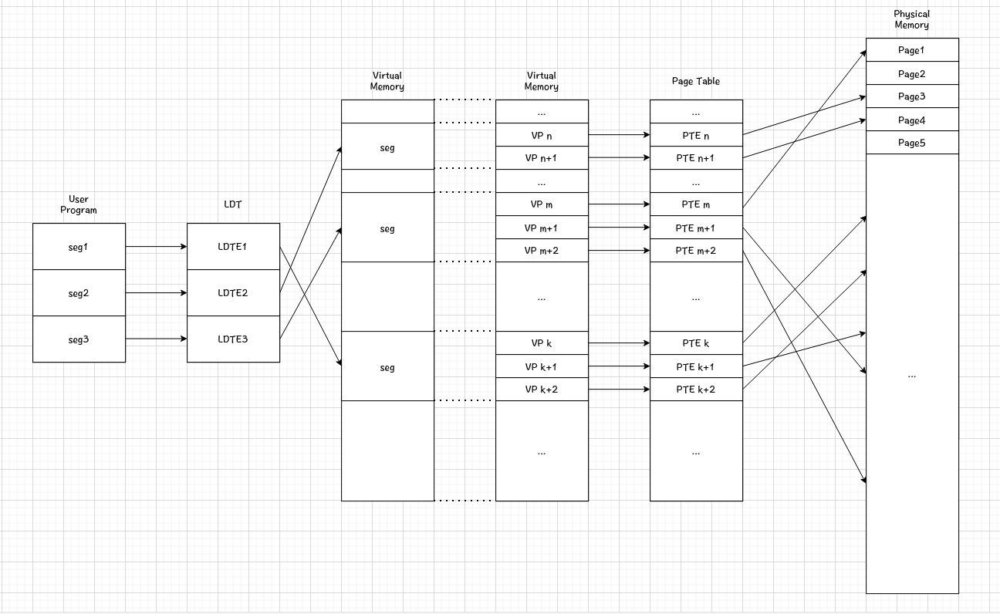

- 多进程视角下？

    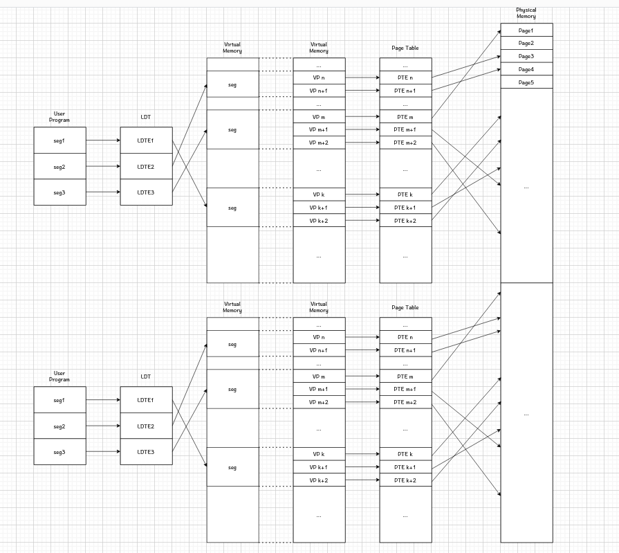

### 段页结合下的地址翻译

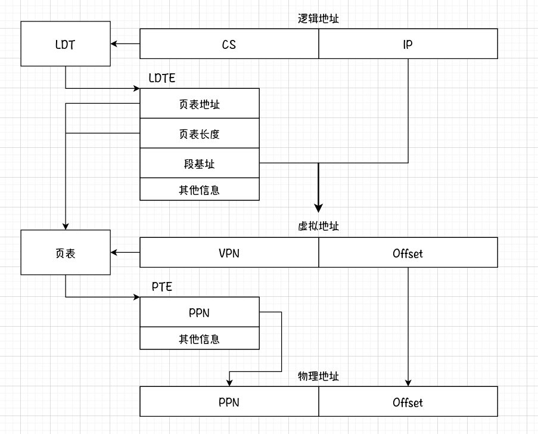

> **思考一下虚拟内存解决了什么问题？**
>
> ​	如果直接对物理内存进行段管理，那么带来的问题就是会出现大量的内存碎片，而降低了内存的利用率；如果对物理内存使用分页管理，且让程序员直接面对分页，那样会带来编码难度加大的问题。
>
> ​	因此，虚拟出一个内存，允许虚拟内存使用段管理（允许出现碎片），但当虚拟内存映射到物理内存上的时候，使用分页管理（提高了物理内存的利用率）。
>
> ​	虚拟内存还给每个进程都提供了一个独立的虚拟地址空间，顺带着解决了多进程的问题。同时，页表或段中可以添加访问信息，使得权限管理更容易了。

## Memory Manager—VM Implement

​	内存的使用与进程绑定，因此内存使用的开始就是新建一个进程的时刻，查看sys_fork()的代码：

```assembly
sys_fork:
	call find_empty_process
	testl %eax,%eax             # 在eax中返回进程号pid。若返回负数则退出。
	js 1f
	push %gs
	pushl %esi
	pushl %edi
	pushl %ebp
	pushl %eax
	call copy_process 			# 关键函数是copy_process
	addl $20,%esp               # 丢弃这里所有压栈内容。
1:	ret
```

```c
int copy_process(int ....){
    ....//新建任务结构体并初始化
    if (copy_mem(nr, p)) { //关键函数 copy_mem(int,task*);
        task[nr] = NULL;
        free_page((long)p);
        return -EAGAIN;
    }
    ....//将进程添加进就绪列表
    return ;
}
```

```c
//nr为任务号，p为任务结构体指针
int copy_mem(int nr,struct task_struct* p){
	unsigned long old_data_base, new_data_base, data_limit;
	unsigned long old_code_base, new_code_base, code_limit;
    code_limit = get_limit(0x0f);
	data_limit = get_limit(0x17);
    old_code_base = get_base(current->ldt[1]);
	old_data_base = get_base(current->ldt[2]);
	if (old_data_base != old_code_base)
		panic("We don't support separate I&D");
	if (data_limit < code_limit)
		panic("Bad data_limit");
    //重点在这几句
    //（Linux 0.11没有切换页表，而是给每个进程都固定分配了64M的虚拟内存）
    //计算新段的LDT
    new_data_base = new_code_base = nr * 0x4000000;
	//设置新段的一些数据（分配虚拟内存）
    p->start_code = new_code_base;
    set_base(p->ldt[1],new_code_base);
	set_base(p->ldt[2],new_data_base);
	//复制父进程的页表（建页表，共用父进程的物理内存）
    if (copy_page_tables(old_data_base,new_data_base,data_limit)) {
		printk("free_page_tables: from copy_mem\n");
		free_page_tables(new_data_base,data_limit);
		return -ENOMEM;
	}
	return 0;
}
```

```c
int copy_page_tables(unsigned long from,unsigned long to,long size)
{
	unsigned long * from_page_table;
	unsigned long * to_page_table;
	unsigned long this_page;
	unsigned long * from_dir, * to_dir;
	unsigned long nr;
	if ((from&0x3fffff) || (to&0x3fffff))
		panic("copy_page_tables called with wrong alignment");
	from_dir = (unsigned long *) ((from>>20) & 0xffc); 
	to_dir = (unsigned long *) ((to>>20) & 0xffc);
	size = ((unsigned) (size+0x3fffff)) >> 22;
	for( ;size-->0 ;from_dir++,to_dir++) {
		if (1 & *to_dir)
			panic("copy_page_tables: already exist");
		if (!(1 & *from_dir))
			continue;
		from_page_table = 
            (unsigned long *) (0xfffff000 & *from_dir);
		if (!(to_page_table = (unsigned long *) get_free_page()))
			return -1;	/* Out of memory, see freeing */
		*to_dir = ((unsigned long) to_page_table) | 7;
		nr = (from==0)?0xA0:1024;
		for ( ; nr-- > 0 ; from_page_table++,to_page_table++) {
			this_page = *from_page_table;
			if (!(1 & this_page))
				continue;
			this_page &= ~2;
			*to_page_table = this_page;
			if (this_page > LOW_MEM) {
				*from_page_table = this_page;
				this_page -= LOW_MEM;
				this_page >>= 12;
				mem_map[this_page]++;
			}
		}
	}
	invalidate();
	return 0;
}
```

## Memory Manager—Swap in & out

### 为什么需要虚拟内存？

​	期望提高对内存的利用率的同时保证编写代码的简易性。虚拟内存衔接了段与页的联系，对程序员可以利用段来编写代码，对物理内存可以使用页来进行更好的管理；整个过程通过**两次地址翻译**来完成：第一次是**逻辑地址转为虚拟地址**（通过LDT），第二次是**虚拟地址转成物理地址**（通过页表）；整个过程在软件角度看，只需要配置好页表与LDT，其余的由硬件（MMU）完成。

### 还缺少了什么？

​	虚拟内存可以比物理内存大的多，如何实现这样的大内存？可以通过页表记录当前已经存在物理内存上的页，并在合适的时候进行换入换出。这种情况下，**物理内存就类似于虚拟内存的缓存**。

​	换入换出的双方是谁？换入哪里？换出到哪里？**换入换出的双方是物理内存与磁盘，换入是将磁盘上的分页读入物理内存，换出是将物理内存上的内容写入磁盘**。虚拟内存中的“数据”事实上应该存在磁盘上，并通过映射来记录。这种情况下，**虚拟内存像是提取出了磁盘中需要用到的部分，作为物理内存与磁盘之间进行缓存的媒介**。

### 换入换出的过程

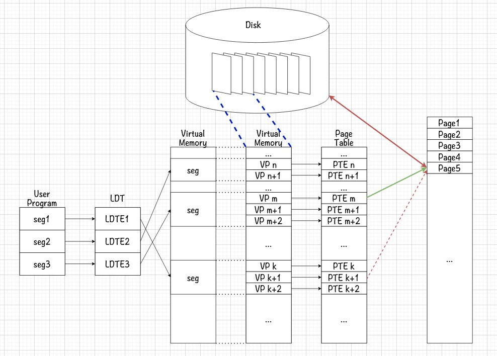

1. CPU对虚拟内存地址进行操作
2. 发现页表中PTEm的PPN为空，触发中断，执行缺页异常处理程序
3. **通过虚拟内存与磁盘的映射（蓝色虚线）**，在磁盘上找到对应的虚拟页
4. **计算出可以换出的物理页，与磁盘上的页面替换（红色双向箭）**
5. 修改页表，**被换出的PTE记录为无映射（删除红色虚线箭），换入的PTE记录为有映射（添加绿色箭）**
6. **重新执行CPU的操作**（这一点与普通中断不一样，一般的中断是执行下一句操作，而这里是重新执行）

### 置换算法—LRU

置换算法的评判标准在于：引发缺页异常的次数

- FIFO算法效率低，虽然公平但会导致大量缺页（公平在这里没什么用…）
- MIN算法选择最远将使用的页淘汰，是最优方案，但难以实现

#### 什么是LRU

​	LRU算法是MIN算法的平替，用过去的历史预测将来，**选择最近最长一段时间没有使用的页面淘汰**（最近最少使用，Least Recent Use）

> 为什么LRU能起作用？
>
> ​	还是因为局部性。最近没有用到的页，在将来也很可能不会用到。

#### LRU—时间戳

​	为每个页维护一个**时间戳**，记录该页最近使用的一次时间。这个算法的**实现非常简单**，但是**运行起来的效率非常差**；因为**每次引用内存都需要更新PTE**，在**选择置换页面时还需要遍历比较整个页表**。此外，还需要处理时间戳溢出等复杂情况。因此，该算法在实际使用中并不可行。

#### LRU—页码栈

​	每次使用时，都将对应的物理页提到栈顶；置换时淘汰栈底的物理页。同样，这个算法需要大量访问内存进行操作，带来效率低下的问题。

#### LRU近似实现—SCR

​	在实际的操作系统中，给每个物理页添加一个引用位；如果最近使用过，则标记为1；在置换时，遍历整个循环链表，如果标记为1,则将标记改为0，如果标记为0，则选择替换该物理页。SCR即Second Chance Replacement，二次机会替换。 

#### SCR的改造

​	如果缺页很少，会造成SCR退化成FIFO算法；因此需要对SCR作一些优化。退化的原因是记录了太长的历史信息。因此需要定时清除引用位。

### Linux 0.11中的调页

#### 异常处理程序的绑定

```c
//init/main.c
void main(void){
    ...
    trap_init();
    ...
}

//kernel/traps.c
void trap_init(){
    ....
    set_trap_gate(14,&page_fault);
	....
}

//这个函数在学习系统调用的时候也学习过
//当时是将0x80号中断与system_call函数绑定
```

#### 缺页处理程序

```assembly
#linux/mm/page.s
.globl page_fault
page_fault:
	#保存数据，取出错误码到eax中
	xchgl %eax,(%esp)
	pushl %ecx
	pushl %edx
	push %ds
	push %es
	push %fs
	
	movl $0x10,%edx
	mov %dx,%ds
	mov %dx,%es
	mov %dx,%fs
	
	#取出引起页面异常的地址
	#CR2是页故障线性地址寄存器，保存最后一次出现页故障的全32位线性地址
	movl %cr2,%edx
	pushl %edx
	pushl %eax
	#测试页存在标志P（为0），如果不是缺页引起的异常则跳转
	testl $1,%eax
	jne 1f
	##重点...do_no_page
	call do_no_page
	jmp 2f
	#调用写保护处理
1:	call do_wp_page
	#返回处理
2:	addl $8,%esp
	pop %fs
	pop %es
	pop %ds
	popl %edx
	popl %ecx
	popl %eax
	iret

```

```c
//linux/mm/memory.c
void do_no_page(unsigned long error_code,unsigned long address)
{
	int nr[4];
	unsigned long tmp;
	unsigned long page;
	int block,i;
	address &= 0xfffff000;//去除地址低12位（页面大小为4KB）
    //tmp保存缺页地址与当前进程之间的gap
	tmp = address - current->start_code;
    //如果偏移大于end_data或当前程序不可执行？
	if (!current->executable || tmp >= current->end_data) {
		//为该VP分配一块空的PP并返回
        get_empty_page(address);
		return;
	}
    //判断当前页是否可以共享，如果是则返回
	if (share_page(tmp))
		return;
    //如果获取失败，则显示内存已用完（不存在可以换出的页面）
    //这里已经用算法计算出了可以替换的PP了
	if (!(page = get_free_page()))
		oom();
	block = 1 + tmp/BLOCK_SIZE;
    //计算需要的页面在磁盘上的位置（1Page为4Block，nr用来存块号）
	for (i=0 ; i<4 ; block++,i++)
		nr[i] = bmap(current->executable,block);
    //读磁盘
	bread_page(page,current->executable->i_dev,nr);
	i = tmp + 4096 - current->end_data;
	tmp = page + 4096;
	while (i-- > 0) {
		tmp--;
		*(char *)tmp = 0;
	}
    //修改页表
	if (put_page(page,address))
		return;
	//失败的情况下，释放PP,并显示物理内存不足
    free_page(page);
	oom();
}

//可以看出Linux 0.11并不支持置换出的页面写回磁盘，只支持读入并执行，经常会报内存不足的错误
```

## File View—IO & Peripheral

### 外设是如何被使用的？

​	外设，即外部设备，可以简单理解为**输入设备和输出设备**；它们与计算机主机**可以认为处于同一地位**，因为它们本身自己也带有计算能力（有内部的运算电路和芯片，比如最常见的固态硬盘的负载均衡就是在其内部实现的）

​	使用外设，就是CPU通过**PCI总线**（PCI，外设组件互联标准），向外设的寄存器（或是内存）写入一些内容；外设的计算模块依赖这些数据进行处理，并在**处理完成后发出中断**。

​	但是裸机使用硬件十分繁琐，操作系统应该给用户提供一个简单、统一的视图——**文件视图**。

### 显示器

对显示器的操作以printf为例：

```c
//init/main.c

static int printf(const char* fmt, ...) {
    char* args;
    int i;
    //计算出args开始的内存地址
    args = (char *) &(fmt) + __va_rounded_size (fmt);
   	//调用vsprintf向printbuf中写入格式化字符串，再将printbuf写入fd=1的文件
    //void write(int fd, char* buf, int offset);
    write(1, printbuf, i = vsprintf(printbuf, fmt, args));
    //返回写入的字节数
    return i;
}

//write会展开为系统调用，陷入内核调用sys_write
//fs/read_write.c
int sys_write(unsigned int fd,char * buf,int count)
{
	struct file * file;
	struct m_inode * inode;
    //这里将file赋值，通过当前进程的PCB获取文件列表并索引访问到fd对应的文件
	if (fd>=NR_OPEN || count <0 || !(file=current->filp[fd]))
		return -EINVAL;
	if (!count)
		return 0;
    //通过文件结构体取得文件的信息
	inode=file->f_inode;
    //根据文件的分类进行分别操作
	if (inode->i_pipe)//管道设备
		return (file->f_mode&2)?write_pipe(inode,buf,count):-EIO;
	if (S_ISCHR(inode->i_mode))//字符设备（Character）
		return 
        rw_char(WRITE,inode->i_zone[0],buf,count,&file->f_pos);
	if (S_ISBLK(inode->i_mode))//块设备（Block，如磁盘等）
		return block_write(inode->i_zone[0],&file->f_pos,buf,count);
	if (S_ISREG(inode->i_mode))//常规文件（Regular）
		return file_write(inode,file,buf,count);
    //如果都不是以上文件，则退出
	printk("(Write)inode->i_mode=%06o\n\r",inode->i_mode);
	return -EINVAL;
}

//那么fd从哪里来？(文件如何产生？)
//
int sys_open(const char * filename, int flag, int mode){
	struct m_inode * inode;
	struct file * f;
	int i,fd;
    //先处理了一下参数
	mode &= 0777 & ~current->umask;
	//循环遍历当前PCB文件列表，找到一个fd空位
    for(fd=0; fd<NR_OPEN; fd++)
		if (!current->filp[fd])
			break;
    //没找着
	if (fd>=NR_OPEN)
		return -EINVAL;
    current->close_on_exec &= ~(1<<fd);
	//找到了文件的w e
    f=0+file_table;
	for (i=0 ; i<NR_FILE ; i++,f++)
		if (!f->f_count) break;
	if (i>=NR_FILE)
		return -EINVAL;
	(current->filp[fd]=f)->f_count++;
	if ((i=open_namei(filename,flag,mode,&inode))<0) {
		current->filp[fd]=NULL;
		f->f_count=0;
		return i;
	}
	if (S_ISCHR(inode->i_mode)) {
		if (MAJOR(inode->i_zone[0])==4) {
			if (current->leader && current->tty<0) {
				current->tty = MINOR(inode->i_zone[0]);
				tty_table[current->tty].pgrp = current->pgrp;
			}
		} else if (MAJOR(inode->i_zone[0])==5)
			if (current->tty<0) {
				iput(inode);
				current->filp[fd]=NULL;
				f->f_count=0;
				return -EPERM;
			}
	}
	if (S_ISBLK(inode->i_mode))
		check_disk_change(inode->i_zone[0]);
	f->f_mode = inode->i_mode;
	f->f_flags = flag;
	f->f_count = 1;
	f->f_inode = inode;
	f->f_pos = 0;
	return (fd);
}

```


## File View—Driver

## File View—File System
