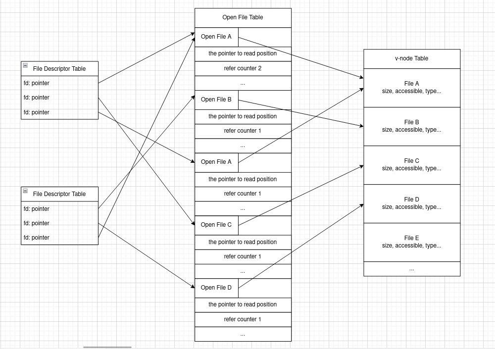
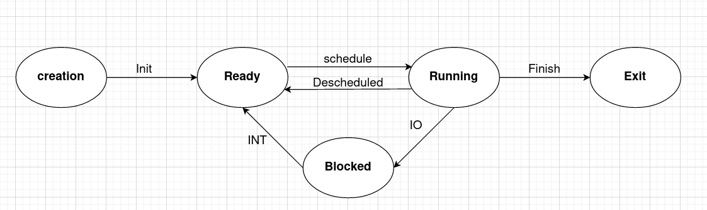
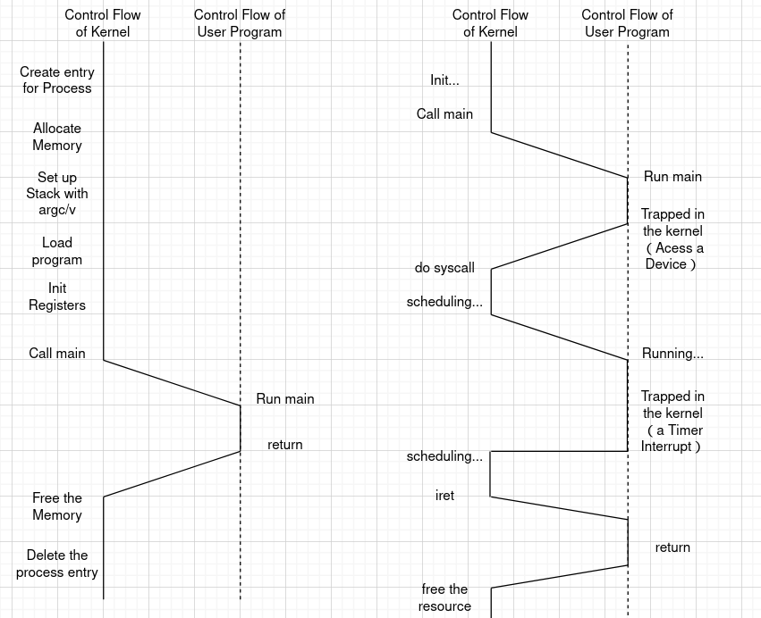
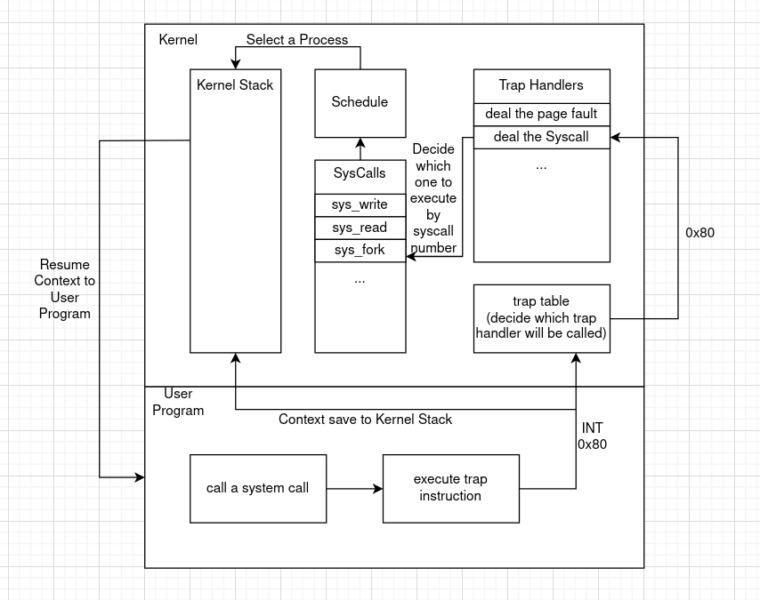
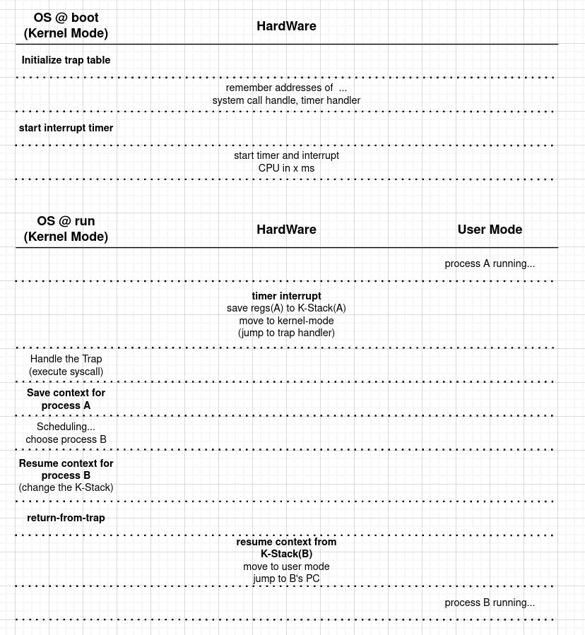
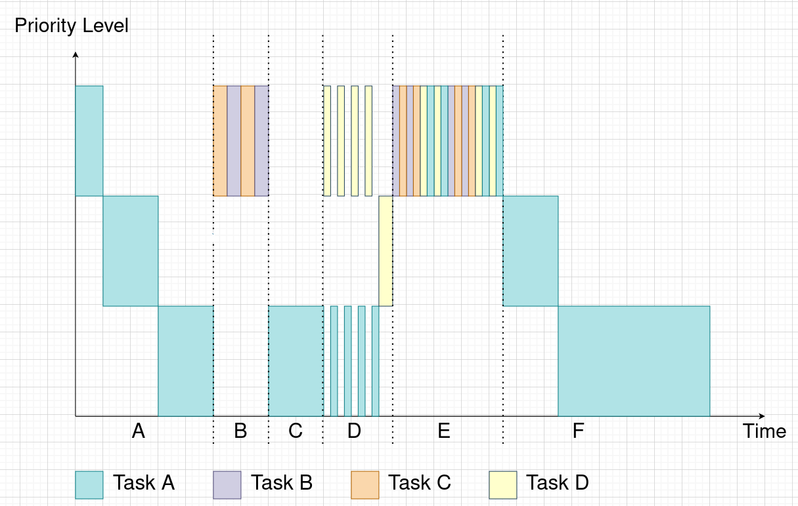
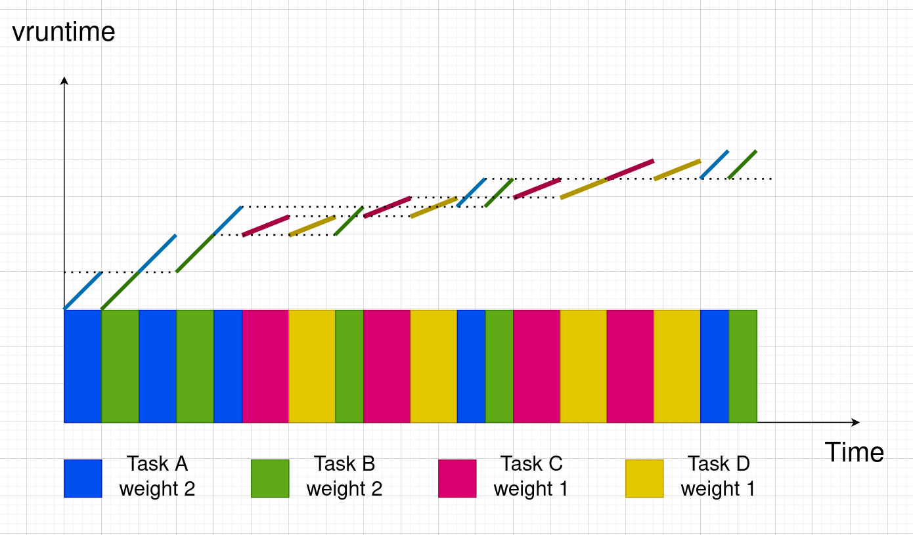
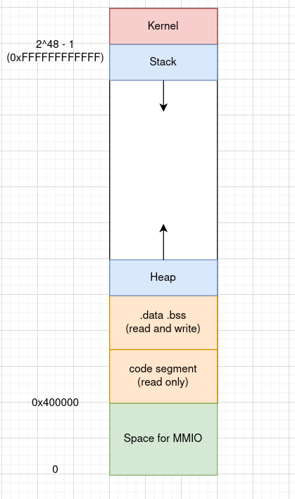
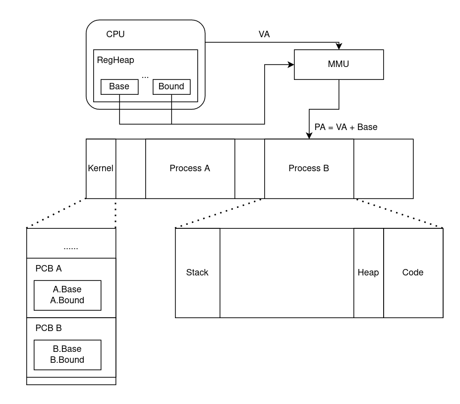

# Operating System - Three Easy Pieces

## Overview

### What happened when a program run?

- **Fetch**
- **Decodes**
- **Executes**
- **Memory Access**
- **Write Back**

### What role the OS play in these stage?

- **Virtualize the physical resource**  OS take physical resource and transform them into a more *general*, *powerful*, and *easy-to-use* virtual form of itself (Take CPU for example, Virtualization can make it be used in a more efficient way by *Time Sharing*). Thus, we sometimes refer to the OS as a *virtual machine*.
- **Provides APIs to allow using the features of VM**  OS provides some interface called *"System Call"* to make the PC become easier and safer to be used. So we sometimes say that OS provides a *standard library* to applications.
- **Manages resource for applications above it**  OS also play a resource manager role in the computer system, it provides mechanism to make applications access devices in a correct order instead of conflicting.

### Embodiment of some mechanisms

#### Virtualizing the CPU

```c
#include <stdio.h>
#include <stdlib.h>
#include <sys/time.h>
#include <assert.h>

#include "common.h"

int main(int argc, char* argv[]){
    char* str = argv[1];
    while(1) {
 		// the Spin(1) function will Block 1 second
        Spin(1);
        printf("%s\n", str);
    }
    return 0;
}
```

​	When execute beyond one instances of this Program, these instances will execute at the same time. *But how can **ONE CPU** execute **MORE THAN ONE PROGRAM AT THE SAME TIME**？*

​	OS provides a *Illusion* to each process that it holds the CPU all the time.

#### Virtualizing Memory

```c
#include <stdio.h>
#include <stdlib.h>
#include <time.h>

int main(){
    int *p = (int*)malloc(sizeof(int));
    printf("Allocate a space at %p\n", p);
    while(1) {
        spin(1);
        printf("*p = %d\n", ++(*p));
    }
    return 0;
}
```

​	When execute two instances of this Program, you will find that the p of two processes are equal, but the *p values are independent with each other.  *The question is that why two processes **ACCESS THE SAME ADDRESS** of memory but **GET DIFFERENT VALUE**？* 

#### Concurrency

```c
#include <stdio.h>
#include <stdlib.h>
#include <pthread.h>

volatile int counter = 0;

int loops;

void *worker(void* args) {
    for(int i = 0; i < loops; i++) {
        counter++;
    }
    return NULL;
}

int main(){
    loops = atoi(argv[1]);
    pthread_t p1, p2;
    printf("Initial value: %d\n", counter);
    
    pthread_create(&p1, NULL, worker, NULL);
    pthread_create(&p2, NULL, worker, NULL);
    pthread_join(p1, NULL);
    pthread_join(p2, NULL);
    
    printf("Final value: %d\n", counter);
    
    return 0;
}
```

​	In a normal view, this program will output final value which equals twice of loops. However, the results are not only not as expected, but even different everytime. **HOW IT OCCURED？**

### Design Goals

-   Build up some **abstractions** in order to make the system **convenient and easy to use**
-   Provide **high performance**, **minimize the overheads** of the OS. Try to **make a balance** between features and performance.

-   Provide **protection** between applications, **isolating processes** to each other

-   Provide a **high degree of reliability**

## Part I — Virtualization

### The Abstraction: The Process

#### What is Process

​	What is a **Process**? it is **a running program** instead of siting on the disk. Also, the abstraction of process make OS can virtualize many CPUs. OS implement this illusion by **running one process, then stopping it and running another one, and so forth**. The Processes share the CPU in turns, which known as **time sharing**, allow users to run more than one program.

​	The potential cost is performance, which means that **OS should not take too much computing-power to implement it**.

​	To implement it, OS should provide supports not only **from the machine-level** (which called **context-switch**), but **from the high-level** (algorithm to finish **scheduling**).

#### How to describe a Process in Machine-Level

In total, **all the hard-wares** of a computer system decide the process, but who are they ?

-   **Memory**   All the instructions and the datas of a process are lie in the memory

-   **Register**   Registers are the interface of the CPU, which describe the CPU 's state (especially some special registers such as Program Counter, Stack Pointer, Frame Pointer and so on)

-   **Devices**    programs often acess persistent storage devices too. (especially the I/O system)

#### Life-Cycle of the Process

-   **Creation**    The *loader* in OS read the program in the disk and try to *map them into a correct position in memory* (not have to load all the pages at one time, with a VM System, OS can swap the required pages into memory when neccesarily, which called lazily load). After that, OS will call some function to do some prepare for process (such as run-time stack or heap). Also, OS do some initialization task like related to I/O. (Open some file descriptor)

>   **How OS prepare run-time stack and heap for process ?**
>
>   ​	When create a process, OS will record a PCB (process control block) structure in the kernel, the PCB maintain some variables to control the process.
>
>   ​	The run-time stack pointer is in the structure (stack means kernel stack but not user stack, in fact, user stack is not control by OS), when a process is running, it will be set in a register called TSS, which is a container of the running process infomation. When program yield into the kernel, hardware will store the sp (recording user stack now) and some other registers into the kernel stack, and then set the kernel stack into the sp to finish the switch between the user stack and the kernel stack. 
>
>   ​	For heap, OS maintain a variable called program break (which point to the end of the data segment) for each process to record the allocated heap space.
>
>   
>
>   **The file model in Linux**
>
>   
>
>   -   **FD Table**  Each process has a file descriptor table, whose item contain a fd and a pointer point to the table maintain the file read or write info.
>   -   **Open File Table**  Items in this table record the read or write info of each IO operation. Include data like refer counter (how many fd pointer to it, which means how many fd shared the IO info) and read write pointer record the file length has been read or write.
>   -   **v-node Table**  Each item in this table mapping a file physically in the disk, which contain the information about the file, such as file size, file type and so on.
>
>   **SO WHY NEED FD ?**
>
>   ​	Why OS don't provides the true address of each system call but provides the system call number to call these function? That is OS want to isolate the user code and the kernel code, just provides limited actions to user. The File System use file descriptor to acheive the same target.

-   **Ready**    After creation, the kernel stack has been pretend to be just like every yield process (has pc, user stack pointer, and some registers). In this state, the new creating process has been ready for being scheduled to run. Once scheduler choose it, OS will resume it context to CPU, and starting to execute the code of it.
-   **Running**    The scheduler choose a yield process, the process start runing ...
-   **Blocked**    The running process may take some action which need a lot of times. When doing these actions, the CPU are stopping to wait for it. So OS can switch to another process in ready state to run.



#### Data Structure of Process

```c
struct context {
	int eip;
    int esp;
    int ebx;
    int ecx;
    int edx;
    int esi;
    int edi;
    int ebp;
};

enum proc_state {
    UNUSED, EMBRYO, SLEEPING, RUNNABLE, RUNNING, ZOMBIE,
};

struct proc {
  	char* mem;
    uint32 memsz;
    char* kstack;
    
    enum proc_state state;
    int pid;
    struct proc* parent;
    void* chan;
    int killed;
    struct file *ofile[NOFILE];
    struct inode* cwd;
    struct context context;
    struct trapframe* tf;
};
```

### Mechanism: Limited Direct Execution

#### The problem with Time-Sharing

​	To virtualize the CPU, OS should switch between different processes, but it also take some challenges.

-   **Performance**    How to take as less as better overhead to schedule the processes? 
-   **Control**    How can OS track the processes and keep (or retain) the control of the CPU?

To solve these problems, a technique called Limited Direct Execution comes.

#### What is Limited Direct Execution



​	Left side is Direct Execution protocol, it without the limit from the OS, so it can get all the control of CPU, but it also cause some problems.

-   The devices are managed by OS, process can not access the devices directly.
-   To virtualize the CPU, OS have to change the process which is running. But in Direct Execution Mode, OS could not get the control unless User Program give it up forwardly.

​	So, Limited Direct Execution should solve these two problems.

#### Problem #1: Restricted Operations

​	The approach we take is to introduce a new processor mode named **user mode**, code run in the user mode is restricted in what it can do. In constrast to user mode is **kernel mode**, which the operating system runs in.

>   **How to isolating the kernel and the user?**
>
>   ​	This function are totally implement by hardware. Take x86 ISA as example, CPU access memory is based on CS:IP registers. So, x86 make the lowest two bits of CS register as the priority of the code. Also, there are two special segment registers which called **CPL** and **DPL** (current priority level and destination priority level). The CPL's value is decided on CS register, and the DPL's value is decided on the next instruction's address. If the CPL's level lower than DPL's, then allow the operation.

​	To provide API for the user, OS provides hundreds of system calls and set syscall number for each call. To execute a syscall, a program must execute a special **trap instruction** (for example,  INT 0x80 in x86 or ecall in RISCV). This kind of instruction will **save some context in kernel stack** and then **jumps into the kernel**. The **Privilege Level also be changed to Kernel Mode** during this period.

​	After that, OS can deal with the request from the user program. Then, OS execute a **return-from-trap** instruction to resume the data of user program, and jump back to the user program code.

​	But how OS know what to do? OS couldn't provides the functions address directly, it only provides **a series of syscall numbers**. When user want to do something, just **set the syscall number in some agreed position** (depends on the ISA and the OS, such as in some registers or in kernel stack). OS set a **trap table** when boost, when **comes a trap instruction**, the ISA will call the function set in trap table. For system call, OS often **provides a system call function to execute the match operation**.



>   **What is limited in this part?**
>
>   ​	OS limit the processes directly access devices. If a process want to do a I/O or other operations, it can only ask OS for help and provide a system call number (This limit the operation to the devices, because OS only provides finite system call, user program can only do these thing which has been prescribed).

#### Problem #2: Switching Between Processes

##### **How to regain the Control?**

​	When a user program running, it control the physical CPU directly. **How can the OS regain control of the CPU so that can switch between processes?**

>   **Consider What Means OS Gain the Control Of CPU**
>
>   ​	When CPU running the user program, the kernel is not running. When CPU running the kernel, means the OS regain the control.

-   **Wait For System Calls**

​	When user program make a system calls or trigger a exception or call a yield function, it will give up the control of CPU forwardly. So a schedule time can set when a system call finish.

-   **The OS Takes Control**

​	But if a process never give up the control, what would happen? (for example, the user program ends up in an infinite loop, and never make a system call) To solve this problem, OS must provide some way to regain the control non-cooperatively.

​	When boost, OS will start a timer, and pre-configured the interrput handler. When a timer interrupt comes, the CPU trapped into the kernel, OS regain the control.


##### **Saving and Restoring Context**



Take Linux 0.11 switching code as example...

```c
// main.c
void main(void) {
#ifdef RAMDISK
    main_memory_start += rd_init(main_memory_start, RAMDISK * 1024);
#endif
    mem_init(main_memory_start, memory_end);
    trap_init(); // init trap table
	//...
    time_init(); // start timer
    sched_init(); // the timer handler and system handler in here
	//...
    move_to_user_mode();
    if (!fork()) {
        init();
    }
    for (;;)
        pause();
}

// sched.c
void sched_init(void) {
    int i;
    struct desc_struct* p;  // 描述符表结构指针
	//...
    // init the based pointer to the tss and ldt
    set_tss_desc(gdt + FIRST_TSS_ENTRY, &(init_task.task.tss));
    set_ldt_desc(gdt + FIRST_LDT_ENTRY, &(init_task.task.ldt));
	//...
    set_intr_gate(0x20, &timer_interrupt); // set timer handler
    /*
    	.align 2
		timer_interrupt:
		//...
		jmp ret_from_sys_call
    */
    set_system_gate(0x80, &system_call);  // set system call handler
}
```

```assembly
# system_call.s
system_call:
	cmpl $nr_system_calls-1,%eax    #check the syscall number
	ja bad_sys_call
	#... prepare some arguments
	call sys_call_table(,%eax,4)        # execute the system call funtion
	pushl %eax                          # push return value to kernel stack
	
	#judge whether need to schedule
	movl current,%eax                   # 取当前任务(进程)数据结构地址→eax
	cmpl $0,state(%eax)		# state
	jne reschedule
	cmpl $0,counter(%eax)		# counter
	je reschedule

ret_from_sys_call:
	# resume all context from k-stack
	iret # go back to User mode
	
reschedule:
	pushl $ret_from_sys_call # push the ret address to k-stack
	jmp schedule
```

```c
void schedule(void) {
    int next;
    // CFS choose next process
    switch_to(next);
    //there will return to ret_from_sys_call function
}

// Linux 0.11 didn't use k-stack to save context, only use a TR register point to a TSS which include all the context. By change the TR register will change the TSS, will change the value resume to CPU.
define switch_to(n) {
	struct {
    	long a, b;
	} __tmp;
   
	__asm__(
    	"cmpl %%ecx,current\n\t"
    	"je 1f\n\t"
    	"movw %%dx,%1\n\t"
    	"xchgl %%ecx,current\n\t"
    	"ljmp *%0\n\t"
    	"cmpl %%ecx,last_task_used_math\n\t"
    	"jne 1f\n\t"
    	"clts\n"
    	"1:" ::"m"(*&__tmp.a),
    	"m"(*&__tmp.b),
    	"d"(_TSS(n)),
    	"c"((long)task[n]) 
    );
}
```

### Scheduling: Introduction

#### Scheduling Metrics

-   **Turnaround Time**    T~turnaround~ = T~completion~ - T~arrival~
-   **Response Time**    T~response~ = T~firstrun~ - T~arrival~

#### Some Basic Scheduler

-   **FIFO**    First in first service, it perform bad in both Turnaround Time and Response Time.
-   **SJF**    Short-Job-First, perform better in Turnaround Time, but can not deal with the situation that the tasks not arrival at the same time.

-   **STCF**  Shortest Time-to-Completion First, which can perform best in turnaround time, but the perform bad  response time.
-   **RR**  Round-Robin, which let each process run the same time then switch to another one. It's totally fair, perform best at response time, but perform bad at turnaround time.

###  Scheduling: MLFQ

#### The Crux

​	Multi-Level Feedback Queue try to solve two problems. First, it would like **to optimize turnaround time** (which can implement by running shorter jobs first); Second, to make a system feel responsive to interactive users, which **should minimize response time**.

​	But for minimizing the overhead of OS, an OS can not have a perfect knowledge to every process. How To Schedule in this situation?

#### The Rules of MLFQ

-   **Rule 1:  If Priority(A) > Priority(B), A runs while B doesn't.**
-   **Rule 2:  If Priority(A) = Priority(B), A&B run in RR fashion using the time slice of the given queue.**

-   **Rule 3:  When a job enters enters the system, it is placed at the highest priority.**

-   **Rule 4:  Once a job uses up its time allotment at a given level, its priority is reduced.**

-   **Rule 5:  After some time period S, move all the jobs in the system to the topmost queue**

>   **The Reason For Rules**
>
>   ​	For Rule 1&2, it can deliver excellent overall *performance similar to SJF/STCF* for short-running tasks and *provides fairness to tasks* in the same priority level.
>
>   ​	For Rule 3, it can *remenber the type of a task* (I/O-bound or CPU-bound) then use a suitable way to schedule them.
>
>   ​	For Rule 4, it *avoid the user-program gaming with the OS*
>
>   ​	For Rule 5, it *avoid the starvation of the long-running jobs* (by boosting priority)

#### Diagrammatic Presentation



>   -   A: This Period Only Task A running, after consume its time in high priority out, it reduced its priority until to the lowest level.
>
>   -   B: Then comes two new tasks (B and C), they coming with highest Level , so the task A hang on the kernel and waiting for scheduling, B and C run in RR fashion.
>   -   C: Now the task B and C finished, OS resume the task A to running.
>   -   D: Here comes the task D, it try to gaming with the OS (pretend to be a short-term task) but failed, after running out of its time, it be move to the lower priority level.
>   -   E: Comes a lot of new tasks, to avoid the starvation of the long-running task, OS boost all the tasks to the highest priority.
>   -   F: The short running tasks finished, the task A continue running...

### Scheduling: CFS

#### Proportional Share

​	The Linux Completely Fair Scheduler is one kind of **Proportional Share**, here are some basic way to implement proportional share.

##### **Lottery Scheduler**

​	Distribute some **Tickets** to each process, then generate a random winner ticket number, the process which has the winner ticket will run.

​	The advantages of the lottery scheduler is clear.

-   *Easy to implemention*, You only need a random number generator and record the tickets for every process. 
-   *Totally Fair*
-   *Easy to optimize*

##### **Stride Scheduler**

​	Distribute some **STEP LENGTH** to each process, record the total length each process has walk. Once a process running a slice, its total length plus with its step length. Every time choose the process which has shortest total length  to run.

​	it can provide a deterministic proportional share, but it doesn't has a global state, so it perform bad when a new process come in.

#### Basic Operation

​	While most scheduler based on the concept of a fixed time slice, CFS based on a technique called **Virtual Runtime** (vruntime).

​	As each process runs, it accumulates vruntime. In the most basic case, each process's vruntime increases at the *same rate*. When a scheduling decision occurs, CFS choose *the process with the lowerst vruntime to run* next.

​	CFS also maintain a variable called **sched_latency**, which determine how long a process should run before considering a switch. CFS *divide this value by the number of processes running on CPU to determine the time slice for a process*. After determine the slice length, processes run in RR fashion.

​	But what if too many processes? It will cause the slice become very short and frequently switch, which perform bad in effciency. So CFS maintain another variable called **min_granularity** to define how long the shortest slice should be.

>   **Rule #1**
>
>   ​	CFS **divide sched_latency by n (process num) to become a slice**, **track the vruntime** of each process, choose **the lowest vruntime process to run**. If n is too big, CFS use a **min_granularity to limited the length of the slice**.

#### Weighting

​	CFS also enables controls over process priority through a classic Unix mechanism known as the nice level of a process.

>   **Niceness**
>
>   ​	Unix allows using a niceness number to describe the priority of a process. Niceness level can be set from -20 to 19, with negtive number has higher priority, and 0 as the default.
>
>   ​	CFS use a map to transfer nice level to weight.
>
>   ```c
>   static const int prio_to_weight[40] = {
>       88761,  71755,  56483,  46273,  36291,
>       29154,  23254,  18705,  14949,  11916,
>        9548,   7620,   6100,   4904,   3906,
>        3121,   2501,   1991,   1586,   1277,
>        1024,    820,    655,    526,    423,
>         335,    272,    215,    172,    137,
>         110,     87,     70,     56,     45,
>          36,     29,     23,     18,     15,
>   };
>   ```

​	CFS implement priority by scaling the vruntime for different niceness levels process. With the following way to update vruntime:
$$
vruntime_{i,t} = vruntime_{i, t-1} + \frac{weight_0}{weight_i} * runtime
$$
​	It seems like the low priority process's **time flowing "quicker"** than the one in high priority, so the high priority process will be choose more likely.

#### Using RB-Tree

​	CFS should maintain a queue sorted by vruntime which contained all the running processes. So use a effcient data-structure is very important. CFS use a special red-black-tree to orgnize the queue (which will "cache" the leftest node...) so that it can reach the complexity of time O(1).

#### Diagrammatic Presentation



### The Abstraction: Address Spaces

#### What is Address Space

​	With the multiprogramming and time sharing coming, a problem comes. How can different processes share the memory? One way to implement it is, *giving it full access to all memory*, *consider the whole memory as a part of context*. When a switch occured, store all memory into disk, and resume the memory of another process from the disk, which called **swap**.

​	But when the memory size become larger and larger, it will take a lot of time to swap the whole memory to disk. So **OS should create an easy to use abstraction of physical memory**, which is **the running program's view of memory in the system**.

​	**The address space of a process contains all of the memory state of the running program.** Include the code segment, stack segment and so on.

>   **The Linux VM layout**
>
>   ​	Can find that VM system even provides a space larger than the Physical Memory.
>
>   

#### Goals

-   **Transparency**  The OS should implement the VMS in a way that is invisible to the running program.
-   **Efficiency**  Should make the virtualization as efficient as possible, both in term of time and space.
-   **Protection**  Should make sure to protect processes from one another.


### Mechanism: Address Translation

#### The Crux

​	In VMS, just like in LDE (Limited Direct Execute), we also need to attain both **effiiency and control** while providing the desired virtualization.

​	Efficiency means we should make use of hardware support; and Control required OS to ensures  that no application is allowed to access any memory but its own.

**But How To Efficiently And Flexibly Virtualize Memory?**

-   How can we build an efficient VM?
-   How do we provide the flexibility needed by applications?
-   How do we maintain control over which memory locations an application can access?

#### Hardware-Based Address Translation

​	**Hardware-based address translation**, or address translation for short, is the key to solve these problems. It occurs every time the CPU try to access memory. It will change the **virtual address** provided by the instruction to a **physical address**, which will redirect application memory references to their actual locations in memory. Such a frequently mechanism must need hardware support, which provided by the **MMU** (memory management unit).

#### Dynamic Relocation

​	At the beginning, MMU provide a pair of registers, which is called **base and bound**. The address translation at this time is very easy:
$$
PA = VA + REG[base]
$$
​	When user program try to access memory, MMU will add its VA and the value in base register as the PA it will actually access. The bound register is used to record the memory size a program could access, MMU will check whether the VA is greater than 0 and less than bound, so that processes isolation to each other. If a user program try to access a illegel memory unit, MMU will raise an exception.



​	When a switch occurring, the base and bound register of the running process will be saved into its PCB, at the same time regs of the choosen process will be resume into the CPU. Then the virtual address will be redirect to another address space.

​	It is also easy for OS to create a address space for a new process —— just need to find a free space and set the bound and base register for the new process.


### Segmentation

#### The Crux

​	With the bound and base register pair, we can easily putting the whole virtual memory into the physical memory. But, as you can see in the figure, **although the space between the stack and the heap haven't been used, it still take up the physical space**. If the process didn't need so much space, the space is wasted.

​	So the crux is —— **How to support a large address space with a lot of free space between the stack and heap?**

#### Generalized Base and Bound

​	To solve this problem, an idea called segmentation was born. It's very simple: since a pair of base and bound can mark a piece of memory, why not **have more bases and bounds for per logical segment of address space**?

​	Now in our system, we only have three logical segment —— code, stack and heap. So we can use three pair of register to mark them.
