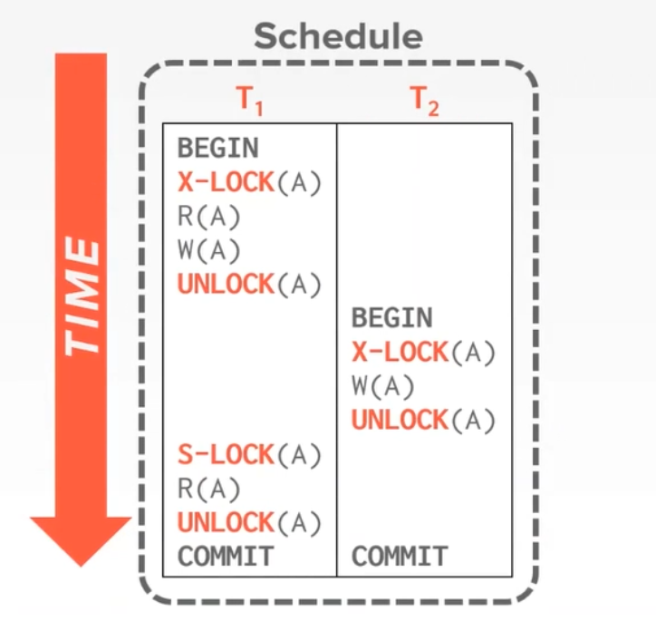

# Database System Concept

## 关系语言

### 关系模型

#### 术语

​	在关系模型中，**关系（relation）**被用于指代**表（table）**，而术语**元组（tuple）**用以指代**行（row）**，**属性（attribute）**被用来指代**列（column）**。

​	关系中的每个列的值域被叫做**域**，域可以分为**原子**的和**非原子的**，原子性由具体对数据的使用而确定（并非是一组数据就一定是非原子的）。

​	**模式（schema）与实例（instance）**的区别类似于声明结构与变量值的区别，模式规范表的信息，实例则是具体的表项。

​	为了区分关系中的不同元组，需要使用**码（key）**来进行标识，其中**超码（super key）**是一个或多个属性的集合，使用超码即可在一个关系实例中确定唯一的元组。超码中的属性并不一定是必须的，有时超码的子集就可以确定唯一的元组，则最小的满足这一特性的子集就是**候选码（candidate key）**。而**主码（primary key）**用来代表数据库设计时选中作为区分元组的方式的唯一候选码，选定主码时应该使用从不变化或极少变化的属性。

​	有时，属性的值域被另一个关系的属性值域所约束，被称为**外码约束（foreign-key constraint）**，    约束一方必须是主码。通常，引用完整性约束要求引用关系中任意元组在指定属性上出现的取值也必须出现在被引用关系中至少一个元组的指定属性上。

#### 关系代数

​	关系代数由一组**接收一个或两个关系**并**生成一个新关系**的**运算**组成。

-   **选择（select）运算**，一元运算，使用小写**sigma**表示。会生成一个由作为参数的关系中的元组中满足谓词的部分组成的新关系。
-   **投影（project）运算**，一元运算，使用**pi**表示。生成一个仅保留部分属性的新关系。
-   **笛卡尔积（Cartesian-product）运算**，二元运算，使用**叉号**表示，将作为参数的两个关系的每个元组俩俩组合成一系列新元组，生成由新元组组成的表。
-   **连接运算**，是对笛卡尔积运算和选择运算的结合。
-   **集合运算**，包括交、并、差，都要求关系的模式相同。

## SQL

### 初级SQL

#### 关系查询

```sql
SELECT attributes
FROM tables
WHERE predicates
```

​	关系查询使用SELECT子句，产生一个新关系，内容来源于 tables 中符合 predicates 的 attributes

>   **SELECT、FROM、WHERE与关系代数**
>
>   ​	select from where 都是关系代数中的运算符，分别为 映射、笛卡儿积、选择；对 SELECT 语句可以解释为：将from后的表作笛卡儿积，通过predicate选择出需要的部分后进行影射，得到最终结果

#### 更名运算

​	更名运算使用 AS 运算符，可以在 select 和 from 等子句中出现，用于给表或字段起别名；起别名一方面可以重命名关系，使得查询语句更简洁，另一方面可以同时操作同一个表，如

```sql
SELECT t.attribute s.attribute
FROM tableA as t, tableB as s
WHERE ...
```

#### 分组聚集

##### GROUP BY子句

​	这是SQL提供的非常重要的一个功能，效果如下

```sql
SELECT dept_name, avg(salary)
FROM instructor
group by dept_name
```

​	这里会将元组按dept_name列的属性值分组，并在每组内进行 avg 运算。需要注意的是，**如果使用了group子句，则出现在select子句中的部分必须使用聚集函数（如avg、max等）**

##### HAVING子句

​	考虑这样两个不同的需求：

-   将所有员工中工资高于平均值的按部门分组并求平均工资
-   选出部门平均工资高于4000的部门

```sql
SELECT dept_name, avg(salary)
FROM instructor
WHERE salary > avg(salary)
GROUP BY dept_name;

SELECT dept_name, avg(salary)
FROM instructor
GROUP BY dept_name
HAVING avg(salary) > 400;
```

​	其中，WHERE会在分组前对元组进行筛选，被**筛出的元组才会参与分组**；而**HAVING在分组之后对分组进行条件筛选**

#### 嵌套子查询

​	嵌套子查询使我们可以在普通查询的SELECT、FROM、WHERE中分别插入子查询，从而产生更复杂的查询

##### WHERE中的子查询

```sql
# 查询所有所在部门创建于2020年之后的员工的信息
SELECT * FROM instructor
WHERE instructor.dept_name in (
	SELECT dept_name
    FROM dept_info
    WHERE time > 2020
)
```

​	类似的运算符还有：

-   NOT IN
-   EXISTS
-   ( >、<、<>) + (ALL、SOME)
-   UNIQUE

##### FROM中的子查询

​	from中的子查询要好理解很多：from本身就是对关系的运算，那么查询返回的关系自然也可以参与到from的运算中

##### SELECT中的子查询

​	也被称作标量子查询，如：

```sql
SELECT dept_name, (
    SELECT COUNT(*) FROM instructor WHERE department.dept_name = instructor.dept_name) as num
FROM department;
```

​	将在映射中添加一个 num 字段，产生的新关系的每个元组的该字段由 执行子查询 得到，因此标量子查询必须保证有且仅有一个输出元组

#### UD

​	增加、修改、删除操作都比较简单：

```

```

### 中级SQL


## 数据库存储结构

​	数据库被映射为**多个不同的文件**，文件在逻辑上被组织为**记录的一个序列**；同时，一个文件由多个**块**组成（需要和磁盘读写的块区分，数据块和OS的块一样，都是软件决定的）。

​	在一个块上，可能会存在数条记录，变长的记录或固定长度的记录通过一些方式决定位置。

### 块组织

#### 定长记录的块组织

​	对于定长记录的管理，问题主要出现在插入和删除上：插入一个数据需要找到空闲的空间，删除一个块则需要管理空闲出来的空间。

​	这一部分与内存管理很相似，而且要更为简单。管理内存时，由于无法确定申请的内存的大小，为了避免产生碎片，需要记录双向的空闲链表，并不断进行合并的操作；而在数据块内，由于所有的定长记录都一样，不会产生碎片，因此可以直接使用空闲链表，将空闲链表存储在**文件头**上，每次发生删除时将新的空闲空间插入链表

#### 分槽页结构

​	对于变长记录，情况要复杂的多，但是由于块普遍不大，一些用在内存管理上比较耗时的操作并不会造成太大的影响；变长记录的存储要从**记录的存储**和**块内记录的布局**两方面讨论

##### **变长记录的结构**

​	变长记录由三部分组成，第一部分是变长字段的指针或定长字段的值组成的部分；第二部分是一个用于标识字段是否为空的空位图；最后是变长字段的值的空间

|  字节  |     值     |               备注                |
| :----: | :--------: | :-------------------------------: |
|  0～3  |   21，5    | 变长字段指针，offset 21，length 5 |
|  4～7  |   26，10   |           变长字段指针            |
| 8～11  |   36，10   |           变长字段指针            |
| 12～19 |   65000    |           定长字段的值            |
|   20   |    0000    |         四个字段均不为空          |
| 21～25 |   10101    |        第一个变长字段的值         |
| 26～35 | Srinivasan |           第二个变长...           |
| 36～45 | Comp.Sci.  |           第三个变长...           |

##### **变长记录所在的块**

​	块的结构与记录的结构类似，也是利用指针的方式来提高灵活度：每个块有一个**块头**，其中包含了已经存储的记录数量；其后是由**固定大小的 offset + length 方式、指向每一条记录的指针**数组；而记录的值从块的末尾往前记录，在块头与值之间就会存在一个**空闲空间**，块头还维护了一个指向空闲空间末尾的 offset 值

​	这样，对于插入，只需要**查看块头即可知道空闲空间的大小并进行插入**；而删除则**需要对删除了的记录之后的内容进行前移并修改块头中的记录**（由于块的大小不大，这样并不会带来太大的开销）

### 文件组织

​	文件组织将决定记录在每个文件中的排布方式（排布顺序），以便于查找和建立索引；在一个文件中，信息的排布方式大概为如下形式：

-   在文件的前几个块中，存在一个**数据字典**，其中包含了关于数据的数据（元数据），它将存储一些与关系的schema、各个字段的索引、文件组织方式等信息
-   在之后就是多个存放了真实数据的**块**，每个块按**块组织**中的方式组织内部的记录
-   而在整体上，各个块之间也有某种关系：
    -   堆文件组织，使用**自由空间图**去存放每个块占用的比例，但是这种结构存放的块无序，无法快速查找
    -   顺序文件组织，将记录**按某个字段排序存储**（使用链表的形式），这样可以快速方便地建立顺序索引（某个字段的），坏处是需要经常**重组**（链表在插入多次后很容易失去其物理存储位置与逻辑位置的相似性），且为其他字段建立索引十分麻烦
    -   **B+树文件组织**，利用B+树数据结构进行的文件组织，将在Indexing一章详细分析

>   **块与文件**
>
>   ​	要理解数据库的存储，最关键的是需要理解块与文件的关系；一个文件由多个块组成，文件界定了表的范围，而块将表分成多份分开存储；同时，块是数据库与磁盘交互的最小单位。总的来说，对数据库的操作就是对块的操作，增、删、查、改就是从某个文件上找出某个块并对块操作、最后写回磁盘。

>   **数据库存储如何保持灵活性**
>
>   ​	数据库需要存储大量数据，一方面需要保证空间的灵活性，即将每份数据合理地插入某个位置，另一方面需要保证块的利用率和操作的高效率。
>
>   ​	观察数据库的组织结构，通过文件界定一张表，通过表的元信息可以快速定位到某个块；在块内利用指针定位每条记录，在记录中又利用指针定位每个字段；指针为保证灵活性提供了很大帮助。

### 缓冲池

​	为了提高数据库的效率，同样**利用缓存**的思想，数据库会**实现一个称为缓冲池的内存区域**，用于缓存常用的数据块。与操作系统所实现的虚拟内存很类似，数据库缓冲池需要**实现一些置换算法**、记录每个页的信息（**Dirty Page**等）、实现Frame与Page的映射（**页表**）。不同的是，数据库缓冲池相较OS的VMS有较多的信息可以预测，所以在一些算法上有不同的实现；此外，还需要实现一些数据库才需要实现的功能，如**日志系统**等。

​	总的来说，**缓冲池需要管理内存，并进行事务追踪、并发控制**

>   **Lock 与 Latch**
>
>   ​	在数据库中，Latch对应在操作系统中讨论的锁等一系列进行并发控制的工具，而Lock则还包含一些例如事务回滚之类的操作，是两个不同的术语。

#### 缓冲池优化

-   使用**多个缓冲池（Multiple Buffer Pools）**，可以将Buffer Pool的可控性增加，为每种数据（比如索引或是真实的表）提供不同的访问模式，从而提高性能；同时，Buffer Pool 维护的页表经常被多个线程读取而导致自旋等待，分多个Buffer Pool 可以减少这种限制。
-   由于数据库可以通过查询语句和索引得知将要访问的块，而使得预测下一个要进入内存的块成为可能；数据库可以通过**预取（Pre-Fetching）**技术将块提前读入缓冲池中，从而减少访问的等待时间。
-   有时候多个线程需要访问同一个块，并进行一些不冲突的读写操作时，这些操作是可以同时进行的；数据库提供了一些机制去**共享扫描（Scan Sharing）**，通过类似订阅/发布的机制去提高读取到的块的利用率。

#### 页替换策略

-   **LRU**， OS学过，不记
-   **Clock Replacement** ， Linux 0.11看过，不记，核心思想是通过记录 **live_flag** 去判断是否被频繁引用
-   **MRU**， most recently used，对于某些查询很有效
-   **LRU-K**，通过记录时间戳，去比对块的访问类型（比如通过两次访问之间的间隔时间等）；相比LRU可以更适配数据库的访问模式

#### Dirty Page

​	对于脏页，需要维护一个 **dirty bit** 去判断是否需要对磁盘进行写入操作；如果采用每次都在页替换时写入，将会带来不少的开销；数据库系统通过**后台写入（Background Writing）**，在后台新开线程，定时写入dirty page并更新dirty bit，以此提高页面替换的效率

## 索引

​	数据库中大量的数据需要通过某种方式提供快速查找的方法，而快速查找的瓶颈则**在于对磁盘的读取次数（即每次数据库操作需要访问的块数量）**，通过将索引存储在文件的固定位置（比如文件头或是用文件头中的某个指针存储），可以通过访问小量的块（因为**索引只对某些字段进行处理，比如只存储某个字段之类的...**）而快速找到对应的块以及记录所在的偏移量

### 顺序索引

​	对于基于某个字段排序的表，则称以顺序字段的索引为**聚集索引**，其他索引被称为**辅助索引**，以下讨论都将基于这俩种索引分别进行

#### 稠密索引与稀疏索引

​	对于聚集索引，可以分为两种方式进行索引：

-   对每个顺序记录使用指针存储，即将**数据库整理成一个HashMap，（key为字段值，value为指向记录的指针，指针的形式由具体的块结构决定）**，进行查找时通过查找hashMap即可找到对应的指针。这种方式称为**稠密索引**。
-   由于记录是聚集的，因此可以使用类似于跳表的形式，**只为某些记录存储索引，通过查找到节点后顺序查找访问到具体的数据**，这种方式称为**稀疏索引**。

​	考虑这两种不同的索引，稠密索引更加简单粗暴，可以轻松找到对应的指针（甚至记录本身无序也能做到），**代价是存储的空间要大的多**；稀疏索引更好地利用了聚集索引的顺序特性，节省了大量空间，但是如果表长期不重组，顺序访问可能会跨多个块（链表的物理顺序和逻辑顺序不连续），导致效率低下。

​	**对于辅助索引，由于记录并不具备逻辑上的顺序性，只能使用稠密索引**

#### 重复字段的处理

​	有时，索引字段并不是主码，这就会造成字段的重复，对聚集索引，可以采用指向第一条索引记录的方式，而对稀疏索引，则需要采用索引指针指向一个存储了指向所有重复字段记录的指针的块来解决。

​	此外，还可以通过联码的方式（如给重复字段建立索引时默认key为 （primary-key , index-key）的tuple）来保证不存在重复字段，这种方式称为**多码索引**

#### 多级索引

​	在上述的稀疏索引中利用了跳表的思想来减少存储量，但事实上，跳表还可以加快搜索的速度：通过**给索引建立索引（上层索引必须是稀疏索引）**，即可使用类似于二分法的方式去加快索引项的查找速度（即上文中HashMap的一种具体实现方式）

#### 索引更新

​	发生插入和删除时，对于稠密索引，并不一定需要维护其顺序性，可以由块结构随意放置；而对于稀疏索引，则必须将记录按顺序重新整理成对应的块结构；因此，这又是一个典型的空间换时间...

​	对于更复杂的多级索引，则需要递归地修改每一层发生改变的索引

#### 总结

​	对于顺序索引，两种方式（稠密索引和稀疏索引）都试图提高某些效率，但是无法达成查询效率和修改效率的平衡：

-   对于**稀疏索引，必须维护其顺序性，降低了修改效率**
-   对**稠密索引，无法快速查找，搜索效率不高**（虽然可以通过在稠密索引上建立多级稀疏索引提高搜索效率，但是这样又影响了修改效率）

​	而树形索引兼顾了这两点，很好地兼顾了修改和查询，但是在存储复杂度上有了更高的难度，因此现如今大部分数据库的索引都采用了**B+Tree的索引方式**

### B^+^树索引

​	B^+^树也是平衡搜索树的一种，核心思想与其它各类树结构一样，不同之处在于它是一个磁盘数据结构，而不是内存数据结构（比如红黑树等），因此需要在一些方面进行改变

#### B^+^树的结构

​	B+树同样可以分为叶子和非叶子节点，但每个节点都可以最多容纳 n - 1 个搜索码值 k 和 n 个指针p；对俩类不同的节点进行介绍：

-   **叶节点**  叶节点的前n-1个p和k分别组成n-1个（p，k）tuple，即**（p~1~，k~1~）到（p~n-1~，k~n-1~）**，每个指针指向值为k的对应记录，而多出p~n~指针则指向下一个相邻的叶子节点。索引码的所有取值都将出现在叶子节点中，即**B+树的叶子节点对索引码构成稠密索引**

-   **非叶节点**  非叶节点在叶节点之上构成**多级稀疏索引**，如（p1，k1，p2，k2，p3）的非叶节点结构，p1将指向值大于k1的下一级索引，p2将指向小等于k1而大于k2的下一级索引，以此类推

    

-   对于重复码值，大部分数据库系统使用多码索引的方式解决

#### B^+^树的查询

​	B^+^树的查询方式与其他搜索树一样，取出根节点所在的块，遍历找到下一级索引的指针，以此类推，直到找到对应的记录；

​	此外，B^+^树也可以实现范围查询（在实际操作中很常见的情况），伪代码如下：

```cpp
set find_range(auto min, auto max) {
    set result = {};
    node current = root;
    while(current is not a leaf) {
        node next_level_index;
        foreach (item: current) {
            if(item > min) {
                nex_level_index = item;
                break;
            }
    	}
        current = next_level_index;
    }
    var start;
    foreach(item: current) {
        if(start > current)
            start = current, break;
    }
    while(start <= max) {
        add start into result;
        next(start);
    }
    return result;
}
```

>   **B^+^树的效率**
>
>   ​	正常来说，一般将一个块作为B+树的一个节点，大小大约在 4KB 到 8KB 之间，n 可取 100 ～ 200 之间，假设存储了 100w 条记录，查询需要访问的块也仅需要 3（索引块数量） + 1（数据块） = 4 个块，效率提升了很多

>   **B^+^树的存储方式**
>
>   ​	B^+^树使用稠密索引的方式存储叶节点，因此对存储要求不高，仅需要底层提供插入、删除、返回地址的接口即可。CMU的课程中展示了分槽页结构时对比了几个不同的数据库，其中有些数据库会对记录所在的槽进行修改，这样就需要修改索引的指针；因此大部分数据库只使用bitmap去标记有哪些槽被使用，而不去改动数据所在的槽。

#### B^+^树的拆分

​	虽然B^+^树的节点很大，但是最后总会用完，此时就需要对节点进行**拆分**操作。

​	当插入时检测到节点块容纳不下新的值时，将**分配一个新的块，并将旧块的一半值移入新块中，并更新父节点中的状态**（在父节点中插入一个新的item，此时父节点作为被插入的块，以此类推）

```cpp
node insert(value k, pointer p, node tree) {
    if(tree == nullptr)
        tree = new node(), return;
	if(tree is not a leaf) {
        node next-level-index = find_node_contain_k(tree, k);
        node child = insert(k, pointer, next-level-index);
        if(child != null){
            if(tree.size() < tree.capacity()) {
    			node new_node = new node();
                copy_half(tree, new_node);
                return new_node;
        	}
            insert_tuple_into_node(tree, k, p);
            return nullptr;
        }
    }
}

void insert_tuple_into_node(node leaf, value k, pointer p) {
    leaf.push_back(k, p);
    for(size_t i = leaf[leaf.length() - 1]; leaf[i].v < leaf[i-1].v; i--)
        swap(leaf[i], leaf[i - 1]);
}
```

#### B^+^树的合并

​	类似地，当删除操作导致某两个相邻节点的剩余容量大于总容量的一半时，会对B^+^树的节点进行合并，以减少空间的浪费。

#### B^+^树的块内表示

​	更为细节地，我们可以考虑B+树的每个节点是如何在块内表示的；最简单的情况是使用朴素的数组将它们保存起来，但事实上这实现时会有一些优化：

-   可以将Key 和 指针 分开保存，便于查找时对 Cache友好
-   添加一些其他的辅助字段，用来维护节点的详细信息，如 Slot的使用情况等
-   使用 **Trie 树（一种对字符串匹配特殊优化的树）**

​	对于指针，通常保存 Record ID，即一个指向对应的Page和Offset的指针；也有些数据库实现为直接保存Tuple

### 并发控制

​	仅考虑B^+^树的线程安全，B+树在并发访问时会存在以下俩种问题：

-   多个线程试图同时修改同一个节点的内容
-   一个线程在读时另一个线程试图修改

#### 对Inner Node的遍历

​	B^+^树使用一种称为 **Latch Crabbing / Coupling** 的技术去实现线程安全，核心思想是：**每访问一个节点前，先取得该节点上的 Latch，直到确认该节点安全并转移到该节点上后，再释放前一个节点上的 Latch （如果有的话）**

​	对于一个节点**安全**的定义是

-   如果进行插入，不会发生拆分
-   如果进行删除，不会发生合并

​	考虑确定节点安全的原因，是如果需要进行拆分或合并，则还需要对上一个节点进行修改；不释放 Latch 可以**保证在完成操作之前不会有其他正在遍历的节点转移到可能发生改变的节点上**

​	**如果子节点不安全，则继续持有父节点的 Latch，直到转移到一个安全的节点之上**

​	实际处理时，通常使用 Stack 保存所有的 Latch，遇到安全节点则释放之前的所有 Latch

​	此外还可以乐观地估计大部分操作不会造成拆分和合并，使用读锁先快速递进到叶节点获取写锁，如果发现估计错误则从根节点重新遍历（使用写锁），以此提高访问效率（写锁带来的影响要大于读锁）（对这种算法还有一种优化，即使用一个全局的表，修改叶节点后并不立即对父节点进行插入，而是将记录该操作进入全局表中，后一个遍历到该节点的线程通过检查该表并补全操作后再继续，也可以保证线程安全）

#### 对Leaf Node的遍历

​	由于B+Tree的Leaf Node实现了**兄弟节点指针**（便于双向进行范围查询），导致如果继续使用 Crabbiong Algorithm 进行并发控制会有死锁的可能

​	因此在遍历 Leaf Node 时如果发生 Latch 被占用的情况，应当选择直接结束此次操作并重启操作

​	

## 查询处理

### 查询处理的过程

​	SQL语句在执行时，会经过以下步骤：

-   **语法分析与翻译**，转变成基于关系代数的一种更有用的表达形式；对于同一SQL语句，表达形式可能会有多种（如映射和选择的次序可以交换等）
-   **优化**，优化器会根据一些已有的信息，从多种表达形式中通过代价计算选择一种最优的；同时会规划执行过程（是**物化**还是**流水线**、执行时使用的算法等）并给每个操作**添加注释**
-   **执行**，经过优化的过程被称为一个**执行计划**，**查询执行引擎**接受执行计划后执行并返回结果

### 查询代价的度量

​	查询的代价可以从很多不同的指标进行度量：

-   在早期的机械硬盘上，**IO操作**通常是执行的瓶颈，通常需要考虑到**寻道时间和传输时间**
-   在SSD上，基本可以忽略寻道时间（基本等同于随机访问）；此时**CPU代价**不再可以忽略不计，必须将CPU的计算时间也纳入考察的范围
-   此外，还有很多其他因素；如 Buffer Pool 的命中率等；举例来说，很多数据库都默认索引被整个存储在内存 Buffer 中，B^+^树索引的时间只考虑叶节点的访问时间

>   ​	**在以下的分析中，我们采取IO操作作为主要代价的度量**

### 运算的算法与代价分析

​	现在对 **选择、连接**为例 进行分析

#### 选择

-   **顺序搜索**，对于任何一个关系都可以采用这种方式，通过**遍历整个关系**，去**寻找满足谓词的元组**；效率极低但是也泛用性极高，对于复杂谓词、范围查询都适用；这种方式的**复杂度为 一次寻道时间（寻找文件的第一个块）和 N 个传输时间（将每个块依次传输到内存中）**
-   **索引搜索**，对于已经建立了索引的关系可以采取这类方式；但是泛用性并不高，如出现复合谓词时，如果并不是对用到的字段进行了多码索引，那就只能利用一部分索引；**复杂度可以降为B^+^树的复杂度（即假设Inner Node都在Buffer Pool中，对叶节点的访问次数（一次寻道+一次传输））**；对于范围搜索，则要对索引的类型进行讨论，如果是聚集索引，则为一次寻道+N次传输；如果是辅助索引，则接近随机访问

#### 连接

-   **嵌套循环连接**，即最朴素的连接方式，将每个元组与另一个块中的元组进行一一比较；对Buffer的利用率极低，可以通过**分块算法**改为**块嵌套寻-循环连接**
-   **索引嵌套-循环连接**，将嵌套-循环连接的内层的循环改为了索引搜索，从复杂度上提高了连接的效率
-   **归并-连接**，对数据进行预处理，**将两个关系排序后进行连接，可以做到两个表都只遍历一次**，但是要**计算外部归并排序的代价**

### 查询执行的过程

​	对执行单个关系运算，只需要按上述的算法执行并输出结果即可；但对一个关系运算表达式，可能存在多个运算，此时运算过程中间的部分就变得复杂了起来；其中主要的复杂问题出现在**中间数据应该如何保存**的问题上，以下就这个问题进行讨论

#### 物化

​	对于运算的中间数据，一个最简单也最朴素的思想就是为它**创建一个临时关系**并写入磁盘中；在后续的运算中再以这个关系作为输入，去得到下一个临时关系，直到得到最终的输出；这种处理方式称为**物化（Materialized）**

​	这种方式在效率上有一个明显的问题，就是**重复的、无意义的IO操作**：一个关系运算刚刚将一个临时关系完全写入磁盘，另一个关系运算又将其读出

​	对物化方式的一个优化是使用**双缓冲（Double Buffer）**，即多分配一个缓冲块专门用于写磁盘操作，算法利用运算缓冲区进行计算，计算的结果写入写缓冲区后写入磁盘，这样可以免去算法执行时需要中断将缓冲区写入磁盘的时间；但是这种方式依然没有避免重复的读写问题

#### 流水线

​	流水线的核心思想是，将**每个关系运算组织成一个模块，通过模块之间的互相调用或是异步的内存读写来将单个关系运算模块组合成关系运算表达式**，两种不同的实现分别被称为**需求驱动型流水线**和**生产者驱动流水线**

-   **需求驱动流水线**

    ​	需求驱动流水线通过**迭代器（Iterator）**为需求者提供获取数据的接口，如 open()，next()，close() 等；流水线末端即输出端会不断对最后一个运算模块提出需求（调用next()），如果该模块有可以提供的数据，就会返回，否则会向再上一级的运算模块（如果也是流水线模块的话）提出需求，以此类推

-   **生产者驱动流水线**

       生产者驱动的流水线与需求驱动流水线正好相反——**各个模块并不等待产生元组的请求，而是尽可能地产生元组**；生产者驱动的流水线很容易被设计为并发执行，下层的运算会不断独立地进行运算，直到自己的接收缓冲区为空或是接收者（上层运算）的接收缓冲区已满。这种实现很自然需要各个线程之间进行同步（很标准的生产者消费者模型，用信号量即可解决）

#### 真实的执行算法

​	事实上的执行算法并不是纯粹的物化或是流水线，而是两者的一个结合；因为有些情况不得不等待上一级运算完全完成才能继续进行（如排序）

​	在真实的执行算法中，把关系运算表达式解析为**算子树（operator tree）**，其中可以流水线执行的边称为**流水线边**，而必须阻塞运算的边称为**物化边**或**阻塞边**，连续的流水线边组成**流水线段**

​	通过对这些运算标记注释，执行引擎可以根据每个边的类型选择具体的执行方式（阻塞执行或流水线执行）

### 并行数据库

#### 处理模型

​	DBMS Worker 指代数据库中可以对某个给定任务进行处理的进程或线程

-   Process Per Worker
-   Process Pool
-   Thread Per Worker

##### Process Per Worker

​	Client 向数据库发出一个查询请求，数据库通过 **Dispatcher** fork 进程通过端口与 Client 进行通信；这种方式**依赖 OS 提供的调度器**；同时每个 进程 可以维护自己的 Buffer Pool，对于通用的 Page，可以通过共享内存模型来解决

​	优势是提高了可靠性，某个进程 Crash 并不会导致 DBMS 本身崩溃

##### Process Pool 

​	这种模型为了减少进程创建的开销，维护了一个进程池，本质上与 Process Per Worker 的方式相同

##### Thread Per Worker

​	80年代 Posix 线程模型出来后，现代数据库系统更多地使用轻量级的线程来替代进程，以此降低 context switch 的开销

>   **多线程数据库与Intra-query Parallel**
>
>   ​	多线程数据库并不一定支持并行化查询（即将查询拆分为多个不同的任务），多线程可能被用于同时处理多个查询请求

#### Intra-Qurey

​	也被称为水平型并行的查询，通过将一个查询分割为多个部分并行执行。这种分割是**在同层中进行块分割**。同层的数据在上下层之间使用一种称为 **exchange** 的操作符解决（exchange 也是作为流水线中的一环）

​	exchange 操作符一般提供以下几种操作：

-   Gather，即将下层的多个数据流（可能来源于不同的线程）聚集
-   Repartion，将下层的多个数据流重新组合成新的多个数据流
-   Distribute，将下层的单一数据流分割成多个向上层输出的数据流

#### Inter-Query

​	与 Intra Query 相对的是 Inter Query，也被称为垂直型查询；对任务的拆分是**在流水线的上下层进行拆分**的（一个线程处理一个流水线操作，并写入处理上层操作的缓冲区中），通过生产者-消费者模型解决同步问题。

>   ​	Intra-Query 和 Inter-Query 并不互斥，大部分数据库都采用混用的方式

#### I/O Parallelism

​	类似于 RAID 的思想，将数据库拆分到多个磁盘，通过一些方式来提高 I/O 的并行度

-   Multi Disk Per DB，通过 RAID 实现，数据库并不确定存储的细节，本质上还是通过重复存储来提高同时读取的块数量
-   One DB Per Disk
-   One Relation Per Disk，可以提高不相关查询的IO并行度
-   Split Relation across Multi Disk，DB实现的复杂度会变高

## 查询优化

​	关系数据库最有趣的一点就是可以使用**声明式语言**来完成对数据库的操作，而不用具体指明查询的具体流程，由此将数据的**物理存储**与**查询的逻辑**完全隔离开来，使得数据保持了独立性

​	要实现这一功能最核心的就是**查询优化器**，它通过对**关系表达式的等价转换**、结合已有的信息（如**索引和物化视图**），对大量查询计划进行估计，并生成局部最优的查询计划

### 查询优化的实现形式

-   **Static Rules**，使用静态规则，通过对查询的解析条件触发，静态地去匹配移除一些明显的低效查询工作（这种方式并不能很好地匹配数据库，因为表的规模和各种情况都会影响到查询的效率）
-   **Cost-based Search**，基于代价的搜索，通过某个**代价模型**去评估每个可能的查询计划，并选择一个最优的查询方案

>   **查询的整个流程**
>
>   -   SQL Rewrite，对SQL语句进行重写，转化为基于关系代数的表达形式
>   -   Parse，对表达式进行解析，得到抽象语法树
>   -   **Binder**，通过**系统目录（system catalog）**生成**逻辑查询计划**（描述查询的流程，而不指定具体的查询过程操作）（这里系统目录提供的是表的基本信息，比如将表名转成table ID等）
>   -   **Tree Rewrite**，通过系统目录得到表的更具体的信息（这部分信息由系统维护，不一定是最新，但是能给优化器提供参考），并重写语法树
>   -   **Optimizer**，接受从 Tree Rewriter 中传递过来的逻辑查询计划，通过逻辑查询计划和系统目录中的一系列信息，**对每个逻辑查询计划进行代价计算**，并生成具体的**物理查询计划**，最核心的**成本模型**就建立在其中
>   -   Execute，将物理查询计划通过某种方式（某种具体的并行方式或是串行方式）执行并得到结果

### 等价关系代数

​	**等价关系代数**作用于 Tree Rewriter 这一环节，用以生成和原关系表达式具有完全一致的输出的关系表达式

#### 等价转换案例

​	考虑这样一个查询

```sql
SELECT s.name, e.cid
FROM student AS s, enrolled AS e
WHERE s.sid = e.sid AND e.grade = 'A'
```

​	描述为关系表达式即为

**PROJECT**~name,cid~（**SELECT**~grade='A'~（student **JOIN** enrolled））

​	一个简单的优化方式是把SELECT结合到JOIN之前，即将SELECT enrolled 的结果与 student JOIN，以此减少 JOIN 的规模，关系表达式变为

**PROJECT**~name,cid~（student **JOIN** （**SELECT**~grade='A'~（enrolled））））

​	这种方式被称为 **predicate push down**，即将 select 向语法树的底层移动，以尽量减少上层操作的数据规模（select 是最有希望能够筛选掉大量数据的操作）

​	**（这种方式并不总能减小数据操作的代价，考虑如果谓词只能筛选掉很小一部分的数据，而enrolled表上本来建有索引的情况，这种情况下，select 筛选的数据很少，但是却丢失了索引）**

#### 对各类操作的优化

-   **SELECT**  对于可以PUSH DOWN的选择操作，会尽可能往语法树底部移；对于 SELECT 谓词中的 AND 等，也会改为 SELECT 的级联（也是为了尽快缩小数据规模）
-   **PROJECTION**  PROJECTION可以在另一个方向上减小数据量，因此对于PROJECTION操作，在重写时也会尽可能 PUSH DOWN，以减小 tuple 的长度，最小化 operator 之间的数据传输量
-   **WHERE**与**ON**  大部分数据库会对谓词作一些基本的判断，移除一些明显可判断的谓词，或是将一些重复的谓词合并（如 [0, 100]，[50, 200] => [0, 200]）

### 代价模型

#### 代价的来源

-   CPU，代价小且很难估计
-   **DISK，代价大，通过传输的块数目估计**
-   Memory，代价与用量相关
-   Network，传递消息的数量，网络传输需要尽可能传输大量的数据

#### 代价预估的数据

​	代价预估的数据来源与对数据库中真实数据的统计，这些信息有可能是过时的，但是代价预估也本身并不需要非常具体的数据，就算信息非常过时，导致的结果也只是生成一个低效的查询计划，并不会对查询的输出造成影响

​	信息可能过时是因为如果每次更新表内容就进行这类元数据的维护有很大的开销，有些数据库选择定时更新，还有一些提供专门的语法（如MySQL提供的 ANALYZE TABLE）来进行手动更新，还有一些使用触发器（如数据变更了 10% 就自动更新）

​	这些信息将会被保存在DBMS中被称为 **Statistics Catagory （数据目录）**的组件中

这些数据用以下符号表示：

-   **R**，relation，即关系
-   **N~R~**，关系R中的元组数
-   **V（A，R）**，关系R中A属性的取值数（值域的大小）
-   **SC（A，R）**，即 selection cardinality（选择基数），是在**假设均匀的条件下**，每个值可能出现的次数，为 N~R~ / V（A，R），通常可以通过这个值去预估运算之间传递的数据量
-   **selectivity of a predicate**，即某个谓词的筛选概率，通过它可以测试一个表符合某个谓词的元组的比例

​	这些数据的表现形式有多种，如直方图、采样表中

## 并发控制

### 事务

​	**事务**是一个操作执行序列，用于在数据库上实现一些更高层的功能；为了保证数据库在某些方面的一致性，才需要事务。如没有任何一个数据库系统会提供类似于银行转帐这样的特殊功能，这类东西应该被实现在应用程序中，但这类操作又必须像是数据库内建的一样（原子且一致）；从这个角度看，**事务是数据库管理系统中关于修改操作方面的一个基本单位**。

#### 简易事务系统

​	从最简单的角度出发，可以将DBMS设计成仅允许单线程执行事务，此时只需要保证**原子性** 即可；原子性指整个事务是一个整体，其中的**操作序列要么全都执行，要么一个都不执行**

​	这样的系统可以通过以下方式实现：

-   每次执行事务时，仅由一个线程从事务队列中拉取事务
-   线程复制整个数据库文件，并在新文件上应用指令序列
-   如果成功，则修改数据库文件指针指向修改后的文件
-   如果失败，移除失败的复制文件即可

​	通过将原文件与事务隔离，保证了所有的操作要么都执行，要么都不执行，但是这种设计十分原始，**复制新文件带来巨大的开销**。此外，仍不满足事务的另一个特性（持久性，如果所有的操作序列都已完成执行，则不会丢失，当前的实现如果在修改文件指针前关机将会导致丢失）

#### 真实系统的要求

-   **支持并发，提高吞吐量**
-   **更快的响应时间**
-   **正确性保证**
-   **公平性保证（同其他所有调度一样，需要保证没有事务会饥饿）**

#### 正确性标准ACID

-   **Atomicity**，即原子性，**事务中的序列要么全执行，要么不执行**
-   **Consistency**，一致性，使用数据库的程序在编写事务时保证；如转账后两方的金额之和一致等
-   **Isolation**，隔离性，即**并发执行的事务之间互相隔离**（也可以说数据库系统给每个事务提供仅有自己在执行的抽象）
-   **Durability**，持久性，即如果一个事务**成功提交**，则必须是持久的（如果在内存中崩溃，事务执行结果还没写入持久设备中，在重启时该事务的影响还应该存在（这通过**恢复系统**实现））

#### 数据冲突的类型

-   **R-W**，对于读后写类型，会产生 **Unrepeatable Read** 的问题，即俩次连续读无法得到同样的值
-   **W-R**，写后读会导致 **Dirty Read** 的问题，即一个事务读取到另一个事务还未提交（可能失效）的数据
-   **W-W**，写后写会导致数据混乱（两边的数据各占一部分，变成毫无意义的数据）

#### 可串行化

​	可串行化分为**冲突可串行化**与**视图可串行化**，其中冲突可串行化带来**冲突等价**的概念；冲突等价**意味着一个调度可以通过非冲突指令的顺序变化变成某个串行调度**（非冲突指令指对同一个对象的读或是对不同对象的读写）。

​	给定一个调度后的序列，可以通过**优先图**判断该调度是否是冲突可串行化的（如果优先图内没有环，则是可串行化的）

#### 调度的恢复与级联

​	对于一个涉及事务A和事务B的调度，事务A对一个对象作出修改，在A commit之前，B读取了该对象并 commit；若此时 A 发生 abort，则无法修改B已经提交的数据（无法对一个已经 commit 的事务进行回滚），这种调度被称为**不可恢复调度**，反之则被称为**可恢复调度**

​	若在上述条件中，A abort 时 B 还仍未 commit，则此时 A 和 B 都要发生回滚，这种调度被称为**级联调度**，反之为**无级联调度**

### 两阶段锁协议

​	要在运行时保证 Conflict Serializable，需要协议去规范访问的过程。**两阶段锁协议**（Two-Phase Locking Protocal）就是起这样的作用。它是一个**悲观锁协议**，即认为数据竞争会很频繁，每次访问 Tuple 前，都需要向系统申请锁，并在完成事务后释放。

>   **数据库中的锁与并发中的锁**
>
>   ​	要区分数据库中使用锁和并发编程中使用锁的异同，考虑如下一个调度序列：
>
>   
>
>   ​	从并发的角度，这个调度没有任何问题，T1在每次操作数据之前都申请了锁，并在完成操作后释放。但是从数据库的角度来看，T1第二次读取A时会发生 **Unrepeatable Read** 现象。
>
>   ​	其原因是数据库**要保证的不仅是每次读写的安全，还有事务的原子性**。如果要类比到并发的加锁方式，应该是在事务开始前把所需的所有锁加上，并在完成事务后释放所有锁。

#### TWO-PHASE

-   **GROWING**，即增长阶段，在这个阶段中，事务可以获得锁但不能释放任何锁
-   **SHRINKING**，缩减阶段，事务可以释放锁，但不能获得任何锁

​	考虑两阶段锁协议如何保证一致性：

-   对于**R-W**操作，协议**保证了读后如果释放了锁，则不会再产生任何再次的读取（如果需要再次读取，就不会释放锁）**
-   对于**W-R**操作，基本的 2PL 协议没有作出保证
-   对于 **W-W**操作，2PL 很容易证明不会同时有两个事务进行写

​	从**优先图**也不难分析出它产生的调度一定是冲突可串行化的：如果一个事务A优先于事务B执行，那么A到B有一条优先图边；如果要产生环（如B指向A），那么就需要A在B之后再进行一次与B冲突的操作；但是B能继续依赖于A已经开始释放锁，则A将不会再申请任何锁（2PL要求），则上述会产生环路的操作就不存在

#### 2PL的变种

-   **严格两段锁协议**，在2PL的基础上强制要求释放锁必须在事务 commit 后（在提交之前释放，如果发生 abort，则 W-R 类型的操作会发生级联回滚）
-   **强两端锁协议**，即在讨论与并发编程的区别时分析的在事务头尾两端直接将所需锁都获取的操作；这会降低并行性

#### 死锁问题

​	对于死锁，解决方式一直都是两种：即**解决或预防**，考虑死锁产生的三个要素

-   **资源是互斥的**

-   **非抢占式分配调度**
-   **对资源的获取是非原子的，且如果没能成功获取则持有之前的资源并等待**
-   **循环等待，即互相持有对方需要的资源**

​	只要有一个不满足就可以解决死锁问题

​	在数据库中，资源互斥不可能打破，则对其他的方式可以有以下思路

-   对于抢占式，可以强制其中一个事务回滚（比如根据时间戳判断，老的回滚）
-   对于循环等待，可以规定锁获取的顺序（即如果要获取到对方需要的资源，必须先获取对方已经持有的资源，这样就不会导致循环等待）
-   对于持有-等待，可以让更小的事务回滚

​	死锁预防的解决方式主要有以下几种：

-   **等待-死亡机制**，即上述对持有等待的解决方法，让更小的事务回滚，在这种机制下
-   **伤害-等待机制**，即上述对抢占式的解决方案
-   **锁超时机制**，超过一定时间，自动回滚，让其他事务可以正常进行

​	在这些机制中，如果获取锁时失败，则都会回滚，不会发生死锁（即死锁预防），这样的代价比较高昂

​	如果采取死锁检测，则可以通过**等待图**来检测死锁，并选择性回滚某些事务

#### 多粒度锁

​	频繁地上元组级别的锁会带来性能问题，数据库通过提供**多粒度锁**解决问题；即使用整张表级别的锁甚至整个数据库级别的锁。实现多粒度封锁协议，就需要提供更多类型的锁（而不仅仅是读写锁）和更多的机制来保证可串行化。

​	为了解决这个问题，我们将数据库组织成 库-表-元组 的**树型结构**，在某个**节点加锁，则意味着其下的所有节点都上锁了**。这样即可完成一次加锁大量数据的操作。但是这样也有问题，如果一个事务试图在根节点上加锁，那么该如何确定树内没有任何一个节点上锁呢？

​	为此引入**意向锁**这一新锁模式，在加锁时，所有祖先节点都将加上意向锁，由此就能通过查询根节点确定树内是否有锁了。

#### 锁管理器

​	锁管理器通常使用以下结构：

-   使用 **HashTable 维护所有元组**
-   每个**HashTable的表项下是一个链表，按顺序记录了当前所有正在等待的锁**
-   在得到申请时，**在等待列表末尾添加新的事务记录**
-   当得到释放时，**按序（防止饥饿）**处理后续的队列，给一个或多个（有可能是S-LOCK）授予权限

### 时间戳排序协议

​	时间戳排序协议（Timestamp Ordering， **T/O**）是一个不依赖于锁的协议；它与2PL不同，**乐观地假设系统中并不会频繁发生竞争现象**，而让事务进行，直到通过某种机制检测到竞争，才主动中断（这是对于乐观并发控制而言的，基本时间戳协议依然是悲观协议，每次操作之前要先保证时间戳对齐）

#### 基本思想

​	时间戳协议通过**分发时间戳**给事务，并通过某种机制**保证 TS（Ti） < TS（Tj），则 Ti 一定会在 Tj 之前执行（在等价的串行调度中）**

​	时间戳必须保证**单调递增**且**不重复**的特性；数据库系统通过提供一个函数**TS（txnid）**来生成、查询时间戳

#### Basic T/O

​	基本时间戳协议需要**在每个元组（或者受保护对象上）添加两个时间戳——Last Read TS 和 Last Write TS**，这两个时间戳分别记录了对应的最后一次读写的事务的时间戳

​	对于**Ti**的**读操作**，需要**保证TS（Ti）>= W-TS（X）**，即**读的时间戳必须大于最后一次写的时间戳**，这样保证事务读到的是更新后的数据；**如不满足，则终止并重启事务；如满足，更新R-TS（取Max（TS(Ti)，R-TS(X)））并复制一份X的数据以保证 Repeatable Read**

​	对于Ti的**写操作**，需要**保证TS（Ti）>= Max(W-TS, R-TS )**，即任何一个写操作不能老于任何一个读操作或者任何一个写操作，不满足同样终止、重启，满足时更新 W-TS，并复制数据进行操作

>   **考虑 T/O 协议如何保证串行化**
>
>   ​	保证可串行化的关键在于优先图不能成环，即不会发生有依赖的事务互相依赖（顺序颠倒）的情况。简单来说，就是保证 如果 A 和 B 之间有冲突，那么不会出现冲突操作先是 A -> B，然后又发生 B -> A 的情况。
>
>   ​	T/O协议的时间戳表示了事务发起的顺序，对于一个老事务 A 和一个新事务 B，共同涉及一个对X的操作，对以下情况进行分析：
>
>   -   双方都是读，那么都会成功，只需要保证时间戳大于最后一次写即可
>   -   老事务是读，新事务是写
>       -   如果老事务先执行了读，那么新事务可以进行写，但如果此时老事务又进行读（即 A -> B -> A），则会由于 TimeStamp < W-TS 而发生终止
>       -   如果新事务先写了，而老事务进行读，老事务将直接重启
>   -   老事务是写，新事务是读
>       -   新事务先执行了读，老事务进行写时会发生TS < W-TS，老事务重启
>       -   老事务先写，新事务读之后，老事务试图再写，老事务会重启
>
>   可以看出T/O 协议相比 2PL 在某些方面会更加严格

#### 托马斯写入规则

​	可以观察到，如果对事务分配了时间戳进行排序，那么很多冲突操作可以通过另一种方式解决：如果俩个写事务都对同一个对象进行了写，在 T/O 协议的保证下，一定只有新事务的内容会生效（期间有可能发生事务 abort 等事件...），那么直接采用新事务要写入的内容即可避免掉这些不必要的 abort，这就是托马斯写入规则的核心思想。

​	这个规则对基本的 T/O 作出的修改是：如果事务中写操作的 TS < W-TS，并不 abort 并 restart，而是在本地副本中维护这个状态，继续这个事务。

#### 乐观并发控制

​	基本时间戳协议带来三个问题：

-   **不可恢复调度**，该协议并不保证事务中引用到的信息都是已经提交了的
-   **性能问题**，每次读写都需要 Copy 副本到本地，对大规模读写带来极大的性能开销

-   **公平性问题**，一个事务越长，那么它被后来的短事务中断的可能性越大，这样会导致长事务容易饥饿

​	如果假设冲突并不频繁，那么可以有另一种方式：**乐观并发控制（OCC）**

​	**OCC的工作分为三个阶段：**

-   **读阶段**，OCC协议为每个事务提供了一个 Private Space，在读阶段所有的操作都将被应用到Private Space
-   **校验阶段**，当 Private Space 中的工作完成后，将 Private Space 与真实的数据库空间作比对，检查是否与其他事务有冲突
-   **写阶段**，将 Private Space 中的内容应用到真实的空间（这里的写操作必须是原子的）

​	在**进入校验阶段时，数据库系统会为事务分配时间戳**，**如果通过校验，并在接下去的写阶段中修改了数据**，该元组的 W-TS 将被更新为该事务的时间戳

​	校验阶段的方式可以分为 Backward Validation 和 Forward Validation，分别对与自己并发执行的已提交事务进行冲突检查和对自己提交时还在运行的事务进行冲突检查（即找所有比自己时间戳大/小的事务进行检测）

​	在很少发生冲突的系统中，OCC可以免去获取锁之类繁琐的步骤，提高性能（尤其是在系统基本只进行读操作（比如 OLAP）时，OCC相较于2PL会有很大的优势）

### 多版本并发控制

​	多版本并发控制（**Multi-Version Concurrency Control，MVCC**）是为**一个逻辑对象**维护**多个物理存储**的并发控制方式，通过记录事务的每次写操作来记录下不同时间戳下对应的数据，从而使每个事务都能找到自己对应时间戳的**快照**（Snapshot），完成并发执行

​	MVCC可以做到**读写互不阻塞**，只有遇到 W-W conflict 时，才会需要转而使用 2PL 或是其他方式（两个事务对同一版本的快照进行写）（疑问1：在validate时分配 write-timestamp，那么两次写肯定是有先后的，为什么会冲突？）

​	同时，MVCC还可以做到 **Time-travel Query**，即查询数据库某个时间点下的数据（疑问2：需要保存多大量的数据？）

#### MVCC原理

​	MVCC为每个元组维护了一个**历史版本表**，每个版本包含这些信息：

-   **Version**，版本号，随事务进行而更新
-   **Value**，元组的值
-   **Begin**，开始时的时间戳
-   **End**，结束时的时间戳

​	对于每个进行的事务，也会根据时间分配一个时间戳；

​	在一开始，队首的（最新版本的）元组只有开始时间戳而没有结束时间戳，即结束时间戳是正无穷大。当一个事务对它进行写后，它的结束时间戳就是对它进行写的事务的时间戳，并在队首加入一个新的历史版本，其开始时间就是事务的开始时间，值就是事务写入的值

​	如果一个事务要对该元组进行读取，则读到的是对应开始时间和结束时间范围内的历史版本元组

​	考虑如果两个事务同时要求写入？此时理论上它应该**根据时间戳的顺序进行排序**，即**生成两个版本**；但是考虑事务是并发执行的，**同时为历史版本表添加表项会引起竞争**，因此需要使用封锁对历史版本表进行保护；这**需要并发控制协议来处理 W-W 冲突**，理论上之前提及的所有并发协议都可以在这一部分起作用（2PL ， T/O ， OCC）

#### 版本存储

​	解决方式并不难；在物理存储方面，依然可以使用分槽页结构，但是对每个元组需要多维护一些信息；除了上述的版本、值、开始和结束时间戳之外，还需要维护一个 Inner Point，指向签一个或后一个版本的元组（就像链表一样）

-   **Append Only Storage**，只增加不删除的存储，那么可以记录链表头并使用头插法
-   **Time Travel Storage**，维护一个主版本表，维护最新的数据，将其它数据放入历史表中，并维护历史表中的元组和指针
-   **Delta Storage**，与 Time Travel 存储类似，但是历史表中并不存储值，而是存储 'Delta'，即元素之间变化的差值（这可以显著减小存储空间？如果值的变化量不大的话；还可以减小复制量（对比 Time Travel的整个元组复制，仅需要计算差值存储就好了））

#### 垃圾回收

​	最理想的情况下，一旦**历史版本的结束时间小于任何一个还在活跃的事务的时间戳，就意味着该版本再也不会被任何一个事务访问到了**；实现方法有两种，一种是循序遍历所有表并维护最老的事务的时间戳，以此判断哪些元组是无用的（即 Tuple 层面的回收，空闲空间管理无所谓，分槽页结构会出手）；另一种是事务级别的GC，每个事务自己维护自己的读写集，自动清除自己生成的记录（要是某个记录再也没有执行过...）

#### 索引管理

​	索引将指向多版本表的表头，而当一次版本更新后，所有相关的索引都需要更新！这是恐怖的开销。可以使用一个中间层，通过对中间层来统一所有索引指向的元组，修改时也仅需要修改中间层指针即可

## 恢复和日志系统

​	恢复算法是一种用于**保证数据一致性，事务原子性和持久性**的技术，其包括两个部分：

-   在事务正常进行时的一些用于保证数据库能够从崩溃中恢复的动作（记录日志）

-   当事务发生逻辑错误或是系统崩溃时进行恢复的一些动作，用于确保数据库处于一个正确的状态（读取日志并 Redo or Undo）

### 故障分类

​	数据库系统涉及内存和磁盘，从错误发生的位置可以分为：

-   **Txn Failure**，即事务的逻辑发生错误或是一些特殊情况如死锁等；
-   **System Failure**，包括软硬件错误，如数据库自身软件实现问题导致了系统崩溃（如 Segment Fault等）或是系统被断电...
-   存储介质失效，这是数据库系统无法处理的物理故障，但是可以通过 RAID 或是其他类似的冗余措施能减小这类事件的概率

### Buffer Pool 管理

​	在加入了事务后，Buffer Pool 写入磁盘的时机变得复杂，考虑如下一个情况：T1 和 T2 分别对同一个块上的两个元组 A 和 B 进行了修改，则此时 Buffer Pool 将该块确定为 Dirty Page，此时 T2 Commit（且先于 T1），而 T1 Abort，那么应该如何处理？ 如果直接将 Dirty Page 写入磁盘，那么 T1 Abort 时又需要读磁盘并进行回滚后再写磁盘（相当于每个事务都需要访问一次磁盘，Buffer Pool 失去其意义了，甚至会因为 Crash 而丢失T1回滚的数据）

​	此时 Buffer Pool 的管理策略就需要作调整，即考虑是否事务 Commit 后就一定要将 Page 落实到磁盘上或如果事务还未 Commit 能否移动它的 Page，有以下可组合策略：

-   **Steal Policy** 将允许一个未提交事务修改另一个事务已提交但还未写入磁盘的数据块，反之 Non Steal Policy 将不允许
-   **Force Policy** 会决定是否每次提交事务都立即将块写入磁盘， No Force 反之

组合后：

​	**No Steal And Force 将强制写入，但是为保证不写入还未提交的数据，则需要在 Buffer Pool 中复制一份数据并取消未提交事务的修改后再写入磁盘，坏处是磁盘 IO 次数变多，性能损耗大**

​	**Steal And No Force 不要求一提交立即写入，因此也自然满足 Steal Policy，即可以修改别的事务已经 Commit 但还未写入磁盘的数据**

### 日志技术

#### Shadow Paging

​	对应到 No Steal And Force 策略，每次提交都生成一个 Shadow Page（复制来的，仅带有自己已修改内容的 Page）立即写入磁盘，这种方式一方面浪费时间（太多IO了），另一方面会干碎固态硬盘的读写次数...

​	优势在于，由于是直写，数据库不存在 commit 了但是还未写入磁盘的数据，不需要恢复，另一方面内存中执行一半的事务也会丢失，也无需 undo；以一种很简单的方式保证了一致性

#### Write-Ahead Logging

​	这是大多数数据库常用的技术，使用 Steal And No Force 策略，对于每次提交，仅**在内存中修改**，并在持久存储设备中记录下**日志**，发生崩溃时通过日志恢复数据

​	这个理念可以追溯到 Log Structure Storage，即日志存储结构，这种方式可以使写数据库很快但读数据库代价高；这里是将两种存储结构作了一个结合

​	唯一**需要保证的是，每次 Commit 时，至少日志必须已经写入磁盘中**；对日志的写一方面写出量小（仅记录了修改的内容，而不像 Shadow Page 一样整页整页的写），另一方面是循序写，相比 Shadow Page 进行大量的随机写也有着更高的性能

​	日志信息大约分为以下几类：

-   BEGIN，表示某个事务开始执行
-   COMMIT，表示某个事务已经提交
-   ABORT，表示事务终止 
-   事务标识、对象ID、原值、修改后的值

​	在恢复时，恢复算法会从头开始执行这些日志（就像Log Structure DB一样），把所有的操作应用于数据库，最后得到 Crash 前的状态（这明显很耗时...）

>   **对于恢复系统的理解**
>
>   ​	恢复系统需要保证的是事务的**原子性**，即事务内的操作要么全做要么不做；
>
>   ​	Write-Ahead Logging下，事务已**提交**代表 Log 已经写入磁盘而非数据库；而 Log 也并不是一条一条追加，而是按 Page 输出的；意味着使用这种方式并不会对磁盘的同一个块进行重复的写，而是按块，块满了事务才提交；如果在块满之前 Crash，那么日志本身就不存在，也就不需要恢复了（相当于什么也没做）
>
>   ​	至于什么时候提交，则取决于具体实现...可以等一个块写完再提交，也可以使用 **组提交（Group Commit）**，在某一时刻统一写出（这样就会产生还未Commit但是已经写入磁盘的Log，但是有Undo）

### 检查点

​	如果真的不对日志进行任何清理，那么恢复算法的速度和日志占用的空间都会非常恐怖；为了解决这个问题，使用检查点定期确认已经完成的操作并清除无用的日志

​	**Check Point 的核心思想是，在某些时间点，将所有的 Dirty Page 都刷出到磁盘上，并为日志添加一条 CHECK POINT 记录，之后恢复时，仅从 CHECK POINT 开始即可，更早的日志记录可以删除**

​	最简单的实现就是定期停止所有事务，并执行Check Point，将所有日志应用于数据库并刷出 Dirty Page，记录所有此时还在活跃的事务。但是停止所有事务执行刷出会带来低效的麻烦，大部分数据库不会使用这种实现

​	关于多久记录一次 Check Point，可以采用定时的方式，也可以**采用记录日志大小来决定，如当日志大小到某一阈值时进行一次 check point**...

​	解决方式是一种称为**模糊检查点**的技术；通过在非易失性存储器上专门设立一个 last_checkpoint field，在更新检查点时，先记录检查点，直到所有的 Dirty Page 刷出到磁盘上后，才对 Last_checkpoint 进行更新

### 恢复算法

​	第一个机制完整的恢复算法，也是目前大部分恢复算法基于的算法，是 **Algorithm for Recovery and Isolation Exploiting Semantics（ ARIES）**

​	核心思想是使用 Ahead-Write Log，并将恢复分为两个阶段，第一阶段从 CheckPoint 开始，**重做所有的操作（Redo 阶段）并记录所有的 有开头而无结尾（有 Begin 但是没有 Commit 或 Abort）的事务（Undo List）**，在第二阶段，**从Log的最新记录开始往回查找查找，如果事务在Undo List里，则执行 Undo 操作并添加 Undo 日志（在另一个表里），遇到 Start 则在日志中添加该事务的 Abort 并从Undo List 中删除该事务，一直回溯直到 Undo List 为空**

## 数据库设计

### 数据库设计的流程

​	第一步进行**需求确认**，完整地描述出数据库系统的功能；下一步选择数据模型，将需求转化为概念模式，并输出实体联系图，称为**概念设计**；第三步**功能需求规格说明**中，用户在ER模型的基础上叙述将在数据上进行的各类操作（如事务等）；最后一步进行**逻辑设计和物理设计**，即将ER图和需求转化为关系数据模型中的Schema和事务，并在物理上决定每个表的存储方式、建立索引等具体细节

​	数据库设计要尽量避免**冗余**和**不完整**，以保证数据库在可用的基础上做到高效而优雅

### E-R模型概念

#### 实体集与关系集

​	E-R模型中，用实体来描述区别于其他所有对象的事物，**实体集是具有相同类型实体的集合，通常通过描述实体的属性来定义**；而联系则指代多个实体之间的相互关联，**关联集是这些联系的集合**

​	根据不同实体集中实体的关联数，可以建立**映射基数**这一概念，即一个实体能通过一个实体集关联的另一些实体的数量，可以有一对一、一对多、多对一、多对多等情况

​	类似的对联系集的约束还有**全部/部分参与**、**基数限制**等

#### 主码

​	对于实体集与关系集中的所有个体，都需要与其他的个体区分开来，引出主码的概念

​	对实体集而言，主码的概念与关系数据模型中的主码完全一致；对关系集，其主码由其联系的实体集的属性决定：一般情况下（多对多），关系集的主码可以由它所关联的实体集的主码取并集组成；如果存在一对多的关系，其主码可以直接由一的那一方决定

### 实体集设计

​	实体集在设计时要尽量避免数据的冗余，考虑以下实体集

``` 
instructor (ID as primary, name, dept_name, salary)
department (dept_name as primary, building, budget)
```

​	其中导师记录了dept_name，且这个 attribute 也在 department 中并是 department 的主码；这里就构成了**冗余**；需要移除 instructor 中的 dept_name 字段

>   ​	这似乎有点违反直觉，但在ER图的设计中，实体只需要关注自己的属性，而联系集才维护他们之间的关联； dept_name 是导师的所属部门，但是该元素也同样在 department 实体中，因此被认为冗余
>
>   ​	将教师和系之间的关联看成联系而非是已经确定的相等的字段，使得逻辑关系明确，并避免了过早地假设每个教师只与一个系关联

### ER图转关系模式

#### 强实体集

​	最简单的情况下（不存在复合属性的情况），只需要把强实体集的 attribute 直接对应到关系上即可。对于复合属性，在关系模式中无法表示，因此只记录其子属性。对于派生属性，不在关系模式中显式地表示，而揉合到对关系的事务操作中。

​	对于多值属性，则需要额外的处理：需要给多值属性建立一个新关系，由主码与一个值构成其元组

#### 联系集

​	联系集同上述，采取主码的并集中的最小超码子集作为元组即可

