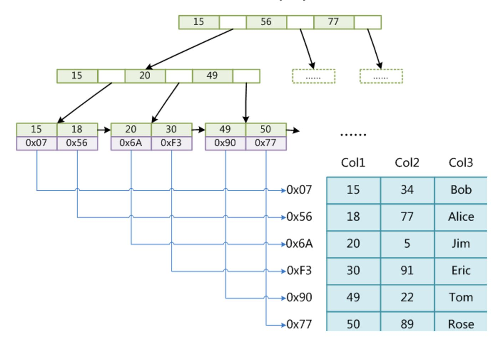

# Database System Concept

## 关系语言

### 关系模型

#### 术语

​	在关系模型中，**关系（relation）**被用于指代**表（table）**，而术语**元组（tuple）**用以指代**行（row）**，**属性（attribute）**被用来指代**列（column）**。

​	关系中的每个列的值域被叫做**域**，域可以分为**原子**的和**非原子的**，原子性由具体对数据的使用而确定（并非是一组数据就一定是非原子的）。

​	**模式（schema）与实例（instance）**的区别类似于声明结构与变量值的区别，模式规范表的信息，实例则是具体的表项。

​	为了区分关系中的不同元组，需要使用**码（key）**来进行标识，其中**超码（super key）**是一个或多个属性的集合，使用超码即可在一个关系实例中确定唯一的元组。超码中的属性并不一定是必须的，有时超码的子集就可以确定唯一的元组，则最小的满足这一特性的子集就是**候选码（candidate key）**。而**主码（primary key）**用来代表数据库设计时选中作为区分元组的方式的唯一候选码，选定主码时应该使用从不变化或极少变化的属性。

​	有时，属性的值域被另一个关系的属性值域所约束，被称为**外码约束（foreign-key constraint）**，    约束一方必须是主码。通常，引用完整性约束要求引用关系中任意元组在指定属性上出现的取值也必须出现在被引用关系中至少一个元组的指定属性上。

#### 关系代数

​	关系代数由一组**接收一个或两个关系**并**生成一个新关系**的**运算**组成。

-   **选择（select）运算**，一元运算，使用小写**sigma**表示。会生成一个由作为参数的关系中的元组中满足谓词的部分组成的新关系。
-   **投影（project）运算**，一元运算，使用**pi**表示。生成一个仅保留部分属性的新关系。
-   **笛卡尔积（Cartesian-product）运算**，二元运算，使用**叉号**表示，将作为参数的两个关系的每个元组俩俩组合成一系列新元组，生成由新元组组成的表。
-   **连接运算**，是对笛卡尔积运算和选择运算的结合。
-   **集合运算**，包括交、并、差，都要求关系的模式相同。

## SQL

### 初级SQL

#### 关系查询

```sql
SELECT attributes
FROM tables
WHERE predicates
```

​	关系查询使用SELECT子句，产生一个新关系，内容来源于 tables 中符合 predicates 的 attributes

>   **SELECT、FROM、WHERE与关系代数**
>
>   ​	select from where 都是关系代数中的运算符，分别为 映射、笛卡儿积、选择；对 SELECT 语句可以解释为：将from后的表作笛卡儿积，通过predicate选择出需要的部分后进行影射，得到最终结果

#### 更名运算

​	更名运算使用 AS 运算符，可以在 select 和 from 等子句中出现，用于给表或字段起别名；起别名一方面可以重命名关系，使得查询语句更简洁，另一方面可以同时操作同一个表，如

```sql
SELECT t.attribute s.attribute
FROM tableA as t, tableB as s
WHERE ...
```

#### 分组聚集

##### GROUP BY子句

​	这是SQL提供的非常重要的一个功能，效果如下

```sql
SELECT dept_name, avg(salary)
FROM instructor
group by dept_name
```

​	这里会将元组按dept_name列的属性值分组，并在每组内进行 avg 运算。需要注意的是，**如果使用了group子句，则出现在select子句中的部分必须使用聚集函数（如avg、max等）**

##### HAVING子句

​	考虑这样两个不同的需求：

-   将所有员工中工资高于平均值的按部门分组并求平均工资
-   选出部门平均工资高于4000的部门

```sql
SELECT dept_name, avg(salary)
FROM instructor
WHERE salary > avg(salary)
GROUP BY dept_name;

SELECT dept_name, avg(salary)
FROM instructor
GROUP BY dept_name
HAVING avg(salary) > 400;
```

​	其中，WHERE会在分组前对元组进行筛选，被**筛出的元组才会参与分组**；而**HAVING在分组之后对分组进行条件筛选**

#### 嵌套子查询

​	嵌套子查询使我们可以在普通查询的SELECT、FROM、WHERE中分别插入子查询，从而产生更复杂的查询

##### WHERE中的子查询

```sql
# 查询所有所在部门创建于2020年之后的员工的信息
SELECT * FROM instructor
WHERE instructor.dept_name in (
	SELECT dept_name
    FROM dept_info
    WHERE time > 2020
)
```

​	类似的运算符还有：

-   NOT IN
-   EXISTS
-   ( >、<、<>) + (ALL、SOME)
-   UNIQUE

##### FROM中的子查询

​	from中的子查询要好理解很多：from本身就是对关系的运算，那么查询返回的关系自然也可以参与到from的运算中

##### SELECT中的子查询

​	也被称作标量子查询，如：

```sql
SELECT dept_name, (
    SELECT COUNT(*) FROM instructor WHERE department.dept_name = instructor.dept_name) as num
FROM department;
```

​	将在映射中添加一个 num 字段，产生的新关系的每个元组的该字段由 执行子查询 得到，因此标量子查询必须保证有且仅有一个输出元组

#### UD

​	增加、修改、删除操作都比较简单：

```

```

### 中级SQL


## 数据库存储结构

​	数据库被映射为**多个不同的文件**，文件在逻辑上被组织为**记录的一个序列**；同时，一个文件由多个**块**组成（需要和磁盘读写的块区分，数据块和OS的块一样，都是软件决定的）。

​	在一个块上，可能会存在数条记录，变长的记录或固定长度的记录通过一些方式决定位置。

### 块组织

#### 定长记录的块组织

​	对于定长记录的管理，问题主要出现在插入和删除上：插入一个数据需要找到空闲的空间，删除一个块则需要管理空闲出来的空间。

​	这一部分与内存管理很相似，而且要更为简单。管理内存时，由于无法确定申请的内存的大小，为了避免产生碎片，需要记录双向的空闲链表，并不断进行合并的操作；而在数据块内，由于所有的定长记录都一样，不会产生碎片，因此可以直接使用空闲链表，将空闲链表存储在**文件头**上，每次发生删除时将新的空闲空间插入链表

#### 分槽页结构

​	对于变长记录，情况要复杂的多，但是由于块普遍不大，一些用在内存管理上比较耗时的操作并不会造成太大的影响；变长记录的存储要从**记录的存储**和**块内记录的布局**两方面讨论

##### **变长记录的结构**

​	变长记录由三部分组成，第一部分是变长字段的指针或定长字段的值组成的部分；第二部分是一个用于标识字段是否为空的空位图；最后是变长字段的值的空间

|  字节  |     值     |               备注                |
| :----: | :--------: | :-------------------------------: |
|  0～3  |   21，5    | 变长字段指针，offset 21，length 5 |
|  4～7  |   26，10   |           变长字段指针            |
| 8～11  |   36，10   |           变长字段指针            |
| 12～19 |   65000    |           定长字段的值            |
|   20   |    0000    |         四个字段均不为空          |
| 21～25 |   10101    |        第一个变长字段的值         |
| 26～35 | Srinivasan |           第二个变长...           |
| 36～45 | Comp.Sci.  |           第三个变长...           |

##### **变长记录所在的块**

​	块的结构与记录的结构类似，也是利用指针的方式来提高灵活度：每个块有一个**块头**，其中包含了已经存储的记录数量；其后是由**固定大小的 offset + length 方式、指向每一条记录的指针**数组；而记录的值从块的末尾往前记录，在块头与值之间就会存在一个**空闲空间**，块头还维护了一个指向空闲空间末尾的 offset 值

​	这样，对于插入，只需要**查看块头即可知道空闲空间的大小并进行插入**；而删除则**需要对删除了的记录之后的内容进行前移并修改块头中的记录**（由于块的大小不大，这样并不会带来太大的开销）

### 文件组织

​	文件组织将决定记录在每个文件中的排布方式（排布顺序），以便于查找和建立索引；在一个文件中，信息的排布方式大概为如下形式：

-   在文件的前几个块中，存在一个**数据字典**，其中包含了关于数据的数据（元数据），它将存储一些与关系的schema、各个字段的索引、文件组织方式等信息
-   在之后就是多个存放了真实数据的**块**，每个块按**块组织**中的方式组织内部的记录
-   而在整体上，各个块之间也有某种关系：
    -   堆文件组织，使用**自由空间图**去存放每个块占用的比例，但是这种结构存放的块无序，无法快速查找
    -   顺序文件组织，将记录**按某个字段排序存储**（使用链表的形式），这样可以快速方便地建立顺序索引（某个字段的），坏处是需要经常**重组**（链表在插入多次后很容易失去其物理存储位置与逻辑位置的相似性），且为其他字段建立索引十分麻烦
    -   **B+树文件组织**，利用B+树数据结构进行的文件组织，将在Indexing一章详细分析

>   **块与文件**
>
>   ​	要理解数据库的存储，最关键的是需要理解块与文件的关系；一个文件由多个块组成，文件界定了表的范围，而块将表分成多份分开存储；同时，块是数据库与磁盘交互的最小单位。总的来说，对数据库的操作就是对块的操作，增、删、查、改就是从某个文件上找出某个块并对块操作、最后写回磁盘。

>   **数据库存储如何保持灵活性**
>
>   ​	数据库需要存储大量数据，一方面需要保证空间的灵活性，即将每份数据合理地插入某个位置，另一方面需要保证块的利用率和操作的高效率。
>
>   ​	观察数据库的组织结构，通过文件界定一张表，通过表的元信息可以快速定位到某个块；在块内利用指针定位每条记录，在记录中又利用指针定位每个字段；指针为保证灵活性提供了很大帮助。

### 缓冲池

​	为了提高数据库的效率，同样**利用缓存**的思想，数据库会**实现一个称为缓冲池的内存区域**，用于缓存常用的数据块。与操作系统所实现的虚拟内存很类似，数据库缓冲池需要**实现一些置换算法**、记录每个页的信息（**Dirty Page**等）、实现Frame与Page的映射（**页表**）。不同的是，数据库缓冲池相较OS的VMS有较多的信息可以预测，所以在一些算法上有不同的实现；此外，还需要实现一些数据库才需要实现的功能，如**日志系统**等。

​	总的来说，**缓冲池需要管理内存，并进行事务追踪、并发控制**

>   **Lock 与 Latch**
>
>   ​	在数据库中，Latch对应在操作系统中讨论的锁等一系列进行并发控制的工具，而Lock则还包含一些例如事务回滚之类的操作，是两个不同的术语。

#### 缓冲池优化

-   使用**多个缓冲池（Multiple Buffer Pools）**，可以将Buffer Pool的可控性增加，为每种数据（比如索引或是真实的表）提供不同的访问模式，从而提高性能；同时，Buffer Pool 维护的页表经常被多个线程读取而导致自旋等待，分多个Buffer Pool 可以减少这种限制。
-   由于数据库可以通过查询语句和索引得知将要访问的块，而使得预测下一个要进入内存的块成为可能；数据库可以通过**预取（Pre-Fetching）**技术将块提前读入缓冲池中，从而减少访问的等待时间。
-   有时候多个线程需要访问同一个块，并进行一些不冲突的读写操作时，这些操作是可以同时进行的；数据库提供了一些机制去**共享扫描（Scan Sharing）**，通过类似订阅/发布的机制去提高读取到的块的利用率。

#### 页替换策略

-   **LRU**， OS学过，不记
-   **Clock Replacement** ， Linux 0.11看过，不记，核心思想是通过记录 **live_flag** 去判断是否被频繁引用
-   **MRU**， most recently used，对于某些查询很有效
-   **LRU-K**，通过记录时间戳，去比对块的访问类型（比如通过两次访问之间的间隔时间等）；相比LRU可以更适配数据库的访问模式

#### Dirty Page

​	对于脏页，需要维护一个 **dirty bit** 去判断是否需要对磁盘进行写入操作；如果采用每次都在页替换时写入，将会带来不少的开销；数据库系统通过**后台写入（Background Writing）**，在后台新开线程，定时写入dirty page并更新dirty bit，以此提高页面替换的效率

## 索引

​	数据库中大量的数据需要通过某种方式提供快速查找的方法，而快速查找的瓶颈则**在于对磁盘的读取次数（即每次数据库操作需要访问的块数量）**，通过将索引存储在文件的固定位置（比如文件头或是用文件头中的某个指针存储），可以通过访问小量的块（因为**索引只对某些字段进行处理，比如只存储某个字段之类的...**）而快速找到对应的块以及记录所在的偏移量

### 顺序索引

​	对于基于某个字段排序的表，则称以顺序字段的索引为**聚集索引**，其他索引被称为**辅助索引**，以下讨论都将基于这俩种索引分别进行

#### 稠密索引与稀疏索引

​	对于聚集索引，可以分为两种方式进行索引：

-   对每个顺序记录使用指针存储，即将**数据库整理成一个HashMap，（key为字段值，value为指向记录的指针，指针的形式由具体的块结构决定）**，进行查找时通过查找hashMap即可找到对应的指针。这种方式称为**稠密索引**。
-   由于记录是聚集的，因此可以使用类似于跳表的形式，**只为某些记录存储索引，通过查找到节点后顺序查找访问到具体的数据**，这种方式称为**稀疏索引**。

​	考虑这两种不同的索引，稠密索引更加简单粗暴，可以轻松找到对应的指针（甚至记录本身无序也能做到），**代价是存储的空间要大的多**；稀疏索引更好地利用了聚集索引的顺序特性，节省了大量空间，但是如果表长期不重组，顺序访问可能会跨多个块（链表的物理顺序和逻辑顺序不连续），导致效率低下。

​	**对于辅助索引，由于记录并不具备逻辑上的顺序性，只能使用稠密索引**

#### 重复字段的处理

​	有时，索引字段并不是主码，这就会造成字段的重复，对聚集索引，可以采用指向第一条索引记录的方式，而对稀疏索引，则需要采用索引指针指向一个存储了指向所有重复字段记录的指针的块来解决。

​	此外，还可以通过联码的方式（如给重复字段建立索引时默认key为 （primary-key , index-key）的tuple）来保证不存在重复字段，这种方式称为**多码索引**

#### 多级索引

​	在上述的稀疏索引中利用了跳表的思想来减少存储量，但事实上，跳表还可以加快搜索的速度：通过**给索引建立索引（上层索引必须是稀疏索引）**，即可使用类似于二分法的方式去加快索引项的查找速度（即上文中HashMap的一种具体实现方式）

#### 索引更新

​	发生插入和删除时，对于稠密索引，并不一定需要维护其顺序性，可以由块结构随意放置；而对于稀疏索引，则必须将记录按顺序重新整理成对应的块结构；因此，这又是一个典型的空间换时间...

​	对于更复杂的多级索引，则需要递归地修改每一层发生改变的索引

#### 总结

​	对于顺序索引，两种方式（稠密索引和稀疏索引）都试图提高某些效率，但是无法达成查询效率和修改效率的平衡：

-   对于**稀疏索引，必须维护其顺序性，降低了修改效率**
-   对**稠密索引，无法快速查找，搜索效率不高**（虽然可以通过在稠密索引上建立多级稀疏索引提高搜索效率，但是这样又影响了修改效率）

​	而树形索引兼顾了这两点，很好地兼顾了修改和查询，但是在存储复杂度上有了更高的难度，因此现如今大部分数据库的索引都采用了**B+Tree的索引方式**

### B^+^树索引

​	B^+^树也是平衡搜索树的一种，核心思想与其它各类树结构一样，不同之处在于它是一个磁盘数据结构，而不是内存数据结构（比如红黑树等），因此需要在一些方面进行改变

#### B^+^树的结构

​	B+树同样可以分为叶子和非叶子节点，但每个节点都可以最多容纳 n - 1 个搜索码值 k 和 n 个指针p；对俩类不同的节点进行介绍：

-   **叶节点**  叶节点的前n-1个p和k分别组成n-1个（p，k）tuple，即**（p~1~，k~1~）到（p~n-1~，k~n-1~）**，每个指针指向值为k的对应记录，而多出p~n~指针则指向下一个相邻的叶子节点。索引码的所有取值都将出现在叶子节点中，即**B+树的叶子节点对索引码构成稠密索引**

-   **非叶节点**  非叶节点在叶节点之上构成**多级稀疏索引**，如（p1，k1，p2，k2，p3）的非叶节点结构，p1将指向值大于k1的下一级索引，p2将指向小等于k1而大于k2的下一级索引，以此类推

    

-   对于重复码值，大部分数据库系统使用多码索引的方式解决

#### B^+^树的查询

​	B^+^树的查询方式与其他搜索树一样，取出根节点所在的块，遍历找到下一级索引的指针，以此类推，直到找到对应的记录；

​	此外，B^+^树也可以实现范围查询（在实际操作中很常见的情况），伪代码如下：

```cpp
set find_range(auto min, auto max) {
    set result = {};
    node current = root;
    while(current is not a leaf) {
        node next_level_index;
        foreach (item: current) {
            if(item > min) {
                nex_level_index = item;
                break;
            }
    	}
        current = next_level_index;
    }
    var start;
    foreach(item: current) {
        if(start > current)
            start = current, break;
    }
    while(start <= max) {
        add start into result;
        next(start);
    }
    return result;
}
```

>   **B^+^树的效率**
>
>   ​	正常来说，一般将一个块作为B+树的一个节点，大小大约在 4KB 到 8KB 之间，n 可取 100 ～ 200 之间，假设存储了 100w 条记录，查询需要访问的块也仅需要 3（索引块数量） + 1（数据块） = 4 个块，效率提升了很多

>   **B^+^树的存储方式**
>
>   ​	B^+^树使用稠密索引的方式存储叶节点，因此对存储要求不高，仅需要底层提供插入、删除、返回地址的接口即可。CMU的课程中展示了分槽页结构时对比了几个不同的数据库，其中有些数据库会对记录所在的槽进行修改，这样就需要修改索引的指针；因此大部分数据库只使用bitmap去标记有哪些槽被使用，而不去改动数据所在的槽。

#### B^+^树的拆分

​	虽然B^+^树的节点很大，但是最后总会用完，此时就需要对节点进行**拆分**操作。

​	当插入时检测到节点块容纳不下新的值时，将**分配一个新的块，并将旧块的一半值移入新块中，并更新父节点中的状态**（在父节点中插入一个新的item，此时父节点作为被插入的块，以此类推）

```cpp
node insert(value k, pointer p, node tree) {
    if(tree == nullptr)
        tree = new node(), return;
	if(tree is not a leaf) {
        node next-level-index = find_node_contain_k(tree, k);
        node child = insert(k, pointer, next-level-index);
        if(child != null){
            if(tree.size() < tree.capacity()) {
    			node new_node = new node();
                copy_half(tree, new_node);
                return new_node;
        	}
            insert_tuple_into_node(tree, k, p);
            return nullptr;
        }
    }
}

void insert_tuple_into_node(node leaf, value k, pointer p) {
    leaf.push_back(k, p);
    for(size_t i = leaf[leaf.length() - 1]; leaf[i].v < leaf[i-1].v; i--)
        swap(leaf[i], leaf[i - 1]);
}
```

#### B^+^树的合并

​	类似地，当删除操作导致某两个相邻节点的剩余容量大于总容量的一半时，会对B^+^树的节点进行合并，以减少空间的浪费。

#### B^+^树的块内表示

​	更为细节地，我们可以考虑B+树的每个节点是如何在块内表示的；最简单的情况是使用朴素的数组将它们保存起来，但事实上这实现时会有一些优化：

-   可以将Key 和 指针 分开保存，便于查找时对 Cache友好
-   添加一些其他的辅助字段，用来维护节点的详细信息，如 Slot的使用情况等
-   使用 **Trie 树（一种对字符串匹配特殊优化的树）**

​	对于指针，通常保存 Record ID，即一个指向对应的Page和Offset的指针；也有些数据库实现为直接保存Tuple

### 并发控制

​	仅考虑B^+^树的线程安全，B+树在并发访问时会存在以下俩种问题：

-   多个线程试图同时修改同一个节点的内容
-   一个线程在读时另一个线程试图修改

#### 对Inner Node的遍历

​	B^+^树使用一种称为 **Latch Crabbing / Coupling** 的技术去实现线程安全，核心思想是：**每访问一个节点前，先取得该节点上的 Latch，直到确认该节点安全并转移到该节点上后，再释放前一个节点上的 Latch （如果有的话）**

​	对于一个节点**安全**的定义是

-   如果进行插入，不会发生拆分
-   如果进行删除，不会发生合并

​	考虑确定节点安全的原因，是如果需要进行拆分或合并，则还需要对上一个节点进行修改；不释放 Latch 可以**保证在完成操作之前不会有其他正在遍历的节点转移到可能发生改变的节点上**

​	**如果子节点不安全，则继续持有父节点的 Latch，直到转移到一个安全的节点之上**

​	实际处理时，通常使用 Stack 保存所有的 Latch，遇到安全节点则释放之前的所有 Latch

​	此外还可以乐观地估计大部分操作不会造成拆分和合并，使用读锁先快速递进到叶节点获取写锁，如果发现估计错误则从根节点重新遍历（使用写锁），以此提高访问效率（写锁带来的影响要大于读锁）（对这种算法还有一种优化，即使用一个全局的表，修改叶节点后并不立即对父节点进行插入，而是将记录该操作进入全局表中，后一个遍历到该节点的线程通过检查该表并补全操作后再继续，也可以保证线程安全）

#### 对Leaf Node的遍历

​	由于B+Tree的Leaf Node实现了**兄弟节点指针**（便于双向进行范围查询），导致如果继续使用 Crabbiong Algorithm 进行并发控制会有死锁的可能

​	因此在遍历 Leaf Node 时如果发生 Latch 被占用的情况，应当选择直接结束此次操作并重启操作

​	

## 查询处理

### 查询处理的过程

​	SQL语句在执行时，会经过以下步骤：

-   **语法分析与翻译**，转变成基于关系代数的一种更有用的表达形式；对于同一SQL语句，表达形式可能会有多种（如映射和选择的次序可以交换等）
-   **优化**，优化器会根据一些已有的信息，从多种表达形式中通过代价计算选择一种最优的；同时会规划执行过程（是**物化**还是**流水线**、执行时使用的算法等）并给每个操作**添加注释**
-   **执行**，经过优化的过程被称为一个**执行计划**，**查询执行引擎**接受执行计划后执行并返回结果

### 查询代价的度量

​	查询的代价可以从很多不同的指标进行度量：

-   在早期的机械硬盘上，**IO操作**通常是执行的瓶颈，通常需要考虑到**寻道时间和传输时间**
-   在SSD上，基本可以忽略寻道时间（基本等同于随机访问）；此时**CPU代价**不再可以忽略不计，必须将CPU的计算时间也纳入考察的范围
-   此外，还有很多其他因素；如 Buffer Pool 的命中率等；举例来说，很多数据库都默认索引被整个存储在内存 Buffer 中，B^+^树索引的时间只考虑叶节点的访问时间

>   ​	**在以下的分析中，我们采取IO操作作为主要代价的度量**

### 运算的算法与代价分析

​	现在对 **选择、连接**为例 进行分析

#### 选择

-   **顺序搜索**，对于任何一个关系都可以采用这种方式，通过**遍历整个关系**，去**寻找满足谓词的元组**；效率极低但是也泛用性极高，对于复杂谓词、范围查询都适用；这种方式的**复杂度为 一次寻道时间（寻找文件的第一个块）和 N 个传输时间（将每个块依次传输到内存中）**
-   **索引搜索**，对于已经建立了索引的关系可以采取这类方式；但是泛用性并不高，如出现复合谓词时，如果并不是对用到的字段进行了多码索引，那就只能利用一部分索引；**复杂度可以降为B^+^树的复杂度（即假设Inner Node都在Buffer Pool中，对叶节点的访问次数（一次寻道+一次传输））**；对于范围搜索，则要对索引的类型进行讨论，如果是聚集索引，则为一次寻道+N次传输；如果是辅助索引，则接近随机访问

#### 连接

-   **嵌套循环连接**，即最朴素的连接方式，将每个元组与另一个块中的元组进行一一比较；对Buffer的利用率极低，可以通过**分块算法**改为**块嵌套寻-循环连接**
-   **索引嵌套-循环连接**，将嵌套-循环连接的内层的循环改为了索引搜索，从复杂度上提高了连接的效率
-   **归并-连接**，对数据进行预处理，**将两个关系排序后进行连接，可以做到两个表都只遍历一次**，但是要**计算外部归并排序的代价**

### 查询执行的过程

​	对执行单个关系运算，只需要按上述的算法执行并输出结果即可；但对一个关系运算表达式，可能存在多个运算，此时运算过程中间的部分就变得复杂了起来；其中主要的复杂问题出现在**中间数据应该如何保存**的问题上，以下就这个问题进行讨论

#### 物化

​	对于运算的中间数据，一个最简单也最朴素的思想就是为它**创建一个临时关系**并写入磁盘中；在后续的运算中再以这个关系作为输入，去得到下一个临时关系，直到得到最终的输出；这种处理方式称为**物化（Materialized）**

​	这种方式在效率上有一个明显的问题，就是**重复的、无意义的IO操作**：一个关系运算刚刚将一个临时关系完全写入磁盘，另一个关系运算又将其读出

​	对物化方式的一个优化是使用**双缓冲**，即多分配一个缓冲块专门用于写磁盘操作，算法利用运算缓冲区进行计算，计算的结果写入写缓冲区后写入磁盘，这样可以免去算法执行时需要中断将缓冲区写入磁盘的时间；但是这种方式依然没有避免重复的读写问题

#### 流水线

​	流水线的核心思想是，将**每个关系运算组织成一个模块，通过模块之间的互相调用或是异步的内存读写来将单个关系运算模块组合成关系运算表达式**，两种不同的实现分别被称为**需求驱动型流水线**和**生产者驱动流水线**

-   **需求驱动流水线**

    ​	需求驱动流水线通过**迭代器（Iterator）**为需求者提供获取数据的接口，如 open()，next()，close() 等；流水线末端即输出端会不断对最后一个运算模块提出需求（调用next()），如果该模块有可以提供的数据，就会返回，否则会向再上一级的运算模块（如果也是流水线模块的话）提出需求，以此类推

-   **生产者驱动流水线**

       生产者驱动的流水线与需求驱动流水线正好相反——**各个模块并不等待产生元组的请求，而是尽可能地产生元组**；生产者驱动的流水线很容易被设计为并发执行，下层的运算会不断独立地进行运算，直到自己的接收缓冲区为空或是接收者（上层运算）的接收缓冲区已满。这种实现很自然需要各个线程之间进行同步（很标准的生产者消费者模型，用信号量即可解决）

#### 真实的执行算法

​	事实上的执行算法并不是纯粹的物化或是流水线，而是两者的一个结合；因为有些情况不得不等待上一级运算完全完成才能继续进行（如排序）

​	在真实的执行算法中，把关系运算表达式解析为**算子树（operator tree）**，其中可以流水线执行的边称为**流水线边**，而必须阻塞运算的边称为**物化边**或**阻塞边**，连续的流水线边组成**流水线段**

​	通过对这些运算标记注释，执行引擎可以根据每个边的类型选择具体的执行方式（阻塞执行或流水线执行）
