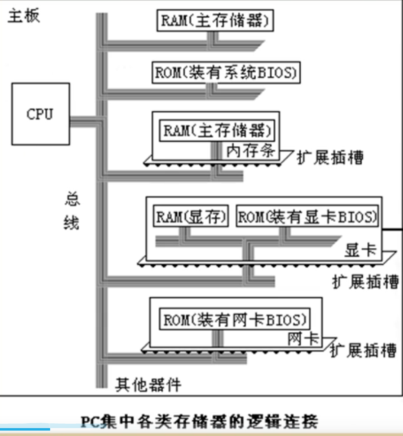
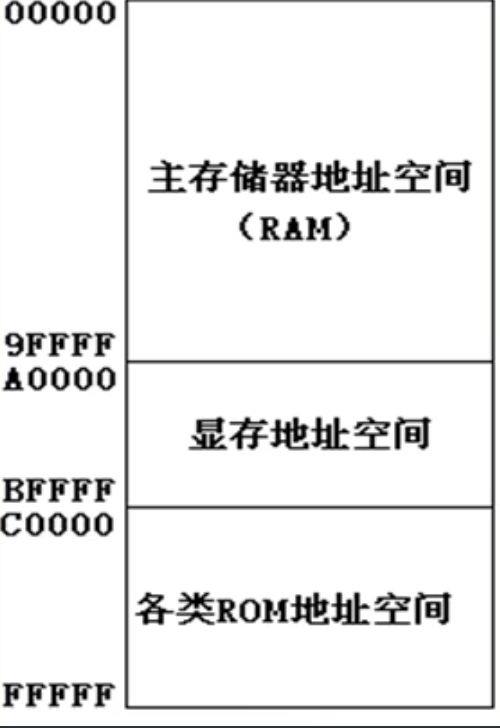
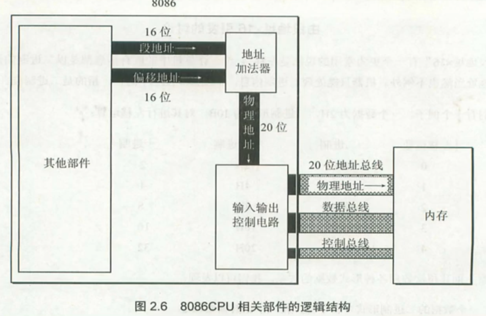
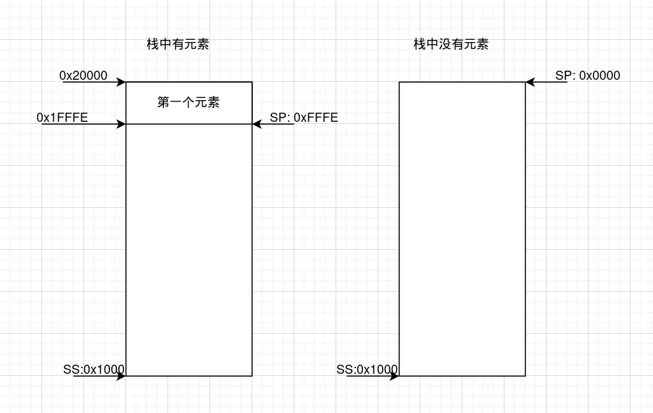

# 深入汇编语言

## 基础知识

### 汇编的组成

- **汇编指令**（助记符）
- **伪指令**（由汇编器执行）
- **其他符号**（由下层软件识别，如链接时的重定位条目等）

### CPU对存储器的读写

连接CPU与其他芯片的导线被称为总线，逻辑上划分为

- **地址总线**（传递地址）
- **数据总线**（传递数据）
- **控制总线**（传递控制信息，如读、写）



从这个角度来看，**大部分扩展设备都是存储器**，CPU通过对这些存储器的操作来控制硬件



**8086 PC机对内存地址空间的划分**，这里的**内存地址空间长度为20bit**，为CPU**在实模式下**工作时可以访问到的**物理内存空间**

## Register

### 8086的寄存器

8086 CPU共有14个寄存器，长度都为**16bit**

|      name      |   type   | note                                               |
| :------------: | :------: | :------------------------------------------------- |
| ax、bx、cx、dx |   数据   | 保存通用数据，可与分为两个8bit（如ax分为ah、al）   |
|     si、di     |   变址   | 用于串指令                                         |
|     sp、bp     | 栈寄存器 | sp为栈寄存器，指向栈顶；bp为栈基寄存器，指向栈帧底 |
|       ip       | 程序计数 | 指向下一条需要执行的指令                           |
| cs、ss、ds、es | 段寄存器 | 分别提供代码段、堆栈段、数据段、附加段的基址       |
|      psw       |   状态   | 用于OS在管态（系统态）和目态（用户态）之间的转换   |

### 通过寄存器寻址



**物理地址 = 段地址 << 4 + 偏移地址**

（似乎虚拟内存系统在这一部分完全没有涉及的样子...）

查资料后发现，开机上电后，在加载操作系统之前（即在进行各种寄存器的初始化等工作时），运行模式为**实模式**，这时CPU仅使用上图的20位地址总线进行**直接物理寻址**（因为操作系统还没加载，无法使用虚拟内存系统）。而在完成加载后，进入**保护模式**，此时就可以使用虚拟内存系统了

> 对于段寄存器，8086 CPU不支持直接修改它的值，因此不能直接写立即数进去，只能分先写到通用寄存器后再mov进去

### 对CS:IP的操作

```assembly
#将会修改CS：IP的值
jmp sectionAddr:offsetAddr

#仅修改IP,IP的值会变为genReg中的值
jmp genReg

```

CS：IP在启动时就会有一个默认值，将要执行的代码放在其中，即可执行

需要跳转时，则修改CS：IP的值（操作系统的引导程序就是这个原理）

### 对DS的操作

```assembly
mov reg, address
#用于将DS<<4 + address中的内容mov到reg中
#因此访问地址需要先修改DS,然后mov指令会自己利用DS的值进行访问
#写也一样
```

mov的数据大小取决于寄存器

如果是16bit （如ax），则会从address + DS<<4 后取出2byte（16bit）

如果是8bit（如al或ah），则会取出1byte（8bit）

### 栈

```assembly
#和正常的push、pop没什么区别...
push ax
push [10]
pop ax
pop [10]
#push和pop甚至能访问段寄存器...
#唯一需要注意的是都是按字进行的，即意味着不能从al或ah中push一部分数据到内存中
```

> 对于栈的操作，同样需要手动指定栈顶（通过**ss**与sp），唯一方便的就是sp会自增自减...（在实模式下确实麻烦...），**栈顶地址 = ss << 4 + sp**
>
> 而bp是在这个基础之上实现栈帧用的

再浅浅注意一下，栈在这里依然是向下增长的

栈如果为空，则sp为0x0000 （如图所示）

栈如果为满，sp也是0x0000...因此sp会在栈段内循环...



（一个元素大小为2byte，即一个字）

### 总结

这一章介绍了很多在实模式下进行汇编时对内存的不同操作方式

在没有虚拟内存时，对内存的访问变成了灵活地设置多个段来进行使用，这与虚拟内存的固定划分有很大的不同～

## 汇编程序的编写

### 结构

```assembly
assume cs: codesg	#将cs寄存器与codesg段相关联

codesg segment      #将codesg声明为段
start: 				#段开始标识符
	mov ax, 0123H
	mov bx, 0456H
	add ax, bx
	add ax, ax
	
	mov ax, 4c00H
	int 21h
codesg ends			#段结束

end					#程序结束
```

