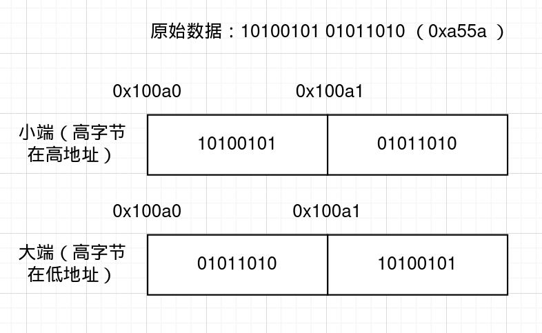

# x86汇编

## 一. 预备知识

### 信息的表示与编码

- 一个内存地址编码1byte的数据

- 一个字由高字节、低字节组成；一个双字由高字与低字组成

- intel x86指令最短仅1byte，最长可到15byte，一般由1byte opcode（操作码）与多个

  func code（功能码）、operand（操作数）构成，指令长度和译码方式由opcode指示

  （简单源于规整，还得是RISCV...）

- 大端序？小端序？记住是*按照字节来排序，而不是按位排序*的

​	所谓大小端，即*字开始的位置*，存的是高字节还是低字节（低字节为小端，高字节为大端）

### Intel 8086处理器

#### 寄存器

| 通用寄存器(16bits) | 功能                             |
| :----------------: | -------------------------------- |
|         AX         | 通用，且支持XH、XL的高低字节访问 |
|         BX         | 通用，且支持XH、XL的高低字节访问 |
|         CX         | 通用，且支持XH、XL的高低字节访问 |
|         DX         | 通用，且支持XH、XL的高低字节访问 |
|         SI         | 源变址寄存器                     |
|         DI         | 目的变址寄存器                   |
|         BP         | 栈基址指针寄存器                 |
|         SP         | 栈顶指针寄存器                   |

| 段寄存器（16bits） | 功能                 |
| :----------------: | -------------------- |
|         CS         | 代码段寄存器         |
|         DS         | 数据段寄存器         |
|         SS         | 堆栈段寄存器         |
|         ES         | 附加（数据）段寄存器 |

#### 内存分段机制的解释

​	由于程序每次被加载进内存时，并不能保证一定是同一个位置，且管理困难（需要程序员手动管理各个分区的长度），因此8086处理器设计了分段机制用于改善这一点。

​	主要存在三个段，即 *代码段、 数据段、 堆栈段*

- 对代码段的访问由两个寄存器控制，即CS：IP，IP寄存器会指示当前执行的程序相对代码段起始（即CS寄存器中存的值）的偏移量，并随着程序执行而不断自行增加；访问代码段时，物理地址即为CS中的值以某种方式组合上IP的值
- 对数据段的访问与对堆栈段的访问相比对代码段的访问更加复杂一些，但是原理大致相同

> **某种组合方式**
>
> ​	上面提到，对物理地址的访问是由段寄存器与偏移寄存器通过某种方式组合，那么具体是什么方式呢？
>
> ​	8086提供了20根地址线，即提供了1MB的物理地址空间，而偏移寄存器的长度均为16bits，意味着最多仅能提供64KB的段，形成了极大的浪费
>
> ​	为了匹配20bits的地址空间，需要*将段寄存器左移4bit*，*再与偏移寄存器的值相加*，即可得到20bits的地址数据

​	8086提供1MB的物理地址空间，最多可以划分为16个段（段寄存器的值从0x0000到0x000F），而16个段可以根据需要自行定义成上述三种段中的任意一种。程序员在代码段超过64KB时，修改一次CS的值，即可继续下一个代码段的指令执行；对数据段、堆栈段也是如此。

​	因此，8086的内存管理甚至可以说十分随意、自由；事实上，段寄存器的值仅需要按16byte对齐即可。