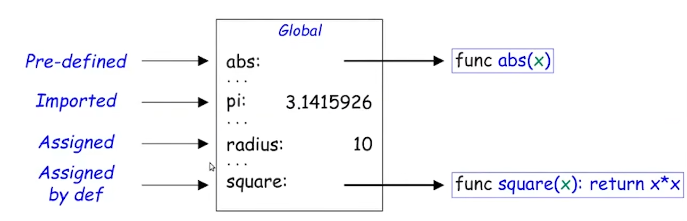

# 程序的构造与解释

## Value

### 什么是Value

​	观察目前接触过的所有编程语言，不管是C或是Python，它们大都是通过对一些**客体**进行一些**操作**（比如函数）完成计算过程的。其中客体就是值，包括数值、以及一切自定义的类型，甚至包括函数；而计算过程使用**表达式**来描述。

## Function

### Function Value

​	函数一般被定义为接收几个参数并返回计算结果的一种操作，比如在Python中：

```python
// Python中可以使用这样的方式定义一个函数
def sax(a, x, b):
    return a * x + b
```

​	**在SICP课程中，我们将函数看作一类描述操作的值（这意味着函数也同样可以被"操作"）**:

```
func name(arguments): calculate operations and return values
```

​	同时不难发现，函数的特征（区别开每个函数的东西）不是函数名，而应该是函数体内部的计算过程。因此，一般不认为名称应该是函数值的一部分。为此，课程中使用**Lambda表达式**来描述匿名函数：

```python
// 匿名函数捕获a x b 三个变量，并返回...
func lambda(a, x, b): a * x + b

// 在python中，定义lambda表达式的方式如下
lambda a, x, b: a * x + b
```

​	对函数的基本操作为**调用**，通过给出函数需要的参数并调用，即可实现程序（程序由一系列对值的操作组成）

### Pure and Impure Function

​	**纯函数**，即它们的输出仅仅依赖于输入它们的参数，它们不会造成任何额外的作用，如：

```c
int add(int a, int b) {
    return a + b;
}
```

​	调用该函数并不会有任何额外的**Side Effects**，与之相对的，**非纯函数**：

```c
void swap(int* a, int* b) {
    int tmp = *a;
    *a = *b;
    *b = tmp;
}
```

​	swap函数没有任何返回值，但是却有Side Effect（交换了两个参数的值），因此是非纯函数

### Expression

​	表达式是一个值，由它的子表达式组成并决定它的值，如：

```
add (a, b)
这是一个表达式，它由子表达式 a b add 组成
其中 a b 的值就是数值
add 的值是函数（计算操作）
整个表达式的值就是add作用在a和b上的结果
```

### **Environment**

​	在处理字面值到命名的转换时，简单使用替换并不严谨（简单使用替换就是将名称直接修改成字面值）；因此引入 Environments 这一概念：

-   一个**环境**是一组名称与值之间的映射
-   我们也说在某个环境中某些名称与某些值**绑定**
-   在最简单的情境下，仅有一个**全局环境帧**（Global Environment Frame）

如下图所示就是一个环境：



可以看到，名称与值的绑定可以来源于定义、赋值等一系列操作

```python
// 举例
// 下面是一段计算代码

from operator import mul
def square(x):
    return mul(x,x)
x = -2
square(mul(x,x))

// 在这里，全局环境中有以下符号
func mul(x, y) 由import从外部引入
func square(x)和x 由用户定义

// 在为表达式进行求值时
首先 x 被 -2 替代（在全局环境中）
mul 被 一系列操作（计算过程）替代，即 func(x,y)->x*y
square 被 func(x)->x*x 替代，同时接收到参数 x=4
在square的local environment中，square计算并返回16
最终表达式的值为16
```

>   **一些个人理解**
>
>   ​	这里的"环境"在具体的编程语言下作为"变量的定义域"可以理解；但是它不仅仅是记录了名字的作用范围，事实上还负责更新名字与值的绑定（映射关系）。理解为类似于进程切换时的"上下文"似乎会更贴切一些，上下文记录的是CPU的具体状态，这里的环境记录的是运算过程的具体状态。

