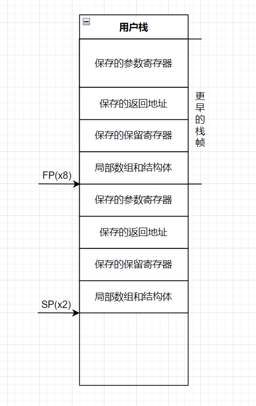
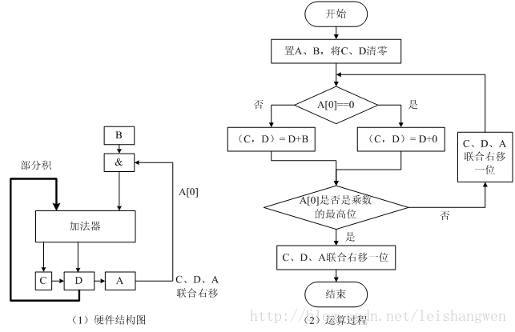
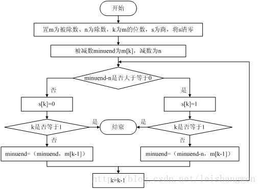

# 计算机组成与设计

## RISC-V指令集

### 操作数

- **寄存器**，X0~X31，共32共寄存器
- **地址**，偏置(基址寄存器)，如 1000（x0）

- **立即数**

> **关于有符号与无符号**
>
> ​	RISC-V有一个特点，将在操作立即数（或是操作地址读出的值）时强制将数据扩展（Intel x86则提供了类似rax、eax、ax、lax一系列不同位数的寄存器操作符，而RISC-V只有Xn系列寄存器，并且只支持固定的位数访问）
>
> ​	因此，RISC-V对于扩展有严格的要求，需要区分是加载有符号数还是无符号数，也就有了lh（取半字）与lhu（取无符号半字）这样的操作。有符号加载与无符号加载的区别在于是选择零扩展还是符号位扩展
>
> ​	**Note： RISC-V中的立即数都是有符号的！！！**

### 基本指令格式

**RISC-V的每一条指令的长度都为32bit**

RISC-V的指令分为以下几个类型

#### R型

即用于**寄存器-寄存器操作**的指令

| func7  |     rs2      |     rs1      | func3  |     rd     | opcode |
| :----: | :----------: | :----------: | :----: | :--------: | :----: |
|  7bit  |     5bit     |     5bit     |  3bit  |    5bit    |  7bit  |
| 功能码 | 寄存器操作数 | 寄存器操作数 | 功能码 | 目的寄存器 | 操作码 |

例如： add x0，x1，x2	（x0 = x1 + x2）

对应的机器码为：**0000000** **00010** **00001** **000** **00000** **0110011**

#### I型

用于**短立即数和访存 load 操作**的指令

用一个7bit功能码与一个5bit寄存器操作数码，换取了一个12bit的立即数操作数

|  Imm   |     rs1      | func3  |     rd     | opcode |
| :----: | :----------: | :----: | :--------: | :----: |
| 12bit  |     5bit     |  3bit  |    5bit    |  7bit  |
| 立即数 | 寄存器操作数 | 功能码 | 目的寄存器 | 操作码 |

如： addi x0，x1，1  （x0 = x1 + 1）

#### S型

用于**访存store操作**的指令

| Imm [11：5] |     rs2      |     rs1      | func3  | Imm [4：0]  | opcode |
| :---------: | :----------: | :----------: | :----: | :---------: | :----: |
|    7bit     |     5bit     |     5bit     |  3bit  |    5bit     |  7bit  |
| 立即数高7位 | 寄存器操作数 | 寄存器操作数 | 功能码 | 立即数低5位 | 操作码 |

与I型对比，发现虽然都是12bit的Imm和2个5bit寄存器，但是结构并不一样

**观察发现，RSIC-V对寄存器的位置安排非常严格，寄存器rd作为目的寄存器，rs1与rs2作为参数寄存器，一定在对应的那些位置，宁愿把Imm分割成两部分也要保证寄存器的位置正确**

**因此，S型是store类型，不需要rd，所以rd的5bit被用于补充Imm的低位了**

#### 其余的

**除上面的内容外，还有用于条件跳转操作的 B 类型指令，用于长立即数的 U 型指令和用于无条件跳转的 J 型指令**

### 逻辑操作指令

| 逻辑操作 |      RISC-V指令       |
| :------: | :-------------------: |
|   左移   |       sll  slli       |
|   右移   |       srl  srli       |
| 算术右移 |       sra  srai       |
|  按位与  |       and  andi       |
|  按位或  |        or  ori        |
| 按位异或 |       xor  xori       |
| 按位取反 | xori（对1111...异或） |

其中，对于R型指令，都是一样的

但是对于I型指令，由于2^12^远大于63，而位移大于63位的值完全没什么意义，因此在逻辑操作时，产生了I型指令的变体

| func6 | Imm  | rs1  | func3 | rd   | opcode |
| ----- | ---- | ---- | ----- | ---- | ------ |
| 6bit  | 6bit | 5bit | 3bit  | 5bit | 7bit   |

### 分支操作指令

|          操作          |    RISC-V指令     |
| :--------------------: | :---------------: |
|       等于时跳转       | beq rs1 , rs2 , L |
|      不等于时跳转      | bne rs1 , rs2 , L |
|       小于时跳转       |        blt        |
|     大于等于时跳转     |        bge        |
| 小于时跳转（unsigned） |       bltu        |
| 大于时跳转（unsigned） |       bgeu        |

猜测意思应该是...branch equal和branch not equal叭

还有需要注意的时，比较有分有符号和无符号两种（话说x86里怎么没什么印象...）

### 循环、分支、Switch

循环、分支只是基于跳转指令的一个常规操作，没什么可说的

Switch是在内存中使用一个数组专门存储了每个跳转的位置，并在条件满足时把数据从内存中加载到寄存器实现跳转

### 过程调用

#### 一些基本约定

- **X1**用于保存返回地址，用于跳转后返回起点
- **X2**是栈指针，相当于%rsp
- **X3**是全局指针
- **[X10，X17]**这部分寄存器用来依次保存调用时的八个参数
- **[X5，X7]，[X28，X31]**为**临时寄存器**，在过程调用中应该为**调用者保存**（如果有必要的话）
- **[X8，X9]，[X18，X27]**为**保存寄存器**，在过程调用中为**被调用者保存**
- **X8**在必要时还会作为栈的**帧指针**，类似于%rbp

#### 跳转指令

不像x86那样提供美丽的call和ret指令，RISC-V中，这两个操作都得通过**ja**指令实现..

|            操作             |       指令        |           备注            |
| :-------------------------: | :---------------: | :-----------------------: |
|          跳转-链接          |   jal x1 , 100    | x1 = pc+4 ; goto PC + 100 |
| 跳转-链接（采用寄存器参数） | jalr x1 , 100(x5) |  x1 = pc+4; goto x5+100   |

可以看出，这两个跳转指令的区别在于寻址方式，一个类似于绝对寻址，一个类似于相对寻址

#### 对栈指针的使用

并不类似于x86只使用栈指针以上的空间，RISC-V对SP以下的空间也有利用，栈的空间分布大约如下所示



#### 对所有寄存器的总结

|   名称   |   用途    | 调用时是否保存 |
| :------: | :-------: | :------------: |
|    x0    |   常数0   |     不适用     |
| x1（ra） | 返回地址  |       是       |
| x2（sp） |  栈指针   |       是       |
| x3（gp） | 全局指针  |       是       |
| x4（tp） | 线程指针  |       是       |
|  x5~x7   |   临时    |       否       |
|  x8~x9   |   保存    |       是       |
| x10~x17  | 参数/结果 |       否       |
| x18~x27  |   保存    |       是       |
| x28~x31  |   临时    |       否       |

### 大立即数与编址寻址

32Bit定长的指令使得硬件更加简单，但是无法去操作超过一定位数的大立即数。而大立即数在运算、寻址的时候又非常方便，因此RISC-V也为大立即数提供了解决方案。

#### 加载大立即数

RISC-V提供了lui（load upper immediate，取立即数高位），用于将20bit常数加载到寄存器的31位到12位上（即高20位），再用addi之类的指令，即可分两次往寄存器中加载大立即数了。

**同时需要注意，立即数都是当作有符号处理的！因此，如果低12位的最高位为1，那么在运算时，它将会被作符号位扩展！为了抵消符号位扩展，只需要在加载高20位时多加1，即可把符号位扩展部分全部进位成0，加载出期望的大立即数。**

#### 寻址

RISC-V中的寻址分为两种指令

- b - condition，如beq，为相等时跳转，接收三个操作数，前两个是比较用的寄存器，最后一个是相对PC的偏移量地址。beq x1，x2，100，意为if(x1==x2) PC+=100;
- jal 、 jalr 无条件跳转，都有两个操作数。前一个为保存下一条指令地址的寄存器，后一个为立即数或寄存器。jal为相对寻址，jal x1，500 意为 x1 = PC+4; PC+=500（x5）。而jalr x1，500意为x1 = PC+4；PC =500+x5。

结合上面的加载高位，即可利用jalr完成远程跳转。

### 并行指令

完成相对独立的任务时，并行更为容易。但是通常任务之间需要协作。为此，RISC-V提供了并行指令，提供对原子化任务的操作。

#### 关于并行的思考

如果要实现两个处理器对同一块内存进行操作而不互相干扰，有哪些实现方法呢？

- 设计一种指令，在单条指令中同时完成读和写操作，这样就不会在读和写之间被干扰了
- 使用**指令对**，其中第二条指令返回一个值，该值表示该指令对是否被原子地执行

RISC-V使用了第二种方式

#### 保留加载与条件存储

- lr.d指令	格式为 lr.d r , memory 如 lr.d x10 , (x11)，即将x11对应内存中的值载入x10中，并作记录
- sc.d指令，格式为 sc.d  r1 , r2 , memory，如sc.d x10 , x23 , (x11)，将x23中的值写入x11对应的内存中，并且更新x10中的值，如果从lr.d以来(x11)中的值没有被改变，则x10中为0，否则代表操作不原子。

### 一些RISC-V的代码示例

#### Swap

```c
void swap(long long int* v,size_t k){
    long long int temp = v[k];
    v[k] = v[k+1];
    v[k+1] = temp;
}
```

```assembly
#x10--v
#x11--k
swap:
	slli x11, x11, 3 #计算偏移量（一个long long int 8Byte）
	add x5, x0, x11  #v[k]的地址
	addi x6, x5, 8   #v[k+1]的地址
	ld x28, 0(x5)    #取出v[k]的值
	ld x29, 0(x6) 	 #取出v[k+1]的值
	sd x29, 0(x5)	 #存v[k]
	sd x28, 0(x6)	 #存v[k+1]
	jalr x0, 0(x1)	 #返回
	
```

#### Sort

```c
void sort(long long int* v,size_t n){
    size_t i,j;
    for(i = 0; i < n; i++){
        for(j = i - 1; j >= 0 && v[j] > v[j+1]; j--){
            swap(v,j);
        }
    }
}
```

```assembly
#x10 -- v
#x11 -- n
sort:
	addi sp, sp, -40	#开辟栈空间
	#保存寄存器
	sd x1, 32(sp)
    sd x22, 24(sp)
    sd x21, 16(sp)
    sd x20, 8(sp)
    sd x19, 0(sp)
    #移动参数
    add x21, x0, x10
    add x22, x0, x11
	
#外循环
	addi x19, x0, x0	#i = 0
for1:
	bge x19, x22, exit1 #if（i>n） break;
#内循环
	addi x20, x19, -1	#j = i-1
for2:
	blt x20, x0, exit2  #if(j<0) break;
	slli x5, x20, 3	 	#v[j]的地址偏移量
	add x5, x21, x5		#v[j]的地址
    ld x6, 0(x5)		#v[j]的值
    ld x7, 8(x5)		#v[j+1]的值
    bge x7, x6, exit2	#if(v[j+1]>=v[j]) break;
	#调用swap
	add x10, x21, x0
	add x11, x20, x0
	jal x1,swap			#x1 = PC+4 , PC = swap
	#j--与内循环
	addi x20, x0, -1
    jal x0, for2
#内循环结束
exit2:
	#i++与外循环
	addi x19, x0, 1
	jal x0, for1
#外循环结束
exit1:
	#恢复数据
	ld x1, 32(sp)
    ld x22, 24(sp)
    ld x21, 16(sp)
    ld x20, 8(sp)
    ld x19, 0(sp)
```

## 计算机的算数运算

### 加减运算

得益于补码，加减运算可以直接按正常的二进制运算一样操作了...

| 操作 |  A   |  B   | 表明溢出的结果 |
| :--: | :--: | :--: | :------------: |
|  +   |  +   |  +   |      <=0       |
|  +   |  -   |  -   |      >=0       |
|  -   |  -   |  +   |      >=0       |
|  -   |  +   |  -   |      <=0       |

### 乘法运算

#### 串行乘法算法



通过乘数的最低位，判断是否需要加上被乘数

被乘数每次左移一位（模拟手算乘法），乘数每次右移一位（取最低位）

同时，还可以采取循环展开的方式，提高乘法运算的效率。

#### RISC-V中的乘法

| 指令  |    操作数    |           效果           |
| :---: | :----------: | :----------------------: |
|  mul  | rd , r1 , r2 | rd = r1 * r2 （低64bit） |
| mulh  | rd , r1 , r2 | rd = r1 * r2（高64bit）  |
| mulu  | rd , r1 , r2 |   无符号乘法取低64bti    |
| mulhu | rd , r1 , r2 |   无符号乘法取高64bit    |

### 除法



