# CMU 15-213 CSAPP

## Lectrue1   Bits，Bytes & Integers

### Part1 关于编码

#### 无符号数

​		无符号数，在C语言中即用unsigned修饰的类型。该存储方式没有记录符号位，因此无符号数的表示范围虽然跟有符号数一样大，但能表示的最大值是普通有符号变量的两倍。

#### 有符号数

​		专门取出一位，并将它的权重取为负，这就可以表示出负数了。并且在这种运算模式下，由于"符号位"（设最高位为第n位，本应表示为2^n^权重的值在有符号时权重改为-2^n^）带来了负权重，则直接根据二进制的运算法则即可得到正确的结果。

#### 权重

| 位数 | 权重 |
| :--: | :--: |
|  0   |  1   |
|  1   |  2   |
|  2   |  4   |
|  3   |  8   |
|  4   |  16  |
|  5   |  32  |
|  6   |  64  |
|  7   | 128  |
|  8   | 256  |

#### 对于"有符号数"和"补码"的理解

**从为了进行负数运算的角度**

​	补码是为了合理地表示负数，因此由"补数"的概念，自然而然地引出了补码这一概念。原理是为了用加法引发上溢而得到负数。(钟表不能往回转，因此多转一圈来得到小于当前值的值)

**从有符号数的表示角度**

​	补码的最高位事实上正好是原权重的相反数。

### Part2 Signed & Unsigned

#### Signed与Unsigned之间的转换

如果将有符号数直接当做无符号数来看，那么：

​	**example** 	

​		（8 bit signed）11111111  == （dec）-1

​		（8 bit unsigned）11111111 == （dec）255

##### 	结论

​	n位无符号数与同样二进制的有符号补码数一定相差 2^n^

​	这不难理解，毕竟对有符号数而言，最高位权重为 - 2^n-1^

​	而对于无符号数而言，最高位权重位为 2^n-1^

​	而其他的位数权重一致，因此差值即为2*2^n-1^=2^n^

#### 符号位扩展

理解了补码表示的原理后，如果要将一个8Bit数扩展成16Bit数，那就很简单了。

只需要将它的符号位向左扩展。

##### 原理如下

10000111 （8 bit 补码）可以看做 10000000 + 00000111

如果向左扩展一位，则有100000000 = -2*（010000000）

以此类推

#### 一些杂谈

##### C语言中常量的补码表示

​	**在C语言中，所有整数常量（除非在值背后加U修饰），那么都默认是补码表示的无符号数。**

​	因此会出现这种情况

```c
void func(){
    unsigned char c = -1;
    cout<<(int)c;
}
```

​	输出值为255，因为-1用8bit signed表示为 11111111，而对于c而言，用unsigned表示值为255

​	**两个数如果都未被声明为unsigned，那么将按照signed转化后比对。只要有一方被定义为unsigned，就将两个数都当做unsigned比较。**


## Lectrue2   Bits，Bytes & Integers continue

### Part1 Unsigned数的运算法则

按位加并进位。w bit的数的相加结果仍是w bit，如果超出w bit的部分（比如进位一个1），即超出表示范围，会直接舍弃最高位。即发生上溢。

### Part2 Signed数的运算法则

在能表示的范围内，有符号数用与unsigned相同的算法可以很容易地计算减法等。但是溢出时，会发生不一样的情况。（除了上溢以外还有下溢）

### Part3 补码的非（即相反数）

对于一个补码，取反加一后即可得到它的相反数的补码

原因：

​	如 1011 （-5）

​		 0100 （+4）

​		 0101 （+5）

​	不难观察得出，一个补码加上它的取反会得到111111(-1)，加上取反后+1的值会得到 00000

因此是相反数

## Lecture3   Floating Point

### 浮点数的规格化表示（IEEE-754）

浮点数的组成是

value = (-1)^S^ * M * 2^E^

其中S为符号位，0为正1为负

M为有效位

E为阶码，存储着小数点的偏移量

而浮点数在计算机中的存储如下顺序

|        |   S   | exp（E+Bias） | frac（M-1） |
| :----: | :---: | :-----------: | :---------: |
| float  | 1 bit |    8 bits     |   23 bits   |
| double | 1 bit |    11 bits    |   52 bits   |

**注意：**

-  **计算机中存储的exp（阶码位）与公式中的E（阶码值）并不相等，而是有一个隐式转换过程（因为exp是用无符号整数来存储的，但E需要有正也有负），因此需要一个偏置值（Bias）。在float中，Bias为127，在double中，Bias为1023**

- **frac也并非是M的直接表示，而是标准化后的值（在标准浮点数中，将M都统一格式化为1.xxxxxx），则frac就存储除1以外的xxxxx的部分（即1隐含在其中）**
- **此外，还需要注意exp不应全为0或全为1**

### 浮点数的非规格化表示

此外，由于一些特殊的值，如0，会给编码带来一定的麻烦

当值为0时，frac中隐含的"1"，将导致无法表示出真正的"0"

因此有如下规则

- 当**exp全为0**时，代表此时为**非规格化表示**，**尾数就直接等于frac**，**且E == 1-bias**
- 当**exp全为1**时，如果**frac全为0**，代表**溢出**，如正无穷或负无穷
- 当**exp全为1**时，如果**frac不全为0**，代表**非法的数（NaN）**，如对-1开根号

### 可视化地看浮点数的表示范围

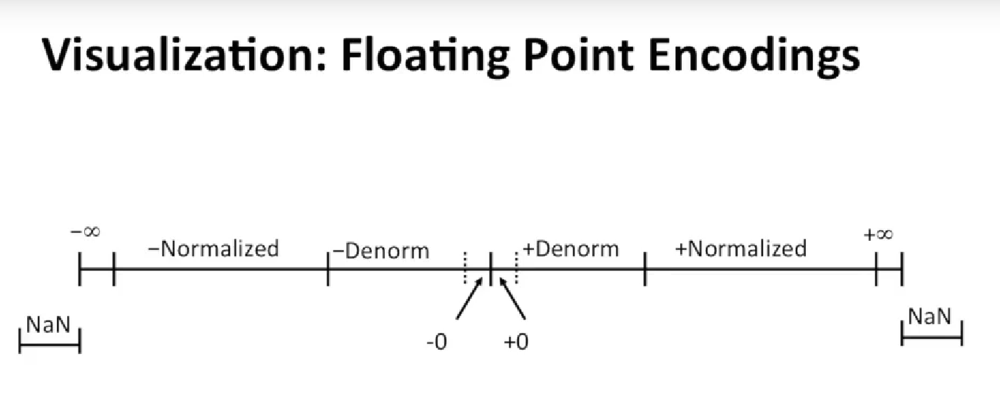

### 穷举一下IEEE的所有值？

在这里，我们采用一种简化的编码方式，来看看浮点数中所有可能的值

**编码格式**

|   s   |  exp   | frac  |      bias      |
| :---: | :----: | :---: | :------------: |
| 1 bit | 3 bits | 2 bit | 2^(3-1)^-1 = 3 |

**列表穷举（仅正数）**

| floating |  E   | value |   note   |
| :------: | :--: | :---: | :------: |
| 0 000 00 |  -2  |   0   | 非规格化 |
| 0 000 01 |  -2  | 1/16  | 非规格化 |
| 0 000 10 |  -2  | 2/16  | 非规格化 |
| 0 000 11 |  -2  | 3/16  | 非规格化 |
| 0 001 00 |  -2  | 4/16  |  规格化  |
| 0 001 01 |  -2  | 5/16  |  规格化  |
| 0 001 10 |  -2  | 6/16  |  规格化  |
| 0 001 11 |  -2  | 7/16  |  规格化  |
| 0 010 00 |  -1  | 8/16  |  规格化  |
| 0 010 01 |  -1  | 10/16 |  规格化  |
| 0 010 10 |  -1  | 12/16 |  规格化  |
| 0 010 11 |  -1  | 14/16 |  规格化  |
| 0 011 00 |  0   | 16/16 |  规格化  |
| 0 011 01 |  0   | 20/16 |  规格化  |
| 0 011 10 |  0   | 24/16 |  规格化  |
| 0 011 11 |  0   | 28/16 |  规格化  |
| 0 100 00 |  1   |   2   |  规格化  |
| 0 100 01 |  1   |  2.5  |  规格化  |
| 0 100 10 |  1   |   3   |  规格化  |
| 0 100 11 |  1   |  3.5  |  规格化  |
| 0 101 00 |  2   |   4   |  规格化  |
| 0 101 01 |  2   |   5   |  规格化  |
| 0 101 10 |  2   |   6   |  规格化  |
| 0 101 11 |  2   |   7   |  规格化  |
| 0 110 00 |  3   |   8   |  规格化  |
| 0 110 01 |  3   |  10   |  规格化  |
| 0 110 10 |  3   |  12   |  规格化  |
| 0 110 11 |  3   |  14   |  规格化  |
| 0 111 00 | n/a  | 溢出  | 非规格化 |
| 0 111 01 | n/a  |  NaN  | 非规格化 |
| 0 111 10 | n/a  |  NaN  | 非规格化 |
| 0 111 11 | n/a  |  NaN  | 非规格化 |

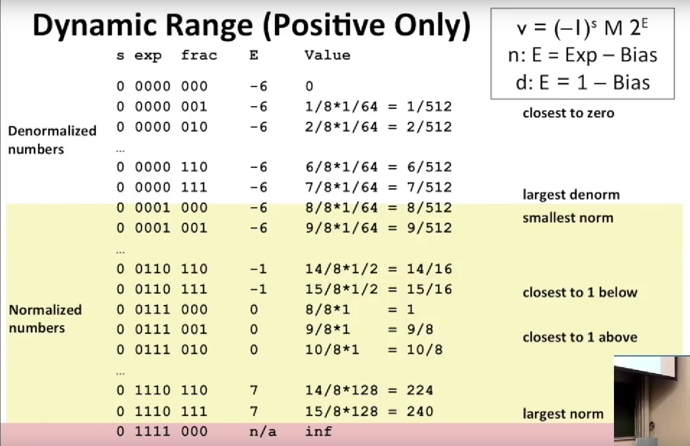

### 表示精度的间距

从上面的穷举表中，不难看出，值越大，则表示的精度越不精确

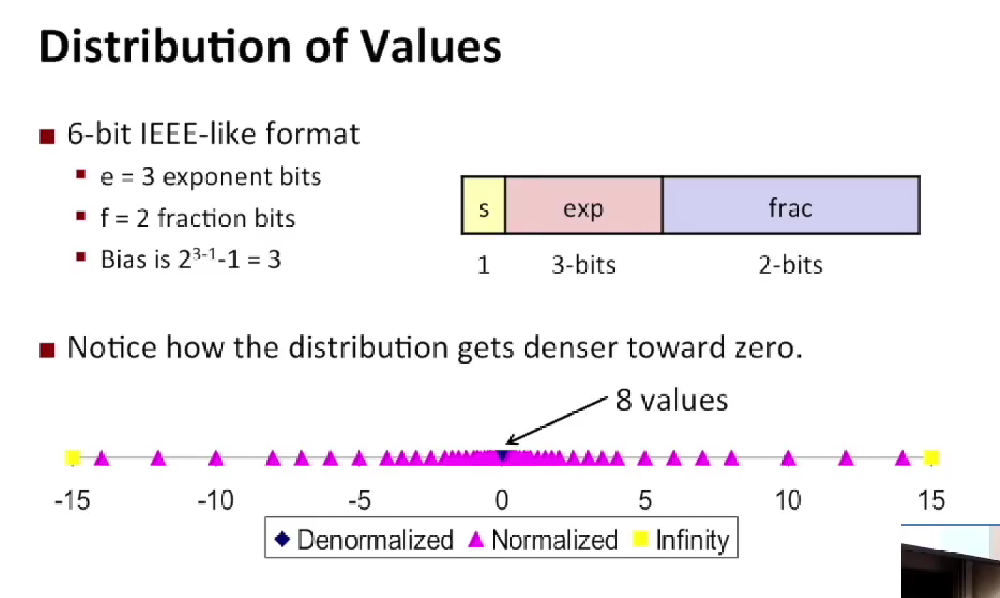

### 浮点数在代码中

由于浮点数并不能准确表达出每一个小数，因此在比较时需要尤其注意

```C
int isOne(double x){
    if(x == 1.0) return 1;//这种写法并不准确
    if(fabs(x-1.0)<=DBL_EPSILON) return 1; //这样写才比较准确
    return 0;
}
```

### 浮点数的编码优势

浮点数的这种编码方式可以非常方便地进行比较。

考虑符号位后，剩余的位完全可以当做无符号整数直接进行比较。

但是有几个条件需要注意

1. 0分为-0与+0
2. NaN的情况

### 浮点数的运算

由于不知道运算结果是否能用浮点数表示，因此在运算中先计算出结果，再用"舍入"的方式去用浮点数表示出结果。

#### 舍入的模式

| Towards zero | Round down | Round up |      Nearest Even      |
| :----------: | :--------: | :------: | :--------------------: |
|   向0舍入    |  向下舍入  | 向上舍入 | 向偶数舍入（默认方式） |

所谓的向偶数舍入，是四舍五入的一个优化。大于一半的向上舍入，小于一半的向下舍入，等于一半的向最近的偶数方向舍入。

对于二进制数，则最高无效位为1且背后全是0就是中间数。

## Lecture4 Machine Level Programing I  Basics

### 汇编基础

#### 数据表示

| C声明  | Intel数据类型 | 汇编代码后缀 | 大小（Byte/bit） |
| :----: | :-----------: | :----------: | :--------------: |
|  char  |     字节      |      b       |    1byte/8bit    |
| short  |      字       |      w       |   2byte/16bit    |
|  int   |     双字      |      l       |   4byte/32bit    |
|  long  |     四字      |      q       |   8byte/64bit    |
| void * |     四字      |      q       |   8byte/64bit    |
| float  |    单精度     |      s       |   4byte/32bit    |
| double |    双精度     |      l       |   8byte/64bit    |

​	如图所示，大多数GCC生成的汇编代码指令都有一个字符的后缀，表明操作数的大小。例如，数据传送指令有四个变种: movb(传送字节)、movw(传送字)、movl(传送双字)和movq(传送四字)。后缀‘1'用来表示双字，因为32位数被看成是“长字( longword)”。注意，汇编代码也使用后缀‘1'来表示4字节整数和8字节双精度浮点数。

#### 寄存器组

x86-64中有16个通用寄存器，并且每个寄存器有四个别名，分别可以访问不同的位数

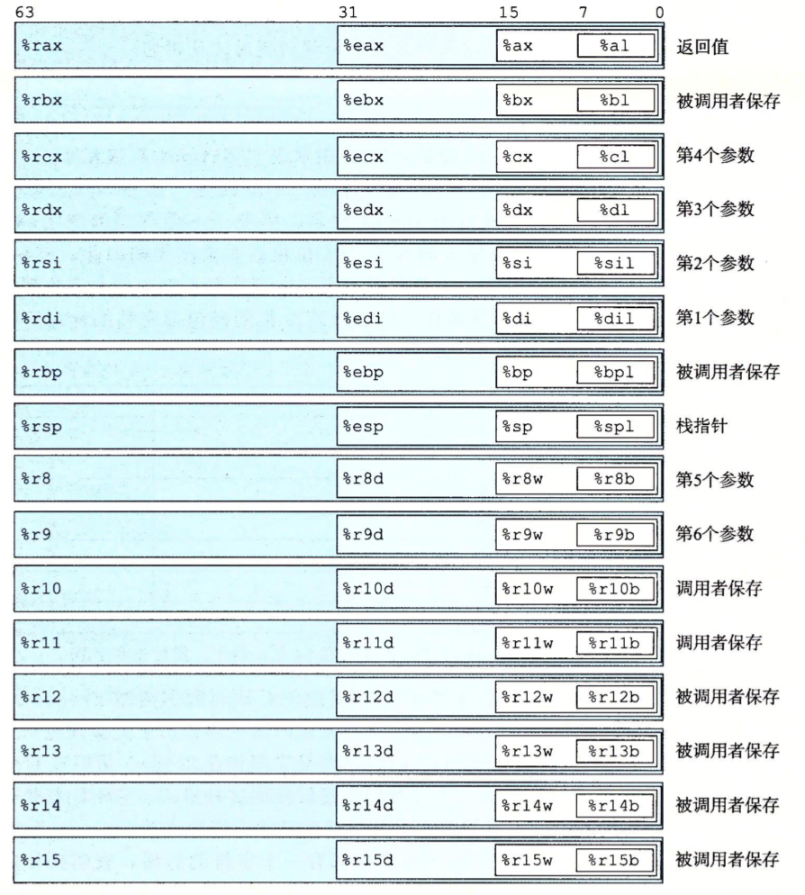

#### 汇编中的操作数

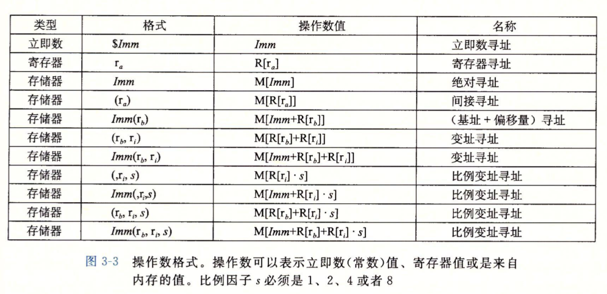

在图3-3中，我们用符号r~x~来表示任意寄存器x，用引用R[r~x~]来表示它的值，这是将寄存器集合看成一个数组R，用寄存器标识符作为索引。有多种不同的寻址模式，允许不同形式的内存引用。表中底部用语法Imm(r~b~，r~i~，s)表示的是最常用的形式。这样的引用**有四个组成部分**:一个**立即数偏移Imm**，一个**基址寄存器r~b~**,，一个**变址寄存器r~i~**和一个**比例因子s**，这里s必须是1、2、4或者3。基址和变址寄存器都必须是64位寄存器。有效地址被计算为**M[Imm+R[r~b~]+R[r~i~]*s]**。引用数组元素时，会用到这种通用形式。其他形式都是这种通用形式的特殊情况，只是省略了某些部分。

#### mov指令

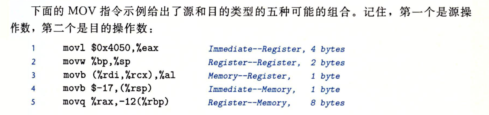

#### 一些其他指令

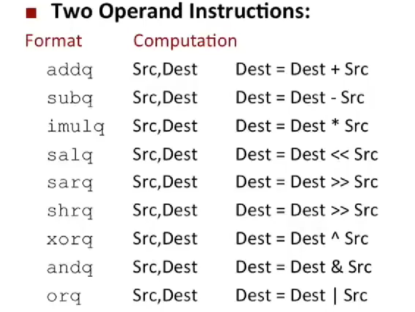

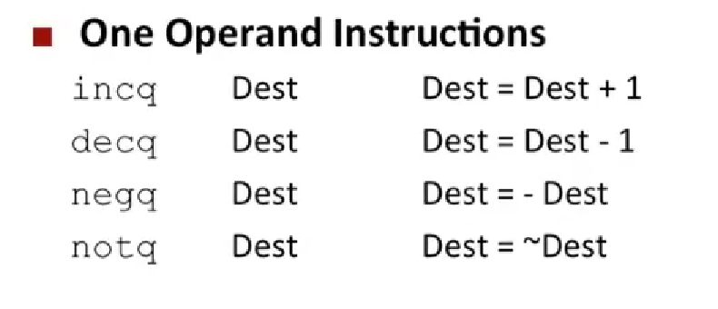

#### lea指令

这是一个...非常...奇特？的指令...

毕竟它的作用是，将地址值取出并复制到dest中...

语法是这样的

leaq  src,dest

可以有这样奇怪的用法

leaq (%rdi,%rsi) , %rax

翻译过来就是，把寄存器rdi中的值按相对寻址的格式（见上文），乘上rsi中的值后，复制给寄存器rax...

算是一种奇怪的？方式实现乘法？

毕竟它的用法和它本来作为"取址"的用法很不一样...

## Lecture5 Machine Level Programing II  Control

本节主要关于**汇编中的流程控制**

### 条件码寄存器

有一些仅有1bit的标志位，处理当前的一些状态

它们仅可以由指令判断后自动设定

- **CF**  Carry Flag	无符号数判断溢出的标志，溢出置1
- **ZF**  Zero Flag     运算结果为0则置1 
- **SF**  Sign Flag      运算结果小于0则置1
- **OF**  Overflow Flag   有符号数溢出则置1

（通常被一些数学运算设置（把它们当做一种边缘效应））

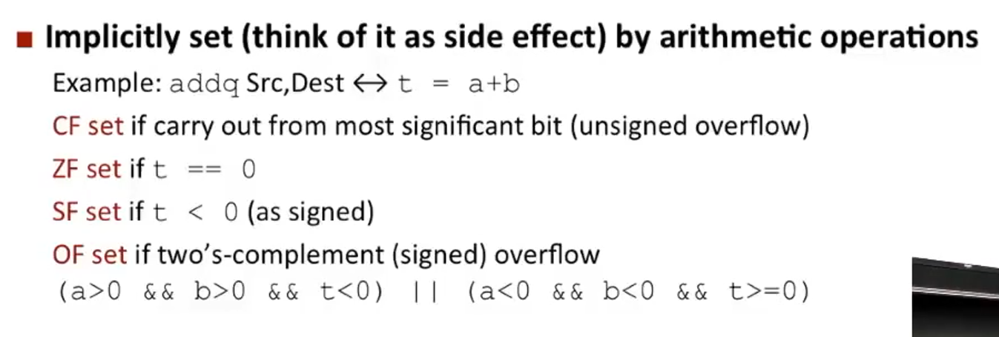

**但是不会被lea设置！！！！**

### 特殊指令对标志位的影响（条件分支的实现基础）

有一些特殊指令，它们的作用就仅仅是设置标志位。

|       CMD        |     RES     |      CF      |    ZF    |   SF    |     OF     |
| :--------------: | :---------: | :----------: | :------: | :-----: | :--------: |
| cmp  src1，src2  | src2 - src1 | unsigned溢出 | RES == 0 | RES < 0 | signed溢出 |
| test  src1，src2 | src2 & src1 |      \       | RES == 0 | RES < 0 |     \      |

**注:**

- test的常见用法是——直接把俩个相同的寄存器进行test，可以直接测得值的正负...

### 读取特殊指令寄存器

对于特殊指令寄存器的读取通常不会通过直接读取来进行，而是采用set指令，根据寄存器的组合，将特定的值写入dest中

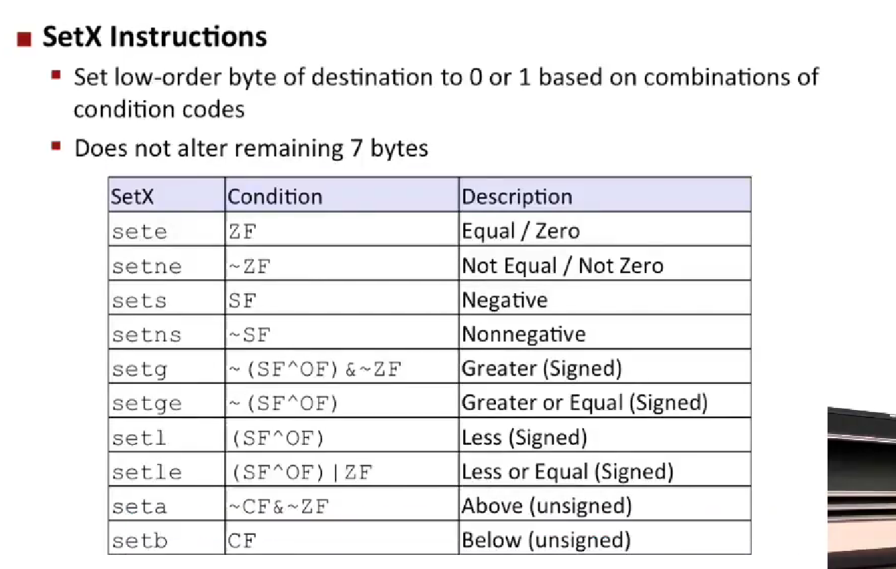

如：sete %al  会在最近操作结果为0时往al寄存器中写入1，否则写入0

### 分支的实现

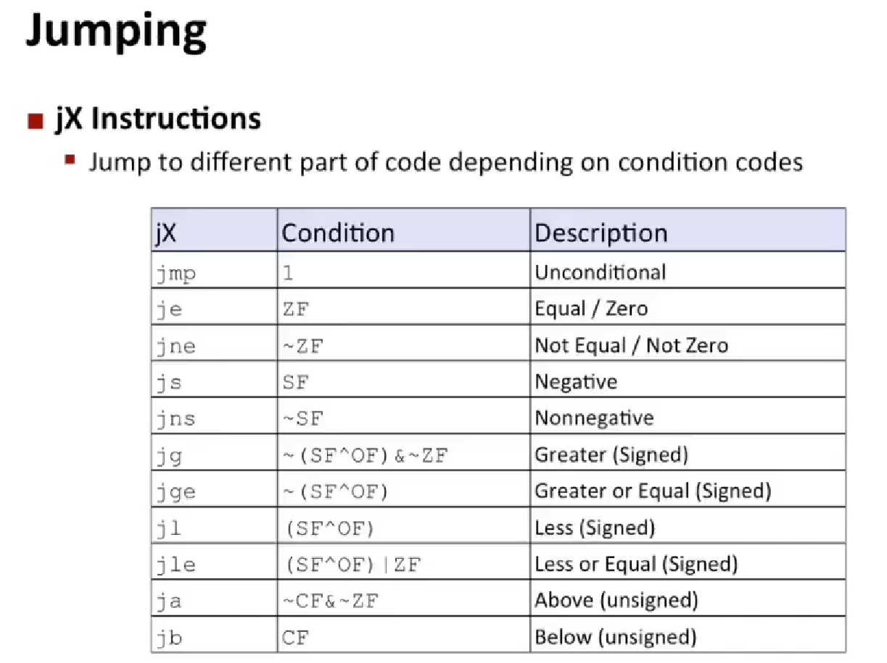

jmp语句通常有一个dest，这里的dest是一个tag

条件跟set一样

这里贴一段代码

```c
int getBigger(int a,int b){
    int c;
    if(a>b) c = a;
    else c = b;
}
```

翻译成汇编后

```assembly
getBigger:
	movl %edx , %eax
	cmpl %edx , %ecx
	jge .L2
	movl %ecx , %eax
	ret
.L2
	ret
```

- 可以这样让GCC强制不进行条件移动（一种优化方式）

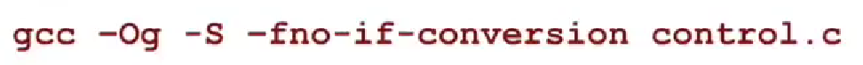


## Lecture6 Machine Level Programing III  Procedures

### 控制的传递

#### 程序栈

- 是一个栈
- %rsp将储存栈顶的地址
- 栈顶到栈底，地址不断递增（栈顶的地址最低）
- push和pop可以对程序栈进行操作
- 每次push/pop都会先将地址进行操作，然后进行读写
- 本质上push和pop都可以写为 对%rsp的地址进行一个算数运算再加上一个mov指令

#### Call & Ret

- **call** 会做俩件事。

	1. 将目标函数的地址存进%rip寄存器（程序指令计数器）中
	2. 将call的下一句指令push进栈中，以便调用执行完后可以继续执行当前语句
- **ret** 将逆转call做的事
	- ret会找到之前push进栈中的指令地址，并将地址pop入%rip中，这样将回到调用者中继续运行

### 数据的传递

数据传递主要是参数与返回值需要传递，因此有一个规范规定了调用前存放参数的寄存器与存储返回值的寄存器（浮点数在传递参数时，用的是另一些寄存器）

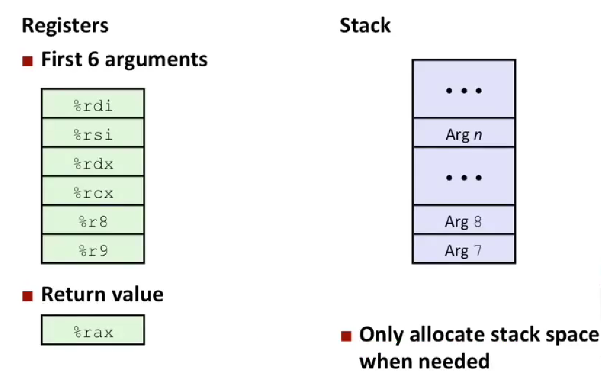

### 数据的处理

- 在调用函数时，会将参数放在特定的那一组寄存器里。但是进入调用的函数时，会对各个通用寄存器进行操作。这时候，如果ret回caller，那么将会导致caller中的状态改变。如何保证caller在调用callee后仍然能维持原来的状态，就一定需要一个系统来保证这一点。
- 这个系统基于栈（因为栈很合适procedure）

#### 栈帧

栈帧，即一个函数存储数据（包括运行过程中产生的或是caller要求它保存的数据）以及一些控制运行的重要信息的栈元素。头部由%rsp（帧指针）存储，尾部根据具体需求，选择性使用%rbp（基指针）存储（如果能预测开辟栈的大小，则直接在结束后按申请的大小释放即可；如果不能预测，则需要%rbp来存储栈尾部的值（这里栈头指地址最小处，栈尾指地址最大处））

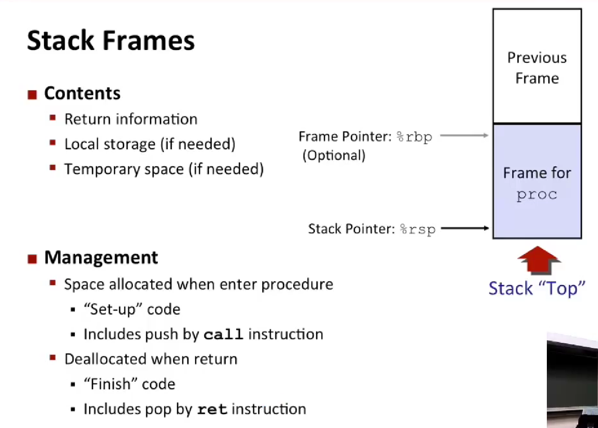

#### caller save & callee save

- caller ，是调用者函数
- callee ，是被调用函数
- 在caller中保存需要的数据，在callee return后再从caller的栈中恢复数据，这就是caller save
- 在callee中保存caller中寄存器的数据，并在return前从callee的栈中恢复数据，这就是callee save
- 对于寄存器是caller save 还是 callee save，ABI有一套完整的规范

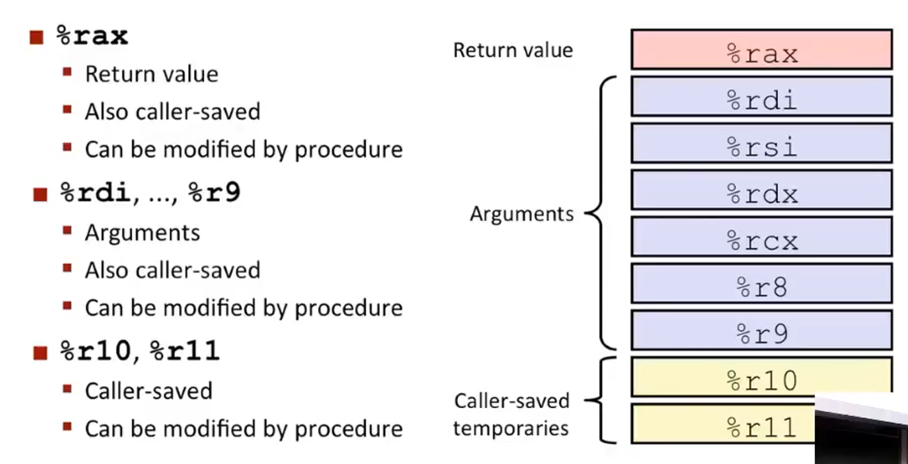

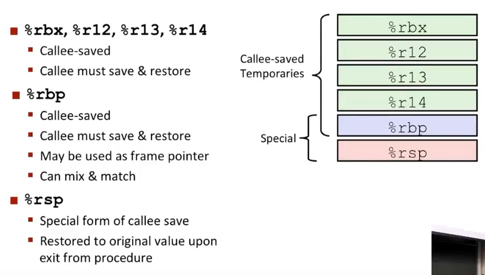

#### 代码示例

现在来看这样一组代码，这将更清晰地展示出栈在C中的作用

```c
//作用是将value到dest的内存中，并返回dest原来的值
int add(int *dest,int value){
    int temp = *dest;
    *dest += value;
    return temp;
}

//作用是调用add函数
int add_caller(int x){
    int val1 = 13352;
    int val2 = add(&val1,3000);
    return x + val2;
}

int main(){
    add_caller(1000);
    return 0;
}
```

```assembly
add:#add函数						
	#int temp = *dest;
	movl	(%rcx), %eax#将rcx中的值解址存入eax中（rcx是参数dest的值，eax是将返回的寄存器）
	#value += temp;
	addl	%eax, %edx	#将eax中的值加到edx中（edx是存储参数value的寄存器）
	#*dest = value;
	movl	%edx, (%rcx)#将edx中的值写入rcx指向的内存中
	#return temp;
	ret					#返回caller

add_caller:
	pushq	%rbx			#rbx是callee save，因此先保存caller中寄存器的值
	subq	$48, %rsp		#开辟48大小的栈空间
	movl	%ecx, %ebx		#将ecx(param1)的值移入ebx中（这里改变了rbx的值）
	movl	$13352, 44(%rsp)#将13352存入rsp+44的位置中（利用已开辟的空间存值）
	leaq	44(%rsp), %rcx	#将rsp+44存入rcx中（add函数的param1）
	movl	$3000, %edx		#将3000存入edx中（add函数的param2）
	call	add				#调用call函数，调用后rax的值会变为add的返回值
	addl	%ebx, %eax		#将ebx中的值移入eax作为返回值
	addq	$48, %rsp		#销毁栈空间
	popq	%rbx			#从栈中恢复caller需要的rbx的数据
	ret						#返回caller中
	
main:
	subq	$40, %rsp	#开辟40大小的栈空间
	call	__main
	movl	$1000, %ecx	#为add_caller准备参数
	call	add_caller	#调用
	movl	$0, %eax	#将0存入eax中最为返回值
	addq	$40, %rsp	#销毁栈空间
	ret					#返回caller
```

**不难看出，ABI在这其中起到了至关重要的作用**

**它使得编译器在规范了每个寄存器的特性后能够通用**

#### Linux中的栈


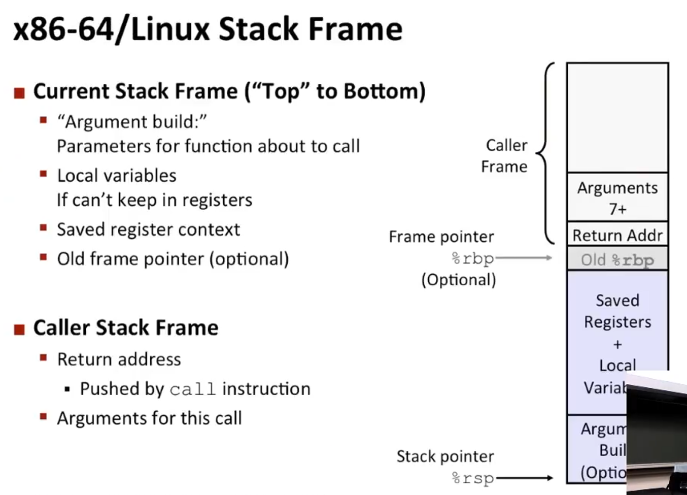

## Lecture7 Machine Level Programing IV  Data

本节主要关于在机器级编程中，数据（像数组、结构体）的表示。

### 数组

#### 一维

这个其实非常简单...直接上代码吧

```c
//这个函数将展示数组的访问
int getElement(int* list,int i){
    return list[i];
}

//循环访问
void traverse(int* list,int length){
    for(int i = 0;i<length;i++) list[i]++;
}
```

```assembly
getElement:
	movslq	%edx, %rdx
	movl	(%rcx,%rdx,4), %eax	#x86提供的这种奇怪的寻址方式给数组提供了可能
	ret
	
traverse:
	movl	$0, %eax			#eax存i
.L2:
	cmpl	%edx, %eax			#比较循环条件
	jge	.L4
	movslq	%eax, %r8			#将i复制到r8里，用于访问数组
	leaq	(%rcx,%r8,4), %r9	#访问，并将地址结果存到r9里
	movl	(%r9), %r10d		#把r9指向的值复制到r10中
	leal	1(%r10), %r8d		#r10的值++存入r8
	movl	%r8d, (%r9)			#r8中的值放入r9指向的地址
	addl	$1, %eax			#eax++
	jmp	.L2
.L4:
	ret
```

#### 多维

- 行优先（即越左的权重越大）

### 结构体

#### 内存分配

根据大小，跟数组一样

#### 访问

也是通过地址偏移来计算的...但是还需要记录偏移量是多少就是了

#### 对齐

每个元素的起始地址必须是它大小的倍数...因此会插入一些空隙

## Lecture8 Machine Level Programing V  Advanced Topics

### 内存的划分

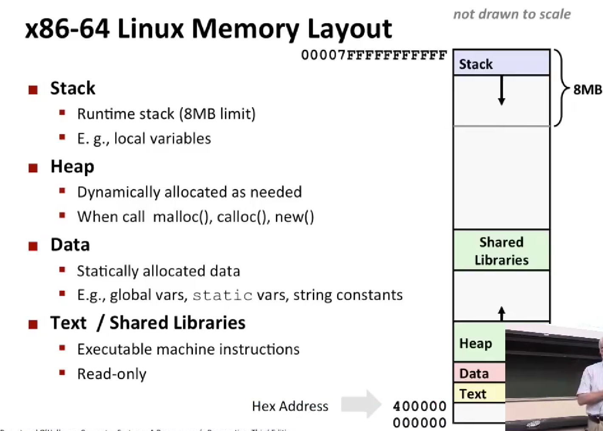

- 栈区，向下扩展，存储运行时栈的数据
- 共享库区，用于动态链接
- 堆区，分配方式由程序决定，用于动态分配
- 数据区，存储全局变量等
- 代码区，存储用户程序

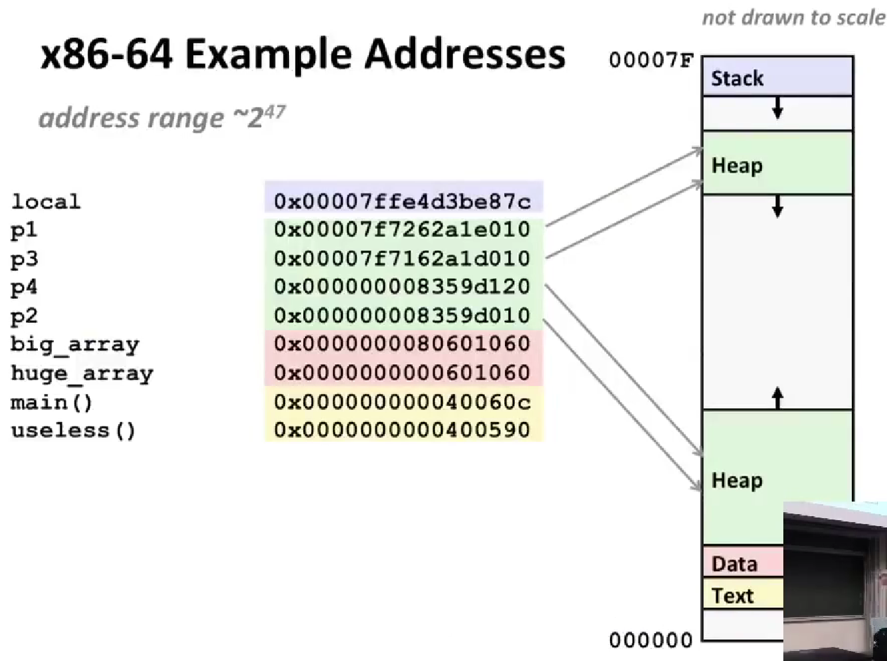

**学会用地址判断所在内存的区域**

### 缓冲区溢出

**缓冲区溢出，通俗讲，就是访问超过数组下标的数组元素，导致污染其他数据**

```cpp
struct struct_t{
  	int a[2];
    double d;
};

int main(){
    struct_t x;
    //这将污染到d中的数据
    x.a[3] = 3;
    return 0;
}
```

会带来一些奇怪的问题。

回顾栈帧的结构，在栈偏底的位置，会存入caller的下一句地址，用于在ret时继续运行

但缓冲区溢出后，有可能篡改这一部分的数据

导致地址非法或是我们不想前往的地方，导致程序崩溃

### 代码注入攻击

通过缓冲区溢出，篡改caller的地址，可以导致程序运行从外部插入的程序。这就是代码注入攻击。

**现在解决方案有很多**

- 通过编写安全的代码
- ASLR技术（Address Space Layout Randomization），地址空间随机化技术，会随机化栈的偏置值，使得难以预测注入代码的开始地址
- 栈保护技术，通过对溢出部分进行特殊标志，来判定程序是否异常

## Lecture8.5 CPU

### 程序的执行过程

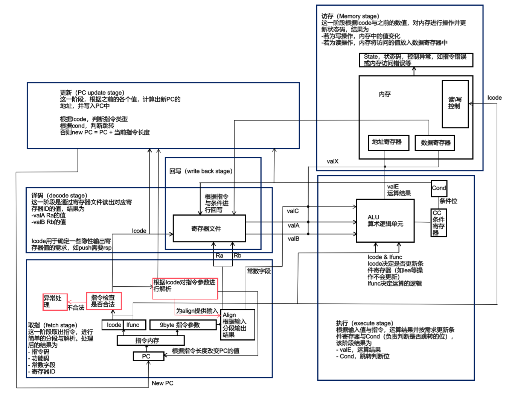

## Lecture9 Program Optimization

等书看完再补充...有点难啊...

## Lecture10 The Memory Hierarchy

存储系统的层次结构

### 存储技术与趋势概览

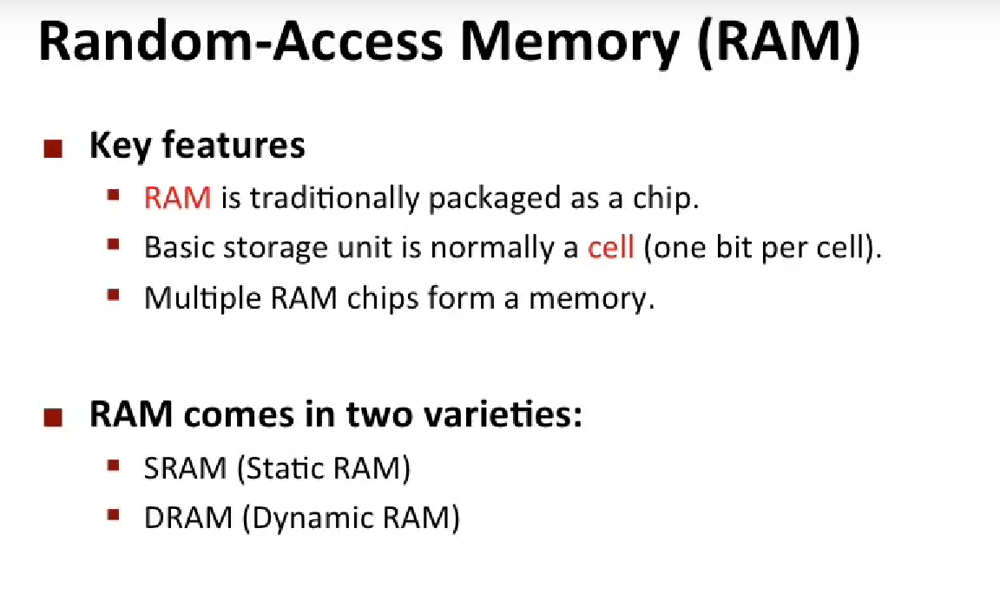

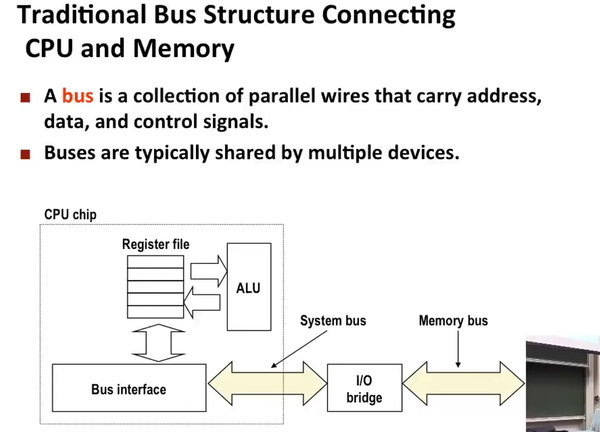


## Lecture11 Cache Memory

## Lecture12 Linking

### 编译过程

- **预处理**  进行文本处理，如将include的文件内容进行复制、进行一些文本替换等
- **编译**  将代码编译为汇编语言
- **汇编**  将汇编代码编译为ELF可重定向文件
- **链接**  将可重定向文件链接为可执行文件

### ELF可重定向文件

#### 可重定向文件的结构

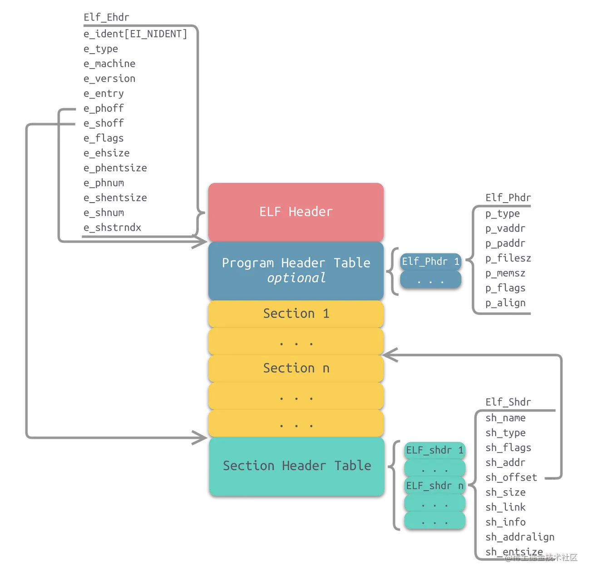

可以看到，ELF文件由

- ELF头
- 程序头部表
- 多个节
- 节头部表

共同组成。

接下来，对每个部分读取看看

（介绍一个命令，readelf，可以查看ELF文件喔）

#### test.c文件

下面的文件都是通过该文件编译出来的~

```c
//test.c
int globalInit = 10;//已经初始化过的全局变量
int globalUninit;  //还未初始化的全局变量
static int staticInit = 11; //已经初始化过的静态变量
static int staticUninit;  //还未初始化的静态变量

int globalArray[3] = {1,2,3};

int unimplementFunc(int n);

int implementFunc(int a){
    return a;
}

int main(){
    int s = globalArray[1] , k ;
    k = implementFunc(s);
    s = unimplementFunc(k);
	return 0;
}
```

#### ELF文件

来看看经过汇编后得到的ELF可重定向文件

```shell
ELF 头：
  Magic：  7f 45 4c 46 02 01 01 00 00 00 00 00 00 00 00 00 
  类别:                              ELF64
  数据:                              2 补码，小端序 (little endian)
  Version:                           1 (current)
  OS/ABI:                            UNIX - System V
  ABI 版本:                          0
  类型:                              REL (可重定位文件)
  系统架构:                          Advanced Micro Devices X86-64
  版本:                              0x1
  入口点地址：              0x0
  程序头起点：              0 (bytes into file)
  Start of section headers:          760 (bytes into file)
  标志：             0x0
  Size of this header:               64 (bytes)
  Size of program headers:           0 (bytes)
  Number of program headers:         0
  Size of section headers:           64 (bytes)
  Number of section headers:         13
  Section header string table index: 12

节头：
  [号] 名称              类型             地址              偏移量
       大小              全体大小          旗标   链接   信息   对齐
  [ 0]                   NULL             0000000000000000  00000000
       0000000000000000  0000000000000000           0     0     0
  [ 1] .text             PROGBITS         0000000000000000  00000040
       0000000000000022  0000000000000000  AX       0     0     1
  [ 2] .rela.text        RELA             0000000000000000  00000228
       0000000000000030  0000000000000018   I      10     1     8
  [ 3] .data             PROGBITS         0000000000000000  00000068
       0000000000000010  0000000000000000  WA       0     0     8
  [ 4] .bss              NOBITS           0000000000000000  00000078
       0000000000000004  0000000000000000  WA       0     0     4
  [ 5] .comment          PROGBITS         0000000000000000  00000078
       0000000000000013  0000000000000001  MS       0     0     1
  [ 6] .note.GNU-stack   PROGBITS         0000000000000000  0000008b
       0000000000000000  0000000000000000           0     0     1
  [ 7] .note.gnu.pr[...] NOTE             0000000000000000  00000090
       0000000000000030  0000000000000000   A       0     0     8
  [ 8] .eh_frame         PROGBITS         0000000000000000  000000c0
       0000000000000048  0000000000000000   A       0     0     8
  [ 9] .rela.eh_frame    RELA             0000000000000000  00000258
       0000000000000030  0000000000000018   I      10     8     8
  [10] .symtab           SYMTAB           0000000000000000  00000108
       00000000000000d8  0000000000000018          11     3     8
  [11] .strtab           STRTAB           0000000000000000  000001e0
       0000000000000041  0000000000000000           0     0     1
  [12] .shstrtab         STRTAB           0000000000000000  00000288
       000000000000006c  0000000000000000           0     0     1
Key to Flags:
  W (write), A (alloc), X (execute), M (merge), S (strings), I (info),
  L (link order), O (extra OS processing required), G (group), T (TLS),
  C (compressed), x (unknown), o (OS specific), E (exclude),
  D (mbind), l (large), p (processor specific)

There are no section groups in this file.

本文件中没有程序头。

There is no dynamic section in this file.

重定位节 '.rela.text' at offset 0x228 contains 2 entries:
  偏移量          信息           类型           符号值        符号名称 + 加数
00000000000d  000300000004 R_X86_64_PLT32    0000000000000000 implementFunc - 4
000000000014  000500000004 R_X86_64_PLT32    0000000000000000 unimplementFunc - 4

重定位节 '.rela.eh_frame' at offset 0x258 contains 2 entries:
  偏移量          信息           类型           符号值        符号名称 + 加数
000000000020  000200000002 R_X86_64_PC32     0000000000000000 .text + 0
000000000034  000200000002 R_X86_64_PC32     0000000000000000 .text + 3
No processor specific unwind information to decode

Symbol table '.symtab' contains 9 entries:
   Num:    Value          Size Type    Bind   Vis      Ndx Name
     0: 0000000000000000     0 NOTYPE  LOCAL  DEFAULT  UND 
     1: 0000000000000000     0 FILE    LOCAL  DEFAULT  ABS test.c
     2: 0000000000000000     0 SECTION LOCAL  DEFAULT    1 .text
     3: 0000000000000000     3 FUNC    GLOBAL DEFAULT    1 implementFunc
     4: 0000000000000003    31 FUNC    GLOBAL DEFAULT    1 main
     5: 0000000000000000     0 NOTYPE  GLOBAL DEFAULT  UND unimplementFunc
     6: 0000000000000000    12 OBJECT  GLOBAL DEFAULT    3 globalArray
     7: 0000000000000000     4 OBJECT  GLOBAL DEFAULT    4 globalUninit
     8: 000000000000000c     4 OBJECT  GLOBAL DEFAULT    3 globalInit

No version information found in this file.

Displaying notes found in: .note.gnu.property
  所有者            Data size 	Description
  GNU                  0x00000020	NT_GNU_PROPERTY_TYPE_0
      Properties: x86 ISA used: 
	x86 feature used: x86

```


#### ELF头

```shell
ELF 头：
  Magic：  7f 45 4c 46 02 01 01 00 00 00 00 00 00 00 00 00 
  类别:                              ELF64
  数据:                              2 补码，小端序 (little endian)
  Version:                           1 (current)
  OS/ABI:                            UNIX - System V
  ABI 版本:                          0
  类型:                              REL (可重定位文件)
  系统架构:                          Advanced Micro Devices X86-64
  版本:                              0x1
  入口点地址：              0x0
  程序头起点：              0 (bytes into file)
  Start of section headers:          760 (bytes into file)
  标志：             0x0
  Size of this header:               64 (bytes)
  Size of program headers:           0 (bytes)
  Number of program headers:         0
  Size of section headers:           64 (bytes)
  Number of section headers:         13
  Section header string table index: 12
```

在ELF文件中，起头的部分就是ELF头，它标志出了如上的重要信息，包括

- **节数**，该elf文件的节数
- **节头部表偏移量**，它指示了记录了每个节的基本信息的节头部表距离文件开始处的偏移量，这样链接器可以通过它找到每个节的位置

#### 节头部表

该表位于elf文件的末尾，可以通过读取ELF头快速找到它的开始

```shell
节头：
  [号] 名称              类型             地址              偏移量
       大小              全体大小          旗标   链接   信息   对齐
```

它记录了每个节的这些信息，可以通过它快速找到每个节的具体位置等

#### 节

我们只需要认识并记住以下几个固定节的信息即可

------

##### **.text节**

该节记录了程序编译后的机器码

```shell
#这是编译后存在.text区里的机器码，最左侧4个数是十六进制标志，方便阅读
Contents of section .text:
 0000 89f8c348 83ec088b 3d000000 00e80000  ...H....=.......
 0010 000089c7 e8000000 00b80000 00004883  ..............H.
 0020 c408c3                               ...             
```

反汇编后，可以得到汇编代码

```assembly
Disassembly of section .text:

#00...是该部分代码的起始位置
0000000000000000 <implementFunc>:
   #左侧是地址与16进制表示的机器码  右侧是反汇编得到的汇编代码
   0:	89 f8                	mov    %edi,%eax
   2:	c3                   	ret    

0000000000000003 <main>:
   3:	48 83 ec 08          	sub    $0x8,%rsp
   7:	8b 3d 00 00 00 00    	mov    0x0(%rip),%edi  #d<main+0xa>
   d:	e8 00 00 00 00       	call   12 <main+0xf>
  12:	89 c7                	mov    %eax,%edi
  14:	e8 00 00 00 00       	call   19 <main+0x16>
  19:	b8 00 00 00 00       	mov    $0x0,%eax
  1e:	48 83 c4 08          	add    $0x8,%rsp
  22:	c3                   	ret    

```

可以看到，.text区里存的就是我们的文件对应的机器码

------

##### **.data节**

该节存储了**已经初始化过的全局变量的值**，代表这些变量真正拥有了一个地址（之后对这个变量的操作就在.data节的对应地址里操作了）

```shell
Contents of section .data:
 0000 01000000 02000000 03000000 0a000000  ................
```

```c
int globalInit = 10;//已经初始化过的全局变量
int globalArray[3] = {1,2,3};
```

可以看到，对应的值已经写入elf文件中了（小端序），依次是1 2 3 10

------

##### **.bss节**

该节会预留空间（其实并没有分配，而是在加载时候提供信息来映射）给还未初始化的全局变量

------

##### **.symtab**

符号表，下一节详细介绍

------

##### **总结**

- 我们发现，ELF最后会加载到内存中，因此它将每一个部分的值都已经写为了机器码，并分配好了地址。
- 同时我们发现，静态变量、局部变量会放在寄存器中操作，而不在.data中分配空间
- 但是也存在一个问题，如果所有的地址都已经确定（每一个变量、每一段机器码），那要如何进行多文件写作呢？这就需要符号表了

### 符号表

符号表是多个ELF文件的粘合剂

先看看符号表中的内容

```shell
#offset				 type section size       	 name
SYMBOL TABLE:
0000000000000000 l    df  *ABS*	0000000000000000 test.c
0000000000000000 l    d   .text	0000000000000000 .text
0000000000000000 g     F  .text	0000000000000003 implementFunc
0000000000000003 g     F  .text	000000000000001f main
0000000000000000          *UND*	0000000000000000 unimplementFunc
0000000000000000 g     O  .data	000000000000000c globalArray
0000000000000000 g     O  .bss	0000000000000004 globalUninit
000000000000000c g     O  .data	0000000000000004 globalInit

```

- **offset** 记录在对应节中的偏移量
- **section** 所在节的位置
- **name** 符号名称
- **size** 字节长度

试着验证一些

```assembly
000000000000000c  O  .data	0000000000000004 globalInit
#读出，global在.data中被引用，偏移量为0xc

Contents of section .data:
 0000 01000000 02000000 03000000 0a000000
#恰好从0xc开始是globalInit（值为10）的地址
```

```assembly
0000000000000000   F .text	0000000000000003 implementFunc
0000000000000003   F .text	000000000000001f main
#读出，implementFunc在.text中被引用，偏移量为0
#     main在.text中被引用，偏移量为0x3

0000000000000000 <implementFunc>:
   0:	89 f8                	mov    %edi,%eax
   2:	c3                   	ret    

0000000000000003 <main>:
   3:	48 83 ec 08          	sub    $0x8,%rsp
   7:	8b 3d 00 00 00 00    	mov    0x0(%rip),%edi  #d<main+0xa>
   d:	e8 00 00 00 00       	call   12 <main+0xf>
  12:	89 c7                	mov    %eax,%edi
  14:	e8 00 00 00 00       	call   19 <main+0x16>
  19:	b8 00 00 00 00       	mov    $0x0,%eax
  1e:	48 83 c4 08          	add    $0x8,%rsp
  22:	c3                   	ret    
#确实对上了！
```

### 符号表解析

#### 强符号与弱符号

强符号指已经初始化过的全局成员，弱符号是还没初始化的全局成员

- 多个强符号——multidefinination
- 多个弱符号——随机选取一个，不会出错
- 一个强符号和多个弱符号——弱符号会被解析为强符号的地址

#### 解析原理

- 维护三个集合，E（引用的文件集合），U（未定义符号集合），D（已定义符号集合）
- 对于每个文件，如果是目标文件，则将它添加到E中，并修改U和D来反映文件中的符号和引用
- 如果是存档文件，则链接器尝试匹配U中未解析的符号，把需要的目标文件填入E中，修改U和D
- 如果最后U为空，则代表可以链接成功

### 重定位

重定位分为两步，第一步为**重定位节和符号定义**，第二步是**重定位节中的符号引用**

#### 重定位节和符号定义

该步骤会将所有相同类型的节合为新的节，为它们重新分配地址，并将新地址记录在符号表中

#### 重定位节中的符号引用

该步骤会根据rel.text与rel.data中的重定位条目修改引用的运行时地址，使得程序可以正常运行

#### 样例

我们补一个实现了unimplement函数的文件，并链接成可执行文件

```assembly
test.c 
#重定位条目
RELOCATION RECORDS FOR [.text]:
OFFSET           TYPE              VALUE 
0000000000000009 R_X86_64_PC32     globalArray
000000000000000e R_X86_64_PLT32    implementFunc-0x04
0000000000000015 R_X86_64_PLT32    unimplementFunc-0x04


#汇编代码
Disassembly of section .text:

0000000000000000 <implementFunc>:
   0:	89 f8                	mov    %edi,%eax
   2:	c3                   	ret    

0000000000000003 <main>:
   3:	48 83 ec 08          	sub    $0x8,%rsp
   7:	8b 3d 00 00 00 00    	mov    0x0(%rip),%edi  #d <main+0xa>
			9: R_X86_64_PC32	globalArray
			#这条与上面的重定位条目相同含义，是objdump为了方便阅读而加的
			#意思是：在地址偏移为9的地方，有一个绝对寻址重定向
			#此时会将从地址0x9开始的值变为符号表中globalArray记录的地址填入
   d:	e8 00 00 00 00       	call   12 <main+0xf>
			e: R_X86_64_PLT32	implementFunc-0x4
			#意思是：在地址偏移为e的地方，有一个相对寻址重定向
			#此时会将从地址0xe开始的值改为(implementFunc-0x4)-%rip的值
			#这里有一个误区，需要特别注意call imm用的是相对寻址
  12:	89 c7                	mov    %eax,%edi
  14:	e8 00 00 00 00       	call   19 <main+0x16>
			15: R_X86_64_PLT32	unimplementFunc-0x4
  19:	b8 00 00 00 00       	mov    $0x0,%eax
  1e:	48 83 c4 08          	add    $0x8,%rsp
  22:	c3                   	ret  
```

```assembly
func.c
SYMBOL TABLE:
0000000000000000 l    df *ABS*	0000000000000000 func.c
0000000000000000 l    d  .text	0000000000000000 .text
0000000000000000 g     F .text	0000000000000003 unimplementFunc

Disassembly of section .text:

0000000000000000 <unimplementFunc>:
   0:	89 f8                	mov    %edi,%eax
   2:	c3                   	ret  
```

```assembly
#可执行文件，仅保留部分有用内容
res：     文件格式 elf64-x86-64

SYMBOL TABLE:
0x0402c l     O .data	0x00004     staticInit
0x04044 l     O .bss	0x00004     staticUninit
0x01157 g     F .text	0x0000c     unimplementFunc
0x04040 g     O .bss	0x00004     globalUninit
0x04030 g     O .data	0x0000c     globalArray
0x01125 g     F .text	0x00032     main
0x04028 g     O .data	0x00004     globalInit
0x01119 g     F .text	0x0000c     implementFunc

Contents of section .data:
 4018 00000000 00000000 20400000 00000000  ........ @......
 4028 0a000000 0b000000 01000000 02000000  ................
 4038 03000000                             ....    

Disassembly of section .text:
0000000000001119 <implementFunc>:
    1119:	55                   	push   %rbp
    111a:	48 89 e5             	mov    %rsp,%rbp
    111d:	89 7d fc             	mov    %edi,-0x4(%rbp)
    1120:	8b 45 fc             	mov    -0x4(%rbp),%eax
    1123:	5d                   	pop    %rbp
    1124:	c3                   	ret    

0000000000001125 <main>:
    1125:	55                   	push   %rbp
    1126:	48 89 e5             	mov    %rsp,%rbp
    1129:	48 83 ec 10          	sub    $0x10,%rsp
    112d:	8b 05 01 2f 00 00    	mov    0x2f01(%rip),%eax
    1133:	89 45 f8             	mov    %eax,-0x8(%rbp)
    1136:	8b 45 f8             	mov    -0x8(%rbp),%eax
    1139:	89 c7                	mov    %eax,%edi
    113b:	e8 d9 ff ff ff       	call   1119 <implementFunc>
    1140:	89 45 fc             	mov    %eax,-0x4(%rbp)
    1143:	8b 45 fc             	mov    -0x4(%rbp),%eax
    1146:	89 c7                	mov    %eax,%edi
    1148:	e8 0a 00 00 00       	call   1157 <unimplementFunc>
    114d:	89 45 f8             	mov    %eax,-0x8(%rbp)
    1150:	b8 00 00 00 00       	mov    $0x0,%eax
    1155:	c9                   	leave  
    1156:	c3                   	ret    

0000000000001157 <unimplementFunc>:
    1157:	55                   	push   %rbp
    1158:	48 89 e5             	mov    %rsp,%rbp
    115b:	89 7d fc             	mov    %edi,-0x4(%rbp)
    115e:	8b 45 fc             	mov    -0x4(%rbp),%eax
    1161:	5d                   	pop    %rbp
    1162:	c3                   	ret    

```

可以看到，它们的地址都已经改为了正确的地址

### ELF可执行文件

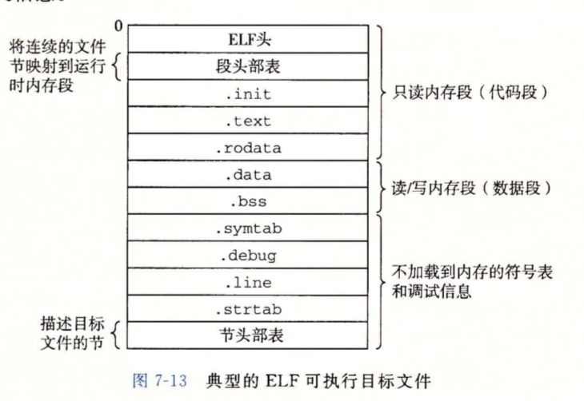

ELF可执行文件中有程序头部表，可以告知内存如何映射自己

最终，在虚拟内存中，出现了熟悉的内存结构

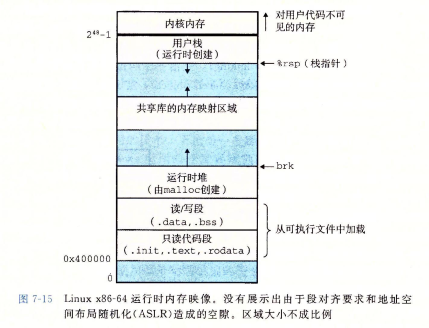

## Lecture13 Exceptions & Processes

## Lecture14 Signal & Nonlocal Jump

## Lecture15 System Level I/O

### 一些概念

- **I/O**	即输入输出，对象是内存与外设之间
- **高级别IO函数**    C语言中的printf、Cpp中重载的>>与<<，都是较高级别的IO

### Unix IO

在Linux中，所有设备都用**文件**（即一串字节序列来抽象），因此输入输出都可以以统一的方式来进行，即读写文件...

统一的方式：

- **打开文件**

	程序要求内核打开文件，来读写外设。内核返回一个小的非负整数，作为一个描述符，用来标识这个文件。程序通过记录这个描述符来执行读写操作。**Linux Shell 创建的每个进程开始时都有三个打开的文件，标准输入（描述符为0）、标准输出（1），标准错误（2）**

- **移动文件位置**

	对于每个打开的文件，内核维护一个**文件位置表**，记录从文件开始的字节偏移量offset。（这个也很懵啊...）

- **读写文件**

	读操作就是从文件复制n大小的内容到内存，从当前文件位置k开始，将k增加到k+n的位置。（猜测写应该也差不多~）

- **关闭文件**

	通知内核关闭文件。内核将描述符归为可用，并处理一些后续操作比如释放空间等。

> 到这里看到还是挺懵逼的...似乎并不好理解...这里IO所谓的文件不是存储在disk上吗？而disk不又是一个外设吗？这就很迷了。

### Linux文件系统

- **文件类型**暂时只讨论这三种：
	- **普通文件** 包含任意数据，可以是文本也可以是二进制，反正就是一个普普通通的字节序列就是了
	- **目录** 是包含了一组链接（link）的文件，每个链接都将一个文件名映射到一个文件，至于".",".."这俩就不多说了
	- **套接字** 用来与另一个进程进行跨网络通信的文件
- **层次结构** 和WIN差不多...不多说
- **当前工作目录** 每个进程都有一个当前工作目录，可以是绝对路径或相对路径

### 相关系统调用

#### 打开或关闭文件

```c
#include "unistd.h"

//打开path对应的文件
//flags可选值：O_RDONLY,O_WRONLY,O_RDWR,O_CREAT,O_TRUNC,O_APPEND，支持位运算
//返回值为对应的文件描述符，出错为-1
int open(char* path,int flags,mode_t mode);

//关闭fd对应的文件
//fd为文件描述符
//返回值成功为0，失败为-1
int close(int fd);
```

#### 读写文件

```c
#include "unistd.h"

//从fd文件中读出n个字节并写入buf中，返回读出的字节数
//比较有意思的是...如果读到了EOF会直接返回...但是第一次碰到EOF并不会返回0...因为确实有读到字节
//而且...这个函数会被中断，导致返回-1，只能通过查看errno来确定是被中断还是自己出错
int read(int fd,void* buf,size_t n);

//写和读差不多
int write(int fd,void* buf,size_t n);
```

#### 查看文件状态

```c
#include "unistd.h"

//会提取出path对应文件的stat数据结构到buf中
int stat(char* path,struct stat *buf);
```

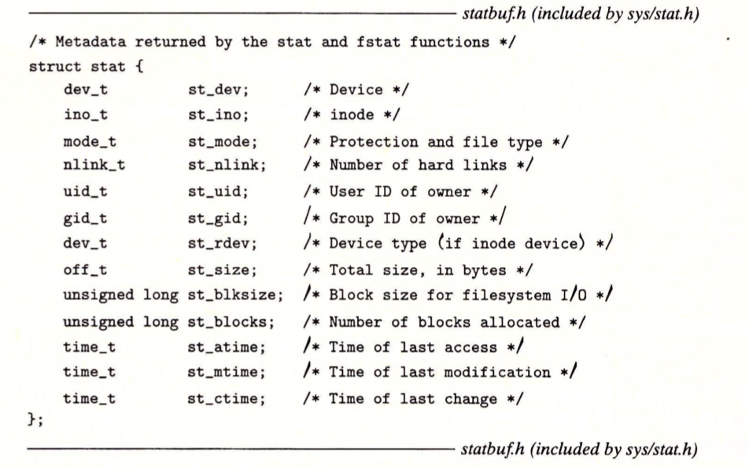

### 封装一个健壮的IO库

```c
#include "stddef.h"
#define MAX_BUF_SIZE 8192

typedef struct
{
    int ioFd;                 //file description
    int ioCnt;                //还未读取的字节数
    char *ioBufPtr;           //指向buf中还未读取区域的第一个字节
    char ioBuf[MAX_BUF_SIZE]; //缓冲区
} IoBuf;

/**
 * @description: 输出错误信息
 * @param {char} *message
 * @return {*}
 */
void unixError(char *message);

/**
 * @description: 从fd文件中读入n个字节到userBuf中
 * @param {int} fd 文件描述符
 * @param {void*} userBuf 用户缓冲区
 * @param {size_t} n 读入文件个数
 * @return 读入的字节数，错误返回-1
 */
int ioReadn(int fd,void* userBuf,size_t n);

/**
 * @description: 从userBuf中读n个字节写入fd中
 * @param {int} fd 文件描述符
 * @param {void*} userBuf 用户缓冲区
 * @param {size_t} n 写入长度
 * @return error?-1:写入的字节数
 */
int ioWriten(int fd,void* userBuf,size_t n);

/**
 * @description: 初始化缓冲区
 * @param {IoBuf*} readBuf 读缓冲区
 * @param {int} fd 文件描述符
 * @return {*}
 */
void ioReadInitBuf(IoBuf* readBuf,int fd);

/**
 * @description: 带缓冲读入
 * @param {IoBuf} ioBuf 输入缓冲区
 * @param {void*} userBuf 用户缓冲区
 * @param {size_t} n 读入长度
 * @return error?-1:读入字节数
 */
int ioReadnBuf(IoBuf* ioBuf,void* userBuf,size_t n);

/**
 * @description: 带缓冲读入行
 * @param {IoBuf*} ioBuf 读入缓冲区
 * @param {void*} userBuf 用户缓冲区
 * @param {size_t} maxn 最大读入长度
 * @return error?-1:读入字节数
 */
int ioReadLineBuf(IoBuf* ioBuf,void* userBuf,size_t maxn);
```

```c
#include "LiteIO.h"
#include "errno.h"
#include "stdio.h"
#include "unistd.h"

void unixError(char* message) {
    fprintf(stderr, "%s : %s", message, strerror(errno));
}

int ioReadn(int fd, void* userBuf, size_t n) {
    size_t nLeft = n;      //剩余的未读字节数
    int readRes;       //记录每次的read返回值
    char* bufp = userBuf;  //记录缓冲区指针
    //当没读的值仍大于0时
    while (nLeft > 0) {
        readRes = read(fd, bufp, nLeft);
        if (readRes < 0) {
            if (errno == EINTR)
                readRes = 0;
            else
                return -1;
        } else if (readRes == 0) {
            break;
        }
        nLeft -= readRes;
        bufp += readRes;
    }
    //返回读入的个数
    return n - nLeft;
}

int ioWriten(int fd, void* userBuf, size_t n) {
    size_t nLeft = n;
    char* bufp = userBuf;
    int writeRes;
    while (n > 0) {
        writeRes = write(fd, userBuf, nLeft);
        if (writeRes < 0) {
            if (errno == EINTR) {
                writeRes = 0;
            } else {
                return -1;
            }
        } else if (writeRes == 0) {
            break;
        }
        nLeft -= writeRes;
        bufp += writeRes;
    }
    return n - nLeft;
}

void ioReadInitBuf(IoBuf* readBuf, int fd){
    readBuf->ioFd = fd;
    readBuf->ioCnt = 0;
    readBuf->ioBufPtr = readBuf->ioBuf;
}

//似乎有问题
int ioReadnBuf(IoBuf* ioBuf, void* userBuf, size_t n){
    int nleft = n;
    while(nleft != 1){
        if(ioBuf->ioCnt != 0){
            *((char*)userBuf++) = *(ioBuf->ioBufPtr++);
            ioBuf->ioCnt --;
            nleft --; 
        }else{
            ioBuf->ioCnt = ioReadn(ioBuf->ioFd,ioBuf->ioBuf,MAX_BUF_SIZE);
            ioBuf->ioBufPtr = ioBuf->ioBuf;
            if(ioBuf->ioCnt == 0) break;
            if(ioBuf->ioCnt == -1) return -1;
        }
    }
    *((char*)userBuf) = 0;
    return n-nleft;
}

//似乎有问题
int ioReadLineBuf(IoBuf* ioBuf, void* userBuf, size_t maxn){
    int nleft = maxn;
    while(nleft != 1){
        if(ioBuf->ioCnt != 0){
            if(*(ioBuf->ioBufPtr) == '\n') break;
            *((char*)userBuf++) = *(ioBuf->ioBufPtr++);
            ioBuf->ioCnt --;
            nleft --; 
        }else{
            ioBuf->ioCnt = ioReadn(ioBuf->ioFd,ioBuf->ioBuf,MAX_BUF_SIZE);
            ioBuf->ioBufPtr = ioBuf->ioBuf;
            if(ioBuf->ioCnt == 0) break;
            if(ioBuf->ioCnt == -1) return -1;
        }
    }
    *((char*)userBuf) = 0;
    return maxn-nleft;
}

```

### IO原理

- **描述符表**

	一个进程将维护一个属于自己的描述符表，里面每个描述符对应一个该进程打开的文件

- **文件表**

	记录着当前打开的所有文件的读写信息（如读到的位置k），这张表被所有进程共享，由内核维护

- **V-Node表** 

	记录着该文件的Stat等条目

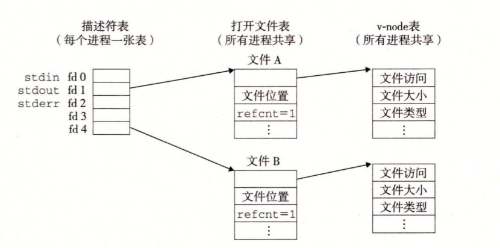

**因此，一个磁盘上的物理文件，只可能对应一个v-node条目，但是可能对应多个文件表条目（被多个进程打开或被一个进程打开多次），而一条文件表条目可以对应多个描述符条目（重定向或fork）**

来看具体情况

- 同一个进程打开同一个文件多次

	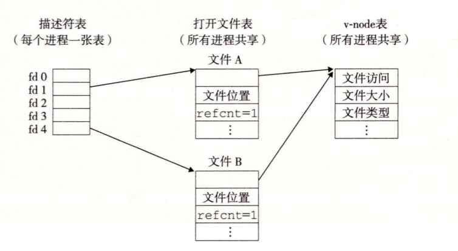
	
	- fork出子进程后子进程与父进程的文件关系
	
		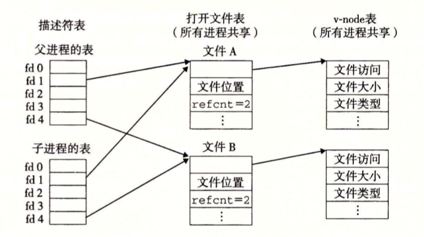

## Lecture16 Virtual Memory Concepts

### 什么是虚拟内存

- 虚拟内存是将"内存"的概念虚拟化，让CPU访问的地址不是物理内存的地址，而是虚拟内存的地址

- 虚拟内存是一种技术，通过将物理内存当做它的缓存来实现
- 虚拟内存真实的存储位置是在磁盘上，通常要比物理内存大
- 此外，应该注意到，并不是整个硬盘都作为虚拟化的内存访问，毕竟硬盘真正的作用是提供长时存储的

### 虚拟内存的一些概念

#### 虚拟内存页与物理内存页

​	虚拟内存页和物理内存页是两个相似的概念，它们**对应于缓存系统中的"块"的概念**，**是虚拟内存与物理内存进行数据交换的基本单位**。与缓存系统不同的是，这里将位于磁盘上的"块"和位于物理内存上的"块"分开起名了，磁盘上的叫虚拟内存页，物理内存上的叫物理内存页。这里也可以发现，所谓的虚拟内存其实就是磁盘上当做内存的部分。

#### 虚拟内存与物理内存的关系

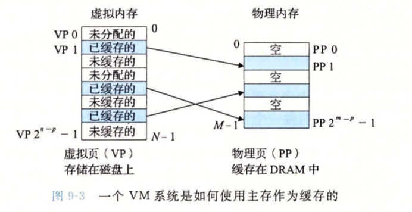

​	本质上，虚拟内存就是将本来应该存储在物理内存中的临时数据放入专门划分出的磁盘中，并用物理内存作为缓存来访问磁盘。从上图可以看出两点：

1. **物理内存页号与虚拟内存页号并非一一对应**
2. **虚拟内存中经常有未分配的空间**
3. 换句话说，**虚拟的内存从一开始就存在于磁盘上**，并且**能够通过系统调用来分配空间**。CPU将**访问这个虚拟的内存空间的地址**，并**通过某种映射在物理内存上**得到想要的数据。

#### 页表

从上文中不难理解到一点，那就是虚拟内存系统像缓存一样，在"块"（VP与PP）之间，需要某种映射。在这里停一下，可以回想一下低一级缓存的块是如何映射到高一级缓存的？

> 缓存分为三种，直接映射、组相联、全相联，但总的来说，它们还是通过地址作为分类的依据。

但在这里有一些不一样了，虚拟内存系统不能通过直接映射或组相联这种低相联度的方式来映射到物理内存，因为这样会导致惩罚的概率加大（而读取磁盘的惩罚实在是太大了，必须尽可能地减少），但是全相联通过标识符查找对应块是否在缓存中的方式效率又比较低（全相联只有一个组，通过轮询组内每行的标志码来确定是否缓存命中）。为了优化这一问题，出现了"页表"

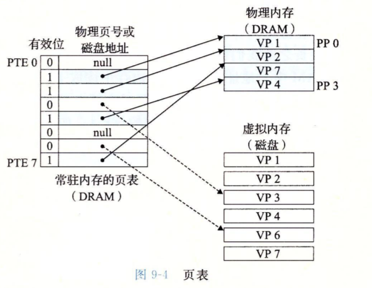

页表是页表条目（Page Table Entry）的数组，为虚拟内存中每个虚拟页（不论是否分配）都生成了一条记录，记录的格式为**有效位+对应的物理地址**。事实上，虚拟地址的格式就是由虚拟页号与其他信息组成，这样，通过虚拟地址，可以快速映射到对应的PTE条目，从而可以快速找到对应的物理地址，进而优化了全相联缓存需要轮询的缺陷（经典的空间换时间）。

注：还未被分配的虚拟内存页会被标注为null

这样，由页表引出的两个概念也很好解释了

#### 页命中

对于特定的虚拟内存地址，MMU快速索引到页表上，如果对应PTE的有效位为1，则证明物理内存刚好缓存了该虚拟页。因此直接对内存进行读写操作。

#### 缺页

顾名思义，就是页不命中啦。那么内核将通过算法，做以下几件事

- 计算出现在缓存在物理页中的**哪个虚拟页可以抛弃**，并**将该页的内容写回到虚拟内存**中
- 访问磁盘，将决定的**物理页中的虚拟页替换成目标虚拟页**
- 更新页表，将换进去的虚拟页的PTE**有效位与物理地址更新**，并**取消换出的虚拟页的有效位**

### 虚拟内存的好处

- 为每个进程提供独立的虚拟内存空间，让每个进程都以为自己在独占内存
- 方便内存的管理，尤其是在不同进程间共享数据时
- 方便内存保护，因为虚拟内存对地址通过页表进行了一次翻译，即虚拟地址要通过页表来确定具体信息，只要在页表中添加相关内容即可很容易地规范内存的访问

## Lecture17 Virtual Memory System

上面说了那么多，但是都只是一直止步于实现思路与概念的讲解。

这波，将正式进入虚拟内存系统，去了解其中的实现细节~

### 本节中出现的符号标记

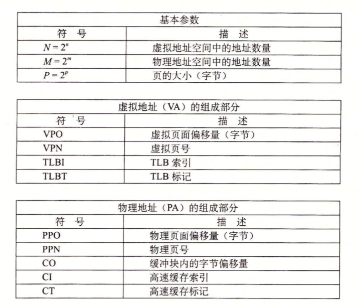

### 地址翻译

#### 虚拟地址的结构

一条n位虚拟地址可以分为两部分，p位的虚拟页偏移量（VPO，记录该地址在该页中的偏移位置）和n-p位的虚拟页号（VPN，通过该页号可以快速索引到页表中对应PTE的位置）。

#### 物理地址的结构

物理地址的结构与虚拟地址的结构大致相当，只是把虚拟页号改为了物理页号（PPN）。同时需要注意的是，因为物理页与虚拟页的大小完全相同，所以物理页偏移量与虚拟页偏移量完全相等。

#### 地址翻译的过程

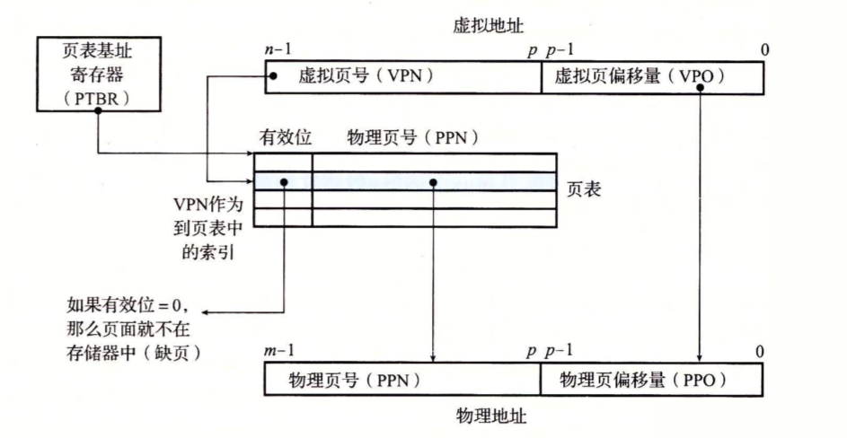

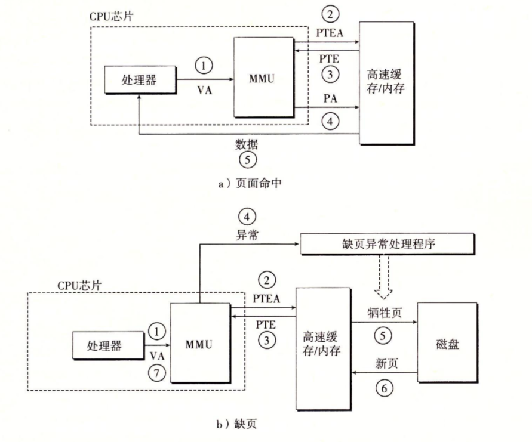

注意以下几点：

- 页命中的过程是由硬件负责，但缺页时需要异常处理程序来完成
- 访问内存之前，已经计算出了物理地址，因此对在CPU与内存之间的多级缓存并没有任何影响（缓存与物理内存都认物理地址）

### 翻译后备缓冲器（TLB）

虽然已经通过页表实现了虚拟内存与物理内存之间的快速映射，但是一些问题仍然存在。比如，每次访问页表，都需要到CPU的各级缓存甚至内存中去读取页表，这无疑带来了很大的时间浪费。

或者...为页表专门设置一个缓存？毕竟每条PTE可以由虚拟地址的前半部分（VPN）获得，即VA通过VPN与PTE一一对应，关系类似于地址，那么使用缓存也就可行了。

因此根据VPN建立索引与标记（TLBI与TLBT）即可利用局部性原理来优化读取。

这时候再看看VA的结构

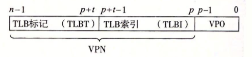

通过VPN可以轻松找到缓存中的PTE了！

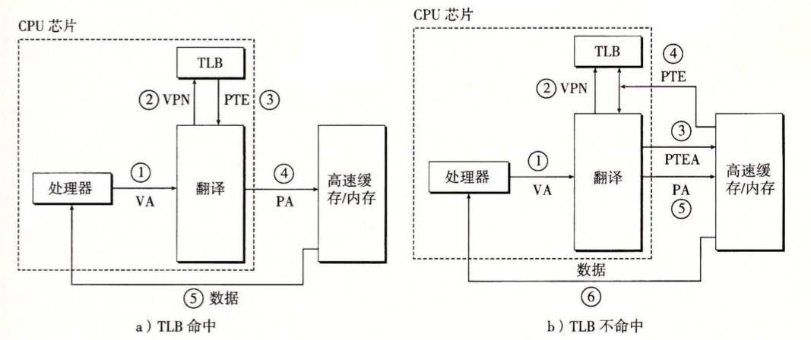

### 多级页表

这时候让我们来考虑一下页表的大小...

假设一个虚拟内存有32位的空间，即4GB的大小，一个VP的大小为4KB，一条PTE的大小为4B...

那么，我们将拥有1024^2^个虚拟页与同样数量的PTE...光是页表的大小就已经占用了4MB！

并且页表占用的空间与虚拟内存分配出去的空间大小无关，这将导致大部分PTE中的PPN为NULL！这对于空间无疑是一种浪费。

因此，我们尝试建立多级页表，一级页表中的数值部分指向下一级页表的基址，最后一级页表指向真正的PPN。这样，假设对于我们刚刚的虚拟内存空间，建立二级页表，其中一级页表将每1024个页（即4MB）的空间合为一个块，则二级页表和我们之前建立的页表规格相同。假设虚拟内存空间什么也没分配，我们仅仅需要记录1024个NULL（NULL下的二级页表因为没有分配而根本不存在），即4KB的空间！而就算全部分配，则将记录1024+1024^2^条PTE，占用4MB+4KB的空间，仅仅比使用单级页表多了4KB！明显这是一笔划算的交易。

下图是多级页表对虚拟地址的划分

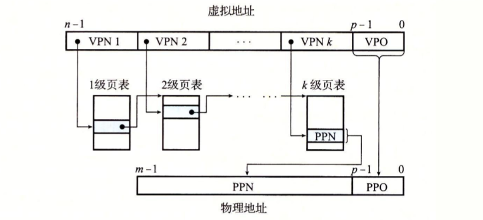

### 案例-端到端地址翻译

接下来，我们来看一个案例。

以下是虚拟内存系统的一个快照

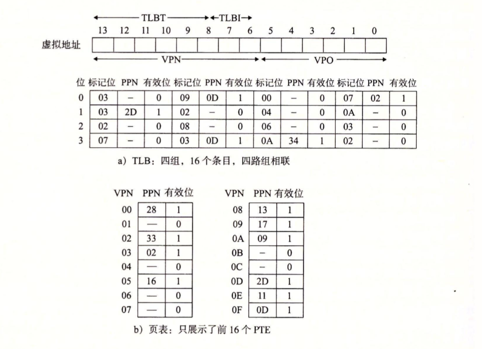

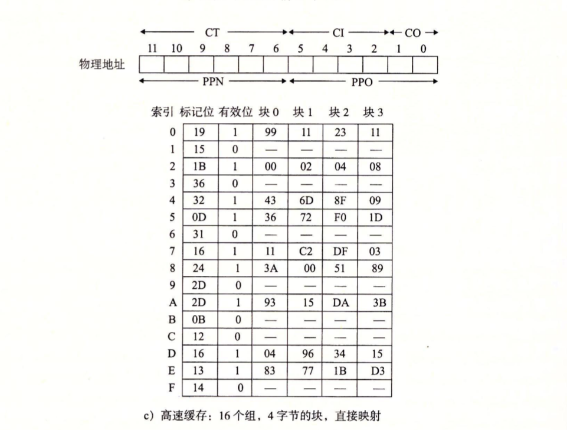

让我们来看看访问0x3d4虚拟地址的整个过程

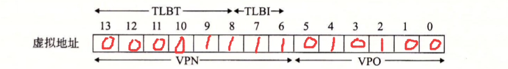

根据虚拟地址的TLBI与TLBT去TLB中查找

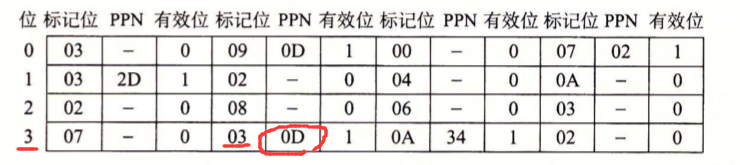

幸运地，我们在TLB中查找到了PPN的记录

由此生成PA（PPN拼接上VPO）

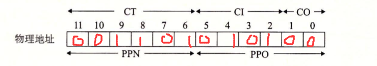

根据物理地址，去一级缓存中寻找

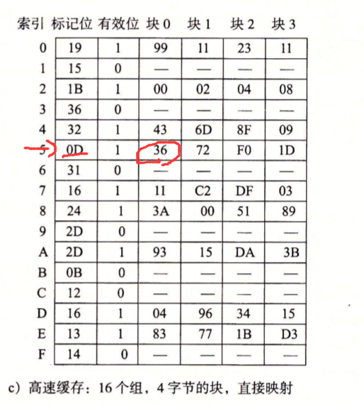

很巧地，CI定位到索引5，CT的十六进制恰巧为0xD，offset为0，访问到数值36！

**至此，我们已经了解过了一次虚拟内存系统中虚拟地址与物理地址的映射的细节了。再下一节，我们将看看Linux系统中对于虚拟内存的支持及实现。**

### Linux虚拟内存系统

#### 一张老图--Linux内存结构

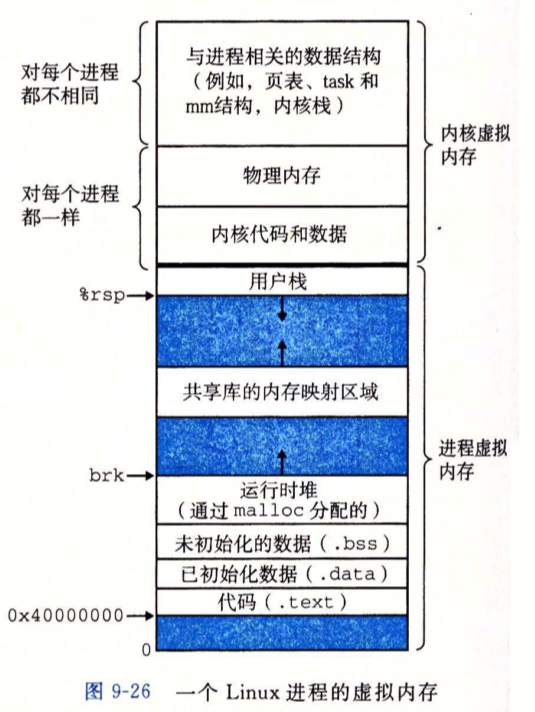

我们之前的一些疑问也有了答案。

- 这张图是物理内存真正的样子吗？很明显不是，它是Linux为每个进程提供的一个虚拟的地址空间的排布
- 内核代码和数据是每个进程都保留一份的吗？不是，它们存在内存中，页表让每个进程的相关VP指向了它们所在的PP中

#### Linux虚拟内存的概念

- **区域（段）**

	我们已经看到，在虚拟内存的分布中，它被分成块，存着不同功能的数据（并且有相当一部分是连续的，见链接那一章中readelf所读到的信息），每个这样的部分都是一个区域（段）

- **虚拟内存的数据结构**

我们已经知道，在缺页时，内核中会有Handler（异常处理程序）来重新读取虚拟内存中的信息。那么就需要有一个数据结构来辅助Handler来对虚拟内存进行操作（不然怎么知道该地址是否合法？怎么知道该地址是否可读？CPU中的程序完全有可能指向一个已经分配了、但是处在各个区域之间还未利用的部分的地址！），这就是虚拟内存的数据结构存在的意义。

下图展示Linux如何对虚拟内存进行组织


- **task_struct** Linux进程的结构体，其中存放着PID、程序计数器等信息，mm是其中一个指向mm_struct的指针
- **mm_struct** Linux虚拟**内存描述结构体**，它描述了整个虚拟内存空间的状态。其中pgd是指向第一级页表基址的指针，mmap指向vm_area_struct（虚拟内存段结构体）链表的头结点
- **vm_area_struct** Linux中描述一个区域的结构体，被组织成链表，用以描述整个虚拟内存空间中区域的分布，有以下几个成员需要注意（这里所说的地址都是虚拟地址空间中的地址！以及虚拟地址空间从下往上增长真的很反人类！跟一般的链表的begin和end是反过来的...）
	- **vm_end** 指向该区域的结尾
	- **vm_start** 指向该区域的开始
	- **vm_prot** 描述该区域的读写权限
	- **vm_flags** 描述该区域的一些其他信息（如是否与其他区域共享等）
	- **vm_next** 指向下一个区域节点的结尾地址

#### Linux对缺页异常的处理

了解了Linux虚拟内存系统的相关术语后，我们来看看Linux是如何使用相关数据结构和Handler对缺页异常进行处理的（软件参与的只有缺页的过程喔~）

Linux会进行如下判断

- 根据该地址是否合法（原理是遍历链表中的vm_start与vm_end，但是用树进行查找优化啦），选择是否触发一个段错误。（从Linux内存分布图中可以很容易看出各个区之间并不一定连续，因此自然会存在非法地址）

- 对该地址的内存访问是否合法。找到对应段后，根据vm_prot可以确定是否有权限访问，选择是否触发保护异常。
- 如果以上都合法，那么通过替换算法从物理内存中换出页，并将目标VP写入物理内存，并通知CPU重新执行读写命令。（ECF中已经讨论过啦~）

### 内存映射的相关概念

#### 内存映射是什么

我们之前都简单地认为，虚拟内存就是磁盘上的一块区域...但是，事实上，虚拟内存是操作系统软件给进程提供的一个假象，在虚拟内存与真实的磁盘之间，依然需要某种方式进行映射。

#### 内存映射的原理

我们已经知道，虚拟内存对应着磁盘上一块真实存在的空间。那么，作为软件的虚拟内存又是怎么和磁盘上的空间映射上的呢？这就是所说的内存映射（memory mapping）的过程。

内存映射，是将虚拟内存区域与磁盘上的一个"对象"对应起来...那么这里的"对象"又是什么呢？

对象的种类

- **Linux文件系统中的普通文件**

	一个区域可以映射到Linux文件系统中普通文件的连续部分（这真是一个奇怪的说法），例如一个可执行目标文件（那是否意味着，我们执行一个磁盘上的目标文件，其实并不是把它整个读入内存，而是新建一个虚拟内存区域并对应着它扣上去呢？）。文件会被分割成页大小的片，直到页面调度访问到它时，被加载到物理内存中。如果区域比文件大，则空余部分填0

- **匿名文件**

	匿名文件由内核创建，包含的全是二进制0。在访问这种页面时，物理内存会很聪明地不从磁盘中读取信息，而是直接把换出的PP上的值全部写0

  **这样有一个显而易见的好处...我们将文件加载到内存中，并不需要真的在磁盘中读写整个文件，而是将一块虚拟内存对应上去，在需要的时候通过类似缓存的机制进行加载**

#### 交换空间

一旦一个虚拟页面被初始化（映射到磁盘上的某个文件去了），它就在一个由内核维护的专门的**交换文件（swap file）**，交换文件也叫做**交换空间（swap space）**或**交换区域（swap area）**

交换空间会限制**当前运行**着的**所有进程**能分配的**VP总数**

### 内存映射对一些概念的解释

#### 共享对象

我们已经了解到，虚拟内存可以方便不同进程之间的数据共享。那么这是如何实现的呢？


我们加固一下内存映射的概念：**共享对象**是**磁盘**上的一个**文件**，进程1的**虚拟内存**将它的地址空间中的一个**区域**与该文件关联起来，完成了内存映射的过程

那么共享对象的概念就很好解释了，共享对象是两个不同的虚拟内存空间都将自己的共享区域（还记得堆区与栈区之间的share区吗）映射到了磁盘上同一个文件上（即共享文件）上了...

但是同样存在一个问题~那就是，如果一个进程把一个文件作为自己的共享对象，但另一个进程却把它当做私有对象，或是它们都把同一个文件作为自己的私有对象呢？（比如你曾经用不同的编辑器打开同一份.c文件，它们之间又是怎样的一个关系呢）

操作系统也对此给出了解决方案。

两个进程将同一个文件对象映射进自己的私有区域内，并共享私有对象的物理副本。


当两个进程都不进行写操作时，它们可以继续共享这个对象，但当它们试图写这块空间时，则会触发写时复制，在物理内存中新建一个副本（这个过程通过操作系统的Handler进行），并重新执行写操作...

#### fork函数

当fork函数被当前进程调用时，内核为新进程创建数据结构，分配PID。为了给新进程分配虚拟内存，它将原样复制当前进程的mm_struct（虚拟内存描述结构体），并为俩个进程的所有区域都标志了私有和写时复制，这样两个进程就不会互相干扰了（即之前实验中fork出的新进程并不改变原有进程中的变量值）

#### execve函数

execve函数会为当前进程重新加载执行的程序，我们来看看这个过程

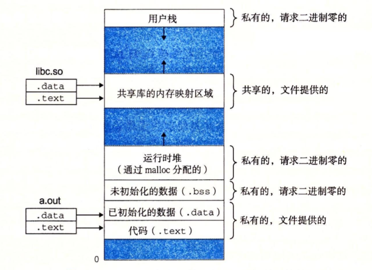

- 首先，加载器会删除已经存在的用户区域（内核区域依然会保留~）
- 接下来，加载器会为不同的区域重新映射物理对象（假设映射的是a.out这一可执行文件）
	- 首先，会将.text和.data映射到代码区（这些都是已经存在的物理对象）
	- 接下来映射匿名文件，如用户栈、运行时堆、.bss区域等。至于映射多大的匿名文件，a.out中会存储相关的数据
	- 最后映射共享文件，根据a.out中的数据，映射共享区域
- 最后一步是在task_struct中记录自己程序计数器的值，指向代码入口（从这里也能看到，其实CPU的取址阶段访问的也是虚拟内存耶~）

#### 用户级的内存映射函数

Linux进程可以通过mmap函数来创建虚拟内存区域，并把物理对象映射到其中

```c
#include "unistd.h"
#include "sys/mman.h"

//mmap函数原型，申请成功返回指向映射区域（VM中）的地址，出错返回-1（MAP_FAILED）
void* mmap(
    void* start,	//虚拟内存中该区域开始的地址（一般写NULL，由内核决定并返回）
    size_t length,	//该映射区域的长度
    int prot,		//访问权限
    int flags,		//该区域的一些信息
    int fd,			//文件描述符（一般就是文件名了吧）
    off_t offset	//映射区域开始时与文件起始位置的偏置值（按byte为单位）
);

/*
prot的可选值
	PROT_EXEC:意味着该区域的内容可以被CPU执行
	PROT_READ:意味着该区域可读
	PROT_WEITE:意味着该区域可写
	PROT_NONE:意味着该区域不可被访问（哈？？）
*/

/*
flags的可选值
	MAP_ANON:代表被映射的是一个匿名对象
	MAP_PRIVATE:被映射的是私有对象
	MAP_SHARED:被映射的是共享对象
*/
```

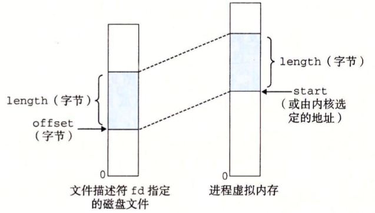

同样，我们可以通过munmap函数删除虚拟内存的映射区域

```c
#include "unistd.h"
#include "sys/mman.h"
//成功返回0，失败返回-1
int munmap(void* start, size_t length);
```

## Lecture18&19 Dynamic Memory Allocate

这一部分我们将学习动态内存分配的相关内容

在上一节中，我们了解了mmap与munmap函数，可以直接要求Linux系统进行内存映射，但是仍然显得麻烦。而C语言中提供的malloc等函数则要显得方便的多。

### 分配器

像malloc这样的函数就是调用了动态内存分配器进行内存分配。

分配器分为两种

- **显式分配器**  像malloc这样要求程序主动进行调用的就是显式分配器

- **隐式分配器**  像java这类语言会自动回收内存的，就是隐式分配器

分配器要能处理以下需求

- 处理任意请求序列（意味着分配器不能假设分配和释放请求的序列）
- 立即响应请求（意味着分配器不能对请求序列进行排序以优化新能等）
- 只使用堆（分配器使用的任何非标量数据结构都必须保存在堆里）
- 对齐块（八字节--双字对齐）
- 不修改已经分配的块

#### 碎片

以上需求带来了一些麻烦。

比如碎片...

- 内部碎片：分配器为了满足对齐等要求而多申请的空间（分配的大于最终用到的，就是内部碎片）

- 外部碎片：由于申请和释放的顺序并不确定，导致虽然空闲空间够，但是没有连续的足够大的空间用于分配（真的挺碎的...）

#### 隐式空闲链表

为了解决分配算法问题，我们采用了这样一个链表来描述堆空间

这个链表的节点有以下结构

- 头部32个字节将存放整个分配块的大小（也包括头部的喔）...但是由于八字节对齐，最低3位不是一定是0了么？我们把这三位利用起来，最低位用来存该块是否已经被分配（已分配位）
- 头部后面的就是有效载荷了~它代表了分配出去的空间真正会被使用到的部分，也是malloc函数最后返回的地址
- 最后一部分是填充，有时为了满足八字节对齐要求，需要加入这一部分

那么，为什么叫**隐式空闲链表**呢？

因为，通过遍历这个链表，我们可以得到

1. 每个空间的起始位置
2. 每个空间的块大小

这样，我们就**可以通过起始位置和块大小将每个块连在一起**了！

因此，它以一种特殊的链表的形式，存储着所有块的信息，自然是隐式**空闲链表**了

同样，作为链表它也需要一个终止标志，我们使用一个**已分配的大小为0的块**作为终止

#### 隐式空闲链表的放置策略

- **首次匹配**

  顾名思义，第一次匹配到了合适的块就马上分配，缺点在于放大块的时间增长，搜索时间变长

- **下一次匹配**

​		第一次匹配到的不算，放在下一次匹配的块上...这个看起来呆，但确实提高了分配效率，同时利用率低的可怜

- **最佳匹配**

​		对于隐式链表这种数据结构，搜索整个链表的代价不是一般的高，也不合适

#### 合并空闲块

对于空闲块同样需要合并，以免出现**假碎片**

合并策略有

- **立即合并** 一旦释放某块空间，立即判断是否需要合并块
- **推迟合并** 直到申请失败，再扫描整个链表判断是否需要合并

立即合并可能会造成抖动（刚合并又分配），因此快速的分配器大多选择推迟合并

#### 带边界标记的合并

我们可以快速合并当前块的后一个块，但是对于前面的块又该怎么办呢？

因为隐式空闲链表的特征类似一个单向链表，根本无法访问到前一个块！

Knuth提出一个解决方案...在节点结尾再加一个头部的副本，作为脚部...那样就可以实现双链表那样的操作了...（书上说这个很聪明...可是这个感觉起来很呆逼啊...）

### 实现一个简单的分配器

贴上代码

```c
#include "memlib.c"

#define WSIZE 4 //字长
#define DSIZE 8 //双字长
#define CHUNKSIZE (1<<12) //不懂，之后看

#define MAX(x,y) ((x)>(y)?:(x):(y))

#define PACK(size,alloc) ((size)|(alloc)) //方便头部或脚部打包

//读写一个字
#define GET(p) (*(unsigned int *)(p))
#define PUT(p,val) (*(unsigned int *)(p) = (val))

//从地址p中读取头部信息
#define GET_SIZE(p) (GET(p) & ~0x7)
#define GET_ALLOC(p) (GET(p) & 0x1)

//给一个首地址，计算出它的块的头部和脚部
#define HDRP(bp) ((char*)(bp) - WSIZE)
#define FTRP(bp) ((char*)(bp) + GET_SIZE(HDRP(bp))-DSIZE)

//给一个块地址，计算出下一个块或上一个块的首地址
#define NEXT_BLKP(bp) ((char*)(bp) + GET_SIZE(((char*)(bp)-WSIZE)))
#define PREV_BLKP(bp) ((char*)(bp) - GET_SIZE(((char*)(bp)-DSIZE)))

static char* heap_listp;

static void* coalesce(void* bp){
    size_t prev_alloc = GET_ALLOC(FTRP(PREV_BLKP(bp)));
    size_t next_alloc = GET_ALLOC(HDRP(NEXT_BLKP(bp)));
    size_t size = GET_SIZE(HDRP(bp));

    if(prev_alloc&&next_alloc) return bp;
    
    else if(prev_alloc&&!next_alloc){
        size += GET_SIZE(HDRP(NEXT_BLKP(bp)));
        PUT(HDRP(bp),PACK(size,0));
        PUT(FTRP(bp),PACK(size,0));
    }else if(!prev_alloc&&next_alloc){
        size+= GET_SIZE(FTRP(PREV_BLKP(bp)));
        PUT(FTRP(bp),PACK(size,0));
        PUT(HDRP(PREV_BLKP(bp)),PACK(size,0));
        bp = PREV_BLKP(bp);
    }else{
        size += GET_SIZE(FTRP(PREV_BLKP(bp)))+GET_SIZE(HDRP(NEXT_BLKP(bp)));
        PUT(HDRP(PREV_BLKP(bp)),PACK(size,0));
        PUT(FTRP(NEXT_BLKP(bp)),PACK(size,0));
        bp = PREV_BLKP(bp);
    }
    return bp;
}

//释放空间
void mm_free(void* bp){
    size_t size = GET_SIZE(HDRP(bp));
    PUT(HDRP(bp),PACK(size,0));
    PUT(FTRP(bp),PACK(size,0));
    coalesce(bp);
}

//扩展words大小的空间
static void* extend_heap(size_t words){
    char* bp;
    size_t size;

    //算一个双字对齐的size
    size = (words%2)? (words+1)/WSIZE :words/WSIZE;
    if((long)(bp=mem_sbrk(size)) == -1) return NULL;

    //初始化块的头和脚
    PUT(HDRP(bp),PACK(size,0));
    PUT(FTRP(bp),PACK(size,0));
    //重新添加一个结尾的头
    PUT(HDRP(NEXT_BLKP(bp)),PACK(0,1));

    //顺便看看bp前后有没有可以合并的
    return coalesce(bp);
}

//初始化空闲链表
int mm_init(void){
    //创建空堆，并判断是否成功
    //四个字，前一是空的，中间俩是序言,最后一个是堆尾
    if((heap_listp = mem_sbrk(4*WSIZE)) == (void*) -1){
        return -1;
    }
    //前一字写0,用来和堆尾凑双字对齐
    PUT(heap_listp,0);
    //中间俩字写序言的头和脚
    PUT(heap_listp+WSIZE,PACK(DSIZE,1));
    PUT(heap_listp+2*WSIZE,PACK(DSIZE,1));
    //堆尾写头
    PUT(heap_listp+3*WSIZE,PACK(0,1));
    //heaplistp放在序言中间
    heap_listp+=DSIZE;

    //为堆扩展CHUNKSIZE大小的空间 4MB
    if(extend_heap(CHUNKSIZE/WSIZE) == NULL) return -1;
    return 0;
}

//搜索合适的块
static void* find_fit(size_t size){
    char* bp = heap_listp;
    while(GET_SIZE(HDRP(bp)) != 0){
        if(GET_ALLOC(HDRP(bp))!=1&&GET_SIZE(HDRP(bp))>size)
            return bp;
    }
    return NULL;
}

static void place(void* bp,size_t asize){
    size_t oldsize = GET_SIZE(bp);
    PUT(HDRP(bp),PACK(asize,1));
    PUT(FTRP(bp),PACK(asize,1));
    PUT(HDRP(NEXT_BLKP(bp)),PACK(oldsize - asize),0);
    PUT(FTRP(NEXT_BLKP(bp)),PACK(oldsize-asize),0);
}

void* mm_malloc(size_t size){
    size_t asize;       //合适的size
    size_t extendsize;  //不合适的话需要扩展的size

    char* bp;

    if(size == 0) return NULL;

    if(size <= DSIZE){
        asize = 2*DSIZE;
    }else{
        asize = DSIZE*((size+2*DSIZE-1)/DSIZE);
    }

    if((bp = find_fit(asize))!= NULL){
        place(bp,asize);
        return bp;
    }

    extendsize = MAX(asize,CHUNKSIZE);
    if((bp = extend_heap(extendsize/WSIZE))==NULL){
        return NULL;
    }
    place(bp,asize);
    return bp;
}
```

这个代码有几个很明显的特点

- 使用宏函数简化
- 需要比较全面的安全考虑

值得以后照着注释多看看喔~

### 小记

除了隐式空闲链表写的显式分配器以外，还有显式空闲链表、隐式分配器等知识点，以后复习时候记得看~

## Lecture20 Network Programming Part I

### Socket编程中常用的函数

#### 大小端转换

TCP/IP协议中，规定了数据传输的**网络字节顺序**——**大端序**。因此，数据传输时经常需要对大小端进行转换。Unix提供了这样的函数。

```c
#include <arpa/inet.h>

//host to net long
uint32_t htonl(uint32_t hostlong); // 返回netlong(网络字节)

uint16_t htons(uint16_t hostlong); // 返回netshort

uint32_t ntohl(uint32_t netlong);

uint16_t ntohs(uint16_t netshort);
```

#### IP地址格式转换

IPv4地址常用点分十进制表示，常需要在点分十进制和数值之间进行转换

如：128.2.194.242 <=> 0x8002c2f2	（32位二进制，分为4个点分十进制，每8位即2位十六进制表示一个十进制）

Unix也提供了这样的点分十进制字符串与数值之间的转换函数

```c
#include <arpa/inet.h>

//p为”表示“的意思（数值）
//n为”网络“的意思（点分十进制）

//AF_INET代表IPv4协议，src是点分十进制字符串，dest是转化的数值的保存位置
//返回值：成功为1，src非法为0，出错为-1
int inet_pton(AF_INET, const char *src, void* dest);

//src是数值变量的地址，dest是字符串变量的地址，size是复制到字符串dest中的字符个数
//返回值：成功为指向点分十进制字符串的指针，失败为NULL
const char* inet_ntop(AF_INET, const void* src, char* dest, socklen_t size);
```

### 什么是Socket

**Socket**，即**套接字**，是互联网连接的一个端点

Socket有对应的地址，表示方式为  主机IP地址：端口号

则一个连接可以由两个套接字组成的二元组描述

客户端在连接时一般采用内核自动分配的**临时端口**，而服务端使用固定的**知名端口**，与提供的服务对应

连接案例：

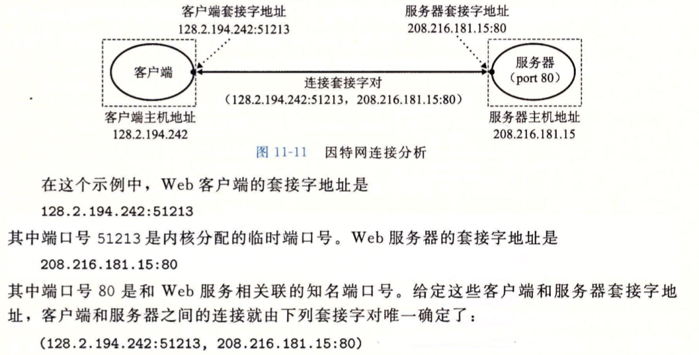

### Socket Interface

Unix为网络编程提供了套接字接口，下面是一般的编程逻辑

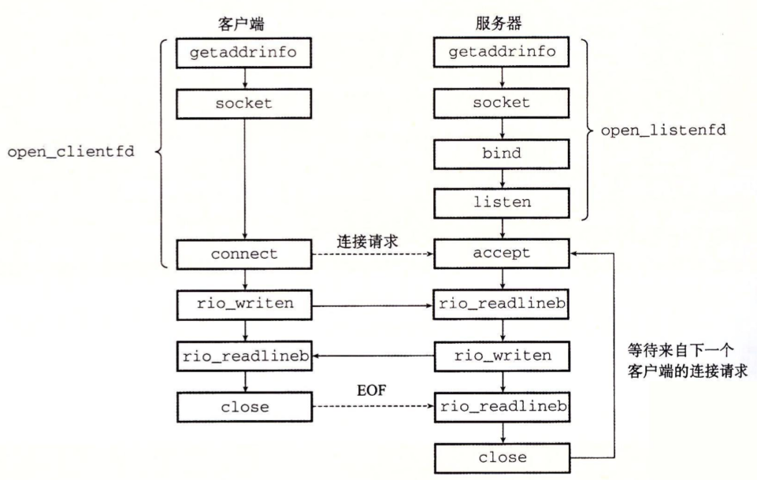

#### 套接字地址结构

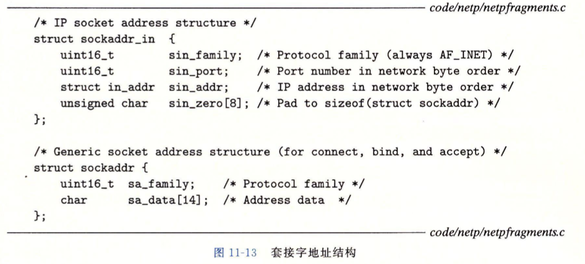

又学到了一个奇怪的操作！

操作系统负责连接的网络协议有许多种，因此需要一个通用的套接字地址结构，就是下一半的sockaddr结构体。而具体协议对应的socket结构体（如IP协议的sockaddr_in结构体）需要按通用套接字地址结构的方式实现，即可利用强制类型转换来获得通用套接字地址结构。

#### Socket函数

```c
#include <sys/types.h>
#include <sys/socket.h>

//返回值为套接字描述符（非负，本质上就是一个文件描述符），错误返回-1
int socket(int domain,		//socket的协议族（一般就是AF_INET,IPv4协议）
           int type, 		//socket的类型（一般是SOCK_STREAM，代表是一个端点）
           int protocol);	//写0就完事

/*
可以看到，这个函数至少在这里的调用方式十分固定...
因此常使用getaddressinfo函数自动生成参数
此外，返回的描述符并不完全打开，不能直接读写
*/

```

#### 打开文件

上文说到返回的描述符并不能直接读写，因此还要进行打开文件这一特殊步骤

打开的步骤取决于socket是作为client还是server

- **客户端**

```c
#include <sys/socket.h>

//成功则返回0，出错返回-1
int connect(int clientfd, //上一步中socket函数返回的套接字(文件)描述符
            const struct sockaddr* addr, //目标服务端的通用socket地址（一般用
            							 //getaddrinfo获取）
            socklen_t addrlen	//套接字有效长度
           );

//这个函数没什么好解释的，它会阻塞进程（一直卡在connet函数等它返回）~
//最后一个参数，是因为不同协议的socket长度并不一定一样长（总共留了14byte空间用来存data），因此需要知道有效的大小
//不过一般都调用getaddrinfo获取...这个盲猜是系统封装的
//客户端只要这一个函数就够啦
```

- **服务端**

```c
#include <sys/socket.h>
```

```c
//成功返回0，出错返回-1
int bind(int sockfd,
         const struct sockaddr* addr,
         socklen_t addrlen);
//和client的connect函数差不多呢~！
//（感觉这个函数命名要好得多啊...毕竟它们都是将套接字文件描述符与套接字地址”绑定（bind）“）
//不过注意一点~！这里的addr是和自己的用作服务的套接字绑定呢！
```

```c
//成功返回0，出错返回-1
int listen(int sockfd,int backlog);
//这个函数的功能也巨简单喔~
//不过是将自己的sockfd对应的文件设置成监听（那问题来了，这一步干嘛不放到bind里做呢）
//backlog是设置队列的最大长度（如果队列满了，那新来的请求就丢弃了）	
```

```c
//成功则返回已连接描述符，出错返回-1
int accept(
	int listenfd,	//已经转成listen的sockfd
    struct socketaddr* addr, //这里会填上客户端的socket addr！
    int* addrlen //同上同上~
);
/*
返回的是已连接描述符~！
服务端通过已连接(文件)描述符与客户端交互~
这样只用初始化一个socket就可以进行多次交互了~
accept同样会阻塞的~！
*/
```

#### getaddrinfo & getnameinfo

### 实现Socket编程的辅助函数

```c
#include <netdb.h>
#include <string.h>
#include <sys/socket.h>
#include <sys/types.h>
#include <unistd.h>

int open_clientfd(char* hostname, char* port) {
    int clientfd;
    struct addrinfo hints, *listp, *p；
    memset(&hints, 0, sizeof(struct addrinfo));
    hints.ai_socktype = SOCK_STREAM;
    hints.ai_flags = AI_NUMERICSERV;
    hints.ai_flags |= AI_ADDRCONFIG;
    getaddrinfo(hostname, port, &hints, &listp);
    for (p = listp; p != NULL; p = p->ai_next) {
        if ((clientfd = socket(p->ai_family, p->ai_socktype, p->ai_protocol)) <
            0) {
            continue;
        }
        if ((connect(clientfd, p->ai_addr, p->ai_addrlen)) != -1)
            break;
        close(clientfd);
    }
    freeaddrinfo(listp);
    if (!p) {
        return -1;
    } else {
        return clientfd;
    }
}

int open_listenfd(char* port) {
    int listenfd;
    int optval = 1;
    struct addrinfo hints, *listp, *p;
    memset(&hints, 0, sizeof(struct addrinfo));
    hints.ai_socktype = SOCK_STREAM;
    hints.ai_flags = AI_NUMERICSERV | AI_PASSIVE;
    hints.ai_flags |= AI_ADDRCONFIG;
    getaddrinfo(NULL, port, &hints, &listp);
    for (p = listp; p != NULL; p = p->ai_next) {
        listenfd = socket(p->ai_family, p->ai_socktype, p->ai_protocol);
        if (listenfd < 0)
            continue;
        setsockopt(listenfd, SOL_SOCKET, SO_REUSEADDR, &optval, sizeof(int));
        if (bind(listenfd, p->ai_addr, p->ai_addrlen) == 0)
            break;
        close(listenfd);
    }
    freeaddrinfo(listp);
    if (!p)
        return -1;
    if (listen(listenfd, 1024) < 0)
        return -1;
    return listenfd;
}
```

### 利用Socket+LiteIO实现一个简单的echo服务器

```c
//服务端代码
#include "../IO/LiteIO.h"
#include "./openfd.h"
#include "stdio.h"

#define maxLen 100

void echo(int connfd) {
    size_t n;
    char buf[maxLen];
    IoBuf myBuf;
    ioReadInitBuf(&myBuf, n);
    while ((n = ioReadnBuf(&myBuf, buf, 10)) != 0) {
        printf("server received %d bytes\n", (int)n);
        ioWriten(connfd, buf, n);
    }
}

int main(int argc, char** argv) {
    int listenfd;
    int connfd;
    socklen_t clientlen;
    struct sockaddr_storage clientaddr;
    char client_hostname[maxLen];
    char client_port[maxLen];

    if (argc != 2) {
        fprintf(stderr, "usage: %s <port>\n", argv[0]);
        return 0;
    }

    listenfd = open_listenfd(argv[1]);
    while (1) {
        clientlen = sizeof(struct sockaddr_storage);
        connfd = accept(listenfd, (struct sockaddr*)&clientaddr, &clientlen);
        getnameinfo(&clientaddr, clientlen, client_hostname, maxLen,
                    client_port, maxLen, 0);
        printf("connect to %s:%s\n", client_hostname, client_port);
        size_t n;
        char buf[maxLen];
        IoBuf myBuf;
        ioReadInitBuf(&myBuf, n);
        while ((n = read(connfd, buf, 10)) != 0) {
            printf("server received %d bytes\n", (int)n);
            ioWriten(connfd, buf, n);
        }
        close(connfd);
        printf("connect over %s:%s\n", client_hostname, client_port);
    }
    return 0;
}
```

```c
//客户端代码
#include "./openfd.h"
#include "../IO/LiteIO.h"
#include "stdio.h"

#define maxLen 100

int main(int argc,char** argv){
    int clientfd;
    char* host;
    char* port;
    IoBuf myBuf;
    char buf[maxLen];

    if(argc != 3){
        fprintf(stderr,"usage: %s <hostname> <port>",argv[0]);
        return 0;
    }
    
    host = argv[1];
    port = argv[2];

    clientfd = open_clientfd(host,port);

    ioReadInitBuf(&myBuf,clientfd);

    while(fgets(buf,maxLen,stdin) != NULL){
        ioWriten(clientfd,buf,strlen(buf));
        read(clientfd,buf,10);
        fputs(buf,stdout);
    }
    close(clientfd);
    return 0;
}
```

## Lecture21 Network Programming Part II

### Web基础

- **动态内容与静态内容**

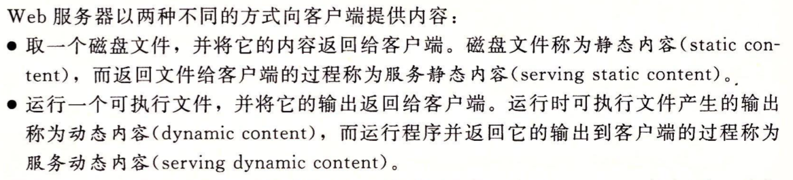

- **URL**


### HTTP请求

HTTP请求的基本格式

​	**请求行 + [0，n ]个请求报头 + 空行**

- **请求行**

> 请求行的组成为 **method + URI + version**
>
> 如：GET / HTTP/1.1
>
> GET为method，/ 为URI，HTTP/1.1是version


- **请求报头**

> 为服务器提供额外的信息，如浏览器的商标名或浏览器对哪些MIME提供支持
>
> 格式为： **header-name: header-data**

### HTTP响应

HTTP响应的基本格式

​	**响应行 + [0，n]个响应报头 + 空行 + 响应主体**

- **响应行**

响应行的组成为**version + status-code + status-message**

常见的响应状态码与状态信息

| status-code | status-message |               describe               |
| :---------: | :------------: | :----------------------------------: |
|     200     |      成功      |             处理请求无误             |
|     301     |    永久移动    | 内容已移动到location头中指明的主机上 |
|     400     |    错误请求    |          服务器不能理解请求          |
|     403     |      禁止      |       服务器无权访问请求的文件       |
|     404     |     未发现     |       服务器不能找到请求的文件       |
|     501     |     未实现     |        服务器不支持请求的方法        |
|     505     | HTTP版本不支持 |        服务器不支持请求的版本        |


- **响应报头**

> 提供了响应的附加信息，格式与请求报头差不多
>
> 常用的俩个是
>
> - **Content-Type** ：告诉客户端响应主体中内容的MIME类型
>
> - **Content-Length**：指示响应主体的字节大小