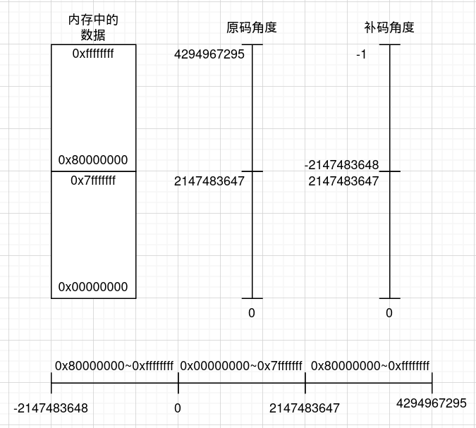

# 计算机体系结构

## 信息的编码与计算

### 信息的类型

在计算机中，信息分为两个类型

- 数值型，包括**定点数（有符号、无符号整数）**，**浮点数**
- 非数值型，通常是编码后有某些特殊意义的信息

因此，一般数值型数据会用来运算，非数值型通常只进行移动，通过某些算法处理后得到需要的信息

### 对数值型数据的解释

对于计算机中同样一串二进制串，如果作为数值型数据进行解析，有以下方面需要考虑

- **定点？浮点？** 仅用二进制串无法表示小数点的位置，因此只能通过IEEE规范约定。这样可以解释出两种数据（整形与浮点型）
- 对于整形，需要考虑是否作为**补码/原码/移码**

### 定点数的计算

#### 立即数到二进制串的映射

​	既然定点数在计算机中的表示可以解释为原码也可以解释为补码，那么计算机对于在高级语言或汇编语言中输入的立即数会如何编码？

​	可以看到，对于整个数轴，如果用32比特的二进制串来表示会得到如上的结果，立即数输入后编码就会按照上图所示的规律转为二进制

#### 指令对定点数计算的支持

​	而对于整型的计算，汇编中通常提供了这些指令（以RISCV32为例）

| instr type | instr                                                |
| ---------- | ---------------------------------------------------- |
| R-type     | add，sub，sll，slt，sltu，xor，srl，sra，or，and     |
| I-type     | addi，slti，sltiu，xori，ori，andi，slli，srli，srai |
| B-type     | beq，bne，blt，bge，bltu，bgeu                       |

​	可以看出，对于大部分指令，都**不考虑所谓的有符号/无符号**，都只是纯粹的位级运算；对于运算的结果，不同的解释也会得到不同的结果（但是至少有一点，原本被当作有符号/无符号的二进制串经过运算后得到的二进制串按原方式解释，运算结果会是正确的）

​	但对于部分涉及到比较的指令，也会特别提供无符号版本的指令（主要是为了区别后判断进行符号位扩展还是零扩展）

> **关于sub指令**
>
> ​	sub指令，即减法指令。处理器中并没有为减法指令配备特殊的减法器，sub指令通常是将减数转为对应的补码（经过反相器后加1）后再与被减数相加，即可得到二进制减法的结果

#### 溢出的处理

​	对ALU而言，发生溢出之后的处理十分简单，即只**取运算结果的低n位**（n为数据的长度），并设置相应的条件码

​	对于IA-32这类CISC，通常会有一个**条件码寄存器**用于存储ALU运算后的相关信息，但在一些**RISC中（如RISCV）中，则不设定条件码**

### 浮点数的表示与运算

​	对于计算机，如果不作任何规范，很明显无法表示出小数；因此[IEEE-754 in Lecture3 Floating Point](./CMU 15-213 CSAPP.md/#Lectur3-Floating-Point)对浮点数的表示作出了约定。

#### 加减运算

​	浮点数的加减运算只有一个原则，即**小阶向大阶看齐**（将阶码较小的浮点数的阶码改为和阶码较大的浮点数相等，同时调整尾数以保证值不变化），小数点对齐后再将尾数运算即可

> **为什么是小阶向大阶对齐？**
>
> ​	阶码越大则意味着表示范围的增大而精度下降，反之，阶码越小则表示的越精确但导致表示范围变小。阶码的变化体现在尾数的位移上，阶码变大，则尾数要相应右移变小以维持数值，*右移带来的精度损失要小于左移带来的精度损失（右移损失最低位，而左移损失最高位）*，因此采取小阶向大阶对齐的操作

#### 乘除运算

​	浮点数的乘除运算要简单许多，仅需要将尾数相乘（相除），阶码相加（相减）即可

#### 溢出

​	浮点数发生溢出的情况较定点数来说要复杂很多

- **发生阶码上/下溢出**： 代表浮点数的运算结果超出了能表示的范围
- **发生尾数溢出**： 由于尾数进位/借位而导致的溢出，此时需要对尾数进行右/左移处理（同时修改阶码），使得表示的值仍然正确