# 计算机网络

## 一、概论

在这一章节中，主要介绍计算机网络的模型，以及在计算机网络中探讨的一些术语

### 计算机网络五层模型

|         层次（从高到低）         | 功能                                                         |
| :------------------------------: | :----------------------------------------------------------- |
| **应用层**（如HTTP、FTP、DNS等） | 这部分协议的功能是**服务于具体的网络应用**的，如HTTP规范的是web程序交互的格式（请求与响应的格式等） |
|      **传输层**（TCP、UDP）      | 这部分协议的功能是在网络层实现端到端通信的基础上**实现host中具体进程间的通信**，TCP协议还同时保证了通信的可靠性 |
|         **网络层**（IP）         | 在链路层的基础上，实现了**端到端通信**                       |
|  **链路层**（以太网协议、WIFI）  | 实现了**相邻的点到点通信**                                   |
|            **物理层**            | 数模转换，将媒体中的数模信号进行互相转换                     |

### 互联网的结构

**Internet = Edge + Access + Core**

#### 互联网边缘

由**端系统**（host，或称为主机）构成，它们是互联网最外层次的端点，作为信息源

#### 接入网

接入网是一些链路，从端点出发并通过连接到ISP而接入到互联网核心

#### 互联网核心

由大量的交换机、路由器构成，它们作为计算机网络的中间节点，并不提供信息，只负责将信息转发到对应的端点（边缘）

### 交换方式

#### 电路（线路）交换

类似于电话线，通过建立一个稳定的、专用的连接从而实现端到端的通信。但是与计算机网络的实际情况并不吻合

- 计算机网络通常并不连续通信，而具有**突发性、短暂性**，使得建立、维护连接的时间开销相对大
- 计算机网络庞大而复杂，维护连接的难度很大
- 计算机网络的端点极多，线路交换这种专有的通信**容易阻塞**

#### 分组交换

是现有计算机网络体系所采取的交换方式。采用存储转发传输，通过发送PDU（协议数据单元），并在路由处排队转发，从而实现网络链路的尽可能的共享。但是也同样带来了一些负面的因素

#### 分组交换的缺陷

- **时延** 
	- 分组交换采取存储转发的方式，因此每次转发前都必须等上一个节点将所有的分组都发送完全后，才往下一个节点进行转发。这一段时间被称为**传输时延**，即发送/接收需要的时间
	- 每个中间节点接收到完整的分组后，都需要进行一些固定的操作（比如解封装获取目的ip、验证校验位等），这部分花费的时间称为**处理时延**
	- 分组到达中间节点并找到对应端口准备发送时，如果对应端口上还有未发送完的分组，那么需要在缓冲区内排队等候，即**排队时延**
	- 分组从节点发出到链路上后，需要一定时间才能到达下一个节点，这部分由电磁波及媒介的物理性质决定的时延称为**传播时延**
- **丢包**
	- 如果进入转发端口时，该端口的缓冲区已经满了，那么该数据包会被直接丢弃，即发生了丢包。因此，在网络层（IP协议）直接进行的通信的不具备可靠性的，需要更高层的协议提供保障

### 一些零散的知识点

#### 路由器与交换机

路由器的功能在于路由，它工作于网络层，能够通过IP协议转发信号。因此当一个媒体信号到达路由器时，会先向上解封装到网络层，再从发射端口封装到物理层

交换机的功能在于连接多个端点，工作于链路层，并不区分不同IP的转发，而是无条件向所有端口转发，因此只需要解封装到链路层

#### ISP层次

**ISP**，即Internet Service Provider，网络服务提供商

最初的ISP一般只能负责到一定区域内，因此出现了想专门在大范围内提供互联服务的全球ISP（Global ISP），但是由于竞争出现了多家全球ISP，它们之间进行合作，通过IXP这样的公益组织互联，并提供服务给下一层次的ISP（region ISP，地区ISP），最后达成了全球互联的现状

#### PDU

PDU，即**协议数据单元**，是同层协议之间进行数据交换的基本单位。不同协议的PDU有着不同的规范和名称。

- **应用层 -- 报文（Message）**

- **传输层 -- 报文段（Message Segment）**
- **网络层 -- 数据报（Datagram）**
- **链路层 -- 帧（frame）**

#### 协议与服务

在计算机网络的层次结构中，下层协议通过SAP（SERVICE ACCESS POINT，类似于接口）向上层协议提供服务（SERVICE）。协议是计算机网络中同一层次的部分进行交互的规范，服务是下层协议对上层协议的支持。

## 二、应用层

### 应用层协议原理

#### Socket原理

在调用系统调用Socket之后，操作系统会根据参数建立一个Socket，并返回一个描述符

Socket可以描述一个连接（尤其是对于TCP等面向连接的传输层协议来说）

Socket的基本目的就是，**减少从应用层通过SAP到传输层的数据量**

如果没有Socket，那么每次要进行传输的数据是：

- 对TCP而言，四元组（host，port，host，port）
- 对UDP而言，二元组（host，port）

而使用Socket之后，操作系统会为连接建立一个**本地**的Socket表，记录Socket描述符与对应的数据，这样从应用层流向传输层的数据量大大减小（只用一个描述符就可以找到对应的连接）

ps：很典型的时间（查表时间）换空间（传输数据量）呢~

#### 传输层协议的选取

- 对于**可靠性要求高**的---TCP
- 对于**时间敏感**的---UDP

- **安全性**---TCP的改良版本，SSL

#### 应用层协议的一点思考

在计算机网络的各种协议中，应用层协议是最多的，并且也是最“软”的

因为它只规定了网络应用程序之间如何交换信息...而如果你的服务器和客户端并没有公共需求的话...

ps：公共需求就是说同类型的客户端或者同类型的服务器都可以访问

那你完全可以搞一个自己专用的“私有协议”...事实上很多公司已经这么干了...

在应用层中，只是浅浅了解一些协议的规范，仅此而已

（比如所有的web客户端（浏览器）都可以访问所有的web服务器（不管它是哪家公司的）...）

### HTTP协议

#### WEB原理

Web很大程度依赖于HTML这一“超文本描述语言”

HTML最好的地方就是，可以互相连接

因此在Web应用中，常常有一个“**HTML基本文件（Base HTML）**”，HTML基本文件中又包含了多个链接到其他文件的超链接

浏览器在接收到HTML基文件后，绘出基本框架，再向服务器请求基本文件中包含的其他文件，继续绘制到页面上

**HTTP协议需要至少三次握手，第一次是C发出TCP连接请求，第二次是S发出连接响应，第三次是C发出请求报文**

#### 持续性连接与非持续性连接

- **持续性连接**  在TCP连接建立后可以处理多条请求，并可以设置一段时间内没有收到请求则关闭连接
- **非持续性连接**  每个TCP连接只接收一个请求，响应后立马断开

**注** HTTP/1.0只支持非持续性连接，**HTTP/1.1可以设置连接方式，通过请求头Connection: close/keep-alive**

#### 报文的结构

行 + 多个头 + 空行 + 实体体

##### 对请求而言

**请求行**：**[method url version]**  如：GET  /  HTTP/1.0

-  **method（请求方法）**

> - **GET** 一般请求，没有实体体（也可以在URL中加入请求参数）
> - **POST** 提交请求，一般将提交内容放在实体体里
> - **HEAD** 与GET一致，但是服务器只返回响应头而不放回实体体（debug用）
> - **PUT** 上传请求
> - **DELETE** 删除请求，要求删除url位置的内容

**请求头**：**[param: value]** 如：Connection: close

> - **Host** 标识访问的主机（在代理服务器中有用）
> - **Connection** 选择持续连接或非持续连接
> - **User-agent** 客户端浏览器类型
> - **Accept-language** 客户端语言类型

##### 对响应而言

**响应行** ：**[version status-code short-message]**，具体规则见[CSAPP笔记](../计算机体系/CMU 15-213 CSAPP.md)

**响应头**：**[param: value]**

> - **Connection** 连接类型
> - **Date** 该报文的发送时间
> - **Server** 服务器软件类型
> - **Last-Modified** 该文件最后修改时间
> - **Content-Length** 响应体长度
> - **Content-Type** 响应体文件类型

#### Cookie

Cookie是一种机制，由Server分配，并由浏览器本地维护，这样即可根据Server在后端维护的cookie表在http协议上建立一个**状态层**，记录用户的行为。


#### WEB缓存

还记得在硬件中学过的计算机缓存吗？

WEB应用中同样有这样的机制——用一台"**缓存服务器**"或者叫做"**代理服务器**"即可实现

WEB缓存的**根本目的**是**减少接入链路的压力**，每台机构网络内部的计算机访问**初始服务器**时，都先请求一下机构**缓存器**，这样带来的好处是，并不是所有流量都流向接入链路，而是根据缓存器的命中概率减少。

（比如命中概率是50%，那么接入链路的压力就减小了50%！）

因此**在接入链路带宽太窄而导致的延迟情况下，比起物理增大带宽，增加一个缓存服务器是更好的选择**！

在计算机的物理缓存中，存在着多种读写机制（换取块的算法、写回/直写策略等），但在WEB缓存器这里，就无法做到类似的机制了（因为对服务器的请求来自各种地方，并不是都经过该缓存器，就是这一点不同导致了它无法和计算机存储结构一样工作），因此增加了一个**条件GET**方式，来**记录是否需要更新"块"**，条件GET就是在请求头中多加一个 **If-modified-since**请求头，这样服务器就可以根据请求头中的信息（包含最后一次更新时间）决定是否要发送更新版本的实体体了

> 那么，**WEB缓存**与我们上文中提到的**请求头中的host**有什么关系呢？很明显，给缓存服务器用的嘛~！不然缓存服务器怎么去找对应主机嘞！

### SMTP

**异步通讯，即两方不需要同时在线也可以完成交互工作**

换句话说，就是电子邮件啦

很明显其中需要服务器的参与，毕竟肯定要有个什么东西一直在线

问题那么需要多少台服务器呢？如果只有一台服务器，那么交流就只能在这台服务器下的客户可以进行交流

而邮件系统是不受这种限制的（QQ邮箱也可以发到网易邮箱）

所以，肯定有许多台一直保持在线的服务器

这些服务器之间进行交互的协议，就是**SMTP（simple mail transfer protocol）**

#### 邮件交互的原理

个人的主机上有邮件客户端，邮件客户端通过与邮件服务器交互（可以通过SMTP也可以通过HTTP等其他协议）将报文交给邮件服务器（一般包含发件方和收件方的地址加上报文）

邮件服务器接收到客户端传来的数据后，将报文放入邮件队列中，用SMTP报文向另一台邮件服务器发送信息

另一台邮件服务器接收后将根据报文信息将邮件整入维护的用户邮箱中（每个用户都有一个喔）

用户再用客户端拉去邮箱里的邮件（可以通过很多协议（HTTP、POP3、IMAP等））

#### SMTP简介

SMTP协议是一个**基于TCP的**、**持续连接的**应用层协议

SMTP服务器交互的过程为

- TCP连接
- 握手（传递信息）
- 传送（发送报文）
- 如果还有报文，则再握手传送
- 没有报文则关闭连接

因此一个TCP连接可以传输多条报文，是持续连接的协议

#### SMTP握手

- Client: HELO xxx
- Server: 250 + message
- Client: MAIL FROM: <ADDRESS>
- Server: 250 + message
- Client: RCPT TO: <ADDRESS>
- Server: 250 + message
- Client: DATA
- Server: 354 + message
- Client: （报文信息，以\r\n.\r\n结尾）
	- xxxxxxxxxxxxxx
	- xxxxxx
	- .
- Server: 250
- Client: QUIT
- Server: 221

可以看到SMTP握手过程中传输了邮件的来源和去路，握手结束后再输入报文

#### SMTP报文格式

> //首部
>
> From: Address
>
> To: Address
>
> Subject: xxxxxx
>
> //空行，首部和报文体的分隔
>
> Content

#### 与HTTP协议的对比

- SMTP是一个推协议，而HTTP是拉协议（SMTP的连接发起方是发送数据的一方，而HTTP是客户端，即拉取数据的一方）
- SMTP强制要求用7-bit ASCII码格式编码报文
- SMTP把所有对象都编码后放入同一个报文中（包括图片、视频等），而HTTP采用链接的方式另外拉取（得益于HTML）

### DNS（域名系统）

DNS是一个**由分层的DNS服务器实现的分布式数据库**，同时是一个使得主机能够查询该数据库的**应用层协议**，运行在**UDP**之上，使用**53号端口**

#### DNS提供的服务内容

- **IP与域名之间的转换**
- 主机映射多个域名（主机别名）
- 邮件服务器别名
- **域名映射多个主机（负载分配）**

#### DNS服务原理

- DNS是由很多DNS服务器组成的，大体分为**根DNS服务器、顶级域DNS服务器（TLD）、权威DNS服务器**
- 每个ISP都有自己的**本地DNS服务器**，用来作缓存与查询

查询过程：

1. 主机向本地DNS服务器发起请求
2. 本地DNS向根服务器发起请求，得到TLD的IP
3. 本地DNS向TLD发起请求，得到权威DNS服务器的地址
4. 本地DNS向权威DNS请求，得到主机发起请求的IP
5. 向主机返回IP

可以看到，过程极为繁琐，好在有DNS缓存这种东西，存储了一段时间内的DNS查询的记录结果，大大减少了查询的复杂度

**ps：如果有多台本地DNS服务器，将在本地DNS范围内采用递归查询，反之迭代查询**

#### DNS记录

域名与IP的映射记录在DNS条目（资源记录（RR））中，格式如下

（Name，Value， Type， TTL）

**Name是域名**

**Value是IP**

**Type是类型说明**

TTL是有效截止时间（超过TTL，服务器将删除该条缓存记录）

| Type | Name | Value            |
| ----- | |---------------- |
| **A** | **主机域名** |**域名对应的IP地址** |
| **NS** | **域** | **能查询到该域的权威DNS的IP** |
| CNAME| 主机别名 | 主机规范名 |
| MX    | 邮件服务器别名 | 邮件服务器规范名 |

#### DNS报文

```
  DNS format

  +--+--+--+--+--+--+--+
  |        Header      |	头部，12byte
  +--+--+--+--+--+--+--+
  |      Question      |	问题区域
  +--+--+--+--+--+--+--+
  |      Answer        | 	回答区域
  +--+--+--+--+--+--+--+
  |      Authority     |	权威区域包含其他权威服务器的记录
  +--+--+--+--+--+--+--+
  |      Additional    |	附加区域包含额外信息
  +--+--+--+--+--+--+--+

```

```
  Header format 头部格式

    0  1  2  3  4  5  6  7  0  1  2  3  4  5  6  7
  +--+--+--+--+--+--+--+--+--+--+--+--+--+--+--+--+
  |                      ID                       |	ID，由客户生成，作为标识符
  +--+--+--+--+--+--+--+--+--+--+--+--+--+--+--+--+
  |QR|  opcode   |AA|TC|RD|RA|   Z    |   RCODE   |	标志，存某些设定
  +--+--+--+--+--+--+--+--+--+--+--+--+--+--+--+--+
  |                    QDCOUNT                    |	问题数
  +--+--+--+--+--+--+--+--+--+--+--+--+--+--+--+--+
  |                    ANCOUNT                    |	回答数
  +--+--+--+--+--+--+--+--+--+--+--+--+--+--+--+--+
  |                    NSCOUNT                    |	权威RR数
  +--+--+--+--+--+--+--+--+--+--+--+--+--+--+--+--+
  |                    ARCOUNT                    |	附加RR数
  +--+--+--+--+--+--+--+--+--+--+--+--+--+--+--+--+
  
```

> 对标志的一些解释
>
> - QR 标识是请求还是响应
> - opcode标识查询方式
> - AA标识授权回答（由服务器设置）
> - TC标识报文已经被截断
> - RD表示期望递归
> - RA标识是否支持递归查询
> - Z是保留值，还没用
> - RCode为0标识查询没有出错，否则为错误码

```
  Question format 问题部分格式

    0  1  2  3  4  5  6  7  0  1  2  3  4  5  6  7
  +--+--+--+--+--+--+--+--+--+--+--+--+--+--+--+--+
  |                     ...                       |
  |                    QNAME                      |  域名
  |                     ...                       |
  +--+--+--+--+--+--+--+--+--+--+--+--+--+--+--+--+
  |                    QTYPE                      |	协议类型
  +--+--+--+--+--+--+--+--+--+--+--+--+--+--+--+--+
  |                    QCLASS                     |	查询的类
  +--+--+--+--+--+--+--+--+--+--+--+--+--+--+--+--+

```

```
  Answer/Authority/Additional format 响应\权威\附加部分格式

    0  1  2  3  4  5  6  7  0  1  2  3  4  5  6  7
  +--+--+--+--+--+--+--+--+--+--+--+--+--+--+--+--+
  |                    NAME                       | 资源记录包含的域名
  +--+--+--+--+--+--+--+--+--+--+--+--+--+--+--+--+
  |                    TYPE                       |	DNS协议的类型
  +--+--+--+--+--+--+--+--+--+--+--+--+--+--+--+--+
  |                    CLASS                      |	RDATA的类
  +--+--+--+--+--+--+--+--+--+--+--+--+--+--+--+--+
  |                    TTL                        |	记录可以缓存的时间
  +--+--+--+--+--+--+--+--+--+--+--+--+--+--+--+--+
  |                    RDLENGTH                   |	RDLENGTH记录RD的长度
  +--+--+--+--+--+--+--+--+--+--+--+--+--+--+--+--+
  |                    RDATA                      | 表示记录，根据类型来定
  +--+--+--+--+--+--+--+--+--+--+--+--+--+--+--+--+


```

### P2P网络应用

P2P，即Peer to Peer，各个用户之间是**对等的关系**，既提供服务，也接受服务

#### P2P应用类型

- 非结构化P2P
	- 集中化P2P
	- 完全分布式P2P
	- 混合P2P
- 结构化P2P（DHT，基于分布式HASH表的P2P）

#### 非结构化P2P

非结构化P2P允许任意两个节点之间构成邻居（overlay）关系，形成一个逻辑上的网络，以达到共享资源的目的

> **集中化P2P**
>
> 集中化P2P，即拥有一个中央服务器来管理所有节点的拥有资源、是否上线等信息
>
> 客户端在查询资源时，向中央服务器发起请求，中央服务器返回查询到的资源结果，并将拥有资源的IP返回给客户端，客户端再向目的IP发起请求，获取资源
>
> 这样的缺点是
>
> - 单点故障，如果中央服务器宕机则整个系统遭到破坏
> - 性能瓶颈，中央服务器虽然不用处理文件传输，但是仍然要负担查询的工作
> - 中央服务器容易触犯到版权等

> **分散式P2P**
>
> 分散式P2P完全不需要中央服务器，通过泛洪查询来工作
>
> 客户端在启动时，会先根据程序预先记录好的一部分长时间在线的节点，发起请求；同时，响应的节点还会向所有邻居转发请求。所有接收到请求的节点都返回一个响应，根据响应，客户端随机选择一部分节点作为邻居，正式加入该overlay
>
> 在发起查询时，客户端向所有邻居节点发起请求，邻居节点递归地向所有邻居节点发起请求，直到查询有结果后返回给发起方（泛洪查询），查询可以很快地遍布整个逻辑网络
>
> 这样带来的问题是，泛洪可能导致洪水...一个查询请求在逻辑网络中一直无法消散...解决方案是
>
> - 采用TTL方式，记录泛洪递归次数，自动抹除（与路由器防止成环的方式一样）
> - 采用记录的方式，每个节点记录自己转发过的请求，再次接收则不用转发（DFS作标记的方式）
>
> 如果有用户下线，则通知所有邻居，邻居再次随机选择节点补入位置，以维持网络的鲁棒性
>
> 可惜分散式P2P由于一部分技术原因并没有取得很好的应用

> **半分散式P2P**
>
> 半分散式P2P结合以上的两种方式，将用户分成逻辑网络块，块内由中央服务器管理，块外（服务器之间）通过泛洪查询解决
>
> 这样的方式非常物理网络中交换机的工作方式

#### 结构化P2P

结构化P2P采用一些特定的拓扑结构（如树、环等）组织逻辑网络，使得每个客户端不需要重复存储副本即可快速定位到请求的资源

#### P2P案例——BitTorrent

- **洪流**

	在BitTorrent中，**参与分享同一个文件的所有客户端集合**被称为洪流

- **文件块**

	BitTorrent将文件分为许多的、长度固定的块（一般为256KB），作为客户端之间互通有无的基本单位

- **Tracker服务器**

	该服务器维护了所有正在执行分享的洪流的信息（包括分享的文件的描述、Hash值等）

> **BitTorrent运行原理**
>
> - 一个客户端，首先通过查询Tracker服务器，根据关键字得到洪流的信息，并加入洪流中
> - 它将生成一个bitmap（标志映射），记录自己是否拥有文件中的某个块
> - 随后，它随机请求洪流中的其他客户端，获取四个随机块，并更新自己的bitmap
> - 接下来，它会根据**最稀缺优先原则**，去请求整个洪流中最稀缺的块（拥有用户最少的块），同时用已经拥有的块为其他用户提供服务
> - 提供服务的原则是，先在前几个周期，选择之前对它**提供优质服务的客户端，优先服务**，再之后选择与自己之间的**连接带宽最高的用户**进行服务
> - 直到所有的块接收完成，客户端可以选择下线或是继续留在洪流中

关于BitTorrent好处的思考

- **最稀缺优先原则** 通过优先请求最稀缺的块，一方面使得该块在当前洪流中的稀缺程度降低，维护了该逻辑网络的稳定性，同时使得自己被请求的概率加大，之后得到优先服务的可能性更高

- **选择连接带宽最高的用户**可以使得用户之间的关系更有灵活性（不会产生抱团，即快的很快，慢的一直排不上的等情况），同时该用户还是潜在的能为自己提供优质服务的用户（带宽高，传输速度快）

### CDN（内容分发网络）

#### 流与HTTP

传统的HTTP请求流文件时，也是将内容塞在报文里整个发送过去，而客户端程序在还没传输完成时，就按一定速率读取文件，带来了一些问题（比特率无法选择）

后来改进成为一个服务器上存放多个副本，用户可以选择接收比特率高还是比特率低的副本，但是还是有问题（看一半，停止接收，换成另一个比特率，又得重新从头接收了）

最后改进出了**DASH**（基于HTTP的动态适应性流），所谓动态，就是把整个流文件分成了小块，用户请求的时候每次只请求长度为几秒的视频

#### 内容分发网

可是，服务器总有一个位置，频繁的HTTP请求在链路层跳来跳去，一方面有比较大的时间延迟，另一方面...ISP要根据流量收费！！！同样的内容却大量经过接入链路传输，这是服务器拥有者所不希望看到的

因此，组建出了**内容分发网络**，通过在各地多搭几台服务器，为特定区域的客户提供服务，以此来提高用户体验与省下ISP的钱

内容分发网络可以是专用的，也可以是第三方的，流媒体公司可以向CDN提供商购买服务来部署流媒体服务

#### 内容分发网的实现

内容分发网需要做到

- 截取到客户对原网页的请求
- 通过算法，用最合适的服务器提供服务

毫无疑问，这里肯定关系到DNS服务了

1. 你通过一个流媒体提供的网页（比如bilibili）点开了某个视频
2. 网页链接到了另一个域名下（与当前网页的服务器很可能不是同一个喔），为此你必须向本地DNS服务器请求
3. 本地DNS服务器接收到请求，转而通过DNS服务请求到了对应的权威DNS服务器
4. **权威DNS服务器通过某些特定标识（比如Video等），并不直接返回对应IP，反而返回一个域（这个域就是CDN中央服务器的ip）**
5. 接到域IP后，本地DNS向CDN中央服务器发起请求，中央服务器根据本地DNS服务器的信息，返回最合适的服务器IP

综上，内容分发网络通过权威DNS服务器截断了请求，并转发到自己的中央服务器提供服务

### TCP/UDP Program实践

本课程采用python作为实例语言，我会拿来与C作一个对比

#### UDP_Program

##### **Client**

```python

```

##### **Server**

```python

```

#### TCP_Program

##### **Client**

```python

```

##### **Server**

```python

```

## 三、传输层

### 传输层的定位

- **逻辑地**为应用层进程**提供进程到进程间的连接、提供以报文为单位的通讯**（通过**层间接口（SAP）**）
- 传输层在接收到上层报文后，**整合报文**（太长则分段，太短则组合）后形成本层的PDU（Protocol Data Unit（协议数据单元））—— **报文段**，在传输层中以它为**基本单位进行传输**
- 同样，传输层在接收到同层传来的数据后，**对段进行处理（排序、去除本层的头部等）**，再**以字节流（TCP）或数据报（UDP）的形式交给应用层**
- 在传输层之下，是网络层，网络层提供的是**尽力而为**的**端到端**的**分组传输（分组是IP协议的PDU）**

> **总而言之，传输层在网络层的基础之上，多做了两件事**
>
> 1. **通信由主机到主机精确到了进程到进程（通过在源端多路复用和目标端解复用，即多个进程共用同一个传输层实体进行通讯）**
> 2. **（TCP）在网络层提供的不可靠的服务上，实现了可靠数据传输**
>
> **注意：TCP与UDP都不提供带宽保证与延时保证！**

### 多路复用与解复用

多路复用与解复用是通过多存一个端口信息来实现的，并通过Socket（套接字）来实现尽可能减少透过层间接口的信息量

#### Socket表

操作系统维护了一个socket表来记录会话信息

- **TCP**  记录了 Socket描述符，源IP，目标IP，源端口，目标端口，PID
- **UDP**  记录了Socekt描述符，源IP，源端口，PID

这样，应用层只需要记录Socket描述符，即可向传输层传递对应的信息

#### TCP的复用与解复用

- **复用**  应用层给TCP传递的信息有：SocketFd，Message（报文/数据），TCP通过找系统即可得到具体信息，并把报文封装成为**TCP数据段**，格式为**源端口+目标端口+Message**，再向下一层（网络层，IP协议）提交信息时，提交源IP与目标IP
- **解复用**  TCP接收到一个TCP数据段与IP数据，通过**源端口、目标端口等字段匹配到对应的进程**（PID），再**将Message交给对应的应用层进程**

**很容易观察到一点，就是层与层之间通信，从上往下和从下往上给的东西都是一样的！比如传输层与网络层之间，传输层给下去的是"网络层头部需要的信息"+"传输层想要传输的信息"，即IP信息与数据段，那么网络层最终回给传输层的也是IP信息与数据段**

（这个非常之好理解，那么问题来啦，UDP呢？UDP可不记录目标IP与目标端口，它又怎么实现多路复用和解复用呢）

#### UDP的复用与解复用

UDP其实挺呆滞的...它与TCP的区别只是，目标端口与目标IP不与Socket捆绑，而是直接通过层间接口送到传输层。

传输层接收到信息后，也会组织起一个PDU——**数据报**，它的格式大体与TCP数据段相似，也是**源端口+目标端口+Message**（还有一些长度信息等与TCP不一样），并将IP信息与PDU一起给到网络层

UDP接收到数据报后，与TCP相似地，通过Socket匹配到当前正在守候的进程的PID，并将Message给出

#### 对比思考

UDP与TCP的PDU格式非常相似，而他们的主要区别似乎就聚集在了Socket记录数据的不同上

TCP的Socket记录了双方的信息，而UDP只记录了自己的

这似乎表示，**TCP的Socket所描述的是一个会话，而UDP的Socket描述的只是本地的进程**

另一个问题也出现了，TCP在应用层接收到信息后，可以通过Socket描述的会话进行反馈

那么UDP如何进行反馈呢？对UDP来说，至少报文来源不是通过Socket确定的


### UDP协议

#### UDP的特点

- 从应用层来看，对发送的数据与何时发送的控制更加精细（UDP，用户数据报协议，本身对IP协议（互联网数据报协议）的封装内容更少，因此可以实现更精细的控制）
- **无需连接建立，也不维护连接状态**，这是UDP与TCP最大的区别之一。UDP的无连接表现在：Socket只记录本地端口与本地IP，而不记录连接另一端的主机IP与端口号，应用层无法通过这一层（Socket）来实现与连接的另一端交互，但是可以通过该层的接口零散地获得源IP地址与源端口号，而不像TCP一样直接通过Socket来维护连接（TCP通过SocketFd即可发送）。因此，是否返回数据或返回什么数据，完全由建立在UDP协议上的应用层协议来控制。
- 分组首部开销小

#### UDP的缺点

- 对网络层不友好。它不对路由流量作控制，只负责发，容易造成拥堵，造成大量的分组溢出
- 同时，这一特点还容易挤垮TCP协议的服务

#### UDP报文结构

| 数据           | 大小 |
| -------------- | ---- |
| 源端口号       | 8bit |
| 目的端口号     | 8bit |
| 长度           | 8bit |
| 校验和         | 8bit |
| 应用层报文数据 | \    |

- **长度**指的是整个UDP报文的长度
- **校验和**应使得所有的除校验和以外的数据按8bit相加后为校验和的反码（所有数据按8bit相加后得到11111111）

#### UDP传输实例

##### 发送端

- **应用层**新建UDP Socket（绑定端口与应用的关系），并将**SocketFd、目的IP、目的端口号、报文**准备好后交给传输层
- **传输层**通过层间接口取得数据后：**SocketFd通过读取Socket表变为源IP与源端口**，**源端口与目的端口封装成为UDP数据报**，**源IP与目的IP**通过层间接口交给网络层
- 网络层将源IP与目的IP封装进PDU并发送到接收端

##### 接收端

- 网络层接收到PDU，解封装得到**UDP报文**与**源IP、目的IP**，并将它们交给传输层
- **传输层**接收数据后，将**UDP报文解封装为源端口、目的端口、应用层报文**，目的IP与目的端口**匹配得到SocketFd**,根据SocketFd通过层间接口**将应用层报文、源IP、源端口交给应用层**

##### 图示


#### 结论

不难发现，协议都有一个共性，就是**发送时上一层给下一层的内容，在接收时是一一对应地由下一层交给上一层**


### 可靠数据传输（RDT）

可靠数据传输，即**Reliable Data Transmit**，作用是在不可靠的下层提供的服务的基础上，为上层提供可靠的数据传输。我们将尝试从假设稳定的下层，慢慢增加不稳定的因素，来一点点改进我们的RDT协议

#### 什么是可靠的数据

- **不出错**  必须原原本本，没有任何改动
- **不丢失**  不可以出现数据缺包现象
- **不乱序**  保证按照发送顺序到达上层

#### RDT 1.0

 该协议假设建立在完全稳定的底层之上，因此只需要进行基本的封装和解封装

#### RDT 2.0

此时，该协议假设建立在可能发生比特差错的信道中，因此需要加入**校验机制与重发机制**

- **发送端**

	

- **接收端**

	

#### RDT 2.1

在2.0中，我们采用重发和校验机制来保证数据包准确到达，但是我们忽略了一个重要问题——ACK与NAK也有可能会发生损坏。为此，我们可以采用以下手段来对RDT 2.0进行一个修补。

- 为ACK与NAK再多加一层ACK-NAK回应。但是这个方法会为系统引入更多复杂的情况，故不采用。
- **为ACK与NAK增加足够的校验**，使得发送方能够自行修复损伤
- 如果**接收到不明晰的回应，则默认重发**。但是这样有带来包重复的可能（因为无法确认不明晰的回应是否是ACK），因此需要引入**序号机制**，来让接收方有选择地接收。在这一情况下，接收方并不知道发送方是否正确收到自己的回应。

下面是流程图

- **发送端**

	

- **接收端**

	

在这一情况下，对发送端而言，只是**单纯地等待ACK的信号然后才发送下一个包**；而**对于接收端而言，需要进行比较多的判断**。除此之外，该种实现只能满足**停止-等待协议**的要求，而无法实现流水线协议，因此进行进一步修改

#### RDT 2.2

在RDT 2.2中，我们采用一种**隐式的ACK与NAK**

即：每次回应时，都**只回应最新收到的通过校验的包的序号**，这样其实就已经隐含了是否成功传输的信息

同时，也给发送方增加了判断序号的工作量

- **发送端**

	

- **接收端**

	

这样的好处是，发送端并非一定要停等，可以实现流水线的形式了（因为不只是通过单个ACK或NAK来判断，而是有标注序号了）

#### RDT 3.0

上面的内容都只考虑到了数据出错的情况，并没有考虑到丢包的情况

因此，如果出现丢包情况，双方都将一直等待对方的回应，从而进入死锁

为此，加入**倒计数定时器**机制，在一段时间（动态计算）内如果没有收到回应，则自动重发

- **发送端**

	

- **接收端**与RDT 2.2一样

	

至此，得到了一个停等可靠数据传输协议！


### 流水线RDT

但是停等协议会造成一些问题...

当信道容量较大时，会导致效率低下

> **信道容量**
>
> ​	即媒体上同时能存在的信息数量。每个信息在发送时只保持某个固定时间，但是它到达接收点仍然需要时间。从这个角度看，信道容量取决于带宽与收发方的距离。**停等协议需要接收到回应后才发送下一个信息，会导致信道利用率很低（大部分时间浪费在传播过程中了）。**

因此，需要流水线协议来改善这一情况。

#### 滑动窗口协议

为了保证接收到的顺序完全一致，而且在这一层并不适合进行完整排序（等所有分组都已经收到后再排序提交给上层，这样像一些流媒体的体验就会很差），而应该每次把已经有序的部分及时交付，因此产生了这一协议

| sendWindow | receiveWindow | Protocol      |
| ---------- | ------------- | ------------- |
| 1          | 1             | 停等协议      |
| >1         | 1             | Go-Back-N     |
| >1         | >1            | Select-Repeat |

接下来先介绍一部分相关的概念

#### 发送缓冲区与发送窗口

- **发送缓冲区** 我们已经知道，流水线协议并不等待接收方的回复，而是连续发送一定量的分组。这样对于重传机制就得进行改进，划分一块空间专门用来实现重发机制，这块空间就叫做缓冲区。

- **发送窗口**  对于发送缓冲区，很容易就可以发现，它的空间可以分为两部分。

  1. 已经发送但是还未得到确认的部分，这部分在缓冲区内等待接收方确认。
  2. 在缓冲区内，等待发送的部分

  发送窗口指的就是已经发送但还没有得到确认的部分

#### 接收缓冲区与接收窗口

接收缓冲区与接收窗口是同一个概念

#### 窗口与缓冲区的移动

##### 对于发送窗口

- 它的前沿在发送数据后会向着缓冲区的正方向扩展
- 它的后沿会随着接收到确认而向缓冲区前沿移动
- 发送窗口的后沿决定着发送缓冲区的后沿
- **前沿移动代表新包被发送**
- **后沿移动代表收到回应**

##### 对于接收窗口

- 它的后沿会随着接收到期待的包而向前沿移动
- 后沿与前沿的差值就是缓冲区的大小
- **缓冲区移动代表着已经接收到了部分有序的包并已经向上层提交**（因此会有之后的包落入缓冲区内）

#### GBN协议

GBN协议的发送缓冲区大小大于1，因此它会连续发送一堆的包，每次接收后回发当前最新的序号，接收窗口的大小为1，意味着如果中途丢包，那么丢包之后的所有包都将失效（接收方只回发当前有序的最新序号），则发送方要重新将丢包之后的包（丢包之前的包因为收到了回应而退出缓冲区）以及由于缓冲区前移而新加入的包连续发送。

**GBN只维护一个针对整个缓冲区的计时器，超时则重发整个缓冲区**

#### SR协议

SR协议，即选择重传协议。它的发送缓冲区大于1，接收缓冲区也大于1，每次接收后都返回对应序号，因此，乱序的包并不会被丢弃，而是放在缓冲区内，直到乱序之前的包被补齐（这时接收缓冲区会向前移动，之后的期望接收的包会填入进来）。

**SR为每个数据包都维护了计时器**

#### GBN与SR的比较

GBN协议**比较简单**，可以很**粗暴地解决乱序问题**，问题在于如果一系列包中序号较前的包丢失，那么**重新发送的代价很大**（几乎所有的包都重新发送了一遍），好处在于**接收到了便马上提交给上层**（没接收到则回退到丢包的那一份重新发送（连带着它背后的），所以叫Go-Back-N...）

SR协议可以**提高传输效率，实现选择性重传**，与GBN不同的是，被卡住的点从下层变成了上层。因为**如果大部分包已经接收到了，但有一个较早的包没有接收到，缓冲区会卡住而不给上层提交**

### TCP协议基础

#### TCP概述

- **点对点**  TCP的Socket维护的是一个点对点的连接，不同于UDP一个Socket所有连接共用的方式
- **可靠的、按顺序的字节流**  TCP没有报文边界
- **流水线**
- **发送和接收缓存**
- **全双工**  在同一连接中，数据可以双向流动
- **面向连接**
- **有流量控制**

但是，什么是**报文边界**呢？

> - **字节流**，意味着接收方在读取TCP发送来的数据时，是**无法感知到发送方是如何发送的**（是多个报文还是一个报文？报文从哪里开始从哪里结束？），多个报文很可能的黏连在一起的（像所有内容都写进同一个文件一样）。因此，通常**需要应用层去约定读取的边界**（比如http协议设置的读取到EOF为结束）
> - **报文段**，意味着一个报文就是一个段，用户在读取时，是**按报文为单位读取的**。因此在使用UDP协议时，一次读取就是一个报文，就算缓冲区不够长，超出的部分也只是被丢弃（如果是TCP，那么超出缓冲区的部分会在下一次读取时继续读取）

#### MSS

即**Maxitum Segment Size**，最大段大小。

TCP协议中，会自动将应用层传下来的报文分割成MMS大小的TCP Segment（TCP的PDU），并在接收端自动顺序拼接并以流式交给上层。

那么TCP为什么要多此一举呢？原因在于*IP协议（网络层）要满足物理层的一个MTU的概念*，要*将上层的PDU分割成特定大小，并在接收端网络层重组*。问题在于，*IP协议并不是可靠传输协议*，是容易造成数据损失的。那么*对上层的TCP而言，如果把整个包交给IP，那么很有可能会导致发送失败，并且对TCP而言，重发一个大包是效率极低的*。因此TCP采取MSS机制，先将数据分割成小包，就不用IP分割，从而达到*更好的重传效果*

#### TCP报文格式

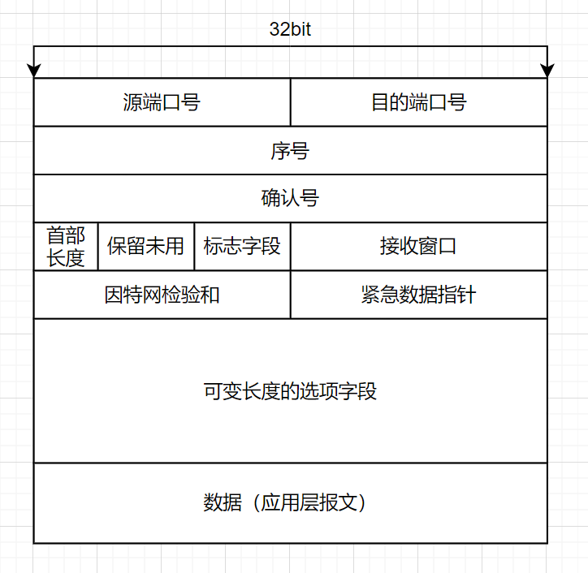

- **源端口号、目的端口号**  与UDP一样，也记录了这些信息
- **序号**  采用累计序号（GBN的方式），是TCP协议对流水线的支持，采取记录**当前数据开头到整个应用层报文开头的字节偏移量加连接时商定的初始序号**作为当前段的序号（采取初始序号的原因是防止旧包影响连接），且由于这种记录方式，接收方不好计算当前接收到的包偏置值，却可以很容易算出下一个包的开头偏置值，因此，**TCP协议中的序号都采用期待的包的序号作为ACK的值**
- **确认号**  TCP是全双工协议，在接收数据时也可以发送数据，因此在发送数据时同时也可以发送回应。
- **接收窗口**  指示接收方愿意接收的字节数量，**用于流量控制**
- **首部长度**  长度为4bit的字段，用来指示TCP首部的字数（这里一个字为32bit，即上面的一行）。需要这个字段的原因是TCP首部有一个可变长度的选项字段。
- **可选与变长的选项字段**  用于发送方与接收方进行一些参数的协商
- **标志字段**  长度为6bit，依次为**URG、ACK、PSH、RST、SYN、FIN**，作用分别为紧急信息、确认号有效、立即提交、连接建立

#### 关于TCP序号与确认号

TCP是**全双工协议**，因此，需要**同时能做到发送方和接收方的事**（发送方需要发送数据+序号，接收方需要发送确认号）。也正因如此，**TCP协议的首部包含了发送方和接收方的所有需要字段**。

##### 以字节流为基础的序号

TCP的序号并非我们之前在RDT中那样考虑的那样设定（为每个包设置一个连续序号），**TCP报文段的序号是该报文段首字节的字节流编号**。

##### 累计确认方式的确认号

TCP的确认号有以下特点

- **确认号是接收方期望从发送方收到的下一个字节的编号**
- **期望收到的字节是当前已有序字节的下一个字节**

> 如发送方发送了0~255的数据，则发送方的报文段序号为0，接收方回应的确认号为256

##### 发送方的角度

从发送方的方面来看，这种序号确认方式并不合适于SR协议的单独确认方式（发送时的序号于接收到的确认号并不对应，需要经过运算），反而更适合GBN协议的累计确认方式（**发送方完全不用考虑复杂情况，只要重发当前缓冲区内确定的字节偏移量处的内容，同时将发送窗口后沿前移**）。因此，发送方采用的是类似于GBN的方式。

##### 从接收方的角度

发送方决定采用GBN的方式，那么接收方就需要面临一个问题：**对于失序的段，是直接丢弃还是保留？**文档并未对TCP进行规范（因为保留或丢弃都行，反正都会再发一份）

- 如果直接丢弃，那么TCP就与GBN协议非常非常相像了
- 但是大部分情况，重复接收总是低效的。**大部分情况下，TCP在接收端采取的是类似于SR协议的方式，等待发送方补齐缺漏的字节**

#### 往返时间的估计

在链路传输的过程中，时间并不稳定，并且抖动较大。因此，TCP对计时器的时间设定不能设定成固定时间差（太短则覆盖不了大部分情况，太长则导致网络效率变低），而是采取算法，对最近一段时间的实际往返时间进行计算，从而预测出往返时间。

- **SampleRTT**，即样本往返时间，会根据时间间隔等因素在合适的时候取样。
- **EstimatedRTT**，即SampleRTT均值，代表了估计的样本往返时间
- **DevRTT**，即RTT偏差，是SampleRTT与EstimateRTT之间差值的平均加权

计算方式为：

​	**EstimatedRTT = EstimatedRTT\*0.875 + SampleRTT\*0.125**

这样计算后，最近的几次SampleRTT值对计算的影响较大，而之前的SampleRTT的影响则以指数趋势下降

​	**TimeoutInterval = EsitmaitedRTT + 4 * DevRTT**

这是一个非常保守的时间值，保证了在当前条件下90%以上的包会在时间内到达

### TCP协议差错恢复机制

```c++
//简化的TCP发送方
int nextSeqNum = initSeqNum;//初始化发送序号
int sendBase = initSeqNum;//记录当前最大确认号

while(1){
    if(receive the call from UpLayer){
    	create a Segment with nextSeqNum;
    	if(clock is not running) set clock with RTT;
        call DownLayer(IP protocol) to send the segment;
        nextSeqNum += length(data);
        continue;
    }
    if(clock timeout){
        repeat the segment which Num is min;//利用sendBase即可
        reset the clock;
        continue;
    }
    if(receive an ACK with seqNum){
        if(ACK_seqNum > sendBase){//更新确认值
            sendBase = ACK_seqNum;
        	reset the clock;
        }
        continue;
    }	
}
```

|     机制     |       目的       |
| :----------: | :--------------: |
| 重传最早的段 | 防止不必要的重传 |
| 超时间隔加倍 | 防止不必要的重传 |
|   快速重传   |   减少等待时间   |

#### 重传最早的段

TCP协议采取的是累计ACK的方式，这类似于GBN协议。但TCP并不会像GBN一样重传缓冲区内ACK之后的所有段，而只**会重设定时器并重发ACK之后的一个段**。这样可以**在接收方采取保存失序段的策略的情况下尽可能减少不必要的重传**。如下图所示：

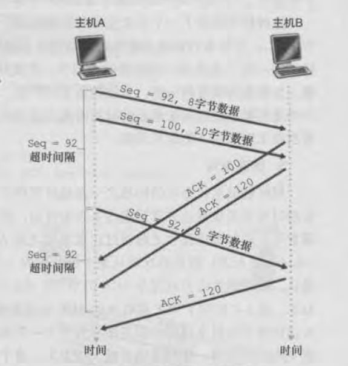

**在这个情况下，TCP可以从Seq = 120 开始发送段，而不会产生一次Seq = 100的重传**

#### 超时间隔加倍

该机制在每次重传后设置计时器时，会将超时间隔加倍

这个机制会在下层拥堵时，尽量避免因此而造成的不必要的重发。

#### 快速重传机制

**TCP在发送ACK时也有相应的规则**

| 事件                                                         | 接收方动作                                                 |
| ------------------------------------------------------------ | ---------------------------------------------------------- |
| 具有期望序号的按序报文到达，并在此之前的所有报文都已经确认过 | 等待500ms（进入延时ACK状态），如果无新按序报文到达，则发送 |
| 具有期望序号的按序报文到达，并在此之前有一个报文处于延时ACK状态 | 立即发送ACK，以确认最近两次的包                            |
| 比期望序号大的失序报文到达                                   | 立即发送冗余ACK，指示下一个期待的字节                      |
| 接收到能部分或完全填补空缺的按序报文                         | 立即发送ACK                                                |

归纳起来就是，**如果当前所有内容都是按序的，就留出500ms等待时间**，以尽量减少ACK的发送（利用了累计ACK的优势）。**只要有失序包存在，则每次接收都发送ACK**（不论是否是冗余ACK，都立即发送而不执行等待操作）

**TCP发送端在接收到三个冗余的ACK后，会立即执行重传，这一操作就是快速重传**

#### 是GBN还是SR？

- TCP的ACK是累积式的，正确接收但失序的报文段不会得到逐个确认，因此T**CP发送方仅需要维护已发送过但未被确认的直接的最小序号（SendBase，本质上其实就是发送窗口的后沿）和下一个要发送的字节序号（nextSeqNum，本质上是发送窗口的前沿）**。这样看，TCP类似于GBN风格。
- 但是**TCP接收端还会正确接收失序的报文段并缓存起来，发送端在重传时只发送最早的那个段**。这样看来，TCP与GBN又有显著的区别。
- 综上，TCP的差错恢复机制，**属于GBN与SR的一个混合体**。

### TCP流量控制

**TCP流量控制的目的是，防止发送方发送过快而超出接收方的读取速度，导致接收方缓冲区溢出而造成数据损失。**

TCP段首部中，有一个**接收窗口（ReceiveWindow）字段**，指示当前接收方的缓冲区的空余字节数，通过在回应ACK时，**捎带（PiggyBacking）告知发送方最多能发送的字节数**，从而实现流量控制。

### TCP连接管理

TCP是一个面向连接的协议。因此，在正式通信之前，通信双方都已经知晓对方的状态，并做好一些初始化工作（如准备缓冲区、变量置位等）。这就是TCP的连接管理。

#### 握手两次？

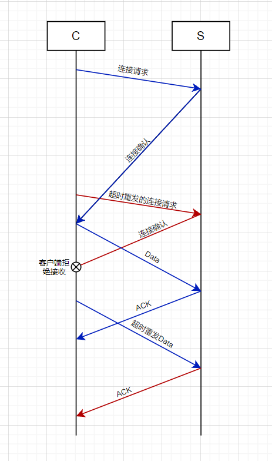

在这一情况下，服务器并不知道客户端发送的两次请求是同一个请求，在服务器视角下，变成了两个不同的请求（蓝色与红色），并且客户端并不会拆除红色连接，造成服务器一直维护一个**半连接**，导致资源的占用。甚至在重发Data后，服务器会认为是另一个连接（红色）数据，进行接收并处理。这就造成了通信的混乱。

> **半连接**
>
> ​	仅由服务器确认的连接，在客户端并没有得到确认，因此服务器当方面地维护维持这个连接所需的资源（尽管这个连接并不会被使用）

#### 连接建立

那么三次握手是如何解决上面的问题的呢？

##### 三次握手的流程

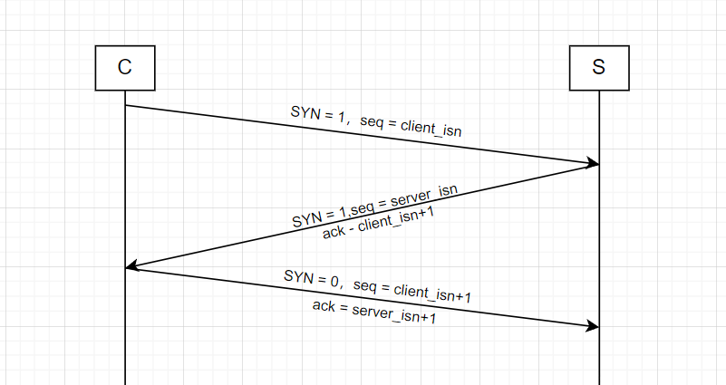

- **C**：SYN = 1，代表请求连接，seq = clientInitSeqNum，告知服务器初始段号
- **S**：接收到，SYN = 1，令ACK = client_isn + 1，并以seq = serverInitSeqNum告知客户端初始段号
- **C**：接收到，SYN = 0，代表已经建立连接，并发送ACK与 seq = client_isn +1 的段，**此时段已经可以开始包含数据了**

##### 对上面问题的解决？

- **对于半连接**，由于服务器接收不到第三次确认，会关闭连接
- **对于旧数据干扰**，每次连接都会确认一个新的InitSeqNum，旧的数据会被抛弃

#### 连接拆除

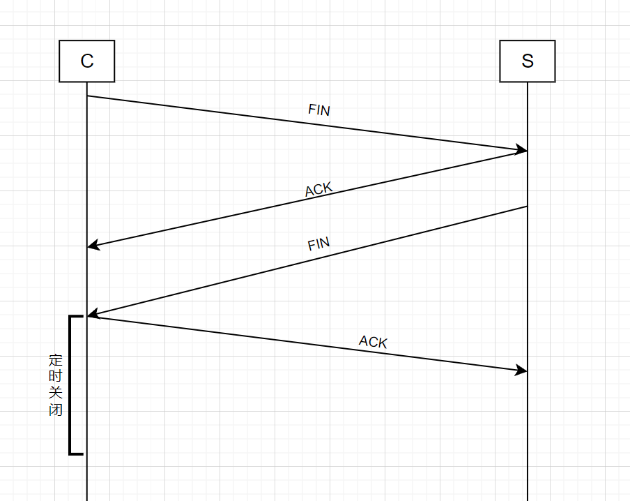

**连接拆除时是拆分成两个半连接的拆除，因此并不可靠**

### 拥塞控制原理

#### 什么是拥塞

拥塞是端系统与核心之间的关系问题。拥塞，即端系统的流量过大，导致网络核心的某些部分无法承受，从而造成延迟加大、甚至丢包的问题。

#### 拥塞曲线

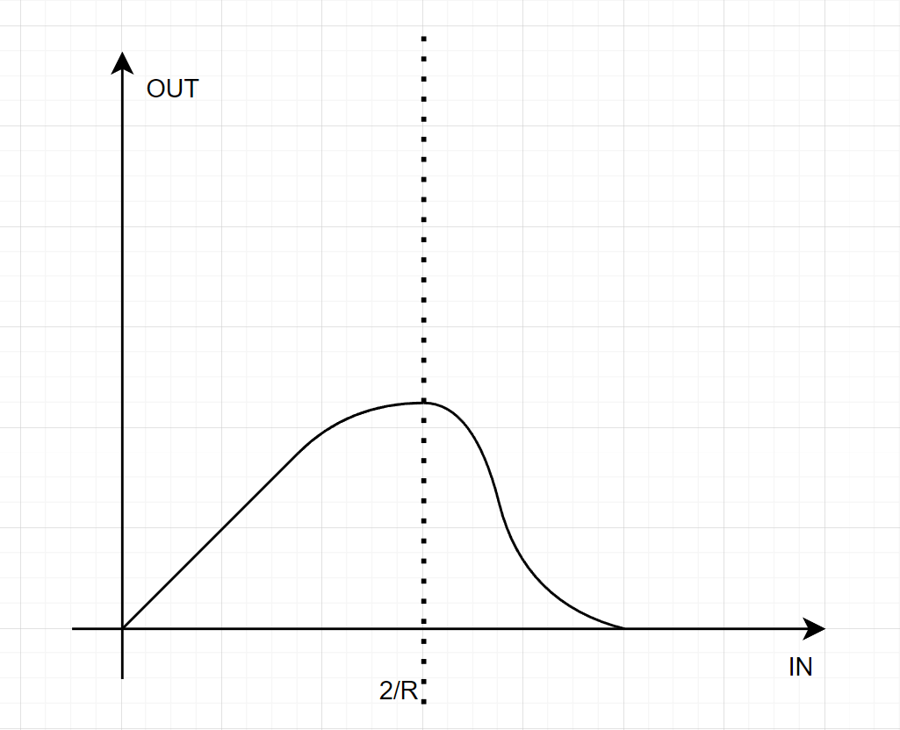

可以看到，在输入流量接近2/R（R为带宽）时，传输速率会出现下降

超过2/R后，传输速率会不断恶化，甚至进入死锁（网络瘫痪）

这是不对拥塞加以控制时，端系统会不断增加流量而导致恶化加剧

### TCP拥塞控制

TCP提供的是一种**端到端的拥塞控制**，不需要网络核心提供相关信息。

这样处理的优势在于，网络的复杂性更多地体现在边缘上，为网络核心降低了负担。

#### 拥塞控制的目标

- 在轻微拥塞时，采取动作防止拥塞快速恶化
- 在严重拥塞时，采取动作减缓拥塞

（在两种情况下，采取的动作是不一样的~）

#### TCP对拥塞的检测

- **超时** 大部分情况下，网络中出现超时情况，都是因为发生了拥塞，造成丢包或时延过长。根据超时的情况即可推测是否出现了拥塞。
- **接收到三个冗余的ACK** 不知道为啥，但是就是推断出了网络此时有轻微拥塞，但是比第一种情况要好

> **超时就代表拥塞吗？**
>
> ​	并不尽然，在发送过程中，如果出现校验错误的情况，接收方会丢弃，并且不会通知发送方。这样在发送方依然会触发超时。但这种超时相较拥塞造成的超时的概率要小的多，因此依然可以采取用超时来判断拥塞的方式。

#### TCP对发送速率的控制

##### CongWin

TCP拥塞控制机制使用一个控制变量，即拥塞窗口(congestionwindow)来表征网络的拥塞情况，

**发送窗口=min{CongWin,RcvWin}**

##### 慢启动（SS）

采取收到一个ACK则多发送一个MSS的策略（可以带来**指数增长**）

##### 线性增长

采取每个周期多发送一个MSS的策略

##### 加性增、乘性减（AIMD）

在这一阶段，如果没有检测到拥塞，则每次多发送一个MSS

如果检测到将要拥塞，则当前的发送速率减半（但是不会低于1MSS），并继续CA

如果检测到拥塞，则直接将发送速率降到1MSS，进入SS

#### 过程

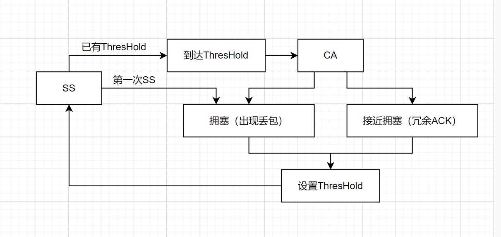

- **拥塞**时会直接将发送速率**降低到1MSS**，并进入SS
- **接近拥塞**时会将发送速率**降低为原速率的一半**，并进入CA

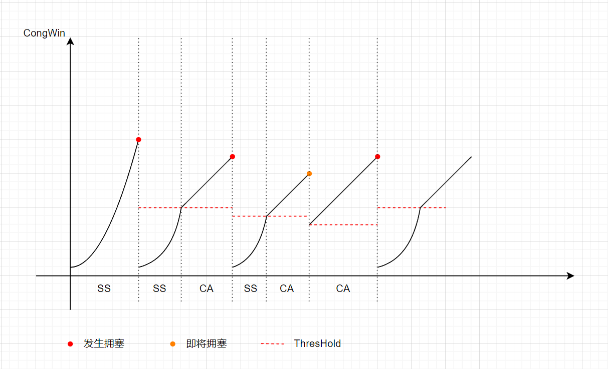

**实际上，慢启动的概率比较小；就算进入慢启动状态，持续时间也很短。从宏观上看，TCP在进行拥塞控制时，体现出锯齿状变化的情况。**

#### 吞吐量

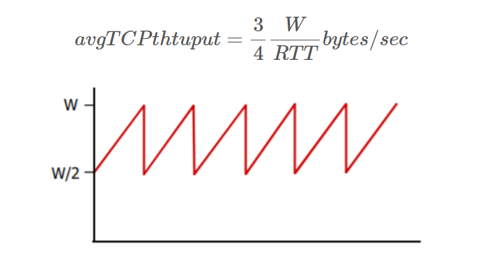
$$
T = \frac{\frac{CongW}{2} + CongW}{2RTT} = \frac{3CongW}{4RTT}
$$

#### TCP的公平性

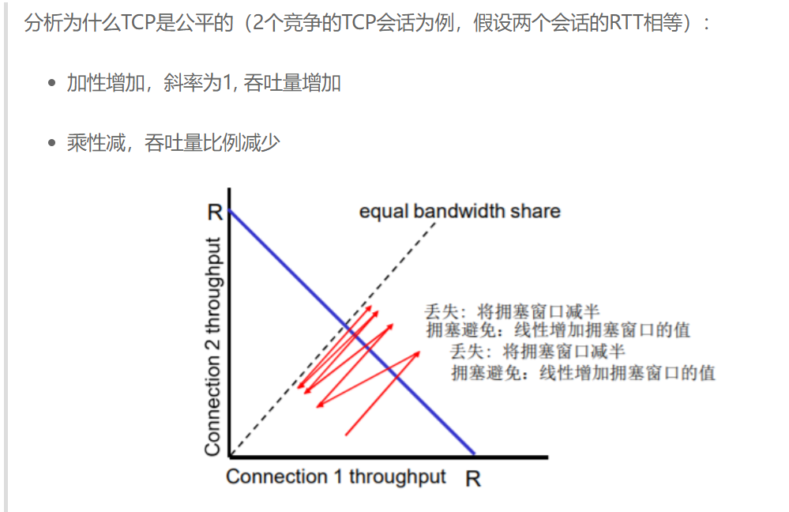

## 四、网络层：数据

### 网络层概述

#### 主要功能

- **转发（Forwarding）** 即路由器从接收端口接收分组，并将它从合适的端口放出的这一过程
- **路由（Routing）** 即路由器根据路由选择算法，更新路由表以提供选择端口的数据

转发是一个局部的概念，仅对一台路由器而言。而路由则是许多路由器共同实现网络层的E2E功能，是一个全局的概念。

#### 数据平面与控制平面

数据平面描述的是路由器如何转发，即在路由器内如何实现交换的功能。控制平面描述的是在网络中，不同路由器如何交换信息，并生成路由表以提供合适的转发路径这样的过程。

因此**数据平面**主要探讨的是**如何转发**，**控制平面**探讨**如何路由**

#### 转发与路由的实现

|  转发方式   |                             描述                             |
| :---------: | :----------------------------------------------------------: |
|    传统     |       基于目标地址（IP地址）+ 路由表（由控制平面计算）       |
| SDN（灵活） | 基于多个字段与流表（表项较传统路由表更多，同时还可以实现阻塞、泛洪等功能） |

| 路由方式 |                        描述                        |
| :------: | :------------------------------------------------: |
|   传统   |     在路由器中实现，路由表由路由器自行计算得出     |
|   SDN    | 在远程服务器中实现，路由器访问远程服务器以获得流表 |

#### 网络层服务的指标

- **对单个数据报而言**
	- 可靠？
	- 延迟保证？
- **对于数据报流而言**
	- 保序？
	- 保证带宽？
	- 延迟差有什么特性？

#### "有连接"的网络层

在TCP协议中，曾提到TCP协议是**面向连接**的，因为TCP协议之间进行通信的信息，仅在两个端系统中维护，而链路中的路由器对这些信息并不知情。而**有连接**意味着通信过程中的每个节点都需要存储一部分维持该连接的信息。


### 路由器

#### 传统路由器的简单模型

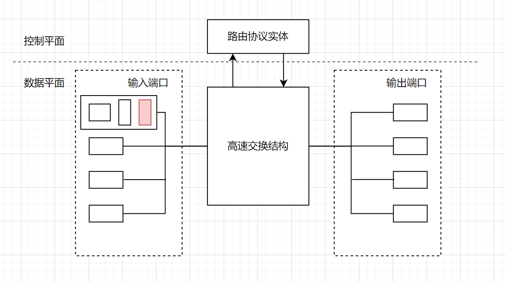

- **路由协议实体**，可以由硬件或软件实现，功能是生成路由表并交给端口
- **输入端口与输出端口**  事实上，在路由器中每个端口都是双向的，可以作为输入也可以作为输出。为了方便理解，这里采用分开的方式绘制。每个端口内都实现了协议栈，可以对该端口收发的数据进行封装或解封装。（上图中，从左到右就是 物理层-链路层-网络层）
- 在控制平面，时延一般为毫秒级，在数据平面，时延为纳秒级。

#### 端口模型

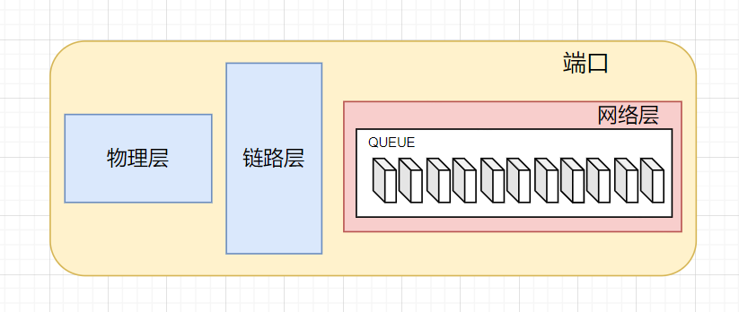

回顾一下端口中这几个层次的作用

- 物理层：实现数模转换，将数字信号转换为物理信号，并发送到链路中；或接收物理信号，交给链路层。是比特级的接收。
- 链路层：实现点到点的通信，分辨帧头帧尾，并将获得的分组交给网络层。
- **网络层：实现端到端通信，在数据平面执行转发功能。维护一个队列，依次根据路由表匹配目标发送端口并通过高速交换结构发送。**输入输出都有自己的缓冲队列。

> **为什么要实现输入输入的缓冲队列？**
>
> 虽然高速交换结构的传输速度是远大于端口的处理速度的，但是同一个端口可能会收到多个收/发请求，这就会带来端口竞争。为了缓解这种暂时性的超速，设置队列进行排队等候是更合适的操作。
>
> 在发送时，并非先来先发，而是存在一个调度算法，对一些延时要求比较高的分组优先发送。

#### 高速交换结构模型

对于交换结构，**最重要的就是速度**，它的交换速度必须N倍大于端口的输入速度（N为端口数）

常见的交换结构模型有以下三种

- **Memory**，采用软件的方式实现路由，端口接收到数据后，通过总线写到内存中，用传统计算机的方式操作内存进行转发。这是第一代路由器采用的方式，分组要经过系统总线两次，缺陷在于转发速率受到内存带宽的限制，且一次只能转发一个分组（被总线限制）

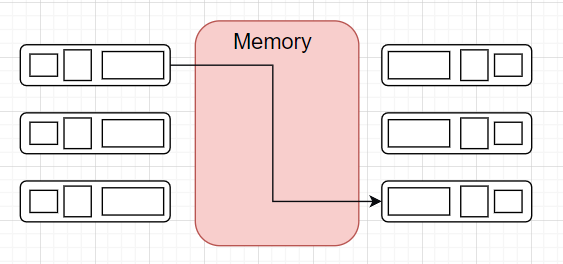

- **Bus**，克服了第一代路由器需要经过两次Bus的缺陷，将各个端口直接用总线相连接，并通过总线地址来进行识别传输。缺陷在于各端口对总线会发生竞争，交换速度受限于总线带宽，且一次仍然只能处理一个分组。这种路由器对于接入网已经够用，但对于网络核心仍然性能较差。

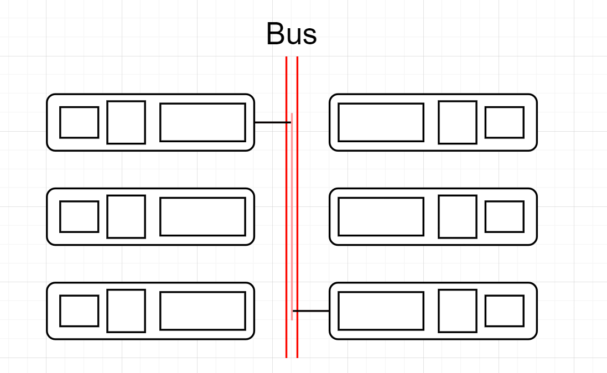

- **CrossBar**（基于互联网络的交换），采取类似总线矩阵的方式，只要联通中间点即可完成端口之间的转发。可以同时完成多个端口转发工作，并克服了总线带宽的限制。

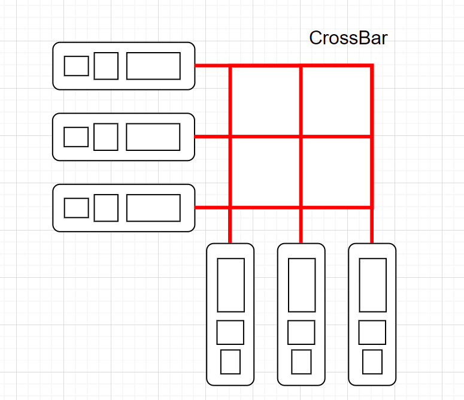

#### 调度方式

##### FIFO

很朴素算法，先来先到，和传统队列一样。在溢出时，可以抛弃最后来的，也可以随机抛弃...

##### 优先权调度

根据标签或一些字段作为依据，采取优先级排序发送

##### RR

按分类轮流传输，按A类、B类、C类、A类...这样的顺序

##### WFQ

加权公平队列，在一段时间内，每类按权重得到按比例的服务时间

------

### 路由表与基于地址的转发

对于每个路由器，如果记录了整个网络中所有主机的去向，那将记录非常非常多的表项。因此，路由表必须对此作出优化，而不是单纯地记录下每一台主机从哪一个端口出。

对此的解决方案就是，记录子网的位置而不是每台主机的位置。记录子网意味着只需要记录高n位的IP即可找到转发的方向。这就是基于地址的转发。

而在路由表生成时，常常采用的是全网泛洪或是递归传递周围的数据的方式，采用基于地址转发，可以减少转发时匹配的难度等。

### IPv4协议

#### IPv4协议格式

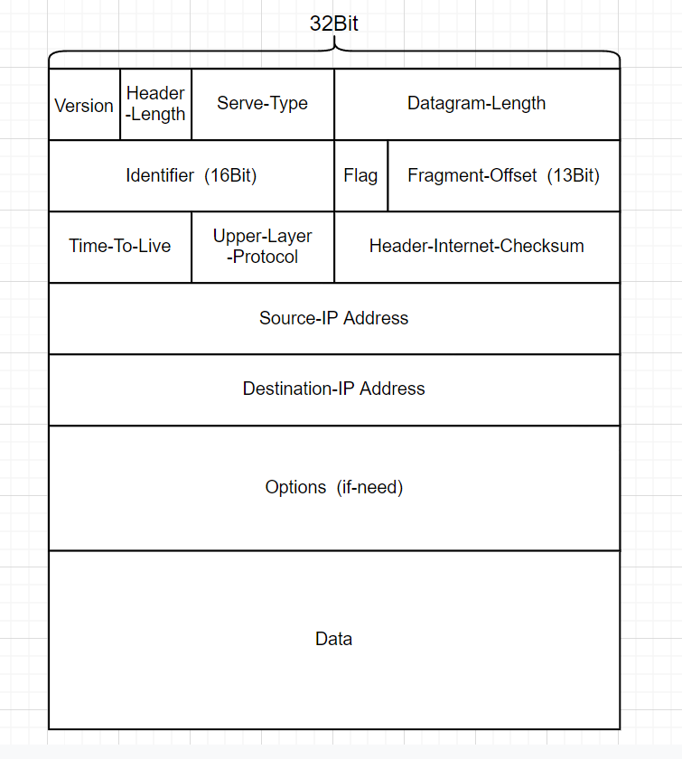

- **Version**，IP协议的版本
- **Header-Length**，首部长度；大部分数据报不包含选项，因此HeaderLength的长度大多为20byte
- **Server-Type**，用于区分服务的类型，方便在发送时进行优先级的区分（对某些要求低时延的数据报优先服务）
- **Datagram-Length**，即首部加上Data的长度
- **flag、indentifier、fragment-offset**，用于IP分片（IPV6已经不允许分片了）
- **Time-To-Live**，可以较好地解决路由环路的问题，每跳都将TTL-1，TTL = 0 时，该报文会被强制丢弃
- **Upper-Layer-Protocol**，上层协议。当IP数据报到达目的端系统后，该字段指示要将该数据报内容交给哪个上层协议（如 6 为TCP，17 为 UDP）
- **Header-Checksum**，首部检验和，原理与UDP等协议一样。注意区别在于它只检查首部是否出错。同时，每次检查完后，还需要重新计算（因为TTL会变化）
- **源IP与目标IP**，没什么好说的...
- **Option**，用于扩展IP协议的首部（IPV6中已经取消了）
- **Data**，即有效载荷，通常是上层协议的分组，也可能是ICMP协议报等

#### IPv4数据报分片

IP协议工作在网络层，即链路层之上。而链路层通常对每个帧的大小有所要求，即MTU。IP为了协调上层与下层，采取对数据报分段的方式来传输，过程如下：

- 路由器端口接收到对方发来的数据报
- 根据IP找到最合适的发送端口
- 根据发送端口的链路层协议，对数据报分片
- 待各个分片到达端系统后，由端系统的网络层进行重组

**分片方式：**

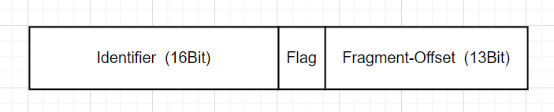

IP会为每个分片添加首部，其中

- **ID**标识了该数据报，用于重组时识别
- **Flag**标识了该片是否是整个数据报的最后一片
- **偏移**标识了该片在整个有效载荷中以8Byte为单位的偏移量

> **关于重组**
>
> 为什么要到端系统再重组？原因有以下两点：
>
> - 在路由器重组会增大路由器的负担
> - 每个分片的路径并不一定一致，路径中的路由器并不一定能被整个数据报通过
>
> 如何重组？
>
> - 端系统接收到分片后，会等待固定的时间
> - 在时间内有同样ID的分片到达，则重组
> - 没有到达，则全部丢弃
>
> （这样来看，IP协议丢包的概率还是很高的...因此TCP协议要自己分MSS而不让IP分MTU，MSS好歹传送到了还能先缓存着，交给IP如果传丢了那就是整个段重发了...）

#### IPv4编址

网络设备与物理链路的边界叫做**接口**，端系统一般只有一个接口，而路由器一般有多个接口

**从技术上讲，一个IP地址与一个接口相关联，而不是与包括该接口的主机或路由器相关联**（这句多少有点拗口...），因此，主机一般只有一个IP地址，路由器一般同时拥有多个IP地址

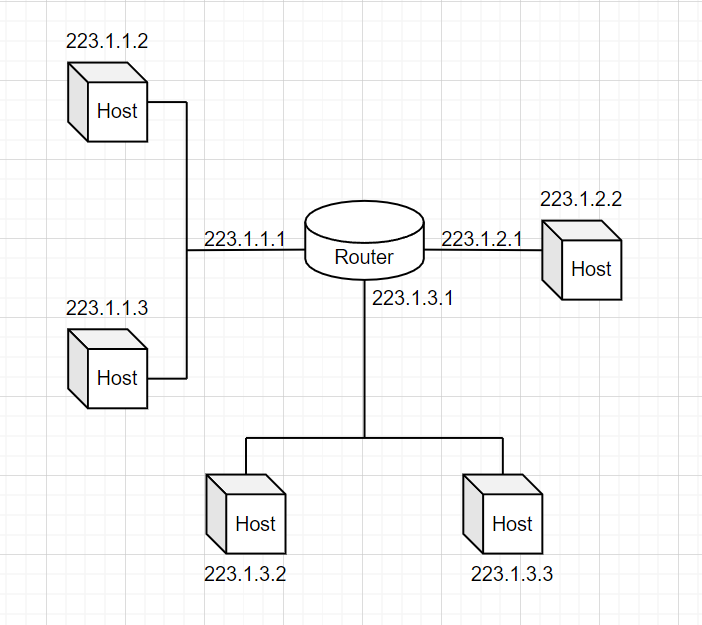

##### **IP地址**

​	现在的IP地址采用一种叫**CIDR（Classless Interdomain Routing，无类别域间路由选择）**的方式编址，IP地址的格式为 **a.b.c.d/x**，其中，a、b、c、d用点分十进制表示，最后的x也被称为子网掩码，用来告知路由器IP地址中的前x位描述了该IP在某个子网下。

> **为什么要采取这种方式？**
>
> ​	这是一种类似于多叉树的分类方式。路由器需要路由表来记录接收到的包对应的发送端口，如果采取两两互联的方式，在硬件和软件上都有极大的压力。采用分段的IP地址，从大的子网能够快速定位到小的子网，从小子网可以快速定位到IP所对应的主机。
>
> **为什么不是固定长度？**
>
> ​	为了兼顾灵活性。最早的子网IP分段是按照8Bit为基本单位的。但是随着组织增多，会带来大量的IP浪费，因此采用子网掩码来支持IP网络段为变长。

#### IP的分配

- 对全球ISP，向IP分配组织请求得到IP块
- 对区域ISP，向它所连接的更高层ISP请求得到IP块
- 对组织，向区域ISP请求得到IP块

IP在分配过程中大致如下

- 全球ISP： 200.0.0.0 / 8  **11001000** 0000000 00000000 00000000
- 区域ISP： 200.23.0.0 / 16  **11001000 00010111** 00000000 00000000

- 组织： 200.23.16.0 / 24   **11001000 00010111 00001000** 00000000
- 主机： 200.23.16.1  **11001000 00010111 00001000 00000001**

（红色代表不能由自己决定的部分）

#### DHCP协议

DHCP，即动态主机配置协议，用来自动给刚接入子网而需要一个IP的主机动态分配一个临时的IP地址，这样对客户流动性大的局域网环境要更合适。

但是，一台主机，刚刚插网线进入该局域网，又该怎么获得自己的IP呢？

每个局域网内至少有一个DHCP服务器，用以给主机动态分配地址。（像家用路由器这样的，因为工作负载比较轻，一般都直接与路由器合在一起了...）

过程如下：

- **DHCP服务器发现**  DHCP客户刚进入局域网内，首先需要向整个局域网广播DHCP发现报文（在UDP分组中，向端口67发送该报文，源IP为保留的本主机IP（0.0.0.0），目的IP为保留的广播目的地址（255.255.255.255），广播是通过链路层提供的原语实现的）
- **DHCP服务器提供**  DHCP服务器在接收到DHCP客户的广播请求后，会广播回应一条DHCP提供报文，DHCP提供报文中会告知服务器的ID与推荐的IP地址、IP地址保留时间等
- **DHCP请求**  DHCP客户会挑选一个合适的DHCP服务器，并回应一个DHCP请求报文（该报文内容是对DHCP提供的回显）
- **DHCP ACK**  DHCP在接收到回显数据并确认后，回应客户一条DHCP ACK，客户确认自己的IP地址，交互到此便完成了

> 从这一过程看，IP并非是与主机死死绑定的，而是类似于“起名”一样，只要双方都认可了IP，那么在传输过程中就不会有差错。DHCP服务器只是告诉主机当前还可以用的IP，主机自己挑了一个顺手的而已，**DHCP服务器并不需要向路由器报告分配了xxx地址，只需要自己知道这个IP已经有人用了即可**（事实上，**IP只有主机自己知道，路由器只知道子网的IP，而不能确认到主机**。而主机通过ARP广播来接收链路层发来的包，因此完全可以伪造自己的IP去抢别人的包...就是所谓的ARP欺骗）

#### 网络地址转换

即NAT（Network Address Translation）（似乎叫网络地址翻译不是更合适嘛...）

这个概念其实已经很熟悉了，就是所谓的私网

私网需要一台**NAT路由器作为桥接**，对外界（公网）而言，NAT路由器其实并不像一台路由器...反而更像一台主机。

NAT路由器有一个WAN口和多个LAN口，WAN接向广域网，而LAN接入私网下的设备。私网下的设备同样根据DHCP协议获取到自己的私网IP。设备与公网沟通时，报文会先经过NAT路由器的改装，在接收时，也会由NAT路由器改回真实的数据，过程如下

- 如一台私网IP为192.168.31.12的设备，通过655端口经NAT向公网中地址为12.13.14.15的服务器发起请求
- NAT会将源IP改为自己的IP（公网IP），端口改为自己的任意一个端口（假设是168），并记录在**NAT转换表**中，再将报文发送出去
- 服务器返回响应后，NAT又会根据端口号，将目标IP与目标端口改回私网设备，并转发回给私网设备

> 这才是真正家用的“路由器”，它真正的功能是NAT，也因此在路由器中甚至能查询到UDP、TCP的通讯记录，进行端口映射！（事实上，现在ISP分配的大多数IPv4地址也不过是私网的IP罢了...回头改用IPv6叭...）

文章最后还叙述了一些对NAT路由器的反对的声音...事实上，这种东西能叫路由器嘛？...确实叫做中间盒更为合适。

-------

### IPv6协议

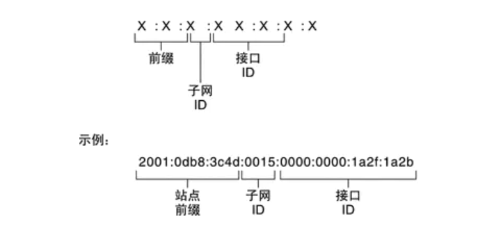

#### 地址类型和格式

- 地址结构

IPv6地址由被划分为8个16位块的128位组成。 然后将每个块转换为由冒号符号分隔的4位十六进制数字。

例如，下面给出的是以二进制格式表示并被划分为八个16位块的128位IPv6地址:

```undefined
0010000000000001 0000000000000000 0011001000111000 1101111111100001 0000000001100011 0000000000000000 0000000000000000 1111111011111011
```

每个块被转换为十六进制并由":"符号分隔，即使在转换为十六进制格式后，IPv6地址仍然很长。

```ruby
2001:0000:3238:DFE1:0063:0000:0000:FEFB
```

- **规则**

**规则1:丢弃前导零:**

在块5，0063中，可以省略前导的两个0，例如(第五块):

```ruby
2001:0000:3238:DFE1:63:0000:0000:FEFB
```

**规则2:如果两个或多个块包含连续零，则省略它们并用双冒号"::"替换：**

例如(第6和第7块):

```ruby
2001:0000:3238:DFE1:63::FEFB
```

**连续的零块只能被::替换一次。如果地址中仍有零块，它们可以缩小到一个零：**

例如(第二块):

```ruby
2001:0:3238:DFE1:63::FEFB
```

#### IPv6协议格式

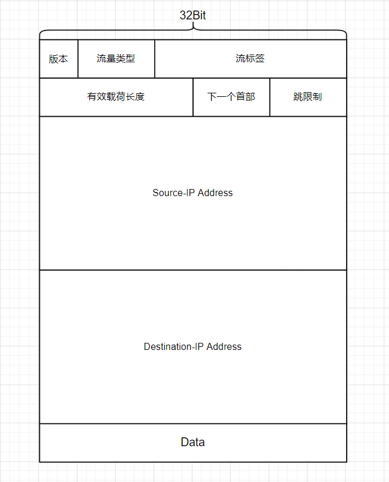

**每个字段的含义：**

- **版本**，同IPv4，4Bit，在IPv6中需要设置成6
- **流量类型**，与之前的TOS（Type of Serve）类似，用于区别优先级（这怎么还保留着啊哎）
- **流标签**，也是用于区分服务优先级的（...）
- **有效载荷长度**，字面意思啦~
- **下一个首部**，相当于IPv4中的Upper Layer Protocol，甚至连表示每种协议的字段都一模一样...
- **跳限制**，与TTL机制一样
- **源IP与目标IP**，增长到128Bit；同时加入了一种"任播"地址，可以使数据报交付到一组主机中的任意一个

**与IPv4的区别**：

- **首部定长了，为40Byte**
- 再也没有选项字段了
- 也不会再有分片的操作了...收到太大的直接扔！
- **取消了首部检验和**，似乎是因为上层与下层都执行了检验操作，认为它已经比较安全了...（重发带来的时间损耗真的会小于每次计算校验和带来的损耗嘛...）

------

### 通用转发与SDN

本部分用于先对SDN有一个了解，在下一章 网络层：控制平面 内，将对SDN的原理作更细致的阐述

#### SDN的目的

#### SDN的目的

在现在网络中，有了越来越多种类的网络设备（包括路由器、交换机、NAT、防火墙等等），并且这些网络设备高度集成。带来了ISP必须维护多种设备的问题。

观察到其实这些网络设备都有一个共同的特征，即作用都符合**匹配-动作**模式。

- 路由器，匹配IP，并决定向哪个端口转发
- 交换机，匹配MAC地址，并决定如何转发
- 防火墙，根据端口号、IP等，决定是否Block
- NAT，根据端口号、IP，进行修改

因此，SDN的目的是，使得这些网络设备都用一种**通用的分组交换机**来替代，而**分组交换机的行为**根据一个**远程控制器**通过**南向接口下发的流表**来决定。**远程控制器通过北向接口与上层的网络软件交互**，计算流表。

#### 流表

匹配加动作转发表在OpenFlow中被称为**流表**，流表的每个表项包括以下字段

- **首部字段的集合**，入分组与之匹配，来决定对应的表项（匹配通过硬件实现）
- **计数器集合**，当分组与流表表项匹配时，更新计数器，这些计数器可以包括已经与该表项匹配的分组数量，以及自从该表项上次更新以来的时间
- **匹配时的动作集合**，这些动作可能包括转发、复制、丢弃、发送到多个端口、重写首部字段等

通过下发流表，网络范围的行为就能被灵活平滑地升级，即所说的**SDN（软件定义网络）**


------

## 五、网络层：控制

### 路由选择算法

分为两类，为**链路状态算法（Link State）**与**距离矢量算法（Distance Vector）**

路由事实上应该理解为**子网到子网的路由**，在从源主机到目标主机的第一跳与最后一跳都是毫无疑问的，都是**子网路由器与主机之间的交互，通过链路层的交换机实现**。而从源主机所在的子网到目标主机所在的子网这一段路，就需要路由了。

#### 路由的概念

- **目标：**确定从发送主机到接收主机之间，通过**由路由器组成的网络**的**较好路径**

- **好处：**将主机与主机之间的最优路径转化成了主机所在子网到另一个子网的最优路径，这样大大减小了计算规模

#### 对路由选择算法的抽象

- 用图抽象
- **输入：**该网络的拓扑结构、每条边的权重、源
- **输出：**从该源出发到每个点的最优端口

#### 汇集树（Sink Tree）

汇集树，就是以源节点为根，到其他所有节点的最优路径形成的树

路由算法的本质就是利用输入，找出汇集树

> **汇集树与最小生成树**
>
> ​	汇集树是用Dijkstra算法生成的树，它和最小生成树有一些类似，但最小生成树并没有指定根节点，而汇集树指定了根。可以理解为汇集树是在源被限制了的条件下的最小生成树。（因此Prim算法和Dijkstra算法非常类似...但是Dijkstra要更简单，因为源被指定了，而Prim需要遍历所有的情况）

#### 路由算法的要求

- **正确性**
- **简单性**（不能为了最优而浪费太多带宽）
- **鲁棒性**（能够适应链路的各种变化）
- **稳定性**（产生的路由不应摇摆）
- **公平性**（网络层提供的是尽力而为的服务，对所有的分组都应该一视同仁）
- **尽量优**（在可能的范围内尽可能靠近最优）

#### 路由算法的分类

- **是否是分布式计算？**如果获取整个网络的图，则是集中式计算。如果只考虑自己的端口连接的相邻节点，并从相邻节点获取数据，是分布式计算。
- **静态还是动态？**如果是静态，路由随时间变化缓慢，如果动态，则路由表周期性更新，并根据链路代价变化。（现在的大部分路由器都采用动态算法）
### 路由算法—LS

Link State（链路状态）算法，是一种集中式的动态路由选择算法。

它本质上就是Dijkstra算法

#### 算法过程

- **发现相邻节点（通过向所有的端口广播），并测算权重**
- **将自己的链路状态（即自己所在的、自己能到的）形成一个分组，并全网泛洪（flooding）**
- **每个路由器都采取这样的操作，很快每个路由器都能得到一个全网络拓扑**
- **通过Dijkstra算法找到最优路径并生成路由表**

> 确实是一个简单粗暴的算法。但是，与P2P网络中学习到的泛洪一样，会存在广播风暴的问题
>
> 解决方案
>
> - 设置Age字段，限制传播的范围（这样有可能会传不到全网吧）
> - 每个节点都记录是否转发过，如果转发过则无视
>
> 同时还需要注意，**这种泛洪是有确认的，是可靠的泛洪**，**在接收到分组后，要给发送方确认，转发后要准备接受接收方的应答，如果没有收到应答，则会进行重发**

#### LS的应用情况

- OSPF协议是一种LS协议，被用于Internet上
- IS-IS协议也是一种LS协议，被用于Internet主干中

### 路由算法—DV

#### DV的执行过程

```
对每个结点x进行如下操作：
    初始化：
        遍历所有网络中的所有目的地y：
            估计 x 的距离向量。如果是非邻接结点，那么距离为∞。
        遍历每个邻接结点 w：
            邻接结点 w 的距离向量。初始估计，不准确的。
        遍历每个邻接结点 w:    
            发送本结点 x 的距离向量到每个邻接结点 w。

	循环：
    	等待（知道存在链路状态变化或者收到其他结点的距离向量之后终止等待）
    	遍历网络N中的每个结点 y：
        	依照bellman-ford方程更新本地 x 距离向量
    	如果 x 的距离向量存在变化
        	发送 x 的距离向量给每一个邻居结点。
```

本质上与bellman-ford算法一致，因此只需要从它周围的节点提供的信息即可得到结果。至于什么时候得到，只要迭代够久，那就一定会好起来...

#### DV的问题

- 根据链路开销改变，可能导致**路由选择环路**
- DV的错误计算随着迭代会快速波及全网

### LS与DV的比较

- **报文复杂性** LS的报文要求记录它到所有邻居的权重并全网泛洪，让所有节点都知道自己这一个点到周围的状况。DV则不一样，它只根据周围节点给的信息计算自己的情况，并再交给周围节点迭代计算。
- **收敛速度** LS可以快速收敛，而DV会遭遇许多问题，如路由环路等
- **鲁棒性** LS的鲁棒性要优于DV（因为DV可能给附近提供错误的信息，并会因此快速扩散到全网）

### 自治系统

上面的算法都是将网络当成一个大的路由器集合来看待，而并没有考虑它们的规模与管理问题。

事实上，随着网络中的路由设备增多，以上两种算法都不得不面临一个大问题，那就是收敛速度将跟不上链路状态的改变速度，换句话说，就是链路变了，而路由系统无法及时作出响应。因此，引出了**自治系统（AS）**这一概念。

所谓自治系统，就是**将某一群路由器看作一个大路由器，而这个路由器的各个端口，就是网关路由器**。路由的问题就由从上亿个路由器中算出一条最佳路径变成了从有限数量个大路由器中找出路径。至于这些大路由器的各个**端口如何转发**，则**由它们内部的路由选择协议来决定。**

因此，路由选择协议也被分成了两个层面。即**自治系统内部的路由选择协议（IGP）与自治系统间的路由选择协议（EGP）**。

一般来说，EGP需要跑在该AS的主干部分，而分支部分并不一定需要运行。将每个AS看成路由器还有一个问题，就是实体的路由器可以通过控制层面进行运算，而AS需要其中运行EGP的部分分布式计算并通告它下辖的路由器（通告则采用下辖部分能看得懂的IGP）。

### OSPF

**OSPF（开放最短路优先）**是一种**基于LS的自治区域内路由算法**，因此它需要全网泛洪通告所有的节点自己的拓扑并通过其他节点的泛洪来生成全网的拓扑。

OSPF的报文直接建立在IP之上（不像BGP建立在TCP之上），因此需要自己实现类似于可靠数据传输等功能，OSPF协议在IP协议的Upper Layer Protocal字段表示为89

OSPF的报文直接建立在IP之上（不像BGP建立在TCP之上），因此需要自己实现类似于可靠数据传输等功能，OSPF协议在IP协议的

**OSPF与LS的不同之处主要体现在下面几个方面：**

- **安全**	OSPF对接收节点的信息有验证并筛选，而不是直接接收。这样可以有效地排除恶意的干扰因素。
- **支持AS内的层次结构**   一个OSPF能够层次化地配置多个区域，在泛洪时不再时向整个AS泛洪，而是向区域内的所有路由器泛洪。并在区域上设置主干区域，用以沟通多个区域。因此OSPF可以适应较大的路由数量。
- **对单播与多播的支持**

> 此外，OSPF对于链路权重的设置依赖于网络管理员的手动配置。

### BGP

**BGP（边界网关协议）**是一种基于DV算法的AS间路由选择协议。

#### AS间路由选择协议的需求

首先考虑BGP作为一个EGP，需要实现哪些功能？

- **对外能像一台物理上的路由器一样，根据AS间交换的信息，计算出一个分组如何在AS间找到对应路径。**（物理的路由器根据其控制层面的软件计算得出，而AS需要根据处在AS主干内的多个路由器一同计算出如何路由（这里的路由是AS间的路由））
- **对内能够作为一个路由器的集群，能够将如何走到外部的信息交付到内部的每一个路由器手中。**

#### AS间的信息交换

- 每个AS中的**网关路由器都会收集整个AS中的可达信息**（根据IGP），整理好后以BGP报文的方式**发送到与之连接的其他AS的网关路由器处**。

- **网关路由器在接收到内容后，会向自己所在AS内的所有路由器（大部分情况下是主干区域）发送该内容。**

- 同一个**AS内的内部路由器在接收到内容后，转换成自己辖区内的路由器能理解的信息（根据IGP）并下发**，这样整个AS都能得到这些信息。

- 同一个**AS内的网关路由器中接收到内容后，还要夹带上自己的区域信息，再转发到别的网关路由器**。

AS的信息交换，是依赖于一些半永久TCP连接的。因为AS内部已经使用IGP实现了AS内的路由选择，因此TCP可以实现。AS内的每两个路由器之间，都拥有这样一个TCP连接（因此BGP协议还是比较耗资源的）。

> **关于BGP报文中的附加信息**
>
> ​	BGP基于DV，但在DV的基础上作出修改，可以很好地应对路径成环等情况。原因就是BGP中的这些“附加信息”。
>
> ​	BGP报文**不仅仅传达自己可达的子网信息**，**还传递了到达此子网的具体路径**。如子网X在AS3中，则AS3发出的BGP报的路径信息就会包含AS3。该报文经过AS2，则从AS2中发出的报文的路径信息就会附加上AS2。记录经过的AS序列，即可有效避免成环的问题。

#### 热土豆路由选择

- **核心思想**是对于接收到不属于自己AS的分组的路由器将尽可能快地将分组送出自己的AS（是否是自己AS内部的分组可以通过内部路由协议实现）

**步骤如下**

1. AS通过EGP从多个AS处得到了到达子网x的信息，并让自己内部的路由器都同步该信息
2. AS内部路由器根据IGP，算出到每个网关路由器的最小开销路径
3. 进行热土豆路由选择，根据1中的信息确定有用的网关路由器，根据2中的信息选择开销最小的那一个网关
4. 根据3中算出的网关与2中算出的最短路，确定下一跳的端口I，并将（x，I）的信息加入路由表中

对于每个路由器都进行这样的操作，即可生成跨AS的路由表。**跨AS的路由表是内部路由协议与外部路由协议带来的信息综合后的结果**。

### 实践中的路由选择算法

考虑热土豆算法是一种自私的算法（仅考虑了如何将分组最快地送出自己的AS，而忽略了端到端开销的其他部分），实践中采用一种更复杂的算法来对跨AS路由进行选择。

在热土豆算法的第三步中，只是简单地直接采用了能到达目的子网的多个网关中在自己AS中开销最小的那条，因此加入以下限制，从而改善。

- 路由会被指定一个**本地偏好**，这一指定完全由网络管理员负责，也是路由选择中最高优先级的限制
- 在本地偏好的限制下，如果存在多个网关，则**利用收集到的AS路径，选择跳数（AS跳）最少的那一条**
- 如果还存在多个这样的网关，则**采用热土豆算法选择开销最小的网关**

这样很好地改善了热土豆算法，尽可能地减小了端到端时延。

### 对IGP与EGP的一些思考

- IGP更加关注性能，而EGP更加注重策略
- 对于同一个AS内的路由，IGP的目的是提高它们传输的效率，不管是分层还是别的什么算法，性能是它重点关注的
- 而对于跨AS的路由，问题就更复杂了，包括很多策略上的考虑，并不是说到的快就让过
- 总体上看，EGP是采取了分层这样的结构，但是目的在于划分不同的AS用于策略管理。而IGP可以可以根据规模采取类似的分层（比如OSPF是支持分层的），但是目的是在于提高性能等。

### SDN控制平面

简单叙述一下SDN在控制平面的结构

分为三层

- 北向接口
- 网络OS
- 南向接口

南向接口实现协议等，用于给CA（即分组交换机）提供交互的平台

北向接口为上层网络应用程序提供接口（跟正常的OS差不多一样）

网络OS负责实现三个层次的粘合

SDN实现控制平面依然有许多问题，包括可靠性、性能、安全性等很多因素，但不可否认是一个很有希望的新的网络层实现方式。

## 六、链路层与局域网

### 链路层概述

#### 一些术语

- **节点** 运行链路层协议的任何设备
- **链路** 链路层实现点到点通信之间的数据通路
- **帧** 链路层的PDU

#### 链路层提供的服务

从最根本上来看，链路层提供的是点到点的节点间通信服务，但根据链路的种类不同，还可以从以下几方面叙述

- **成帧** 即封装数据帧，在链路层数据以帧为单位进行传输
- **链路接入** 如果链路两端各只有一个发送方和接收方，那么链路的结构十分简单。问题在于大部分情况下多个节点会共享一个广播链路，因此需要实现多路访问。**MAC协议实现了这一功能。**
- **可靠交付** 链路层有时也提供可靠交付服务，这一服务的对象是网络层数据报（即确保网络层提交的与交付给网络层的数据完全一致）。链路层的可靠交付功能本质上还是**基于差错检验与重传**，但在实现上**更多地依靠了硬件**。一般容易产生高差错的链路会实现这一功能（如无线链路），而大部分有线链路都不提供。
- **差错检验和纠正** 大部分链路层协议都提供差错检验机制，也更多通过硬件实现。

#### 链路层的位置

链路层的主体是在网络适配器（通常所说的网卡）中实现的，它的核心是一块实现了许多链路层服务的专用芯片。

在发送端，链路层接收网络层的数据报，并在其基础之上添加首部信息形成帧；在接收端，网络控制器接收帧并抽取出网络层报文。

> **硬件还是软件？**
>
> ​	链路层属于**计算机网络协议栈中软硬交接的部分**，从硬件层面上看，它负责将数据从物理层（网络媒体）中发送出去，实现了数据的物理传输；从软件层面上看，它为网络层提供了层间接口，并实现了封装、解封装、数据处理等功能。因此链路层是软件与硬件的结合体。

### 差错检验和纠正

**差错检测**与**差错纠正**是链路层提供的两种不同的服务，合称为**EDC**（Error-Detection and Correction），同时还需要注意到，这些技术并不能绝对确定数据不出错，只能减小错误传输的概率。

一般来说，EDC的算法越复杂，导致开销越大。

下面来看几种常见的EDC

#### 奇偶校验

##### 单个奇偶校验位

- 使用单个奇偶校验位，补充原有数据，使得原有数据中的1的个数变为奇数或偶数
- 如对1000101采用奇校验，则校验位为0；反之则为1（偶校验要求最后有偶数个1）

##### 二维奇偶校验

- 将数据分为i行j列
- 分别对每行每列都使用单个奇偶校验
- 这样，通过校验所有的位，即可通过行和列确定出错的bit并修复！

> 类似二维奇偶校验的这种接收方可以主动纠错的校验方式被称为**FEC（Forward-Error Correction，前向纠错）**；在实现可靠数据传输时，接收方可以主动纠错，从而减少重传的次数。

#### 循环冗余校验

这是目前网络中应用最广泛的校验方式，过程如下

- 发送方与接收方商定一个比特序列G
- 发送方在发送的数据末尾添加G-1个校验位，使得组合后的数据对G取余为0
- 接收方用如上方式校验即可

问题出在发送方如何确定冗余位

推导过程如下（规定原数据为D，校验序列为G，冗余序列为R，r为冗余序列长度，+为模2加（即异或））
$$
D \cdot 2^r \oplus R = nG \\
D \cdot 2^r = nG \oplus R \\
(D \cdot 2^r)\mod G = (nG \oplus R) \mod G \\
R = (D \cdot 2^r) \mod G
$$


### 多路访问链路与协议

### 交换局域网

### 链路虚拟化

### 数据中心网络