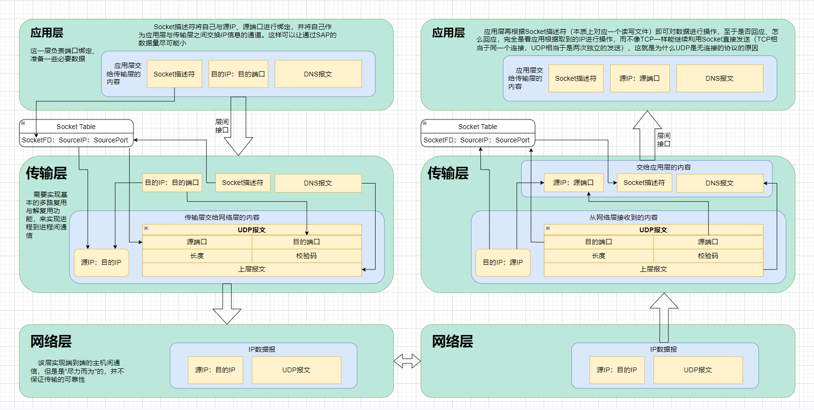
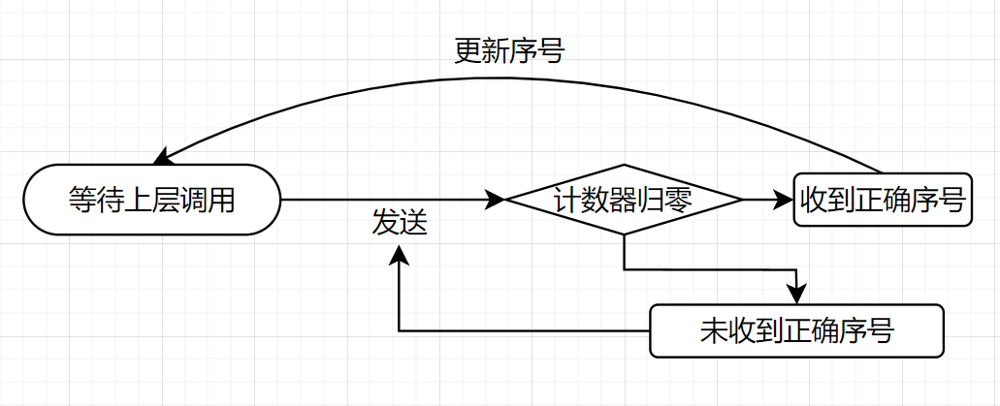

# 计算机网络

## 一、概论

在这一章节中，主要介绍计算机网络的模型，以及在计算机网络中探讨的一些术语

### 计算机网络五层模型

|         层次（从高到低）         | 功能                                                         |
| :------------------------------: | :----------------------------------------------------------- |
| **应用层**（如HTTP、FTP、DNS等） | 这部分协议的功能是**服务于具体的网络应用**的，如HTTP规范的是web程序交互的格式（请求与响应的格式等） |
|      **传输层**（TCP、UDP）      | 这部分协议的功能是在网络层实现端到端通信的基础上**实现host中具体进程间的通信**，TCP协议还同时保证了通信的可靠性 |
|         **网络层**（IP）         | 在链路层的基础上，实现了**端到端通信**                       |
|  **链路层**（以太网协议、WIFI）  | 实现了**相邻的点到点通信**                                   |
|            **物理层**            | 数模转换，将媒体中的数模信号进行互相转换                     |

### 互联网的结构

**Internet = Edge + Access + Core**

#### 互联网边缘

由**端系统**（host，或称为主机）构成，它们是互联网最外层次的端点，作为信息源

#### 接入网

接入网是一些链路，从端点出发并通过连接到ISP而接入到互联网核心

#### 互联网核心

由大量的交换机、路由器构成，它们作为计算机网络的中间节点，并不提供信息，只负责将信息转发到对应的端点（边缘）

### 交换方式

#### 电路（线路）交换

类似于电话线，通过建立一个稳定的、专用的连接从而实现端到端的通信。但是与计算机网络的实际情况并不吻合

- 计算机网络通常并不连续通信，而具有**突发性、短暂性**，使得建立、维护连接的时间开销相对大
- 计算机网络庞大而复杂，维护连接的难度很大
- 计算机网络的端点极多，线路交换这种专有的通信**容易阻塞**

#### 分组交换

是现有计算机网络体系所采取的交换方式。采用存储转发传输，通过发送PDU（协议数据单元），并在路由处排队转发，从而实现网络链路的尽可能的共享。但是也同样带来了一些负面的因素

#### 分组交换的缺陷

- **时延** 
	- 分组交换采取存储转发的方式，因此每次转发前都必须等上一个节点将所有的分组都发送完全后，才往下一个节点进行转发。这一段时间被称为**传输时延**，即发送/接收需要的时间
	- 每个中间节点接收到完整的分组后，都需要进行一些固定的操作（比如解封装获取目的ip、验证校验位等），这部分花费的时间称为**处理时延**
	- 分组到达中间节点并找到对应端口准备发送时，如果对应端口上还有未发送完的分组，那么需要在缓冲区内排队等候，即**排队时延**
	- 分组从节点发出到链路上后，需要一定时间才能到达下一个节点，这部分由电磁波及媒介的物理性质决定的时延称为**传播时延**
- **丢包**
	- 如果进入转发端口时，该端口的缓冲区已经满了，那么该数据包会被直接丢弃，即发生了丢包。因此，在网络层（IP协议）直接进行的通信的不具备可靠性的，需要更高层的协议提供保障

### 一些零散的知识点

#### 路由器与交换机

路由器的功能在于路由，它工作于网络层，能够通过IP协议转发信号。因此当一个媒体信号到达路由器时，会先向上解封装到网络层，再从发射端口封装到物理层

交换机的功能在于连接多个端点，工作于链路层，并不区分不同IP的转发，而是无条件向所有端口转发，因此只需要解封装到链路层

#### ISP层次

**ISP**，即Internet Service Provider，网络服务提供商

最初的ISP一般只能负责到一定区域内，因此出现了想专门在大范围内提供互联服务的全球ISP（Global ISP），但是由于竞争出现了多家全球ISP，它们之间进行合作，通过IXP这样的公益组织互联，并提供服务给下一层次的ISP（region ISP，地区ISP），最后达成了全球互联的现状

#### PDU

PDU，即**协议数据单元**，是同层协议之间进行数据交换的基本单位。不同协议的PDU有着不同的规范和名称。

- **应用层 -- 报文（Message）**

- **传输层 -- 报文段（Message Segment）**
- **网络层 -- 数据报（Datagram）**
- **链路层 -- 帧（frame）**

#### 协议与服务

在计算机网络的层次结构中，下层协议通过SAP（SERVICE ACCESS POINT，类似于接口）向上层协议提供服务（SERVICE）。协议是计算机网络中同一层次的部分进行交互的规范，服务是下层协议对上层协议的支持。

## 二、应用层

### 应用层协议原理

#### Socket原理

在调用系统调用Socket之后，操作系统会根据参数建立一个Socket，并返回一个描述符

Socket可以描述一个连接（尤其是对于TCP等面向连接的传输层协议来说）

Socket的基本目的就是，**减少从应用层通过SAP到传输层的数据量**

如果没有Socket，那么每次要进行传输的数据是：

- 对TCP而言，四元组（host，port，host，port）
- 对UDP而言，二元组（host，port）

而使用Socket之后，操作系统会为连接建立一个**本地**的Socket表，记录Socket描述符与对应的数据，这样从应用层流向传输层的数据量大大减小（只用一个描述符就可以找到对应的连接）

ps：很典型的时间（查表时间）换空间（传输数据量）呢~

#### 传输层协议的选取

- 对于**可靠性要求高**的---TCP
- 对于**时间敏感**的---UDP

- **安全性**---TCP的改良版本，SSL

#### 应用层协议的一点思考

在计算机网络的各种协议中，应用层协议是最多的，并且也是最“软”的

因为它只规定了网络应用程序之间如何交换信息...而如果你的服务器和客户端并没有公共需求的话...

ps：公共需求就是说同类型的客户端或者同类型的服务器都可以访问

那你完全可以搞一个自己专用的“私有协议”...事实上很多公司已经这么干了...

在应用层中，只是浅浅了解一些协议的规范，仅此而已

（比如所有的web客户端（浏览器）都可以访问所有的web服务器（不管它是哪家公司的）...）

### HTTP协议

#### WEB原理

Web很大程度依赖于HTML这一“超文本描述语言”

HTML最好的地方就是，可以互相连接

因此在Web应用中，常常有一个“**HTML基本文件（Base HTML）**”，HTML基本文件中又包含了多个链接到其他文件的超链接

浏览器在接收到HTML基文件后，绘出基本框架，再向服务器请求基本文件中包含的其他文件，继续绘制到页面上

**HTTP协议需要至少三次握手，第一次是C发出TCP连接请求，第二次是S发出连接响应，第三次是C发出请求报文**

#### 持续性连接与非持续性连接

- **持续性连接**  在TCP连接建立后可以处理多条请求，并可以设置一段时间内没有收到请求则关闭连接
- **非持续性连接**  每个TCP连接只接收一个请求，响应后立马断开

**注** HTTP/1.0只支持非持续性连接，**HTTP/1.1可以设置连接方式，通过请求头Connection: close/keep-alive**

#### 报文的结构

行 + 多个头 + 空行 + 实体体

##### 对请求而言

**请求行**：**[method url version]**  如：GET  /  HTTP/1.0

-  **method（请求方法）**

> - **GET** 一般请求，没有实体体（也可以在URL中加入请求参数）
> - **POST** 提交请求，一般将提交内容放在实体体里
> - **HEAD** 与GET一致，但是服务器只返回响应头而不放回实体体（debug用）
> - **PUT** 上传请求
> - **DELETE** 删除请求，要求删除url位置的内容

**请求头**：**[param: value]** 如：Connection: close

> - **Host** 标识访问的主机（在代理服务器中有用）
> - **Connection** 选择持续连接或非持续连接
> - **User-agent** 客户端浏览器类型
> - **Accept-language** 客户端语言类型

##### 对响应而言

**响应行** ：**[version status-code short-message]**，具体规则见[CSAPP笔记](../计算机体系/CMU 15-213 CSAPP.md)

**响应头**：**[param: value]**

> - **Connection** 连接类型
> - **Date** 该报文的发送时间
> - **Server** 服务器软件类型
> - **Last-Modified** 该文件最后修改时间
> - **Content-Length** 响应体长度
> - **Content-Type** 响应体文件类型

#### Cookie

Cookie是一种机制，由Server分配，并由浏览器本地维护，这样即可根据Server在后端维护的cookie表在http协议上建立一个**状态层**，记录用户的行为。


#### WEB缓存

还记得在硬件中学过的计算机缓存吗？

WEB应用中同样有这样的机制——用一台"**缓存服务器**"或者叫做"**代理服务器**"即可实现

WEB缓存的**根本目的**是**减少接入链路的压力**，每台机构网络内部的计算机访问**初始服务器**时，都先请求一下机构**缓存器**，这样带来的好处是，并不是所有流量都流向接入链路，而是根据缓存器的命中概率减少。

（比如命中概率是50%，那么接入链路的压力就减小了50%！）

因此**在接入链路带宽太窄而导致的延迟情况下，比起物理增大带宽，增加一个缓存服务器是更好的选择**！

在计算机的物理缓存中，存在着多种读写机制（换取块的算法、写回/直写策略等），但在WEB缓存器这里，就无法做到类似的机制了（因为对服务器的请求来自各种地方，并不是都经过该缓存器，就是这一点不同导致了它无法和计算机存储结构一样工作），因此增加了一个**条件GET**方式，来**记录是否需要更新"块"**，条件GET就是在请求头中多加一个 **If-modified-since**请求头，这样服务器就可以根据请求头中的信息（包含最后一次更新时间）决定是否要发送更新版本的实体体了

> 那么，**WEB缓存**与我们上文中提到的**请求头中的host**有什么关系呢？很明显，给缓存服务器用的嘛~！不然缓存服务器怎么去找对应主机嘞！

### SMTP

**异步通讯，即两方不需要同时在线也可以完成交互工作**

换句话说，就是电子邮件啦

很明显其中需要服务器的参与，毕竟肯定要有个什么东西一直在线

问题那么需要多少台服务器呢？如果只有一台服务器，那么交流就只能在这台服务器下的客户可以进行交流

而邮件系统是不受这种限制的（QQ邮箱也可以发到网易邮箱）

所以，肯定有许多台一直保持在线的服务器

这些服务器之间进行交互的协议，就是**SMTP（simple mail transfer protocol）**

#### 邮件交互的原理

个人的主机上有邮件客户端，邮件客户端通过与邮件服务器交互（可以通过SMTP也可以通过HTTP等其他协议）将报文交给邮件服务器（一般包含发件方和收件方的地址加上报文）

邮件服务器接收到客户端传来的数据后，将报文放入邮件队列中，用SMTP报文向另一台邮件服务器发送信息

另一台邮件服务器接收后将根据报文信息将邮件整入维护的用户邮箱中（每个用户都有一个喔）

用户再用客户端拉去邮箱里的邮件（可以通过很多协议（HTTP、POP3、IMAP等））

#### SMTP简介

SMTP协议是一个**基于TCP的**、**持续连接的**应用层协议

SMTP服务器交互的过程为

- TCP连接
- 握手（传递信息）
- 传送（发送报文）
- 如果还有报文，则再握手传送
- 没有报文则关闭连接

因此一个TCP连接可以传输多条报文，是持续连接的协议

#### SMTP握手

- Client: HELO xxx
- Server: 250 + message
- Client: MAIL FROM: <ADDRESS>
- Server: 250 + message
- Client: RCPT TO: <ADDRESS>
- Server: 250 + message
- Client: DATA
- Server: 354 + message
- Client: （报文信息，以\r\n.\r\n结尾）
	- xxxxxxxxxxxxxx
	- xxxxxx
	- .
- Server: 250
- Client: QUIT
- Server: 221

可以看到SMTP握手过程中传输了邮件的来源和去路，握手结束后再输入报文

#### SMTP报文格式

> //首部
>
> From: Address
>
> To: Address
>
> Subject: xxxxxx
>
> //空行，首部和报文体的分隔
>
> Content

#### 与HTTP协议的对比

- SMTP是一个推协议，而HTTP是拉协议（SMTP的连接发起方是发送数据的一方，而HTTP是客户端，即拉取数据的一方）
- SMTP强制要求用7-bit ASCII码格式编码报文
- SMTP把所有对象都编码后放入同一个报文中（包括图片、视频等），而HTTP采用链接的方式另外拉取（得益于HTML）

### DNS（域名系统）

DNS是一个**由分层的DNS服务器实现的分布式数据库**，同时是一个使得主机能够查询该数据库的**应用层协议**，运行在**UDP**之上，使用**53号端口**

#### DNS提供的服务内容

- **IP与域名之间的转换**
- 主机映射多个域名（主机别名）
- 邮件服务器别名
- **域名映射多个主机（负载分配）**

#### DNS服务原理

- DNS是由很多DNS服务器组成的，大体分为**根DNS服务器、顶级域DNS服务器（TLD）、权威DNS服务器**
- 每个ISP都有自己的**本地DNS服务器**，用来作缓存与查询

查询过程：

1. 主机向本地DNS服务器发起请求
2. 本地DNS向根服务器发起请求，得到TLD的IP
3. 本地DNS向TLD发起请求，得到权威DNS服务器的地址
4. 本地DNS向权威DNS请求，得到主机发起请求的IP
5. 向主机返回IP

可以看到，过程极为繁琐，好在有DNS缓存这种东西，存储了一段时间内的DNS查询的记录结果，大大减少了查询的复杂度

**ps：如果有多台本地DNS服务器，将在本地DNS范围内采用递归查询，反之迭代查询**

#### DNS记录

域名与IP的映射记录在DNS条目（资源记录（RR））中，格式如下

（Name，Value， Type， TTL）

**Name是域名**

**Value是IP**

**Type是类型说明**

TTL是有效截止时间（超过TTL，服务器将删除该条缓存记录）

| Type | Name | Value            |
| ----- | |---------------- |
| **A** | **主机域名** |**域名对应的IP地址** |
| **NS** | **域** | **能查询到该域的权威DNS的IP** |
| CNAME| 主机别名 | 主机规范名 |
| MX    | 邮件服务器别名 | 邮件服务器规范名 |

#### DNS报文

```
  DNS format

  +--+--+--+--+--+--+--+
  |        Header      |	头部，12byte
  +--+--+--+--+--+--+--+
  |      Question      |	问题区域
  +--+--+--+--+--+--+--+
  |      Answer        | 	回答区域
  +--+--+--+--+--+--+--+
  |      Authority     |	权威区域包含其他权威服务器的记录
  +--+--+--+--+--+--+--+
  |      Additional    |	附加区域包含额外信息
  +--+--+--+--+--+--+--+

```

```
  Header format 头部格式

    0  1  2  3  4  5  6  7  0  1  2  3  4  5  6  7
  +--+--+--+--+--+--+--+--+--+--+--+--+--+--+--+--+
  |                      ID                       |	ID，由客户生成，作为标识符
  +--+--+--+--+--+--+--+--+--+--+--+--+--+--+--+--+
  |QR|  opcode   |AA|TC|RD|RA|   Z    |   RCODE   |	标志，存某些设定
  +--+--+--+--+--+--+--+--+--+--+--+--+--+--+--+--+
  |                    QDCOUNT                    |	问题数
  +--+--+--+--+--+--+--+--+--+--+--+--+--+--+--+--+
  |                    ANCOUNT                    |	回答数
  +--+--+--+--+--+--+--+--+--+--+--+--+--+--+--+--+
  |                    NSCOUNT                    |	权威RR数
  +--+--+--+--+--+--+--+--+--+--+--+--+--+--+--+--+
  |                    ARCOUNT                    |	附加RR数
  +--+--+--+--+--+--+--+--+--+--+--+--+--+--+--+--+
  
```

> 对标志的一些解释
>
> - QR 标识是请求还是响应
> - opcode标识查询方式
> - AA标识授权回答（由服务器设置）
> - TC标识报文已经被截断
> - RD表示期望递归
> - RA标识是否支持递归查询
> - Z是保留值，还没用
> - RCode为0标识查询没有出错，否则为错误码

```
  Question format 问题部分格式

    0  1  2  3  4  5  6  7  0  1  2  3  4  5  6  7
  +--+--+--+--+--+--+--+--+--+--+--+--+--+--+--+--+
  |                     ...                       |
  |                    QNAME                      |  域名
  |                     ...                       |
  +--+--+--+--+--+--+--+--+--+--+--+--+--+--+--+--+
  |                    QTYPE                      |	协议类型
  +--+--+--+--+--+--+--+--+--+--+--+--+--+--+--+--+
  |                    QCLASS                     |	查询的类
  +--+--+--+--+--+--+--+--+--+--+--+--+--+--+--+--+

```

```
  Answer/Authority/Additional format 响应\权威\附加部分格式

    0  1  2  3  4  5  6  7  0  1  2  3  4  5  6  7
  +--+--+--+--+--+--+--+--+--+--+--+--+--+--+--+--+
  |                    NAME                       | 资源记录包含的域名
  +--+--+--+--+--+--+--+--+--+--+--+--+--+--+--+--+
  |                    TYPE                       |	DNS协议的类型
  +--+--+--+--+--+--+--+--+--+--+--+--+--+--+--+--+
  |                    CLASS                      |	RDATA的类
  +--+--+--+--+--+--+--+--+--+--+--+--+--+--+--+--+
  |                    TTL                        |	记录可以缓存的时间
  +--+--+--+--+--+--+--+--+--+--+--+--+--+--+--+--+
  |                    RDLENGTH                   |	RDLENGTH记录RD的长度
  +--+--+--+--+--+--+--+--+--+--+--+--+--+--+--+--+
  |                    RDATA                      | 表示记录，根据类型来定
  +--+--+--+--+--+--+--+--+--+--+--+--+--+--+--+--+


```

### P2P网络应用

P2P，即Peer to Peer，各个用户之间是**对等的关系**，既提供服务，也接受服务

#### P2P应用类型

- 非结构化P2P
	- 集中化P2P
	- 完全分布式P2P
	- 混合P2P
- 结构化P2P（DHT，基于分布式HASH表的P2P）

#### 非结构化P2P

非结构化P2P允许任意两个节点之间构成邻居（overlay）关系，形成一个逻辑上的网络，以达到共享资源的目的

> **集中化P2P**
>
> 集中化P2P，即拥有一个中央服务器来管理所有节点的拥有资源、是否上线等信息
>
> 客户端在查询资源时，向中央服务器发起请求，中央服务器返回查询到的资源结果，并将拥有资源的IP返回给客户端，客户端再向目的IP发起请求，获取资源
>
> 这样的缺点是
>
> - 单点故障，如果中央服务器宕机则整个系统遭到破坏
> - 性能瓶颈，中央服务器虽然不用处理文件传输，但是仍然要负担查询的工作
> - 中央服务器容易触犯到版权等

> **分散式P2P**
>
> 分散式P2P完全不需要中央服务器，通过泛洪查询来工作
>
> 客户端在启动时，会先根据程序预先记录好的一部分长时间在线的节点，发起请求；同时，响应的节点还会向所有邻居转发请求。所有接收到请求的节点都返回一个响应，根据响应，客户端随机选择一部分节点作为邻居，正式加入该overlay
>
> 在发起查询时，客户端向所有邻居节点发起请求，邻居节点递归地向所有邻居节点发起请求，直到查询有结果后返回给发起方（泛洪查询），查询可以很快地遍布整个逻辑网络
>
> 这样带来的问题是，泛洪可能导致洪水...一个查询请求在逻辑网络中一直无法消散...解决方案是
>
> - 采用TTL方式，记录泛洪递归次数，自动抹除（与路由器防止成环的方式一样）
> - 采用记录的方式，每个节点记录自己转发过的请求，再次接收则不用转发（DFS作标记的方式）
>
> 如果有用户下线，则通知所有邻居，邻居再次随机选择节点补入位置，以维持网络的鲁棒性
>
> 可惜分散式P2P由于一部分技术原因并没有取得很好的应用

> **半分散式P2P**
>
> 半分散式P2P结合以上的两种方式，将用户分成逻辑网络块，块内由中央服务器管理，块外（服务器之间）通过泛洪查询解决
>
> 这样的方式非常物理网络中交换机的工作方式

#### 结构化P2P

结构化P2P采用一些特定的拓扑结构（如树、环等）组织逻辑网络，使得每个客户端不需要重复存储副本即可快速定位到请求的资源

#### P2P案例——BitTorrent

- **洪流**

	在BitTorrent中，**参与分享同一个文件的所有客户端集合**被称为洪流

- **文件块**

	BitTorrent将文件分为许多的、长度固定的块（一般为256KB），作为客户端之间互通有无的基本单位

- **Tracker服务器**

	该服务器维护了所有正在执行分享的洪流的信息（包括分享的文件的描述、Hash值等）

> **BitTorrent运行原理**
>
> - 一个客户端，首先通过查询Tracker服务器，根据关键字得到洪流的信息，并加入洪流中
> - 它将生成一个bitmap（标志映射），记录自己是否拥有文件中的某个块
> - 随后，它随机请求洪流中的其他客户端，获取四个随机块，并更新自己的bitmap
> - 接下来，它会根据**最稀缺优先原则**，去请求整个洪流中最稀缺的块（拥有用户最少的块），同时用已经拥有的块为其他用户提供服务
> - 提供服务的原则是，先在前几个周期，选择之前对它**提供优质服务的客户端，优先服务**，再之后选择与自己之间的**连接带宽最高的用户**进行服务
> - 直到所有的块接收完成，客户端可以选择下线或是继续留在洪流中

关于BitTorrent好处的思考

- **最稀缺优先原则** 通过优先请求最稀缺的块，一方面使得该块在当前洪流中的稀缺程度降低，维护了该逻辑网络的稳定性，同时使得自己被请求的概率加大，之后得到优先服务的可能性更高

- **选择连接带宽最高的用户**可以使得用户之间的关系更有灵活性（不会产生抱团，即快的很快，慢的一直排不上的等情况），同时该用户还是潜在的能为自己提供优质服务的用户（带宽高，传输速度快）

### CDN（内容分发网络）

#### 流与HTTP

传统的HTTP请求流文件时，也是将内容塞在报文里整个发送过去，而客户端程序在还没传输完成时，就按一定速率读取文件，带来了一些问题（比特率无法选择）

后来改进成为一个服务器上存放多个副本，用户可以选择接收比特率高还是比特率低的副本，但是还是有问题（看一半，停止接收，换成另一个比特率，又得重新从头接收了）

最后改进出了**DASH**（基于HTTP的动态适应性流），所谓动态，就是把整个流文件分成了小块，用户请求的时候每次只请求长度为几秒的视频

#### 内容分发网

可是，服务器总有一个位置，频繁的HTTP请求在链路层跳来跳去，一方面有比较大的时间延迟，另一方面...ISP要根据流量收费！！！同样的内容却大量经过接入链路传输，这是服务器拥有者所不希望看到的

因此，组建出了**内容分发网络**，通过在各地多搭几台服务器，为特定区域的客户提供服务，以此来提高用户体验与省下ISP的钱

内容分发网络可以是专用的，也可以是第三方的，流媒体公司可以向CDN提供商购买服务来部署流媒体服务

#### 内容分发网的实现

内容分发网需要做到

- 截取到客户对原网页的请求
- 通过算法，用最合适的服务器提供服务

毫无疑问，这里肯定关系到DNS服务了

1. 你通过一个流媒体提供的网页（比如bilibili）点开了某个视频
2. 网页链接到了另一个域名下（与当前网页的服务器很可能不是同一个喔），为此你必须向本地DNS服务器请求
3. 本地DNS服务器接收到请求，转而通过DNS服务请求到了对应的权威DNS服务器
4. **权威DNS服务器通过某些特定标识（比如Video等），并不直接返回对应IP，反而返回一个域（这个域就是CDN中央服务器的ip）**
5. 接到域IP后，本地DNS向CDN中央服务器发起请求，中央服务器根据本地DNS服务器的信息，返回最合适的服务器IP

综上，内容分发网络通过权威DNS服务器截断了请求，并转发到自己的中央服务器提供服务

### TCP/UDP Program实践

本课程采用python作为实例语言，我会拿来与C作一个对比

#### UDP_Program

##### **Client**

```python

```

##### **Server**

```python

```

#### TCP_Program

##### **Client**

```python

```

##### **Server**

```python

```

## 三、传输层

### 传输层的定位

- **逻辑地**为应用层进程**提供进程到进程间的连接、提供以报文为单位的通讯**（通过**层间接口（SAP）**）
- 传输层在接收到上层报文后，**整合报文**（太长则分段，太短则组合）后形成本层的PDU（Protocol Data Unit（协议数据单元））—— **报文段**，在传输层中以它为**基本单位进行传输**
- 同样，传输层在接收到同层传来的数据后，**对段进行处理（排序、去除本层的头部等）**，再**以字节流（TCP）或数据报（UDP）的形式交给应用层**
- 在传输层之下，是网络层，网络层提供的是**尽力而为**的**端到端**的**分组传输（分组是IP协议的PDU）**

> **总而言之，传输层在网络层的基础之上，多做了两件事**
>
> 1. **通信由主机到主机精确到了进程到进程（通过在源端多路复用和目标端解复用，即多个进程共用同一个传输层实体进行通讯）**
> 2. **（TCP）在网络层提供的不可靠的服务上，实现了可靠数据传输**
>
> **注意：TCP与UDP都不提供带宽保证与延时保证！**

### 多路复用与解复用

多路复用与解复用是通过多存一个端口信息来实现的，并通过Socket（套接字）来实现尽可能减少透过层间接口的信息量

#### Socket表

操作系统维护了一个socket表来记录会话信息

- **TCP**  记录了 Socket描述符，源IP，目标IP，源端口，目标端口，PID
- **UDP**  记录了Socekt描述符，源IP，源端口，PID

这样，应用层只需要记录Socket描述符，即可向传输层传递对应的信息

#### TCP的复用与解复用

- **复用**  应用层给TCP传递的信息有：SocketFd，Message（报文/数据），TCP通过找系统即可得到具体信息，并把报文封装成为**TCP数据段**，格式为**源端口+目标端口+Message**，再向下一层（网络层，IP协议）提交信息时，提交源IP与目标IP
- **解复用**  TCP接收到一个TCP数据段与IP数据，通过**源端口、目标端口等字段匹配到对应的进程**（PID），再**将Message交给对应的应用层进程**

**很容易观察到一点，就是层与层之间通信，从上往下和从下往上给的东西都是一样的！比如传输层与网络层之间，传输层给下去的是"网络层头部需要的信息"+"传输层想要传输的信息"，即IP信息与数据段，那么网络层最终回给传输层的也是IP信息与数据段**

（这个非常之好理解，那么问题来啦，UDP呢？UDP可不记录目标IP与目标端口，它又怎么实现多路复用和解复用呢）

#### UDP的复用与解复用

UDP其实挺呆滞的...它与TCP的区别只是，目标端口与目标IP不与Socket捆绑，而是直接通过层间接口送到传输层。

传输层接收到信息后，也会组织起一个PDU——**数据报**，它的格式大体与TCP数据段相似，也是**源端口+目标端口+Message**（还有一些长度信息等与TCP不一样），并将IP信息与PDU一起给到网络层

UDP接收到数据报后，与TCP相似地，通过Socket匹配到当前正在守候的进程的PID，并将Message给出

#### 对比思考

UDP与TCP的PDU格式非常相似，而他们的主要区别似乎就聚集在了Socket记录数据的不同上

TCP的Socket记录了双方的信息，而UDP只记录了自己的

这似乎表示，**TCP的Socket所描述的是一个会话，而UDP的Socket描述的只是本地的进程**

另一个问题也出现了，TCP在应用层接收到信息后，可以通过Socket描述的会话进行反馈

那么UDP如何进行反馈呢？对UDP来说，至少报文来源不是通过Socket确定的

### UDP协议

#### UDP的特点

- 从应用层来看，对发送的数据与何时发送的控制更加精细（UDP，用户数据报协议，本身对IP协议（互联网数据报协议）的封装内容更少，因此可以实现更精细的控制）
- **无需连接建立，也不维护连接状态**，这是UDP与TCP最大的区别之一。UDP的无连接表现在：Socket只记录本地端口与本地IP，而不记录连接另一端的主机IP与端口号，应用层无法通过这一层（Socket）来实现与连接的另一端交互，但是可以通过该层的接口零散地获得源IP地址与源端口号，而不像TCP一样直接通过Socket来维护连接（TCP通过SocketFd即可发送）。因此，是否返回数据或返回什么数据，完全由建立在UDP协议上的应用层协议来控制。
- 分组首部开销小

#### UDP的缺点

- 对网络层不友好。它不对路由流量作控制，只负责发，容易造成拥堵，造成大量的分组溢出
- 同时，这一特点还容易挤垮TCP协议的服务

#### UDP报文结构

| 数据           | 大小 |
| -------------- | ---- |
| 源端口号       | 8bit |
| 目的端口号     | 8bit |
| 长度           | 8bit |
| 校验和         | 8bit |
| 应用层报文数据 | \    |

- **长度**指的是整个UDP报文的长度
- **校验和**应使得所有的除校验和以外的数据按8bit相加后为校验和的反码（所有数据按8bit相加后得到11111111）

#### UDP传输实例

##### 发送端

- **应用层**新建UDP Socket（绑定端口与应用的关系），并将**SocketFd、目的IP、目的端口号、报文**准备好后交给传输层
- **传输层**通过层间接口取得数据后：**SocketFd通过读取Socket表变为源IP与源端口**，**源端口与目的端口封装成为UDP数据报**，**源IP与目的IP**通过层间接口交给网络层
- 网络层将源IP与目的IP封装进PDU并发送到接收端

##### 接收端

- 网络层接收到PDU，解封装得到**UDP报文**与**源IP、目的IP**，并将它们交给传输层
- **传输层**接收数据后，将**UDP报文解封装为源端口、目的端口、应用层报文**，目的IP与目的端口**匹配得到SocketFd**,根据SocketFd通过层间接口**将应用层报文、源IP、源端口交给应用层**

##### 图示



#### 结论

不难发现，协议都有一个共性，就是**发送时上一层给下一层的内容，在接收时是一一对应地由下一层交给上一层**

### 可靠数据传输（RDT）

可靠数据传输，即**Reliable Data Transmit**，作用是在不可靠的下层提供的服务的基础上，为上层提供可靠的数据传输。我们将尝试从假设稳定的下层，慢慢增加不稳定的因素，来一点点改进我们的RDT协议

#### 什么是可靠的数据

- **不出错**  必须原原本本，没有任何改动
- **不丢失**  不可以出现数据缺包现象
- **不乱序**  保证按照发送顺序到达上层

#### RDT 1.0

 该协议假设建立在完全稳定的底层之上，因此只需要进行基本的封装和解封装

#### RDT 2.0

此时，该协议假设建立在可能发生比特差错的信道中，因此需要加入**校验机制与重发机制**

- **发送端**

	

- **接收端**

	

#### RDT 2.1

在2.0中，我们采用重发和校验机制来保证数据包准确到达，但是我们忽略了一个重要问题——ACK与NAK也有可能会发生损坏。为此，我们可以采用以下手段来对RDT 2.0进行一个修补。

- 为ACK与NAK再多加一层ACK-NAK回应。但是这个方法会为系统引入更多复杂的情况，故不采用。
- **为ACK与NAK增加足够的校验**，使得发送方能够自行修复损伤
- 如果**接收到不明晰的回应，则默认重发**。但是这样有带来包重复的可能（因为无法确认不明晰的回应是否是ACK），因此需要引入**序号机制**，来让接收方有选择地接收。在这一情况下，接收方并不知道发送方是否正确收到自己的回应。

下面是流程图

- **发送端**

	

- **接收端**

	

在这一情况下，对发送端而言，只是**单纯地等待ACK的信号然后才发送下一个包**；而**对于接收端而言，需要进行比较多的判断**。除此之外，该种实现只能满足**停止-等待协议**的要求，而无法实现流水线协议，因此进行进一步修改

#### RDT 2.2

在RDT 2.2中，我们采用一种**隐式的ACK与NAK**

即：每次回应时，都**只回应最新收到的通过校验的包的序号**，这样其实就已经隐含了是否成功传输的信息

同时，也给发送方增加了判断序号的工作量

- **发送端**

	

- **接收端**

	

这样的好处是，发送端并非一定要停等，可以实现流水线的形式了（因为不只是通过单个ACK或NAK来判断，而是有标注序号了）

#### RDT 3.0

上面的内容都只考虑到了数据出错的情况，并没有考虑到丢包的情况

因此，如果出现丢包情况，双方都将一直等待对方的回应，从而进入死锁

为此，加入**倒计数定时器**机制，在一段时间（动态计算）内如果没有收到回应，则自动重发

- **发送端**

	

- **接收端**与RDT 2.2一样

	

至此，得到了一个停等可靠数据传输协议！

### 流水线RDT

但是停等协议会造成一些问题...

当信道容量较大时，会导致效率低下

> **信道容量**
>
> ​	即媒体上同时能存在的信息数量。每个信息在发送时只保持某个固定时间，但是它到达接收点仍然需要时间。从这个角度看，信道容量取决于带宽与收发方的距离。**停等协议需要接收到回应后才发送下一个信息，会导致信道利用率很低（大部分时间浪费在传播过程中了）。**

因此，需要流水线协议来改善这一情况。

#### 滑动窗口协议

为了保证接收到的顺序完全一致，而且在这一层并不适合进行完整排序（等所有分组都已经收到后再排序提交给上层，这样像一些流媒体的体验就会很差），而应该每次把已经有序的部分及时交付，因此产生了这一协议

| sendWindow | receiveWindow | Protocol      |
| ---------- | ------------- | ------------- |
| 1          | 1             | 停等协议      |
| >1         | 1             | Go-Back-N     |
| >1         | >1            | Select-Repeat |

接下来先介绍一部分相关的概念

#### 发送缓冲区与发送窗口

- **发送缓冲区** 我们已经知道，流水线协议并不等待接收方的回复，而是连续发送一定量的分组。这样对于重传机制就得进行改进，划分一块空间专门用来实现重发机制，这块空间就叫做缓冲区。

- **发送窗口**  对于发送缓冲区，很容易就可以发现，它的空间可以分为两部分。

  1. 已经发送但是还未得到确认的部分，这部分在缓冲区内等待接收方确认。
  2. 在缓冲区内，等待发送的部分

  发送窗口指的就是已经发送但还没有得到确认的部分

#### 接收缓冲区与接收窗口

接收缓冲区与接收窗口是同一个概念

#### 窗口与缓冲区的移动

##### 对于发送窗口

- 它的前沿在发送数据后会向着缓冲区的正方向扩展
- 它的后沿会随着接收到确认而向缓冲区前沿移动
- 发送窗口的后沿决定着发送缓冲区的后沿
- **前沿移动代表新包被发送**
- **后沿移动代表收到回应**

##### 对于接收窗口

- 它的后沿会随着接收到期待的包而向前沿移动
- 后沿与前沿的差值就是缓冲区的大小
- **缓冲区移动代表着已经接收到了部分有序的包并已经向上层提交**（因此会有之后的包落入缓冲区内）

#### GBN协议

GBN协议的发送缓冲区大小大于1，因此它会连续发送一堆的包，每次接收后回发当前最新的序号，接收窗口的大小为1，意味着如果中途丢包，那么丢包之后的所有包都将失效（接收方只回发当前有序的最新序号），则发送方要重新将丢包之后的包（丢包之前的包因为收到了回应而退出缓冲区）以及由于缓冲区前移而新加入的包连续发送。

**GBN只维护一个针对整个缓冲区的计时器，超时则重发整个缓冲区**

#### SR协议

SR协议，即选择重传协议。它的发送缓冲区大于1，接收缓冲区也大于1，每次接收后都返回对应序号，因此，乱序的包并不会被丢弃，而是放在缓冲区内，直到乱序之前的包被补齐（这时接收缓冲区会向前移动，之后的期望接收的包会填入进来）。

**SR为每个数据包都维护了计时器**

#### GBN与SR的比较

GBN协议**比较简单**，可以很**粗暴地解决乱序问题**，问题在于如果一系列包中序号较前的包丢失，那么**重新发送的代价很大**（几乎所有的包都重新发送了一遍），好处在于**接收到了便马上提交给上层**（没接收到则回退到丢包的那一份重新发送（连带着它背后的），所以叫Go-Back-N...）

SR协议可以**提高传输效率，实现选择性重传**，与GBN不同的是，被卡住的点从下层变成了上层。因为**如果大部分包已经接收到了，但有一个较早的包没有接收到，缓冲区会卡住而不给上层提交**

### TCP协议


### 流量控制

### 拥塞控制