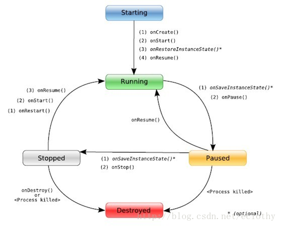
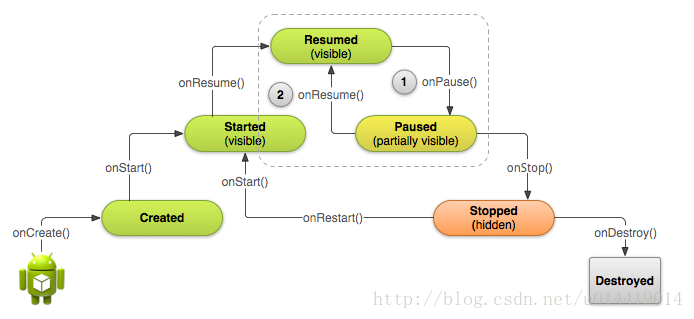

# Activity

## Activity简介

### Activity的启动

Activity类似于**应用程序入口**的作用，只是它可能会有多个"入口"来**对付应用中不同生命周期**

同时这似乎也说明一个activity应该与别的操作系统中的一个带main的程序具有相同的地位

**不同activity之间的关系应该非常薄弱**，只提供最基础的数据传输和跳转等功能

### 配置Activity

#### 声明

在**mainfest.xml**文件中，添加如下的声明

```xml
    <manifest ... >
      <application ... >
          <activity android:name=".ExampleActivity" />
          ...
      </application ... >
      ...
    </manifest >
    
```

即可声明一个名为.ExampleActivity的Activity

**注：对于每个Activity，必需的声明的属性只有name，其他的可以根据情况添加**

#### 声明Intent过滤器

配置Intent过滤器后，将告诉系统该Activity能够处理的内容

这样，在Android执行一个内容时，会列举出所有具有该内容对应的action的应用，供用户选择，即隐式跳转

配置Intent过滤器的方法如下

```xml
    <activity android:name=".ExampleActivity" android:icon="@drawable/app_icon">
        <intent-filter>
            <action android:name="android.intent.action.SEND" />
            <category android:name="android.intent.category.DEFAULT" />
            <data android:mimeType="text/plain" />
        </intent-filter>
    </activity>
```

在activity条目内部，添加intent-filter条目，可以为该activity添加intent过滤器

- **action** 该条目指定当前activity会做什么，示例代码中会SEND（发送消息）
- **category** 该条目指定能否接收到系统的请求
- **data** 指定该activity处理的类型

在调用时如下

```java
    // Create the text message with a string
    Intent sendIntent = new Intent();
    sendIntent.setAction(Intent.ACTION_SEND);
    sendIntent.setType("text/plain");
    sendIntent.putExtra(Intent.EXTRA_TEXT, textMessage);
    // Start the activity
    startActivity(sendIntent);
```

这样就会唤起所有支持ACTION_SEND并同意接收请求的应用，供用户选择后跳转到对应的Activity中

#### 声明权限

```xml
    <manifest>
    <activity android:name="...."
       android:permission=”com.google.socialapp.permission.SHARE_POST”
    />
```

格式如上，具体后文有说~

### Activity的生命周期

#### Acitivity的四个状态

在了解生命周期前，需要先了解Activity的四个状态

- **running** 在该状态下，Activity位于栈顶，可以和用户交互
- **pause** 在该状态下，Activity仍可见，但是被其它更小的如dialog等遮蔽，因此无法操作
- **stop** 该状态下，Activity被彻底遮挡，不可见也无法操作
- **killed** Activity被彻底杀死



#### onCreate()

您必须实现此回调，它会在系统创建您的 Activity 时触发。您的实现应该*初始化 Activity 的基本组件*：例如，您的应用应该在此处*创建视图并将数据绑定到列表*。最重要的是，您必须在此处调用 *`setContentView()` 来定义 Activity 界面的布局*。

`onCreate()` 完成后，下一个回调将是 `onStart()`。

#### onStart()

`onCreate()` 退出后，Activity 将进入“已启动”状态，并对用户可见（**不代表就真的绘制好了！！**）。此回调包含 Activity 进入前台与用户进行互动之前的最后准备工作。

**看起来只是做了一些...初始化工作，但是在生命周期中，Activity在真正与用户进行交互之前还有好几个回调...为什么要将它们分开呢？**

**对于onCreate，这很好解释，因为在Activity生命周期中，很多事情是不用重复做的...视图只需要绑定一次，大部分数据的初始化也只需要做一次，如果揉在一起的话会浪费很多算力的~**

#### onStart()

当 Activity 进入“已开始”状态时，系统会调用此回调。`onStart()` 调用使 Activity 对用户可见，因为应用会为 Activity 进入前台并支持互动做准备。例如，**应用通过此方法来初始化维护界面的代码**。

当 Activity 进入已开始状态时，与 Activity 生命周期相关联的所有生命周期感知型组件都将收到 [`ON_START`](https://developer.android.google.cn/reference/androidx/lifecycle/Lifecycle.Event#ON_START) 事件。

`onStart()` 方法会非常快速地完成，并且与“已创建”状态一样，Activity 不会一直处于“已开始”状态。一旦此回调结束，Activity 便会进入“已恢复”状态，系统将调用 `onResume()` 方法。

**这里很奇怪哇...啥叫初始化维护界面的代码？（仔细一想，大概就是...setVisibilty、获取宽高之类的吧...这些事情为什么每次从onStop回来需要重新做一次呢？）**

#### onResume()

系统会在 Activity 开始与用户互动之前调用此回调。此时，**该 Activity 位于 Activity 堆栈的顶部**，并会捕获所有用户输入。应用的大部分核心功能都是在 `onResume()` 方法中实现的。

`onResume()` 回调后面总是跟着 `onPause()` 回调。

**这里有个坑，那就是Activity栈的顶部。这一段说明onCreate后，Activity并不会直接进入能与用户交互的状态，只是做了一些基本的初始化，而onStart会处理关于界面的信息...onResume就会完成接下去的那一部分工作，开始捕获输入**

**还有一点比较坑就是...这个resume的本意是..."恢复"...这些都要通过理解android的Activity的四个状态来理解~**

#### onPause()

当 Activity 失去焦点并进入“已暂停”状态时，系统就会调用 `onPause()`。例如，当用户点按“返回”或“最近使用的应用”按钮时，就会出现此状态。当系统为您的 Activity 调用 `onPause()` 时，从技术上来说，这意味着您的 Activity 仍然部分可见，但大多数情况下，这表明用户正在离开该 Activity，该 Activity 很快将进入“已停止”或“已恢复”状态。

如果用户希望界面继续更新，则处于“已暂停”状态的 Activity 也可以继续更新界面。例如，显示导航地图屏幕或播放媒体播放器的 Activity 就属于此类 Activity。即使此类 Activity 失去了焦点，用户仍希望其界面继续更新。

您**不**应使用 `onPause()` 来保存应用或用户数据、进行网络呼叫或执行数据库事务。

`onPause()` 执行完毕后，下一个回调为 `onStop()`或 `onResume()`，具体取决于 Activity 进入“已暂停”状态后发生的情况。

**这个没啥好说的，就是失焦了~**

#### onStop()

当 Activity 对用户不再可见时，系统会调用 `onStop()`。出现这种情况的原因可能是 Activity 被销毁，新的 Activity 启动，或者现有的 Activity 正在进入“已恢复”状态并覆盖了已停止的 Activity。在所有这些情况下，停止的 Activity 都将完全不再可见。

系统调用的下一个回调将是 `onRestart()`（如果 Activity 重新与用户互动）或者 `onDestroy()`（如果 Activity 彻底终止）。

**这里真有个坑，如果内存紧张的话，Android会杀process的，会强行结束该activity**

#### onRestart()

当处于“已停止”状态的 Activity 即将重启时，系统就会调用此回调。`onRestart()` 会从 Activity 停止时的状态恢复 Activity。

此回调后面总是跟着 `onStart()`。

**这很迷啊，这玩意有啥用啊**

#### onDestroy()

系统会在销毁 Activity 之前调用此回调。

此回调是 Activity 接收的最后一个回调。通常，实现 `onDestroy()` 是为了确保在销毁 Activity 或包含该 Activity 的进程时释放该 Activity 的所有资源。

**这个好说**

### Activity生命周期流程图


