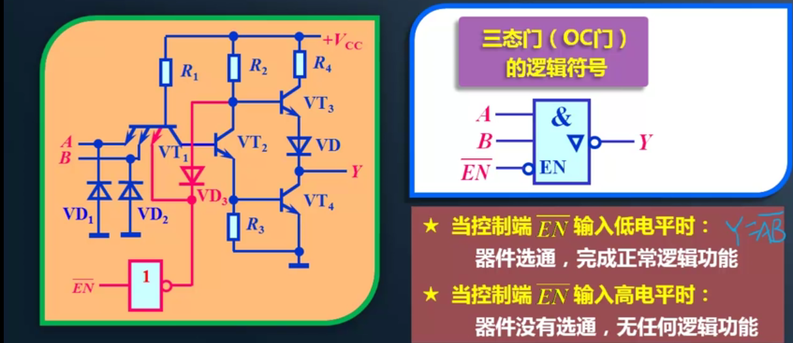

# 逻辑门电路笔记

## Part0） 引入：什么是门电路

​	用于实现逻辑运算的、可复用的逻辑门电路，简称门电路

​	比如：与门、或门、非门（也被叫做反相器）

### 	逻辑门电路的分类

#### 		1、TTL逻辑门

​			用晶体管制作，功耗大、发热量，不合适做大规模集成电路，但是速度比CMOS快

#### 		2、CMOS逻辑门

​			用场效应MOS管制作，功耗低，易于集成

#### 		3、普通逻辑门与特殊逻辑门

​			TTL与CMOS都可以分为普通逻辑门与特殊逻辑门

​			TTL的特殊逻辑门为：OC门（集电极开路门）   TS门（三态门）

​			CMOS的特殊逻辑门为：OD门（漏极开路门）  TS门（三态门）

## Part1） 逻辑门电路基础知识

### 	一、正逻辑与负逻辑

​		在逻辑电路中，基本约定是：高电平为1，低电平为0；

​		逻辑电路中，高低电平分别指代一个范围而非某个特定的值；

### 	二、二极管、晶体管的基本特性

​		在数字电路中，我们不需要再关注二极管、三极管的具体特性，只需要了解它的开关特性即可~

#### 		1、二极管

​			

#### 		2、晶体管（三极管）

​			只要基极导电，那么三极管就导通。

​			相关视频：[三极管是如何导电？超形象动画让你一看就懂！_哔哩哔哩_bilibili](https://www.bilibili.com/video/BV1kv411574Y?from=search&seid=1405937802986245052&spm_id_from=333.337.0.0)

​			

​			

## Part2） 分立元件门电路

### 	一、二极管与门

​		注意要利用UD来反向判断二极管是否导通，如果导通，那么过二极管前的电压等于二极管

后电压+UD。

​		因此判断是否导通从压降比较大的一边全面考虑~（如0/3与3/0输入）

### 	二、二极管或门

​	分析要点同上

​									

### 	三、三极管非门

## Part3） TTL逻辑门电路

​	Transistor-Transistor Logic

### 	一、TTL非门

#### 		（1	电路结构

​					

​				该电路中，外接一个+5V的VCC供电，A为输入端，Y为输出端。A的电压值将决定整个回路中的最大电流。

​				其中VDi的作用是，维持VT1左侧电压最小不会小于-0.7V（二极管的特性）。那么如果A端输入突变为大负数，通过VT1的电流也			不会过大而导致晶体管烧坏。因此VDi其实是一个起保护作用的二极管~

#### 		（2	输入/输出分析

​					输入输出分为以下四种情况：

​							1、确定输入电压为0.3V

​							2、确定输入电压为3.6V

​							3、输入端悬空时

​							4、输入端通过电阻接地时

##### 					a、输入电压为0.3V

​						

##### 					b、输入电压为3.6V

​						tip: 三极管饱和，则发射极的电压将固定。

​						

##### 					c、输入端悬空

​						

##### 					d、输入端通过电阻接地

​													

#### 				（3	TTL门的参数

​							输入高/低电平（U in High/Low）		开门电平:   2V	   关门电平:  0.8V

​							输出高/低电平（U out High/Low） 	UoH(min): 2.4V	UoL(max): 0.4V

​							输出低电平时为	关门状态	反之则为	开门状态

​							开/关门电阻	见输入端接地时工作状态，若接地电阻R>2.5k，则开门，若R<0.7k，则关门

#### 				（4	TTL电平规范

​							

### 			二、特殊的TTL逻辑门

#### 				（0	引入

​						为什么需要特殊的TTL逻辑门？

​							1、多个TTL逻辑门共接导线会导致晶体管烧坏

​							2、多个TTL门共接导线会导致逻辑混乱

​						

#### 				（1	集电极开路门

##### 		a.结构

​			左侧为OC与非门，右侧为普通TTL与非门

​			不难看出，OC门与普通门的区别在于，把输出VT4集电极上的负载给去除了

​			故称为	集电极开路门（open collector）

​			

##### 		c.使用方法

​			必须接上拉电阻，来替代正常TTL门被删除的负载

##### 		d.工作特点与线与

​			工作特点：克服了本不能共线的缺点，同时还可以用于实现更复杂的逻辑结构

​			

​			

##### 		e.适用范围及特性

​			外接的上拉电阻会影响OC门的开关速度，因此OC门只适用于工作速度不高的应用场景

#### 				（2	三态门(TS门)

​	Three state gate

##### 		a.TS门的结构符号与特性

​		控制端低有效

#### 				（3	性能比较

##### 	a.开关速度

​		TS门的开关速度要高于OC门

##### 	b.接入个数

​		TS门的接入个数可以完全不受限制（因为有专门的EN输入来控制是否真正接入），但是OC门的接入个数要受上拉电阻阻值的限制

##### 	c.逻辑功能

​		OC门可以实现线与功能，但是TS门不仅不能实现线与，连不受控直接共线都不可以~！（在有EN输入时则可以共线）

### 			三、TTL或非门/TTL与非门

​					可以用来练手分析电路~

​					

## 	Part4）CMOS逻辑门

### 		与TTL比对的优势

​			功耗低	芯片集成度高	温度稳定性好	电路结构简单	输入阻抗高，输出能力强	电源电压范围广	抗干扰能力强	输出逻辑		摆幅大

### 		CMOS电路电平规范及对比

## Part5）多余输入端的处理

### 	引入

​			为什么需要对多余输入端进行处理？在学习TTL非门时，输入端悬空会使输出端输出低电平，相当于输入了一个极高的电平。但·		是，输入端悬空会引入外界干扰从而导致逻辑运算错误

### 	解决方式

​			输入确定的电平，尽量避免输入端悬空。

### 	与门/与非门

​			多余输入端应接入高电平

### 	或门/或非门

​			多余输入端接入低电平

# END