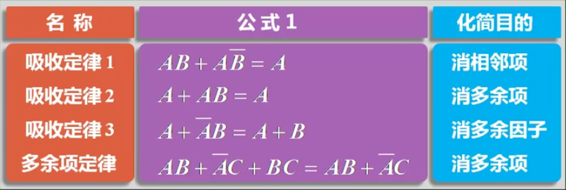
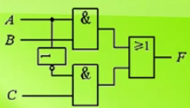
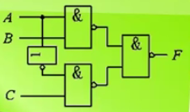
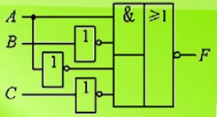
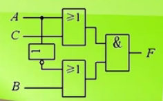
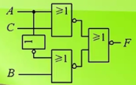
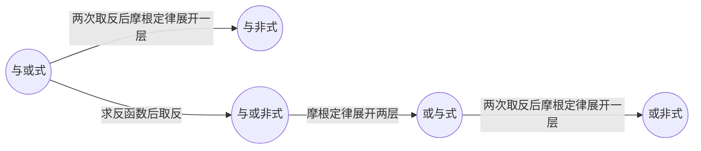
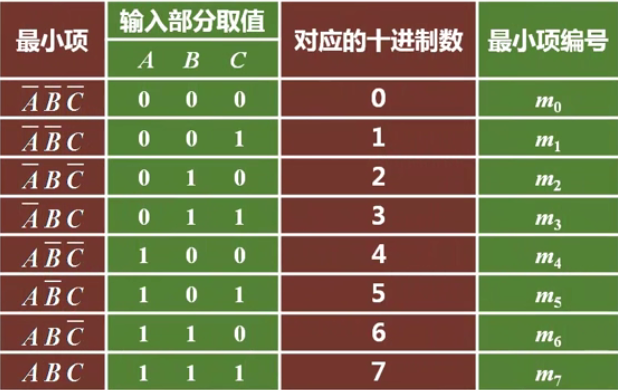
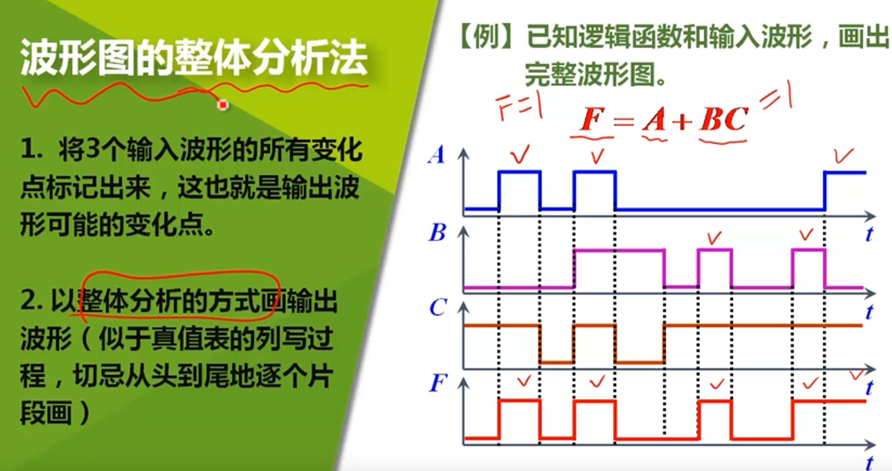

# 逻辑函数的表示与化简

## 引入

### 	为什么要进行逻辑函数的化简？

这需要谈到逻辑函数化简的*<u>**原则**</u>*了：

 -  减少逻辑门的使用

 -  使每个门的输入端减少

 -  减少逻辑电路的级数

 -  为了逻辑电路的可靠性

	**总而言之，就是为了逻辑电路更加简洁并增强鲁棒性**

### 	如何进行逻辑函数的化简？

**公式法化简**	公式法可以快速化简与或结构的逻辑函数，但在实际运用中，有许多类似与非门、或非门这一类复杂的逻辑结构，此时公式法就麻烦起来了。

**卡诺图化简**	本章需要学习的新方法

### 	本章知识结构

- **化简**	两条思路，六个知识模块
- **表示**	五种表示工具的使用及相互转换

## 逻辑代数公式

### **公式复习**

### 通用化简思路

- 如果存在能直接化简的结构，那就直接化简

	利用公式，*由易到难*

	- 先利用*吸收定律2/3*，消除单因子项
	- 再利用*吸收定律1*，消除逻辑相邻项
	- 最后利用*多余项定理*，消除三项结构

- 如果没有可以直接化简的结构，则*改变结构*

	- 方法一：拆项
	- 方法二：提取公因子

- 最后尝试*两种特殊方法*

## 五类逻辑函数之间的转化

### **五类逻辑函数**

#### 与或式

$$
F=AB + \overline AC
$$

形如这样的，叫做最简与或式，因为它由两个与加上一个或构成，并且不能再化简了。转为逻辑电路则如下图：

由这个逻辑函数，我们可以通过变形得到其他四类逻辑函数。

#### 与非-与非式

$$
F=\overline{\overline{AB+\overline AC}}=\overline{\overline{AC}\cdot\overline{\overline AC} }
$$

很明显，与非-与非式（简称与非式）是由与或式两次取反后用摩根定律展开一层得到。

与非式的逻辑电路如下图：

#### 与或非式

与或非式由与或式先求反函数，再取一次反得到。

**求反函数** 	利用摩根定律推论+多余项定律
$$
\begin{align}
\overline F &=(\overline A+\overline B)(A+\overline C)\\
&=A\overline B+\overline A \overline C+\overline B \overline C\\
&=A\overline B+\overline A\overline C
\end{align}
$$
**取反**
$$
F=\overline{A\overline B+\overline A\overline C}
$$
逻辑电路：

#### 或与式

与或非式用摩根定律展开两次即可得到。
$$
\begin{align}
F&=\overline{A\overline B+\overline A\overline C}\\
&=\overline{A\overline B}\cdot\overline{\overline A\overline C}\\
&=(\overline A+B)(A+C)\\
\end{align}
$$
逻辑电路：

#### 或非-或非式

简称或非式，是由或与式两次取反，再用摩根定律展开一层。
$$
\begin{align}
F&=\overline{\overline{(\overline A+B)(A+C)}}\\
&=\overline{\overline{\overline A+B}+\overline{A+C}}
\end{align}
$$
逻辑电路：

#### 总结

五类逻辑函数都由**确定的电路图**所决定，命名也与逻辑电路紧密相关。

### 逻辑函数间的转换记忆

| 类型     | 转换方法                                     |
| -------- | -------------------------------------------- |
| 与或式   | 利用公式化简原则去化简                       |
| 与非式   | 与或式两次取反，摩根定律展开一层             |
| 与或非式 | 先求出反函数的与或式，然后再取反，不处理即可 |
| 或与式   | 与或非式用摩根定律展开两层                   |
| 或非式   | 或与式两次取反，摩根定律展开一层             |

## 公式化简法总结

​	**公式化简法就是利用逻辑公式先将复杂逻辑转化为最基本的与或式，再利用五种逻辑函数之间的转化转为需要的逻辑表达式。**

## **卡诺图化简法**（重点）

### 卡诺图的由来

#### 最小项与标准与或式

​	在一个给定了输入变量数的逻辑函数，所有变量都参与相"与"的与项称为"最小项"。

​	如   $F=f(A,B,C)=AB+\overline AC=ABC+AB\overline C+\overline ABC+\overline A \overline B C$   中的每一项都为"**最小项**"。在一个最小项中，每个**变量**只能以**原变量或反变量**的形式**出现且仅出现一次**。

​	则由最小项相或得到的与或式就是"**标准与或式**"。

​	不难得出，**n变量输入**的逻辑函数将有**由2^n^个最小项构成**的标准与或式。

#### 标准与或式与真值表之间的联系

对于标准与或式：
$$
F=\overline A\overline B C+\overline ABC+AB\overline C+ABC 
$$
与该逻辑函数真值表：

|  A   |  B   |  C   |  F   |
| :--: | :--: | :--: | :--: |
|  0   |  0   |  0   |  0   |
|  0   |  0   |  1   |  1   |
|  0   |  1   |  0   |  0   |
|  0   |  1   |  1   |  1   |
|  1   |  0   |  0   |  0   |
|  1   |  0   |  1   |  0   |
|  1   |  1   |  0   |  1   |
|  1   |  1   |  1   |  1   |

不难发现，标准与或式与真值表之间存在一一对应关系。

**由此得到最小项的基本性质:**

1. **在输入的任意一种取值下，有且仅有一个最小项的值为1**
2. **在同一输入下，逻辑函数的任意两个最小项之积必为0**
3. **在同一输入下，一个逻辑函数的全体最小项之和必为1**

#### 最小项的编号

### 卡诺图的结构规则

​	例：4输入卡诺图

| AB  \  CD | 0 0  | 0 1  | 1 1  | 1 0  |
| :-------: | :--: | :--: | :--: | :--: |
|    0 0    |  m0  |  m1  |  m3  |  m2  |
|    0 1    |  m4  |  m5  |  m7  |  m6  |
|    1 1    | m12  | m13  | m15  | m14  |
|    1 0    |  m8  |  m9  | m11  | m10  |

​	**注意卡诺图的递归编号顺序**

​	**卡诺图的每一格都代表输入的逻辑函数的每一个最小项，格子中的值就与每一个最小项的值一一对应。**

### 卡诺图的化简原理

卡诺图的化简原理**本质上是使用吸收定律一**（$AB+A\overline B=A$）

实际上，用公式法去寻找逻辑相邻变量具备很高的难度。

卡诺图将表达式中的**逻辑相邻关系**转化为了图上的**几何相邻关系**	

如以下四个与
$$
\overline AB\overline CD对应m_5\\
$$
具备逻辑相邻关系的最小项：
$$
\overline A\overline B\overline CD对应m_1\\
\overline AB\overline C\overline D对应m_4\\
\overline ABCD对应m_7\\
AB\overline CD对应m_{13}
$$
由图表不难得出，这四个最小项在几何上也与m5几何相邻

**同时需要注意，卡诺图的边缘元素是对应相接的，在上图中，m~0~的左侧对应的是m~2~**

### **最小项的合并规则**

- **2^n^**个相邻最小项可以构成一个**卡诺圈**，合并后**可以消去n个变量**
- **不存在**包括**非2^n^**个相邻项的卡诺圈
- 看坐标化简，多项变一项，**保留不变的，消去变化的**
- 1为原变量，0为反变量

### **用卡诺图表达逻辑函数**

**先结构**而**后内容**

- 先由待化简逻辑函数的变量个数，画出对应结构的卡诺图
- 分析逻辑函数，找出对应的最小项，并填入卡诺图中

#### 三种典型情况

- 一般与或式

	例:	化简 $F=\overline AB\overline D+AC$

	先分析是几输入表达式：4输入

	确定卡诺图结构后，整理表达式

	
	$$
	\begin{align}
	F&=f(A,B,C,D)\\
	&=\overline AB\overline D+AC\\
	&=\overline AB\cdot(\overline C+C)\cdot\overline D+A\cdot(\overline B+B)\cdot C \cdot(\overline D+D)\\
	&=\overline AB\overline C\overline D+\overline ABC\overline D
	+A\overline BC\overline D+A\overline BCD+ABC\overline D+ABCD
	\end{align}
	$$
	填入卡诺图

	| AB/CD | 0 0  | 0 1  | 1 1  | 1 0  |
	| :---: | :--: | :--: | :--: | :--: |
	|  0 0  |      |      |      |      |
	|  0 1  |  1   |      |      |  1   |
	|  1 1  |      |      |  1   |  1   |
	|  1 0  |      |      |  1   |  1   |

- 标准与或式

	​	标准卡诺图的结构一般为
	$$
	F=\sum m (n_0,n_1\dots)
	$$
	​	由最小项个数确定输入量后，直接填入卡诺图即可

- 一般表达式

	例：
	$$
	F=\overline{(\overline AC+A\overline C)\cdot \overline{\overline B(A\overline C\overline D+\overline AC\overline D)}}
	$$
	复杂表达式先进行化简转为与或式

$$
\begin{align}
F&=f(A,B,C,D)\\
&=\overline{(\overline AC+A\overline C)\cdot \overline{\overline B(A\overline C\overline D+\overline AC\overline D)}}\\
&=\overline{\overline AC+A\overline C}+\overline B(A\overline C\overline D+\overline AC\overline D)\\
&=\overline A\overline C+AC+\overline B(A\overline C\overline D+\overline AC\overline D)
\end{align}
$$

​		再填入卡诺图即可

### 化简步骤

- 卡诺图上画卡诺圈，要求卡诺圈尽量大而少 
	- 先圈唯一的选择
	- 圈最大的
	- 最后用最大最少的圈，去解决剩余的1

- 变量相与，结果相或
- 化简结果并不唯一

## 约束关系

### 引入

 -  什么是约束关系？

	​	约束关系是指，在一个命题中，输入变量的取值并非任意，而是有条件的，并不是所有输入组合都可以出现

- 什么是具有约束的变量？

	​	将一组具有限制关系的变量称为一组有约束的变量

- 由具有约束关系的输入变量组成的逻辑函数称为具有约束的逻辑函数

### 约束关系的表达

- 在卡诺图与真值表中画	**X**

- 在表达式中：
	$$
	\left\{
	\begin{align}
	&F=expression_1\\
	& expression_2 =0
	\end{align}
	\right.
	$$
	

### 卡诺图法化简约束关系

任意项可以直接当做0/1加入卡诺圈中，然后正常化简

## 波形图表示逻辑函数

比较简单，不多说。

