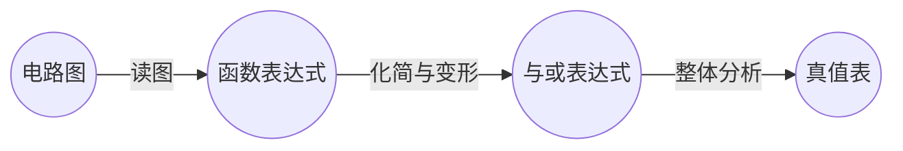
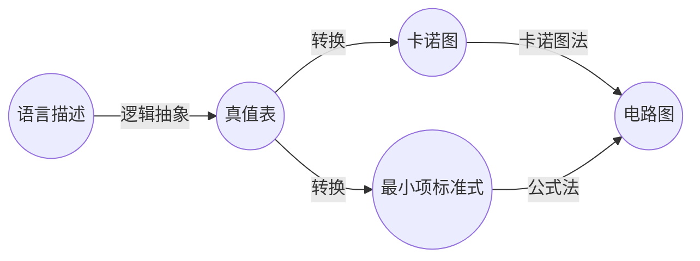
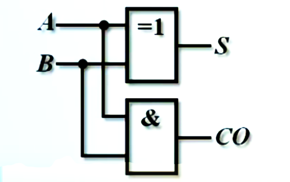
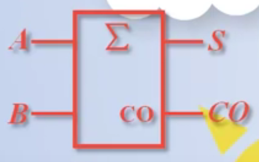
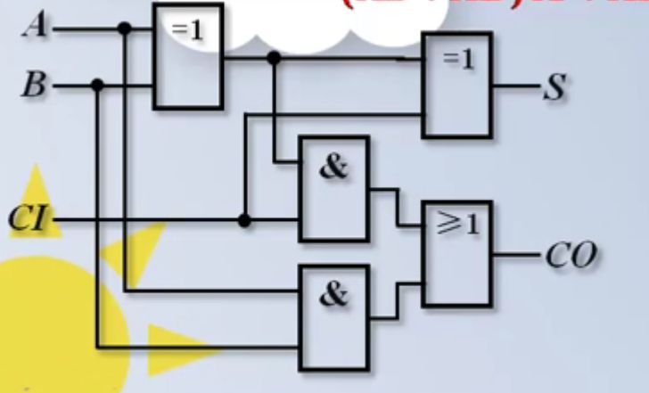
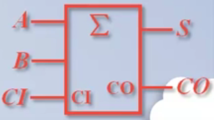
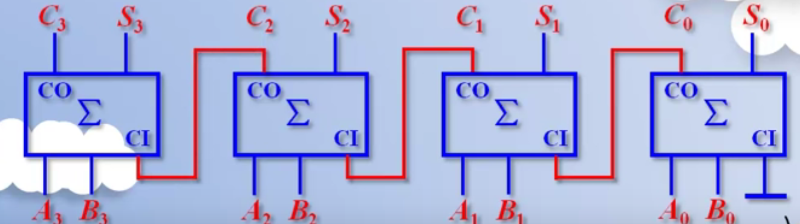

组合逻辑电路

## 组合逻辑电路的分析方法

### 电路图转为真值表

### 真值表转为电路图

## 典型逻辑电路的知识结构

### 需要学习的器件？

- 加法器
- 数值比较器
- 编码器
- 译码器
- 数据选择器
- 数据分配器

### 需要掌握什么？

- 定义与功能
- 典型集成电路器件
- 器件的应用

## 加法器

计算机中的**加法**，是**二进制数加法**

### 全加器？半加器？

- **半加器**是**不考虑低位向本位进位**的加法器。但是，要**考虑本位相加，给高位的进位**。
- **全加器**则要考虑低位向本位的进位。

因此，半加器只需要两输入，两输出。全加器在半加器的基础上添加了一个"从低位来的进位"输入。

### 半加器的真值表与电路

- 逻辑表达式：$S=A\oplus B$	$CO=AB$	(S为本位结果，CO为进位输出)

- 真值表

	|  A   |  B   |  S   |  CO  |
	| :--: | :--: | :--: | :--: |
	|  0   |  0   |  0   |  0   |
	|  0   |  1   |  1   |  0   |
	|  1   |  0   |  1   |  0   |
	|  1   |  1   |  0   |  1   |

- 电路图

  

- 封装符号

	

### 全加器的真值表与电路

- 逻辑表达式
	$$
	\left\{
	\begin{align}
	S&=A\oplus B\oplus C_I\\\\
	C_O&=\overline ABC_I+A\overline BC_I+AB\overline {C_I}+ABC_i\\
	&=(A\oplus B)C_I+AB
	\end{align}
	\right.
	$$
	
- 真值表

	|  A   |  B   |  CI  |  S   |  CO  |
	| :--: | :--: | :--: | :--: | :--: |
	|  0   |  0   |  0   |  0   |  0   |
	|  1   |  0   |  0   |  1   |  0   |
	|  0   |  1   |  0   |  1   |  0   |
	|  1   |  1   |  0   |  1   |  1   |
	|  0   |  0   |  1   |  1   |  0   |
	|  1   |  0   |  1   |  0   |  1   |
	|  0   |  1   |  1   |  0   |  1   |
	|  1   |  1   |  1   |  1   |  1   |

- 逻辑电路图

	

- 封装

	

### 多位全加器的进位原理

#### 串行进位加法器

**模拟真实加法过程，依次按位输入进位	** 

但是这样会**大大降低计算速度**，因此需要"**其他进位方式**"

#### 超前进位加法器

​	串行进位的劣势在于，**每一位的运算都需要等待上一位的进位输出**，导致速度降低。因此，对串行进位进行改进，计算时**附带计算上一位的进位输出**，从而直接得出结果。在位数高时，这样可以大大提高运算效率。这就是**超前进位加法器**。

### 加法器的级联扩展

### 加法器的应用

## 数值比较器

### 数值比较器原理

### 集成数值比较器

### 数值比较器的级联扩展

## 编码器

### 编码器原理

### 集成编码器

### 编码器的级联扩展

## 译码器

### 译码器原理

### 集成译码器

### 译码器的级联扩展

### 译码器的应用

### 显示译码器的原理与应用

## 数据选择器

### 数据选择器原理

### 集成数据选择器

### 数据选择器的级联扩展

### 数据选择器的应用

## 数据分配器

### 数据分配器原理

## 总结

