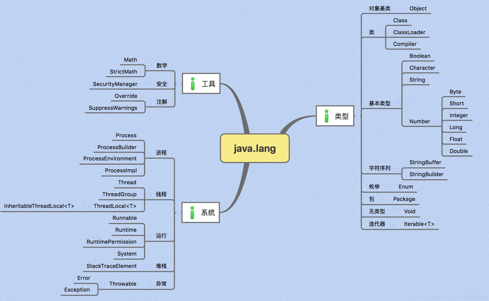
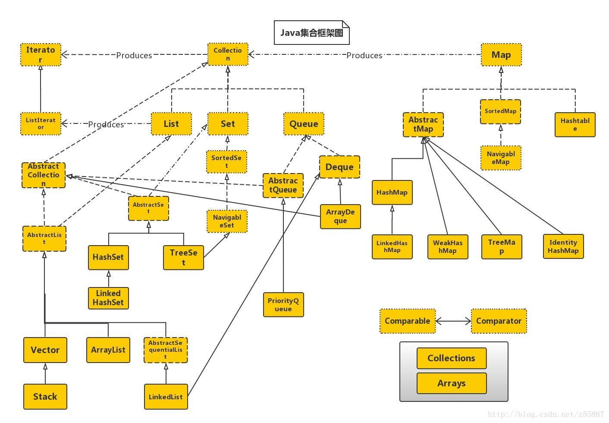

# Java SE 课程笔记

## 基本概念

-   Java是一种跨平台语言，其跨平台建立在JVM的基础之上。
-   JVM会对.class文件进行解释并运行，.class 文件类比到 OS 上就是 elf 文件（Linux下）
-   Jar包，即 Java Archive File，本质上就是.class文件 + 文件清单的打包，文件清单中包含了 程序入口（if executable）、include path 等基础信息
-   Java包管理

## Java.lang

### 简介

Java.lang是java的语言基础库，包含了对基本类型的封装。该包的结构如下：



### 对一些类的解释

#### Object

提供了一些关于对象的基本操作

```java
// 反射机制
java.lang.Class<?> getClass();

// 计算hash
int hashCode();

// 判等
boolean equals();

// deep copy
java.lang.Object clone();

// to String
java.lang.String toString();

// concurrent control
void notify();
void notofyAll();
void wait(...);

// gc
void finalize();
```

>   **Java中的并发控制**
>
>   ​	java中的并发控制会利用Object中相关的notify等接口，使用对象中的内置锁（对象锁）来完成资源请求的控制与同步。
>
>   ​	与传统的基于OS的并发控制相比，特点是每个对象都可以进行并发控制。
>
>   ​	使用 synchorize 关键字来进行加锁/解锁操作。

#### Class

​	由于有了JVM层的支持，Java在运行时可以有更大的灵活性，如在运行时类型标识等功能。这些功能的来源就是Class（类类），它在JVM的运行中完成对类的抽象，可以通过该类获取到对象所属类别的相关信息（如成员、注解、包、父类等）

#### ClassLoader

​	Java中的加载不同于一般的Loader，而是将字节码映射入JVM的虚拟内存中，由JVM维护管理（在OS中是不进行管理的，在编译期就已经决定），因此加载过程可以更加灵活，即使用双亲委派机制。

>   **对比Java与编译型语言**
>
>   ​	由于JVM，Java的加载机制也不同于OS上的加载器，而更加复杂。OS上的Loader通常是将字节码直接复制到固定的内存地址后设置PC即完成加载，就算是动态链接也只是在运行时完成一部分字节码的复制，本质上在内存中并不区分数据和指令，也没有所谓的类型、对象的概念，一切操作都在编译时完成。但JVM是一个软件虚拟机，自然可以维护相关信息。Class、Object、ClassLoader类都在其中提供支持。

#### 基本类型类

分为4类，是对基本类型的简单包装，使基本类型有了object的特性。

-   Boolean 是对 boolean 的简单封装
-   Character 是对 char 的简单封装
-   String 是对 final byte[] 的简单封装

-   Number 是对各种数字类型的简单封装

其中关注String类（考虑java中的字符串处理与类C语言的不同之处）

>   **类型装包和解包**
>
>   ​	Java中一切皆对象，但是每个语言又一定有自己的基础类型，它们是语言的基础（即并不经过任何封装），这就造成了冲突。
>
>   ​	简单来说，比如在Cpp中，并不能对一个int或是一个char调用成员函数。而Java利用装包和解包解决了这一问题。
>
>   ​	Java中基础类型会被自动当作类来看待，并且能自动转换。

>   **数组**
>
>   ​	测试以下程序：
>
>   ```java
>      	public static void main(String[] args) {
>           int[] s = { 1, 2, 3, 4, 5 };
>           int[] x = s;
>           s[0] = 2;
>           System.out.println(x[0]);
>           System.out.println(x == s);
>       }
>   ```
>
>   ​	运行结果为 2 true
>
>   ​	这说明 java 中的 数组 类似于指针，存储的也是首地址，数组之间的赋值相当于指针赋值。

>   **Java中的String**
>
>   ​	Java中的 String 是不可变的，即没有提供修改字符串的方式。其成员有 一个byte[] 和 coder字段记录编码。类似于 C 中的 const char[] 放置在静态区中，Java 将其放置在常量池中（且无法修改）。

#### StringBuilder与StringBuffer

​	即字符序列类，存储可修改的字节序列，与String相比，它建立在堆中（因此使用前必须手动new一下），提供了更灵活的字符操作。由于并不对应基础类型，因此无法做到装包和拆包。

#### 工具类和系统类

​	Java.lang中剩余部分就是工具类和系统类，分别提供了 安全、注解（工具类）和进线程模型、异常处理、运行时（系统类）。

>   **Java中的线程**
>
>   ​	不同于C/Cpp中有函数指针从而实现将函数作为参数传递，Java使用一种更隐晦的方式去为线程指派任务。
>
>   ​	首先，Thread类中存储了一个 runnable 对象， runnable 接口中只有一个函数成员 即 run（）。 构造 Thread 时，需要传递 Runnable 对象作为参数，在 Thread 的启动函数中会使用 Runnable 中的 run 函数。
>
>   ​	这种实现方式，更类似于 Cpp STL库中的 Functor （函数对象）的实现，只是 Cpp 是为了给函数提供配接器，而 Java 是没有指针，不得已而为之...
>
>   ​	这种实现方式在 Java 中似乎也被叫做 接口回调...
>
>   ​	要实现给Java线程传递参数，则需要继承 Thread 类，并添加参数字段。
>
>   ​	Java线程最终将被绑定到内核线程上，线程的 start 函数最后将调用 native 代码。

## Java.util

### 简介

​	该库是Java的工具类库，其中包含了常用的容器与算法等。以下是Java容器的关系：

